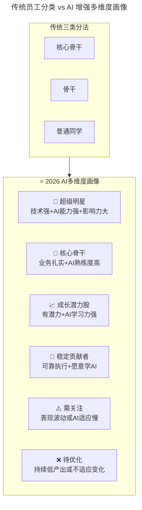
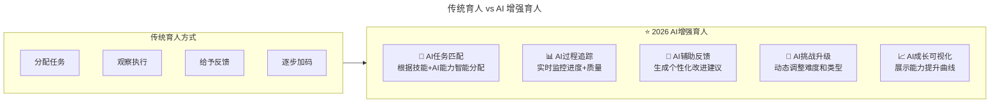
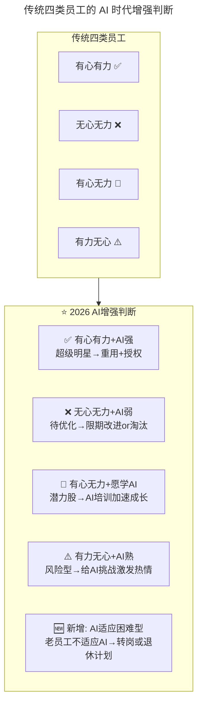

# 第73讲 | 用数据来分析管理员工

> **适用范围**：技术管理者、团队 Leader、HR BP，以及希望用数据思维提升人才管理效果的所有管理者
>
> **更新摘要（v2 · 2026-08 更新）**：
> - 结构化升级为 6 节骨架（导言 / 核心方法论 / 关键流程 / 工具与实战 / 常见误区 / 进阶延展）
> - 新增 AI 驱动的数据化人才管理方法论
> - 补充员工 AI 成熟度评估模型（Level 1-4）与 AI 增强员工画像
> - 新增 AI 辅助管理 SOP（每周 Check-in / 每月 Review / 季度 Planning）
> - 所有 Mermaid 图表添加 title frontmatter 并补充文字解读

## 1. 导言

上周，我们聊了创业公司招人的话题，今天，我们接着聊聊把人招进来之后该怎么育人和用人。

所有的公司都有新员工培训这个环节，只是重视程度不同。每个人的特质都不同，很多时候我们很难招到跟团队完全 Match 的人，但如果育人和用人跟得上的话，在把员工变得更好的同时，也能让团队更高效。

一般来说，我会把团队成员定义为三类，**一个是核心骨干，一个是骨干，一个是普通同学**，不同的人有不同的带法。实际操作中，育人是要花费大量时间和精力的，而我们每天放在工作上的时间是有上限的，很难做到雨露均沾。所以一定要将人才分档，把我们的大部分精力放在骨干、核心骨干上。

### 核心理念

> "我们用大数据来分析我们的客户，为什么不能用数据来分析我们自己的兄弟，让他们在公司呆的更开心呢。"

这句话在 2026 年终于可以完美实现了——AI 让人才数据化管理成为现实。

## 2. 核心方法论

### 2.1 以事育人，因材施教

王阳明说过，**人须在事上磨**，如果我们只用嘴说，就太肤浅了。在培养下属、管理干部的时候，必须用一些事情让他们得到锻炼、让他们证明自己。

同时，我们要因材施教，因为不同的人的性格都不一样。有些同学是外放型的，他就适合往业务方向发展，有些同学是内敛型的，他就适合沉下来做基础建设、做工具系统。

### 2.2 言传身教，多做政委

新人又分两类，一类是能力强的新人，给他们定任务、做计划就好了；一类是能力不强的新人，但人很聪明又好学，这时就是 16 字经验："**我说你听，你说我听，我做你看，你做我看**"。

同时，我们还要多做政委，留人即留心，功夫在平时，平时要多跟员工沟通，多做知心大哥大姐。结合团队和个人发展目标，和下属共同制定他们的长线规划，要让他们感觉到 leader 是在很用心的帮助自己成长。

### 2.3 容人之短，用人之长

在用人这方面，我经常把团队成员分为四种：

- **有心有力**：态度认真、能力胜任，给明确目标即可自驱动
- **无心无力**：给三次机会两次考核，不行就走人
- **有心无力**：很努力但出不了成果，看情况调整
- **有力无心**：技术实力不错但心不在焉，需要给更多挑战

### 2.4 员工分类的 AI 时代演进



流程图展示了员工分类从传统三类（核心骨干 / 骨干 / 普通同学）到 AI 增强六类的演进。新增了"AI 能力"维度后，分类更加精细：超级明星（技术 + AI + 影响力三强）、成长潜力股（有潜力 + AI 学习力强）、需关注（AI 适应慢）等。**AI 时代的员工画像不能只看技术能力，还要看 AI 协作能力和学习适应力**。

### 2.5 员工 AI 成熟度评估模型

| 维度 | Level 1 (新手) | Level 2 (熟练) | Level 3 (专家) | Level 4 (领袖) |
|-----|---------------|---------------|---------------|---------------|
| **AI 工具使用** | 偶尔使用 | 日常使用 | 设计工作流 | 团队推广 |
| **Prompt 质量** | 简单指令 | 结构化 Prompt | 可复用模板库 | Prompt 框架设计 |
| **AI 批判性** | 盲信输出 | 能识别明显错误 | 能深度审查优化 | 制定 AI Review 标准 |
| **AI 创新力** | 跟随使用 | 主动探索新工具 | 创造 AI 应用场景 | 引领团队 AI 转型 |
| **AI 分享欲** | 不分享 | 偶尔分享 | 定期分享培训 | 建立AI知识体系 |

## 3. 关键流程

### 3.1 "以事育人"的 AI 增强



对比图展示了育人方式从传统到 AI 增强的演进：任务分配从手动变为 AI 智能匹配；过程追踪从人工观察变为 AI 实时监控；反馈从主观判断变为 AI 生成个性化建议；挑战升级从固定阶梯变为 AI 动态调整。**AI 让育人过程更精准、更及时、更可视化**。

**任务分配 AI 矩阵**：

| 任务类型 | 适合人群 | AI 工具要求 | 成长目标 |
|---------|---------|-----------|---------|
| **AI 探索型任务** | 成长潜力股 | 自由选择工具 | 培养AI创新力 |
| **AI 实战型任务** | 核心骨干 | 必须使用AI提效 | 强化AI应用能力 |
| **AI 优化型任务** | 稳定贡献者 | 在指导下使用AI | 建立AI信心 |
| **AI 教学型任务** | 超级明星 | 辅助他人使用AI | 提升影响力 |

### 3.2 "言传身教"的 AI 时代更新

| 维度 | 传统做法 | 2026 AI 增强 |
|-----|---------|--------------|
| **16 字经验** | 我说你听、我做你看 | **+ AI 示范：我演示 AI 工具使用全过程** |
| **政委角色** | 吃饭聊天关心生活 | **+ AI Wellness Check：监测情绪和工作状态** |
| **职业规划** | 定期 1v1 沟通 | **+ AI Career Path Generator：基于数据建议发展方向** |
| **导师匹配** | Leader 指定 | **+ AI Mentor Matching：根据技能互补性自动匹配** |

### 3.3 "容人之短，用人之长"的 AI 诊断



流程图在传统四类员工基础上新增了"AI 适应困难型"——老员工不适应 AI 工具，需要转岗或退休计划。**这是 2026 年团队管理的新挑战**：如何在推进 AI 转型的同时，妥善处理不适应 AI 的老员工。

## 4. 工具与实战

### 4.1 员工数据仪表盘（AI 版）

```
📊 员工AI效能Dashboard

【基本信息】
├── 姓名、岗位、入职时间
├── 技能标签（含AI技能）
└── 当前级别

【AI能力评分】
├── AI工具掌握度: X/10
├── Prompt质量分: X/10
├── AI增效倍数: X.x
└── AI社区活跃度: X/10

【工作效能】
├── 本月代码提交量: XX
├── AI辅助代码占比: XX%
├── Code Review参与度: XX%
└── 任务按时完成率: XX%

【成长轨迹】
├── 近6月AI能力趋势图
├── 技能短板AI推荐
└── 下阶段发展建议
```

### 4.2 AI 辅助管理 SOP

1. **每周 AI Check-in**：
   - 自动生成团队成员本周 AI 使用情况报告
   - 识别 AI 使用率异常下降的成员（可能需要关注）
   - 推荐下周 AI 学习资源

2. **每月 AI Review**：
   - AI 汇总每位成员的成长数据
   - 生成个性化的表扬 / 改进建议
   - 更新员工 AI 能力评级

3. **季度 AI Planning**：
   - AI 分析团队整体 AI 成熟度
   - 建议下季度 AI 培训和项目方向
   - 识别需要重点关注的人才

## 5. 常见误区

### 5.1 人才管理的常见陷阱

- **平均主义**：在每个人身上花一样的时间，结果累死且效果不好。应将精力集中在骨干和核心骨干上
- **无底洞投入**：对不值得投入的人花费大量时间和精力，应学会及时止损
- **只用人不育人**：只关注产出不关注成长，导致人才枯竭
- **硬留不放**：员工想走时硬留着，双方都痛苦。应让人才流动起来

### 5.2 AI 时代数据化管理的误区

- **数据替代人文关怀**：数据是辅助决策的工具，不是替代人文关怀的理由。**"政委"的角色在 AI 时代反而更重要了**
- **过度量化**：将所有管理决策都依赖数据，忽视了主观判断和直觉
- **AI 评分偏见**：AI 评估模型可能存在偏见，需要定期审查和修正
- **忽视隐私边界**：在收集员工 AI 使用数据时，未考虑隐私和信任问题

## 6. 进阶延展

### 6.1 关键洞察

> 原文的金句——"为什么不能用数据来分析我们自己的兄弟"——在 AI 时代终于可以完美实现了。

过去受限于：
- 数据收集成本高
- 分析维度有限
- 主观判断干扰大

**2026 年，AI 让人才数据化管理成为现实**：
- 工具使用数据自动采集
- 多维度客观分析
- 个性化发展建议

**但切记：数据是辅助决策的工具，不是替代人文关怀的理由。"政委"的角色在 AI 时代反而更重要了。**

### 6.2 员工离职的价值

即使真的留不住对方，我也会珍惜每一个同学离职的机会，跟他开诚布公地聊一聊，让他给我开个药方，告诉我是哪里没有做到位，怎样可以做得更好。**每一次的员工离职，都是我的一次反思、学习的机会**。

在 AI 时代，这一做法可以进一步增强：
- **离职面谈 AI 分析**：用 AI 分析离职原因的共性问题
- **离职预测模型**：提前预警高流失风险员工
- **校友网络建设**：维护离职员工关系，可能未来还会合作

---

*本注解基于 2026 年 6 月技术环境生成，强调 AI 对数据化人才管理的全面赋能。*
