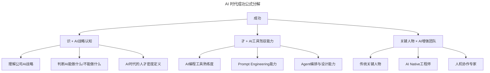
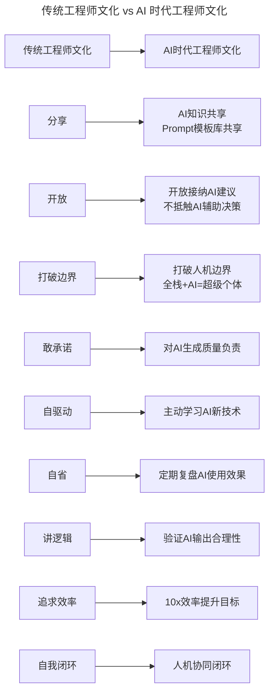

# 第79讲 | 程军：从0到1打造高效技术团队的方法论

> **适用范围**：CTO、技术总监、创业团队技术负责人，以及需要从零组建技术团队的管理者
>
> **更新摘要（v2 · 2026-08 更新）**：
> - 结构化升级为 6 节骨架（导言 / 核心方法论 / 关键流程 / 工具与实战 / 常见误区 / 进阶延展）
> - 新增 AI 时代公式：成功 =（识 + AI 认知）×（才 + AI 协作能力）× 人
> - 补充招聘三问的 AI 版本与工程师文化的 AI 时代演进
> - 新增 AI Native 关键人物培养路径与工程师个人成长路径
> - 所有 Mermaid 图表添加 title frontmatter 并补充文字解读

## 1. 导言

我的分享主要分成三篇，第一篇讲我对高效技术团队的看法以及我的方法论；第二篇讲我过去成功的实践；第三篇讲我踩过的坑。

曾国藩有言："**凡成大事，以识为主，以才为辅；人谋居半，天意居半。**"

"识"我认为就是一个人的大智慧、格局，有远见。"才"是一个人的小聪明，注意这里的小，意在小角度细枝末节的把握。

如果将这一观点套用到搭建高效技术团队这件事上："**识**"是了解公司战略，并弄清当前所做的产品线对公司战略的达成有什么帮助等；"**才**"是先找 leader 还是干活的、选 Java 还是 Go等人员招聘、技术选型等方向的具体事宜。不难得出结论，"识"是最重要的。

### 2026 新公式

**成功 =（识 + AI 认知）×（才 + AI 协作能力）× 人**

## 2. 核心方法论

### 2.1 以"识"为主：站在全局高度思考

要打造高效技术团队，先站在你可以认知到的全局高度去思考，比如我会去了解我的团队在公司组织架构中所处的位置，去了解公司的整体战略以及我所负责的产品对公司战略的影响。接着，作为 leader，当务之急就是思考怎么做才能支撑这个产品战略。

### 2.2 2026 新公式解析



分解图展示了 AI 时代成功公式的三个维度："识 + AI 战略认知"要求管理者理解公司 AI 战略、判断 AI 能力边界、重新定义人才密度；"才 + AI 工具驾驭能力"要求掌握 AI 编程工具、Prompt Engineering、Agent 编排设计；"关键人物 × AI 增强团队"要求培养传统关键人物、AI Native 工程师和人机协作专家。**三个维度相乘而非相加，任何一个维度的短板都会显著拖累整体**。

### 2.3 "识"的三个维度

**第一点：关注人**

一家公司的成功公式是：成功 = 战略 × 组织能力。然而，战略是由团队领袖思考和决定的，组织能力也是由这帮人来打造的，因此，这个公式核心还可以写成：**成功 = 人 × 人**。当然，这里的人并不是普通的人，而是指**关键人物**。

**第二点：工程师文化**

工程师文化的核心体现是团队气氛、做人原则和做事方式：
- **团队气氛**：分享、开放、打破边界
- **做人原则**：敢承诺、自驱动、自省
- **做事方式**：讲逻辑、追求效率、自我闭环

**第三点：工程师绩效评价**

工程师绩效评价的核心是，怎么评判我们达成的结果符合预期，其关键是**结果是否超过预期**，以及个人在其中是否有成长并实现个人价值。

### 2.4 工程师文化的 AI 时代演进



对比图展示了工程师文化九个维度的 AI 时代演进：分享升级为 AI 知识共享；开放升级为接纳 AI 建议；打破边界升级为打破人机边界；敢承诺升级为对 AI 生成质量负责；追求效率升级为 10x 效率提升目标。**核心变化是从"人与人协作"扩展到"人与 AI 协作"**。

## 3. 关键流程

### 3.1 快速组建核心团队

按照方法论，可以分解成三点：

1. 我们的雇主品牌怎么样，我们需要什么样的人才？
2. 符合这些要求的人才在哪里？
3. 我们用什么方法和渠道去接触这些人才并且吸引到这些人才？

### 3.2 招聘三问的 AI 版本

| 维度 | 原版 | AI 时代版 |
|------|------|----------|
| 人才画像 | 知识 + 经验 + 能力 + 动力 | **AI 编程能力 + Prompt 能力 + Agent 思维 + 人机协作经验** |
| 渠道策略 | 猎头、内推、招聘网站 | **GitHub Copilot 用户社区、AI 开源项目贡献者、Kaggle 竞赛选手** |
| 吸引力要素 | 薪资、期权、文化 | **AI 工具栈先进性、AI 实践机会、人机协作文化** |

### 3.3 初心与动力

你选择软件行业的初心是什么？你的初心可以支持你走多远呢？

李嘉诚曾经说过一句话，你想过普通的生活，就会遇到普通的挫折。你想过最好的生活就会遇到最强的伤害。这个世界很公平，你想要最好，就一定会给你最痛。

而你的初心就是支撑你往前走的动力。**在 AI 时代，初心的本质不变——解决真实问题、创造用户价值。但实现初心的路径变了：以前靠个人英雄主义，现在靠"人 + AI"协同。**

### 3.4 工程师绩效评价标准

作为 leader，怎么判断团队成员到底做的好不好呢？以下几点可以参考：

1. 可以把他负责的事在指定的时间截点做成
2. 做完之后他会思考有什么改进的办法，能让下次做的更好，并分享给其他的人或团队
3. 他会想着帮团队其他人员甚至团队本身解决问题，而不是只干好自己的
4. 他会去思考自己的工作结果是不是切中客户的需求
5. 他会突破自己所在的认知高度去思考自己的工作，并站在他的下一个职级能力的角度去看到问题的本质

## 4. 工具与实战

### 4.1 团队 Leader 必做 3 件事

1. **建立 AI 工具标准栈**
   - 统一配置 GitHub Copilot / Cursor / Windsurf 等 AI 编程工具
   - 建立团队 Prompt 模板库（代码审查、技术方案、Bug 排查）
   - **预期效果**：编码效率提升 30-50%

2. **重新定义绩效评价**
   - 新增指标：**AI 工具使用率、AI 辅助产出占比、Prompt 工程质量**
   - 从"写多少代码"转向"**用 AI 创造多少价值**"

3. **培养 AI Native 关键人物**
   - 选拔"AI Champion"负责推动团队 AI 实践
   - 组织内部 AI Hackathon（主题：用 Agent 解决实际业务问题）
   - 建立"人机配对"机制：1 个资深工程师 + AI = 1 个超级生产力单元

### 4.2 工程师个人成长路径

```
Level 1: AI使用者 → 会用Copilot写代码
Level 2: AI优化者 → 能写高质量Prompt，调优AI输出
Level 3: AI设计者 → 能设计Agent工作流，解决复杂问题
Level 4: AI战略者 → 能规划团队AI路线图，培养AI文化  ⭐2026目标
```

## 5. 常见误区

### 5.1 AI 时代的避坑指南

| 坑 | 表现 | 解决方案 |
|----|------|----------|
| **AI 幻觉陷阱** | 盲信 AI 生成的代码 / 方案 | 建立AI输出审查机制，Critical Thinking不可丢 |
| **人才错配** | 招了AI工具高手但缺乏业务sense | 优先招"**业务理解 + AI 能力**"复合型人才 |
| **文化冲突** | 老员工抵触AI工具 | 从小胜开始，展示AI带来的效率提升，而非强制推行 |
| **过度依赖** | 离了AI不会干活 | 保持核心技术功底，AI是放大器不是替代品 |

### 5.2 传统团队建设的误区

- **重"才"轻"识"**：只关注技术选型和招聘细节，忽视了战略对齐
- **平均主义**：在每个人身上花一样的时间，而不是聚焦关键人物
- **文化空谈**：口头说工程师文化，但没有落实到绩效评价和日常行为中

## 6. 进阶延展

### 6.1 核心结论

程军的"识为主、才为辅"在 AI 时代依然成立，但"识"要加上 AI 战略认知，"才"要加上 AI 协作能力。

**2026 年的高效技术团队 = 关键人物的远见 + AI 工具的放大 + 人机协同的文化**

### 6.2 初心的 AI 时代意义

- 在 AI 时代，**初心的本质不变**——解决真实问题、创造用户价值
- 但**实现初心的路径变了**：以前靠个人英雄主义，现在靠"**人 + AI**"协同
- 程军在饿了么解决"人类懒"这个 bug，2026 年的你可以用 AI 解决更复杂的 bug
- **关键转变**：从"I can code"到"I can leverage AI to solve problems 10x faster"

---

*本注解基于 2026 年 6 月技术环境生成。2026 年的技术背景：GPT-5.5 发布，DeepSeek V4 国产大模型崛起，84% 开发者已将 AI 编程作为日常工作方式。*
