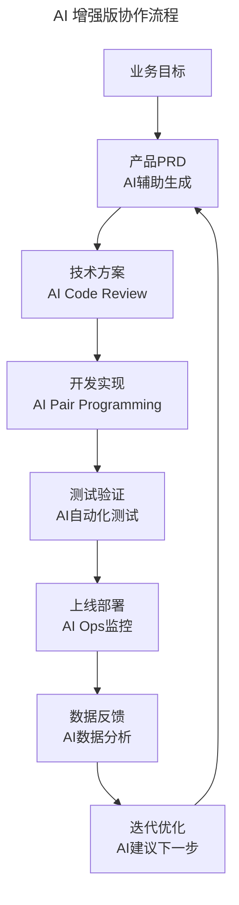
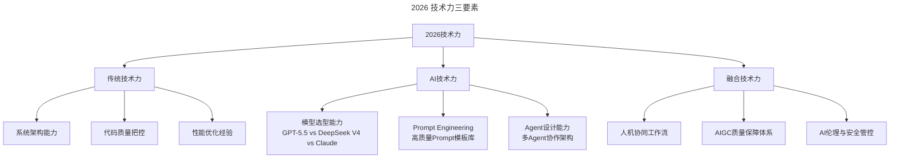

# 第91讲 | 程军：打造高效技术团队之做事

> **适用范围**：CTO、技术总监、工程经理，以及需要提升团队执行力与产品力的技术管理者
>
> **更新摘要（v2 · 2026-08 更新）**：
> - 结构化升级为 6 节骨架（导言 / 核心方法论 / 关键流程 / 工具与实战 / 常见误区 / 进阶延展）
> - 新增"和业务心在一起"的 AI 时代协作流程
> - 补充技术力与产品力的 AI 时代重塑（四阶段模型）
> - 新增 2026 技术力三要素与产品力 AI 革命
> - 整合可执行的 2026 行动清单
> - 所有 Mermaid 图表添加 title frontmatter 并补充文字解读

## 1. 导言

上一篇，我跟你分享了招人的那些事，包括招聘渠道和识人两个大方向。众所周知，招人的核心原因是为了做事，所以，我今天就继续跟大家聊聊**做事**这个话题。

### 原文核心框架

团队必须要有一个**共同的目标**、**可迭代的协作流程**，以及**统一的评价机制**。做好事的关键：
1. 和业务心在一起
2. 打造技术力和产品力
3. 从内因和外因两方面分析

## 2. 核心方法论

### 2.1 和业务心在一起

我之前在饿了么负责产品和研发落地，在实际执行中，我会先和业务负责人沟通好彼此做事的方法和节奏，最主要的是先确定下一个月的业务目标，然后产品和研发团队这边好确定产品的目标。

我们每个月都会集中过一次下个月计划落地的产品功能，如果业务方 OK，产品经理就会提前准备 PRD，这样至少可以让团队提前了解下个月的规划，研发和测试团队也能提前准备，有一个缓冲，应了那句古话"**兵马未动粮草先行**"。

如果碰到紧急需求，我们做法是紧急需求不需要排期，可以按约定砍掉一些 P0 需求。如果出现 P0 需求也砍不掉的情况，只能从灵活的组织能力出发，在自己的团队中成立机动团队，这些人就是我们团队的**特种兵，指哪打哪**。

### 2.2 AI 时代协作流程



协作流程图展示了 AI 时代的全链路增强：业务目标 → AI 辅助生成 PRD → AI Code Review 技术方案 → AI Pair Programming 开发 → AI 自动化测试 → AI Ops 监控上线 → AI 数据分析反馈 → AI 建议迭代优化。**每个环节都有 AI 参与，形成从目标到迭代的完整闭环**，效率相比传统流程提升数倍。

### 2.3 评价机制

人一般很难找到自己的问题，所以定期和业务负责人乃至上级领导 one-on-one 沟通，让他们指出自己做的不好的地方、欠考虑的地方，是真的可以帮助自己和团队改进和提升。

引用前公司老领导说过的一句话，"**未长夜痛哭者，不足以语人生**"。

## 3. 关键流程

### 3.1 技术力和产品力的三个阶段

**第一个时间段是 2015 年~2016 年，技术团队从几十人发展到 500 人左右。**

这期间，我可以毫不客气的说，我们根本没有什么产品力，先把业务的需求干完就可以，这个阶段要做的就是招人，干活，团队速度扩张快，但是工程效率低下，P0 事故频繁发生，痛苦不堪。

**第二个时间段是 2016 年~2017 年，技术团队从 500 扩张到 1000 人左右。**

这个时候慢慢出现一个大的问题，招进来的人是多了，可是响应新产品的效率依然很低。因此，这时需要沉淀我们的中台、中间件、工程效率工具及技术影响力。

以技术影响力为例，饿了么第一个有影响力的项目是"多活"，严格意义上来说国内真正做到多活的不超过 10 家公司。内部孵化的工具或者中间件就有 200 多个，还开源了更多的比如 Element 组件等等。

**第三个时间段是 2017 年~2018 年，技术团队规模突破 1200+。**

这个阶段广义上来说，互联网产品一定是流量为王，留存为后，但最终你的模式要成功，要么可以赚钱自己造血，要么可以成为别人的护城河或防御工具。按上面的思路我们开始了双剑合并，选择加入阿里的怀抱。

### 3.2 四阶段模型（含 AI 时代新增）

| 阶段 | 时间段 | 原文特征 | 2026 新增 |
|------|--------|----------|------------|
| **生存期** | 0-50 人 | 招人、干活、工程效率低下 | **AI 工具快速补齐能力缺口** |
| **成长期** | 50-500 人 | 沉淀中台、中间件、工程效率工具 | **AI 中台：Prompt 管理、Agent 编排平台** |
| **成熟期** | 500-1200 人 | 技术影响力、开源、Hackathon | **AI 影响力：开源 AI 项目、内部 Agent 生态** |
| **智能期** | 1200 人+ | （原文未涉及） | **AI Native 组织：人机协同成为 DNA** |

### 3.3 2026 技术力三要素



分解图展示了 2026 年技术力的三大要素：传统技术力（系统架构、代码质量、性能优化）仍是基础；AI 技术力（模型选型、Prompt Engineering、Agent 设计）是新增核心；融合技术力（人机协同工作流、AIGC 质量保障、AI 伦理安全）是两者的交叉领域。**三者缺一不可，传统技术力是根基，AI 技术力是加速器，融合技术力是保障**。

### 3.4 产品力的 AI 革命

**原文**："互联网产品一定是流量为王，留存为后"
**2026 升级**："**AI 原生产品 = 智能体验为王，个性化为后**"

| 维度 | 传统产品力 | AI 时代产品力 |
|------|-----------|-------------|
| 用户理解 | 用户调研、数据分析 | **AI 用户画像 + 实时行为预测** |
| 功能交付 | PRD → 开发 → 测试 → 上线 | **自然语言描述 → AI 生成 → 自动验证 → 上线** |
| 迭代速度 | 2 周一个 Sprint | **1 天多次迭代（AI 辅助）** |
| 个性化 | 分群运营、A/B Test | **千人千面的实时个性化** |

## 4. 工具与实战

### 4.1 内因和外因的 AI 时代解读

**内因（可控因素）**：

1. **AI 成熟度评估**
   ```
   Level 1: 实验阶段 - 少数人在用AI工具
   Level 2: 推广阶段 - 团队标配AI编程工具
   Level 3: 融合阶段 - AI融入研发全流程
   Level 4: 引领阶段 - AI成为核心竞争力  ⭐ 2026目标
   ```

2. **组织 AI 就绪度检查清单**：
   - [ ] 是否有统一的 AI 工具栈？
   - [ ] 是否有 Prompt Engineering 规范？
   - [ ] 是否有 AI 输出质量标准？
   - [ ] 团队是否接受 AI 辅助决策？
   - [ ] 是否有 AI 相关的 KPI？

**外因（环境因素）**：
1. 竞争压力：竞品已用 AI 将研发效率提升 3-5 倍
2. 人才市场：84% 开发者期望公司提供 AI 工具
3. 技术趋势：Agent 加速落地，不布局就落后
4. 客户期望：用户习惯 AI 产品的智能体验

### 4.2 2026 行动清单

**本周可做（Quick Wins）**：

1. **为团队配置 AI 编程工具**
   - 推荐：GitHub Copilot / Cursor / Windsurf
   - 成本：约 $20/人/月
   - **预期 ROI**：效率提升 30%+

2. **建立第一个 Prompt 模板库**
   - 场景：代码审查、Bug 排查、技术方案撰写
   - 方式：共享文档 + 版本控制

3. **用 AI 优化一次 Code Review 流程**
   - 工具：GPT-5.5 + GitLab/GitHub 集成
   - 目标：减少 80% 的重复性审查工作

**本季度目标（Strategic Goals）**：

1. **完成团队 AI 成熟度从 Level 1→Level 2**
   - 培训覆盖率 100%
   - AI 工具使用率 >80%
   - 至少 1 个 AI 成功案例

2. **打造 1 个 AI Native 产品特性**
   - 用 Agent 重构某个现有功能
   - 用户体验提升可量化

3. **建立 AI 效能度量体系**
   - 指标：AI 辅助产出占比、AI 工具使用时长、Prompt 成功率
   - 月度复盘，持续优化

## 5. 常见误区

### 5.1 做事的常见陷阱

| 坑 | 程军原文警示 | 2026 新坑 |
|----|------------|-----------|
| **执行力陷阱** | "产品负责人没有独立思考能力" | **过度依赖 AI 导致丧失判断力** |
| **性格弱点** | "要改正或回避" | **AI 放大而非弥补性格缺陷** |
| **成长烦恼** | "未长夜痛哭者不足以语人生" | **AI 时代的学习焦虑症** |

### 5.2 业务协作的误区

- **技术与业务脱节**：技术团队闭门造车，不和业务方沟通目标和方法
- **紧急需求处理不当**：没有机制应对紧急需求，导致正常排期被打乱
- **评价机制缺失**：不定期与业务方 One-on-One 沟通，不知道自己的问题
- **过度承诺**：为了取悦业务方过度承诺，导致团队疲于奔命

## 6. 进阶延展

### 6.1 核心结论

程军的"做事"方法论在 AI 时代依然有效——和业务同心、打造技术力与产品力、内外因分析。但 2026 年的"做事"效率可以提升 10 倍，关键在于：**用 AI 增强执行力，用人类保持判断力，用人机协同创造更大价值**。

### 6.2 One-on-One 的 AI 辅助

**2026 版 One-on-One**：
- **会前**：AI 汇总双方合作数据（交付率、响应时间、满意度）
- **会中**：AI 实时记录要点，识别潜在问题
- **会后**：AI 生成 Action Items，跟踪落实情况

### 6.3 核心原则不变

> **程军金句**："未长夜痛哭者，不足以语人生"
> 
> **2026 补充**：但有了 AI 助手，你可以少熬一些夜，把时间花在更有价值的思考上。

凌晨 5 点 43 分的江城，现在可以有 AI 陪你一起看窗外的风景了。

---

*本注解基于 2026 年 6 月技术环境生成。2026 年的技术背景：GPT-5.5 发布，DeepSeek V4 国产大模型崛起，84% 开发者已将 AI 编程作为日常工作方式，Agent 进入加速落地期。*
