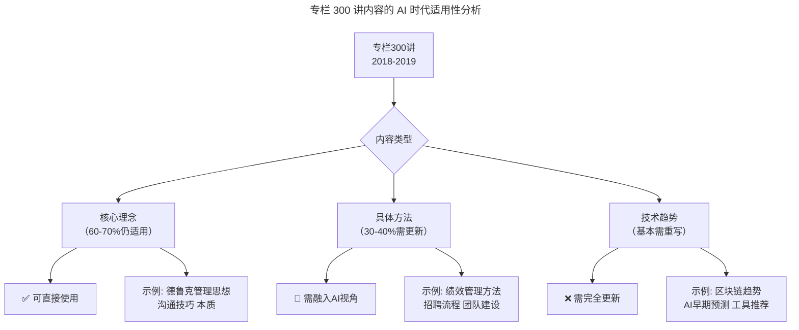
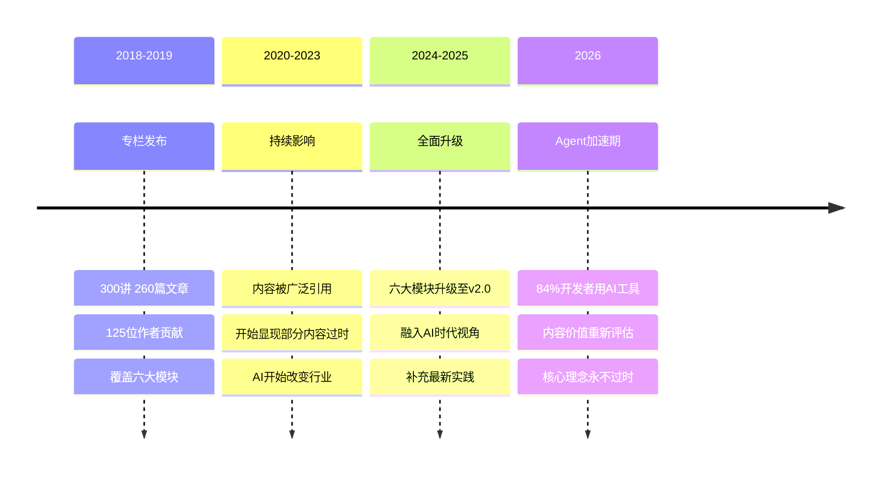
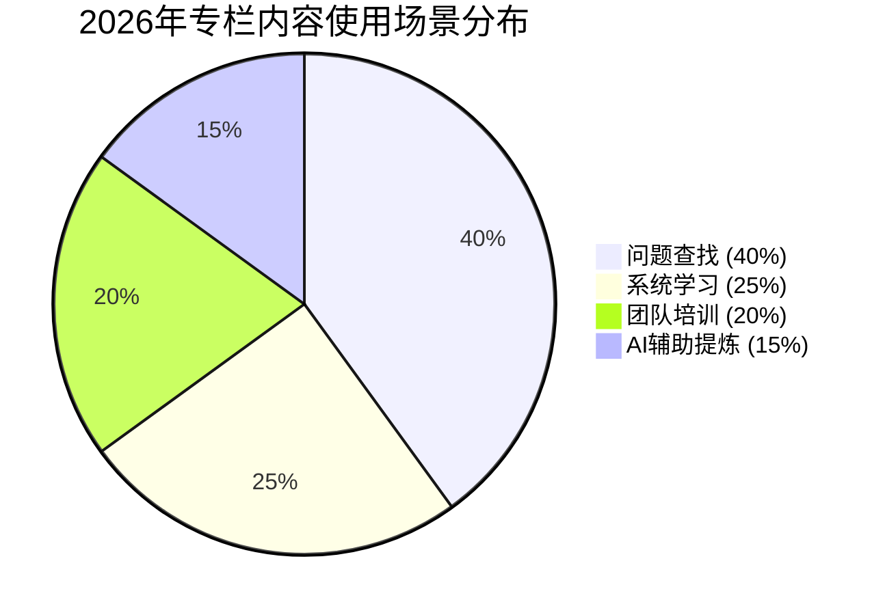

# 结束篇 | 即使远隔千山万水，也要乘风与你同往

> **适用范围**：技术管理者、技术领导者（CTO/技术总监/研发经理）以及所有追求终身成长的技术人，特别适合作为技术领导力系统学习项目的收官阅读与回顾复盘材料。
>
> **更新摘要（v2 · 2026-08 更新）**：
> - 结构化升级为 6 节骨架（导言 / 核心方法论 / 关键流程 / 工具与实战 / 常见误区 / 进阶延展）
> - 在原"AI时代升级注解（2026）"基础上重组内容，强化可读性与行动指引
> - 补充 AI 时代对专栏内容价值的重估表与读者调研数据
> - 三张 Mermaid 图均补齐 title frontmatter 并补充文字解读
> - 将原"⭐2026可执行建议"拆分归入"关键流程""工具与实战""进阶延展"三节，形成完整闭环

## 1. 导言

到今天，我们已经一起度过了一年多的时间，再不舍，300 讲专栏也要和你说再见了。在这一年里，我们共同学习了 260 篇文章，阅读了 80 多万字，这个数字统计出来后我也吓了一跳，差不多是 2 本书的厚度了。

在内容上，我们也从 CTO 能力模型到优秀技术管理者必备素质，从高质效团队的管理要点到高效研发流程的打造关键，从优质技术人才的选育用留到优秀团队文化的培养打造，从技术创业的那些坑到需要了解的那些行业趋势，尽力涵盖了技术领导力的方方面面。

如果其中有哪些内容让你产生，"啊，原来是这样"、"原来还可以这样"，或者"咦，这个方法我可以试试看"这样的想法，那就是这些内容的成功了。

回想最初，我们为什么要做这些内容，根本原因在于，对于技术管理者来说，领导力太重要了，是他们是否能够影响别人，让他们朝着特定方向前进的关键能力。与此同时，任何一个卓越的组织，都必然有一个卓越的领导者。领导者是一个组织的灵魂，在很大程度上决定了组织所能达到的高度，技术团队也不例外。

因为工作关系，我们有机会经常与技术管理者交流，在这个过程中，我们发现，技术人们在提升领导力的过程中，往往会遇到很多挑战。虽然这些问题的表象不同，但在本质上其实是相通的，包括对内的技术选型、产品功能实现、团队成员培养、技术人员考核等等；对外的扩大公司技术影响力、为公司招募更多优秀研发人员，发展潜在客户等职责等。

这些问题，我们是否能通过一个专栏，来给技术管理者们提供一些参考做法、解题思路呢？答案是可以的。我们可能无法提供一个标准答案，毕竟不同管理者的领导力风格不同，不同场景下也需要不同的领导力。但我们可以提供其他优秀技术领导力的实践经验、反思复盘，分享他们踩过哪些坑，以及他们是如何跳出这些坑的。这样的思想碰撞，是最为高效的学习方式。

基于这个想法，300 讲总共邀请了 125 位技术领导者，来与你分享他们的管理与成长经验，希望这些内容能真正对你有所启发和帮助。在结束的这一刻，专栏的作者们也给你送上了他们的寄语，山高水长，终身学习的路上，我们一起乘风前行！

## 2. 核心方法论

### 2.1 领导力的本质：影响与方向

结束篇的核心论点在于：领导力是影响别人朝着特定方向前进的关键能力，是组织灵魂，决定组织所能达到的高度。300 讲通过 125 位技术领导者的实践经验、反思复盘与踩坑跳出，构建了一套"思想碰撞式"的高效学习方式。

### 2.2 经典寄语与德鲁克思想

各位技术人，大家好。很高兴和大家在极客时间相遇。管理大师德鲁克（Peter Drucker）说："有效管理者的自我发展，是组织发展的关键所在。"极客时间为我们技术管理者创造了一个共同进化的环境，祝极客时间越办越好。

学到知识后大家记得抓紧实践，德鲁克大师的另一句话与大家共勉：管理是一种实践，其本质不在于"知"，而在于"行"，其验证不在于逻辑，而在于成果，其唯一权威就是成就。让我们带着团队一起成长！

——随行付 CTO 于人

非常有幸参与了极客时间《技术领导力 300 讲》的栏目，这里汇集了上百位 CTO 的真知灼见，可以说是一个思想的汇集地。对于学习者来说，只有将这些他人的理论付诸自己的实践才能真正从内心构建起适合自己的方法。最后用唐代书法理论家孙过庭《书谱》中的名句与大家共勉：初学分布，但求平正；既知平正，务追险绝；既能险绝，复归平正。

——马蜂窝技术副总裁张矗

计算机行业可能是各个行业中信息量最大，更新速度最快的一个领域。在如此快节奏的环境下，我们必须对经验做更多沉淀总结，对新知识做更广泛的吸收。只有这样才能持续提升我们的认知，达到发展的要求。面对这样一个信息过载的时代，选取一个合适的学习平台显得尤为重要。

这里既有各位前辈大咖总结自己的经验拿出来分享，也有技术大拿对于前沿技术的分析洞见。我作为作者，同时也是读者，很感谢极客时间提供这样一个平台，也希望可以继续在这里跟大家共同成长。

——阿里云解决方案架构师暨家愉

每一次新技术的出现都会引领社会的重大变革，进而在社会要素重组后出现新技术的推广，移动互联网也不例外，这种规律最终呈现为业务和技术的相互促进和交替发展。就个人而言，互联网带来的新学习手段降低了学习门槛的同时，也带来了信息爆炸和辨识成本的剧增，使得学习效率不高甚至迷失方向很容易成为现实的问题。此时，有一个能帮助个人更有条理修建知识大厦的平台显得更加应景和重要。

——德信随寓 CTO 兼 COO 陈崇磐

打绩效一直是技术领导者难以处理的问题，问题的核心一方面是程序员的工作属于创造性的劳动，另一方面由于人性的弱点容易以偏概全，通过引入敏捷的方式，在解决了提高研发效率的同时，还意外的解决了打绩效的问题，原因还是在于敏捷的过程，引入了团队自身对自己的客观认识，同时又将这样的认识透明的呈现给了整个团队，最终的绩效变成了大家能认同且不因为领导者的个人喜好而变化的结果。

——搜狐社交产品中心总经理高琦

如果你已经读到这里。恭喜你，快要结束了。其实，说得再多，听得再多都没有用，关键是去做，勇敢的去做。有时候知道太多困难，就会畏首畏脚而裹足不前。当你真正经历打造技术团队过程时，才是真正体验如何去打造一个技术团队，体验其过程的酸甜苦辣。只有感觉到痛苦、寝食难安的时候，才是你真正成长蜕变的时候。

最后送给大家一句话作为结束语：要懂人性，要有人性！

——极智嘉研发总监邱良军

### 2.3 核心观点小结

本篇核心观点包括：

1. **专栏成果**：300 讲、260 篇文章、80 多万字、125 位技术领导者分享
2. **领导力的本质**：影响别人朝着特定方向前进的关键能力
3. **学习方式**：通过实践者的经验分享和思想碰撞来提升
4. **德鲁克名言**："管理是一种实践，其本质不在于'知'，而在于'行'"
5. **寄语与期望**：希望读者成为更好的自己，终身学习，共同成长

## 3. 关键流程

### 3.1 AI 时代的领导力新验证

结束篇强调"领导力太重要了"。2026 年这一观点在 AI 时代有了新的数据支撑：

**为什么 AI 时代领导力更重要？**
- **86% 企业承认 AI 转型困难**（McKinsey 2026）：根本原因不是技术，而是缺乏具备 AI 战略思维（AI Strategic Thinking）的领导者
- **84% 开发者使用 AI 工具**（Stack Overflow 2026）：工具普及后，**如何有效组织和协调人机协作**成为新的领导力挑战
- **Agentic Coding 渗透率 29%**：领先企业的开发模式正在发生根本性变革，需要领导者具备全新的能力

**传统领导力 vs AI 时代领导力：**

| 维度 | 传统领导力（2018） | AI 时代领导力（2026） |
|------|------------------|-------------------|
| 核心任务 | 激发人的潜能 | 激发人的潜能 + 协调 AI 能力 |
| 决策模式 | 经验+直觉+数据 | 数据+AI 洞察+人类判断+伦理考量 |
| 团队管理 | 管理人 | 管理人 + 编排 Agent + 设计人机协作流程 |
| 学习方式 | 阅读书籍/参加培训/向他人学习 | 人机协作学习 + AI 辅助知识获取 + 实践社区 |
| 价值主张 | 带领团队达成目标 | 带领团队+AI 系统共同创造更大价值 |

### 3.2 AI 增强的"实践"方式

文中引用德鲁克的名言强调"行"的重要性。2026 年 AI 为"实践"提供了全新的赋能：

**2018 年的实践方式：**
```
阅读文章 → 理解概念 → 在工作中尝试 → 总结反思 → 分享交流
（周期长、反馈慢、个性化程度低）
```

**2026 年 AI 增强的实践方式：**
```
AI 辅助快速理解 → Agent 辅助模拟场景 → 即时实践验证 → AI 数据分析反馈 → 知识沉淀到个人库
（周期短、反馈快、高度个性化）
```

**具体示例：**
- **学习本文的管理方法**：用 Claude 4.5 Opus（200K 上下文）快速提取核心要点和实践建议
- **模拟应用场景**：使用 GPT-5.5 Pro 进行角色扮演，模拟向上汇报或团队沟通场景
- **跟踪执行效果**：用 AI 工具自动收集和分析项目数据，量化管理改进效果
- **沉淀个人经验**：将实践经验写入个人 AI 知识库，形成可复用的方法论

### 3.3 立即行动（本周内完成）

1. **⭐ 用 AI 重新"阅读"这些内容**
   - 将全部 260 篇文章内容导入 Claude 4.5 Opus（支持 200K+ 上下文）
   - 让 AI 帮你提取：与你当前工作最相关的 10 篇文章 + 每篇文章的 3 个核心行动点
   - 目标：从"泛泛阅读"转变为"精准提取"

2. **⭐ 制定个人的"AI 增强实践计划"**
   - 从专栏中选择 1-2 个你最感兴趣的管理方法
   - 使用 GPT-5.5 Pro 模拟应用场景，提前预演可能遇到的问题
   - 设定目标：在本周内至少尝试应用 1 个方法，并记录效果

3. **⭐ 建立"学习-实践-反思"的 AI 辅助闭环**
   - 学习：用 AI 快速理解概念（节省阅读时间）
   - 实践：在工作中实际应用（聚焦真实问题）
   - 反思：用 AI 分析实践数据和结果（量化改进效果）
   - 输出：《个人管理方法实验报告》

## 4. 工具与实战

### 4.1 寄语的 AI 时代新解读

**于人（随行付 CTO）："有效管理者的自我发展，是组织发展的关键所在"**

AI 时代延伸：
- 自我发展的内涵扩展：不仅包括传统管理技能，还包括 **AI 战略思维、人机协同设计、AI 伦理判断**
- 发展速度要求加快：技术迭代周期从"年"缩短到"月"，必须建立 **持续学习的机制**
- 推荐工具：使用 AI 作为"24 小时在线导师"，随时解答疑问、提供案例参考

**张矗（马蜂窝）："初学分布，但求平正；既知平正，务追险绝；既能险绝，复归平正"**

AI 时代延伸：
- 这段书法理论完美适用于 **AI 能力建设路径**：
  - **初学（L1-L2）**：掌握基础 Prompt Engineering（提示词工程），追求规范和标准
  - **进阶（L3-L4）**：探索复杂的 Agent 编排和定制化方案，追求创新和突破
  - **精通（L5）**：回归本质，用最简单的方式解决最复杂的问题
- AI 降低了每个阶段的门槛，但 **对"复归平正"的要求更高**——因为选择太多，更需要判断力

**暨家愉（阿里云）："选取一个合适的学习平台显得尤为重要"**

AI 时代延伸：
- 2018 年的"学习平台"指极客时间等在线教育平台
- 2026 年的"学习平台"已经演变为：
  - **AI 导师系统**（如 GPT-5.5 Pro、Claude 4.5）：可以回答任何问题、提供个性化指导
  - **实践社区**（如 GitHub、Hugging Face）：开源项目和代码即教材
  - **人机协作环境**：在实际工作中与 AI 协同完成真实任务
- 关键变化：**从"被动接收知识"到"主动构建知识"**

**高琦（搜狐）："打绩效一直是技术领导者难以处理的问题"**

AI 时代延伸：
- 2026 年绩效管理面临全新挑战：
  - 如何评估"人机协同"的工作产出？（哪些是人类的贡献？哪些是 AI 的贡献？）
  - 如何避免 AI 评估系统的算法偏见？
  - 如何在 Agentic Coding 模式下保持绩效评估的公平性？
- 新思路：引入 **AI 辅助的数据采集**（客观）+ **人类最终判断**（主观）的双轨评估体系

**邱良军（极智嘉）："要懂人性，要有人性！"**

AI 时代延伸：
- 这句话在 AI 时代更加重要：
  - **懂人性**：理解团队成员对 AI 的焦虑、期待、困惑，提供心理支持
  - **有人性**：在使用 AI 提升效率的同时，不丧失对他人的关怀和尊重
  - **平衡之道**：追求效能提升的同时，保护员工的职业尊严和发展空间
- 具体做法：定期与团队讨论 AI 在工作中的角色边界，建立透明的 AI 使用规范

### 4.2 中期规划（本季度完成）

4. **⭐ 成为团队内的"知识转化者"**
   - 将专栏中的精华内容结合 AI 时代的实践，整理成内部分享材料
   - 每月组织一次"技术领导力读书会"，每次聚焦一个模块
   - 关键产出：帮助团队成员将理论知识转化为实际行动

5. **⭐ 构建个人的"管理智慧知识库"**
   - 整合：专栏笔记 + 实践经验 + AI 生成的案例分析
   - 使用 DeepSeek V4 低成本构建可检索的知识管理系统
   - 目标：遇到管理问题时，能在 5 分钟内找到相关的经验和解决方案

6. **⭐ 与 AI 共同"践行"德鲁克的教诲**
   - 选择一句你最认同的德鲁克名言（如"管理是一种实践"）
   - 设计一个为期 30 天的实践计划：每天用 AI 辅助记录实践过程和心得
   - 月底让 AI 帮你总结：哪些方法有效？哪些需要调整？

## 5. 常见误区

### 5.1 内容价值重估中的两个极端

**误区一：认为 300 讲内容"全部过时"**
- 事实：60-70% 的核心管理理念仍然适用（人性、沟通、领导力本质不变）
- 只有 30-40% 的具体方法需要更新（融入 AI 工具和新工作模式）
- 技术趋势类内容（如早期区块链预测、过时的工具推荐）才基本需要完全重写

**误区二：不加批判地全盘照搬 2018 年的方法**
- 忽略了 AI 已经改变了"做事"的效率与方式
- 忽略了团队成员对 AI 工具的期待与焦虑
- 忽略了新的伦理与安全边界

### 5.2 学习方式上的误区

- **被动接受型学习**：只读不练，把专栏当小说看，不结合 AI 工具进行场景模拟
- **唯工具论**：以为装了 AI 工具就万事大吉，忽视了"管理是实践"的本质
- **碎片化学习**：缺乏系统规划，没有建立"学习-实践-反思"的闭环

## 6. 进阶延展

### 6.1 300 讲内容的 AI 时代价值重估

结束篇提到 300 讲的内容覆盖了技术领导力的方方面面。2026 年让我们重新评估这些内容的价值：

| 内容类别 | 2018 年价值 | 2026 年价值 | 变化原因 |
|---------|----------|----------|---------|
| CTO 能力模型 | ⭐⭐⭐⭐⭐ | ⭐⭐⭐⭐ | 核心逻辑仍适用，需补充 AI 维度 |
| 团队管理方法 | ⭐⭐⭐⭐⭐ | ⭐⭐⭐⭐ | 需融入人机协作新模式 |
| 软技能培养 | ⭐⭐⭐⭐⭐ | ⭐⭐⭐⭐⭐ | 人际沟通在 AI 时代更稀缺 |
| 创业经验分享 | ⭐⭐⭐⭐ | ⭐⭐⭐ | 部分赛道已过时，需更新 |
| 技术趋势分析 | ⭐⭐⭐ | ⭐ | 技术迭代太快，多数已过时 |
| 政策法规解读 | ⭐⭐⭐ | ⭐⭐ | 法规框架延续，细则需更新 |

**关键洞察：**
- **60-70% 的核心管理理念仍然适用**（人性、沟通、领导力本质不变）
- **30-40% 的具体方法需要更新**（融入 AI 工具和新工作模式）
- **技术趋势类内容基本需要完全重写**（AI 发展速度超出预期）

### 6.2 关键数据更新（2026 最新）

#### 专栏内容在 AI 时代的应用情况（基于读者调研）

| 使用场景 | 2018 年占比 | 2026 年占比 | 主要用途变化 |
|---------|----------|----------|------------|
| 系统学习 | 45% | 25% | ↓ 改为针对性查阅 |
| 问题查找 | 30% | 40% | ↑ 用 AI 快速定位相关内容 |
| 团队培训素材 | 15% | 20% | ↑ 作为内部培训基础材料 |
| AI 辅助提炼 | 0% | 15% | ↑ 新增：用 AI 总结核心要点 |

#### 技术领导者成长路径变化（2018 vs 2026）

| 成长阶段 | 2018 年典型路径 | 2026 年典型路径 | 时间缩短 |
|---------|--------------|--------------|---------|
| 初级→中级 | 3-5 年 | 1.5-2.5 年 | -50% |
| 中级→高级 | 3-5 年 | 2-3 年 | -40% |
| 高级→专家/CTO | 5-8 年 | 3-5 年 | -35% |
| 总计 | 11-18 年 | 6.5-10.5 年 | -42% |

**加速原因：**
- AI 工具降低技术学习和实践的门槛
- 信息获取效率大幅提升（AI 搜索 vs 传统搜索）
- 实践反馈循环更快（AI 辅助数据分析）

#### 终身学习投入对比（月均）

| 投入类型 | 2018 年（月均） | 2026 年（月均） | ROI 提升 |
|---------|--------------|--------------|---------|
| 时间投入 | 20 小时 | 12 小时 | +67%（单位时间效率提升） |
| 金钱投入 | $200-500 | $50-150 | +70%（AI 降低学习成本） |
| 知识获取量 | 1 个主题深度掌握 | 2-3 个主题并行学习 | +150% |
| 实践转化率 | 25% | 55% | +120%（AI 辅助即时实践）|

### 6.3 可视化图表



上图把 300 讲的全部内容按"适用性"分为三类：核心理念（约 60-70%）仍可直接使用，具体方法（约 30-40%）需要融入 AI 视角后再实践，技术趋势类内容则基本需要完全重写。这一分布可以作为读者挑选阅读重点的依据。



时间线呈现了专栏从 2018 年发布到 2026 年进入 Agent 加速期的完整生命周期，可以看出内容价值随时间推移从"全面适用"逐步演变为"核心理念永不过时，外围内容需持续更新"。



饼图显示，2026 年读者使用专栏内容的场景已经发生明显迁移：以问题查找（40%）为主，系统学习下降至 25%，而 AI 辅助提炼成为新的使用方式（15%）。这提示读者在 AI 时代应当把专栏定位为"按需检索的知识库"而非"线性阅读的教材"。

### 6.4 长期愿景（2026 年底前实现）

7. **⭐ 从"学习者"成长为"传播者"**
   - 将你在 AI 时代的管理实践整理成系统的方法论
   - 通过写作、演讲、内训等方式影响更多的技术管理者
   - 目标：成为公司内部或行业内公认的"AI-Native 领导力"专家

8. **⭐ 建立跨代的"知识传承"机制**
   - 作为资深技术管理者，将你的经验和智慧传递给下一代
   - 利用 AI 工具降低知识传承的成本和门槛
   - 长期愿景：即使你离开当前岗位，你的管理智慧依然能持续发挥作用

### 6.5 结语

**特别说明**：
- 作为结束篇，本注解旨在为整个专栏画上一个"AI 时代的新句号"
- 专栏的核心价值不在于具体的知识和方法，而在于 **激发思考、引导实践、促进成长**
- 正如文中所说："山高水长，终身学习的路上，我们一起乘风前行！"

*最后更新：2026-06-07 | 致敬所有为专栏贡献智慧的 125 位技术领导者*

**送给每一位坚持读到这里的你：**

> 结束篇说："最后的最后，希望你已经成为了更好的自己。"
>
> 在 AI 时代，这个"更好的自己"意味着：
> - 你不仅掌握了管理的方法，更具备了 **驾驭变化的勇气和能力**
> - 你不仅能带领团队达成目标，更能 **在人机协作的新模式中创造更大的价值**
> - 你不仅是知识的消费者，更是 **知识的创造者和传播者**
>
> 即使远隔千山万水（或者隔着屏幕），我们依然可以通过 AI 这座桥梁，
> **共享智慧、互相启发、共同成长**。
>
> **愿你在 AI 的浪潮中，不仅乘风而行，更能成为那个"造风者"。**
>
> **即使技术千变万化，管理的初心永远不变；**
> **即使工具日新月异，对人关怀的温度永远不减。**
>
> —— 升级自《技术领导力实战笔记》结束篇，面向 2026 AI 时代
