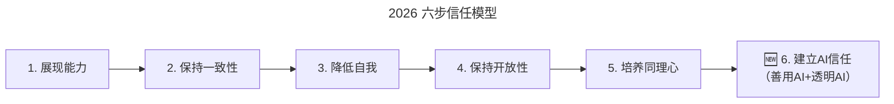

# 第191讲 | 肖冰：如何建立高信任度的团队

> **适用范围**：技术团队负责人、研发经理、技术总监等需要从零搭建或修复团队信任关系的管理者，特别适合在"个人英雄主义→团队协作"转型期、或制度流程过度膨胀导致团队活力下降的场景下参考。
>
> **更新摘要（v2 · 2026-08 更新）**：
> - 结构化升级为 6 节骨架（导言 / 核心方法论 / 关键流程 / 工具与实战 / 常见误区 / 进阶延展）
> - 在原"AI 时代升级注解（2026）"基础上，将信任五步法扩展为六步模型并补充第六步"建立 AI 信任"
> - 补充"2026 信任公式"新增变量（AI 协同度、AI 不透明度）及解读
> - 一张 Mermaid 图补齐 title frontmatter，并增加图后文字解读
> - 将原"⭐2026 可执行建议"统一归入"工具与实战"和"进阶延展"两节

## 1. 导言

### 成功依靠的是团队协助，而不是个人英雄

我早期的成长经历让我形成了颇为个人英雄主义的认知，即成功靠的是提升个人技术能力。当时的同事还送给我一个外号"大侠"，我对这个外号虽然谈不上骄傲，但颇有自信可以解决各种技术问题，而且我当时在工作上基本上是一个独行侠，一个人就可以快速完成各种任务，这也进一步强化了我的个人英雄主义。

可随着年龄的增长、业务的发展、职位的提升，当年"任何工作上的事情都能自己一个人扛下来"的自信慢慢消失。另外，虽然增加了很多下属，但是压根不懂管理甚至蔑视管理，还是按照"自己来"和"我先学会再教大家"的工作思路做事，基本上工作中遇到困难都是自己一个人尝试解决。但实际上人的精力是有限的，不可能面面俱到，结果导致工作绩效每况愈下。经过起初的迷茫、无助、焦虑等阶段后，终于明白当下想要把工作做好，需要的不是继续增强个人的能力，而是要依靠团队的力量。

这一篇的核心问题就是：到底如何建设团队？如何带领团队一起实现目标？每天在一起工作的同事就是团队吗？团队建设就是外出旅游，吃吃喝喝吗？作者最终给出的答案是：建立和增强信任才是团队建设的基石（Trust is the foundation of team building）。

## 2. 核心方法论

### 2.1 依靠制度流程不能建设团队

当意识到问题之后，我开始恶补和实践很多软件开发领域的管理方法，经过一段时间的学习和思考，那时得出的结论是，靠细化岗位职责、强化制度流程才能发挥团队的力量。于是，开始按照软件工程的思想，依据 CMMI 的理念进行管理，进一步明确和细分岗位，建立了一系列的制度和流程。但结果是，表面上大家貌似都很认真、忙碌，产出了一堆工程文档和记录，但实际上客户满意度却越来越差，而且能明显感觉到同事的活力越来越低，办公室里越来越安静了。

经过痛苦的反思和总结后，我意识到，不断增加的制度和流程在规范操作、提高效率的同时也在压制个性、扼杀创新，让大家觉得工作没劲，缺乏乐趣。之所以设计这些制度和流程，本质上是不信任员工的能力，也不相信员工的责任心。这种不信任员工，只相信制度的管理方法，并不适合技术这种鼓励创新的、非重复劳动的工作。

### 2.2 信任是团队建设的基石

那到底如何建设团队？如何带领团队一起实现目标呢？那时我一直在思考这些问题，后来有幸加入 TGO 鲲鹏会，对我个人而言仿佛推开了一扇大门，着实开阔了眼界，各种知识扑面而来。一个偶然的机会我读到了《团队协作的五大障碍》以及《突破——程序员如何练就领导力》这两本书，给了我极大的启发和触动。我意识到建立和增强信任才是团队建设的基石。

那么具体如何才能建立信任呢？我认为简单来说，平等、真诚这两个原则是取得信任的关键。

### 2.3 信任建立的五步法

**原文回顾**

建立信任五步：
1. **展现能力（Demonstrate Competence）**：证明你能胜任
2. **保持一致性（Consistency）**：言行一致
3. **降低自我（Low Self-Orientation）**：关注团队而非个人
4. **保持开放性（Openness）**：透明沟通
5. **培养同理心（Empathy）**：理解他人感受

### 2.4 2026 六步信任模型（新增第六步）



上图在原"五步法"基础上新增第六步"建立 AI 信任"。这一步专门回应 2026 年 84% 开发者使用 AI 编程的现状——团队成员不仅需要彼此信任，还需要学会信任 AI 工具、信任人机协作流程。新一步的核心动作是"善用 AI"与"透明 AI"两手抓：既要让团队具备 AI 协作能力，又要让 AI 的使用过程可解释、可审计。

**第六步详解：建立 AI 信任**

| 子维度 | 定义 | 具体做法 |
|-------|------|---------|
| **AI 能力信任** | 团队相信 AI 工具能可靠地完成任务 | 选择经过验证的 AI 工具，定期展示 AI 成功案例 |
| **AI 过程信任** | 团队相信 AI 的使用过程是透明的 | 建立 AI 决策日志，公开 AI 使用规范 |
| **AI 安全信任** | 团队相信 AI 不会危害数据安全 | 严格的数据分类和访问控制 |

### 2.5 信任公式的 AI 时代版本

**原文回顾**

```
信任 = (专业度 + 可靠度 + 亲近度) / 自我导向
```

**2026 新增变量**

```
2026版信任 = (专业度 + 可靠度 + 亲近度 + AI协同度) / (自我导向 + AI不透明度)

其中：
- AI协同度 = 团队成员与AI协作的顺畅程度
- AI不透明度 = AI决策过程的不可解释程度（越低越好）
```

新公式在分子中增加"AI 协同度"，在分母中增加"AI 不透明度"。前者意味着团队越善于与 AI 协作，信任水平越高；后者意味着 AI 使用越不透明，信任越低。这提示管理者既要提升团队的人机协作能力，也要让 AI 的使用过程保持公开、可追溯。

## 3. 关键流程

### 3.1 第一步：思想的转变

作为一个团队领导者，首先你要从内心相信，改变你的观念能够带来结果的改变，要放下自己可能由于年龄、资历、职位等各方面优于团队成员而带来的自信，放下感觉团队成员能力不足、没责任心、不够努力的偏见，从内心深处相信只有信任、授权、依赖你的团队成员，才能提高团队绩效。

不要以"因为团队成员能力不足，责任心不强，所以我不能信任"作为理由进行辩解。因果要倒置，要相信"由于团队成员没有被信任，所以不愿意负责，不愿意提升能力"。这点很重要。我曾经有很多次差点忍不住出言指点或者自己动手，但是每次都在心里告诉自己既然选择相信大家，就彻底放手，毕竟只有亲自经历挫折才能成长。

### 3.2 第二步：真诚的沟通

以前我意识到自己不会说话，太直接，老讲实话，不擅长沟通，这是一个缺点，需要改正。因此我读了很多如何提高情商或说话技巧类的书籍，也学习了一些方法，比如先表扬，再批评，接着再表扬的三明治批评法。但是在实践中，我发现这样沟通看起来一团和气，但实际上并没有解决问题，甚至可能让问题更加的恶化。

后来感觉这种沟通方式太累了，还是回到我熟悉的有话直说的方式，不过尝试改变了自己之前以问题导向为主的沟通方式，我不仅说出那些可能让人不快的结论，而且把我所得到结论的各种事实、思考及推理的过程和盘托出，没有压抑或者掩盖自己对某些事情的好恶，反而感觉获得了有效的沟通。

试想一下，如果团队成员间不能如实地表达自己的想法，而是按照某种高明的、不伤人的沟通技巧沟通，能形成真正互相可信赖的团队吗？

### 3.3 第三步：尽量多地暴露工作以外的信息

做个简单的小调查，你是否能准确地说出你团队成员的家庭情况？父母身体如何？小孩几岁了？如果不能。那说明你们不是一个理想的团队，只是一群熟悉的陌生人。

只有让团队成员之间了解除了工作以外的其他信息，才可能产生信任。试问你会信任一个什么背景信息都不了解的陌生人吗？所以在团队活动中要让团队成员互相介绍自己的背景、人生历程、习惯爱好以及最触动自己的事情等等。正如 TGO 小组的活动中，每个小组成员都要首先进行人生成长历程的生命线分享，之后每次活动都向大家介绍自己这段时间在工作、家庭以及个人方面的喜怒哀乐。

尽量多的、周期性地暴露自己的信息是建立信任的关键。从这点来说，换一个环境，比如在酒桌而不是办公室，聊聊工作以外的事情确实是一种团建行为。

### 3.4 第四步：平等的发言机会和时间

我记得 TGO 小组中有一条重要原则就是关于平等，不论在公司中担任什么职务，不论公司规模大小，在小组活动中大家的发言机会都是平等的。同样的，在一个团队中也存在职务上、能力上、年龄上的差异。而会议是最重要的团队活动，要通过刻意的会议议程设计，确保团队成员的发言机会和发言时间的平等性。一个"一言堂"或者缺乏活力的团队，其会议发言机会和时间一定是不平等的。

### 3.5 第五步：示弱，减小盲区

我记得有一篇文章里提到，"在战场上，对战友的最大信任就是背靠背，把唯一的弱点交给对方，也是将自身无法满足的安全感托付给对方"。如果你真正信任团队成员，你就不会怕团队成员会利用、嘲笑你的弱点，而是相信他们会包容和帮助你。一个强势的让人感觉各个方面表现都很突出、几乎全能的团队成员，会让其他成员感觉自己不被需要，很难产生信任。按照乔哈里视窗理论（Johari Window），任何人都存在别人知道而自己不知道的盲区。所谓盲区，是指你自己无法感知到的信息，主要指负面信息，例如性格上的弱点、坏习惯、别人对你的处事方式的感受等。

减少自己的盲区是成功的必要条件。如果你的团队成员让你看到了自己的盲点，减小了自己的盲区，那对你来说就是获得了进步和提升，而你真诚的感谢会极大地提升对方的成就感，使对方获得被信任、被依赖的感觉，有利于增强团队信任。具体的实践方法就是团队领导带头进行定期的自我批评。

### 3.6 第六步（2026 新增）：建立 AI 信任

详见 2.4 节"2026 六步信任模型"中的子维度详解。实践要点是：
1. **AI 能力信任**：通过定期的"AI 成功案例分享会"积累团队对 AI 工具的正面经验；
2. **AI 过程信任**：建立 AI 使用日志（AI Decision Log），让每一次 AI 辅助决策都可被复盘；
3. **AI 安全信任**：制定数据分级与访问控制策略，公开 AI 安全事件应急流程。

## 4. 工具与实战

### 4.1 信任评估与建设工具

基于六步模型，推荐如下团队信任建设实践：

| 步骤 | 传统做法 | 2026 AI 增强做法 | 推荐工具 |
|------|---------|----------------|---------|
| 1. 展现能力 | 周会分享技术心得 | AI 辅助整理能力雷达图 | Notion AI、Miro |
| 2. 保持一致性 | OKR 对齐 | AI 监测言行一致性 | Lattice、15Five |
| 3. 降低自我 | 360 度反馈 | AI 匿名情感分析 | Officevibe |
| 4. 保持开放性 | 定期全员会 | AI 总结会议纪要并公开 | Otter AI、飞书妙记 |
| 5. 培养同理心 | 1on1 沟通 | AI 识别团队情绪信号 | Ema、Wysa for Work |
| 6. 建立 AI 信任 | —— | 公开 AI 使用日志 + 案例 | 自建 AI Decision Log |

### 4.2 2026 立即行动

- [ ] 用上述"六步法"评估当前团队的信任水平
- [ ] 制定"AI 信任建设计划"，重点提升 AI 过程透明度
- [ ] 在团队会议中增加"AI 使用经验分享"环节

### 4.3 实战小而美团队心得

当你和团队成员真正建立信任以后，你会发现其实不用依靠复杂的流程、繁琐的文档，也不需要人海战术或者技术大咖，打造一个能让大家愉快且发自内心愿意工作的团队氛围，即使是一群普通人都能够取得非凡的成就。现在的我认为小而美的团队是成功的基础。

## 5. 常见误区

### 5.1 误区一：用制度流程代替信任

不断增加的制度和流程在规范操作、提高效率的同时也在压制个性、扼杀创新。本质上，只相信制度而不相信员工，是不适合技术这种鼓励创新的、非重复劳动的工作的。

### 5.2 误区二：把"三明治批评"当作真诚沟通

实践表明，"先扬后抑再扬"看起来一团和气，但往往不能真正解决问题，甚至让问题恶化。真诚沟通的关键是把结论背后的"事实、思考、推理"和盘托出，而不是用沟通技巧掩盖真实判断。

### 5.3 误区三：把团建等同于吃喝旅游

每天在一起工作的同事不一定是团队，外出吃喝也不等于团建。真正的团建是周期性、深度地暴露工作以外的信息，建立彼此的背景认知与情感连接。

### 5.4 误区四（2026 新增）：把 AI 信任视为"工具熟练度"

AI 信任不等于"会不会用 AI"，它包含能力信任、过程信任和安全信任三个子维度。如果只关注工具熟练度而忽视过程透明度和数据安全，团队的 AI 信任难以真正建立。

## 6. 进阶延展

### 6.1 信任模型在 AI 时代的扩展

2026 年，原文核心方法论"建立信任的五步法（能力、一致性、低自我、开放性、同理心）"在 AI 时代需要全面升级——**信任的对象从"人与人之间"扩展到"人与 AI 之间"以及"人-机混合团队之间"**。84% 开发者使用 AI 编程，团队成员需要同时信任彼此和信任 AI 工具，这对管理者提出了新要求。

### 6.2 与其他理论的连接

- **《团队协作的五大障碍》**：信任是克服其他四大障碍（惧怕冲突、缺乏承诺、逃避责任、忽视结果）的前提
- **《突破——程序员如何练就领导力》**：从技术高手到领导者的转型，本质上是从"个人能力"到"团队信任"的跃迁
- **乔哈里视窗理论（Johari Window）**：通过"自我暴露"与"他人反馈"扩大公开区，减小盲区

### 6.3 长期愿景

- 从"小而美"团队走向"人机协同小而美"团队：以少数关键人物 + AI Agent 形成超级生产力单元
- 建立"AI 信任年度复盘"机制，每年评估团队在 AI 能力信任、过程信任、安全信任上的变化
- 把"信任六步法"纳入团队 Onboarding（新人入职）流程，让新成员第一天就理解团队信任规范

---

**注解说明**：本章节基于 2026 年 AI 深度普及的现状，对原文"建立高信任度团队"进行 AI 时代升级。核心理念不变——信任是高效团队的基础——但信任的范围从纯人际扩展到了人机协同的新领域。

## 作者简介

肖冰，环球鑫彩技术总监， TGO 鲲鹏会会员，一个混迹于技术十多年，蓦然发现感性和沟通非常重要，正在不断学习的人。
