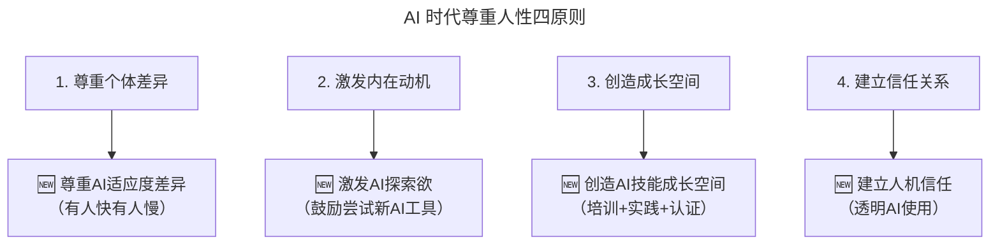

# 第183讲 | 薛文植：技术管理的本质—要做尊重人性的管理

> **适用范围**：技术负责人、研发经理、CTO 等需要在"业务/产品/技术"多线作战中持续激发团队活力的管理者，特别适合团队进入 AI 转型期、成员 AI 适应度差异明显时参考。
>
> **更新摘要（v2 · 2026-08 更新）**：
> - 结构化升级为 6 节骨架（导言 / 核心方法论 / 关键流程 / 工具与实战 / 常见误区 / 进阶延展）
> - 在原"AI 时代升级注解（2026）"基础上，将"尊重人性四原则"升级为 AI 时代四原则
> - 新增"以人为本 vs 以事为本 vs 以人机协同为本"的三选模式
> - 一张 Mermaid 图补齐 title frontmatter 并增加图后文字解读
> - 将原"⭐2026 立即行动"统一归入"工具与实战"一节

## 1. 导言

你好，我叫 Nick，中文名是薛文植，在电商和零售行业里摸爬滚打了 7、8 年，现在在便利蜂负责整体门店的智能化。这些年踩了很多坑，但同时也对管理有了一些心得，今天就想跟你分享一些自己在管理方面的实践经验，希望能对你有所帮助。

现在这个时代，对管理者的要求非常高。作为一名优秀的技术负责人，一定要给团队指出正确的方向，**必须同时要懂业务、懂产品、懂技术，但是更重要的是对于技术团队成员的管理，人才才是整个公司的根本。**

对于管理，我们要认识到技术人才首先是 **普通人**，需要遵循一些对人才管理的基本原则，也就是尊重人性的管理（Human-Centric Management）。我们需要从人的本质上去理解大家的需求，这样才能更好地保持团队的活力。

### AI 时代的新背景

2026 年，原文核心观点"技术管理的本质是尊重人性"在 AI 时代被赋予了全新内涵——**"人性"的定义扩展到了"人机协同中的人性"，尊重人性意味着既要尊重人类团队成员的需求，也要合理使用 AI 工具来解放人力而非压迫人力**。84% 开发者使用 AI 编程，管理者需要在"效率追求"和"人文关怀"之间找到新的平衡。

## 2. 核心方法论

### 2.1 原文：尊重人性的管理四原则

管理四原则：
1. **尊重个体差异**：每个人都是独特的
2. **激发内在动机**：而非单纯外部激励
3. **创造成长空间**：让员工能发展
4. **建立信任关系**：开放透明的沟通

### 2.2 2026 AI-Augmented 四原则

上图把原文的四条管理原则与 AI 时代的新内涵一一对应：每一条原则都增加了一个与 AI 相关的子项。核心理念不变——管理的本质是尊重人性——但在 AI 时代，"尊重人性"意味着要尊重每个成员在与 AI 协作过程中的不同节奏和方式，而不是一刀切地要求所有人同步。

### 2.3 "以人为本 vs 以事为本"的 AI 时代平衡

**原文回顾**

- **以事为本**：关注任务完成，可能忽视人的感受
- **以人为本**：关注人的需求和发展，任务自然完成

**2026 新增第三选项：以人机协同为本（Human-AI Collaboration Centric）**

| 管理模式 | 关注点 | AI 时代适用场景 |
|---------|-------|--------------|
| **以事为本** | 任务效率和产出 | 高重复性、低创意性工作 |
| **以人为本** | 人的感受和成长 | 创意性、战略性工作 |
| **以人机协同为本（新增）** | 人与 AI 的最优配合 | **大多数 2026 年的研发工作** |

新模式的关键判断标准是：在"大多数 2026 年的研发工作"中，单看人或单看事都会失真，只有把"人 + AI"作为一个协同单元来设计工作流，才能既保效率又保人性。

## 3. 关键流程

### 3.1 满足员工最本质的需求，而不是永远画大饼

首先，我们要了解员工到底想要什么，来公司的诉求是什么。这些年有太多的创业公司给员工画大饼，最常见的比如承诺期权、股票等，激励大家为梦想奋斗。其实如今大家早已看穿这样的"大饼"模式，员工更看重实实在在的价值，如工资、晋升、前途等。很多技术人也非常看重自己能力的成长，比如能不能做更核心的项目，能不能带更大的团队等，这些都是很多人的第一需求。如果员工觉得自己在这里没有成长，他们自然会选择离开。

而关于期权和股票，有当然是锦上添花，但上市和被收购的公司毕竟是少数，大多数公司的股票是无法兑现的。因此作为管理者，不能用未来可能会有的股票来压低员工现有的其他价值，该给的现在就要给，大家都要养家糊口。**如果只是画大饼，而不给员工提供实际利益获得与成长机会，这种团队是不会长久的。**

### 3.2 知道如何去批评员工才能让人更容易接受

人都是有自尊心的，有些管理者会认为，在发现员工犯错误的时候，作为领导可以毫不留情面的批评指责，甚至辱骂。这是一个非常错误的观念。我们批评员工的目的是让对方认识到自己的错误，然后接受并且改正。如果采用相对粗暴的方式来批评别人，员工可能会觉得无地自容，但这不但无法达到让其改正的目的，反而会让其更加抵触。当然这并不是表示员工有错误你不指出，而是可以采用相对柔和一点的方式，这样效果会更好。

我比较青睐"三明治"式的谈话方式，就是先扬后抑再平和的节奏。举个谈话的例子，我们可以对员工说："最近 XXX 方面做的还行，但是你在某某某方面还需要改进（然后具体发散需要改进的内容），不过我们还是有很大进步空间的不是吗？"当然这只是我个人喜欢的一个风格，供大家参考。

### 3.3 对员工的预期要事先表达清楚

这是很多管理者容易犯的毛病。比如很多领导会对员工说："关于 XX 事情，我以为你应该知道。"要知道，揣测老板的意图，是很多员工最不想做的事情。如果你对该员工有期许，请直接告诉他，比如设置好目标节点，并且告知员工达成目标之后的结果或收益。因为员工不是你肚子里的蛔虫，不可能知道你的想法，同时猜测想法本身就是一件非常消耗精力的事情。透明的做事方式能够减少内耗，也能够让员工有一个非常清晰的目标，事半功倍，所以作为管理者，你需要对员工提前表达你的预期。

举个例子，如果你对某位员工的做事方式或结果不是特别满意，一定要在第一时间与对方沟通。原因有二，第一，有可能是其他因素导致了该员工做事没有达到预期，而你不知情；第二，如果你提前沟通了，员工也能够清楚自己该改进的方向，而不是一直持续现状，这种结果不论是对员工个人还是于公司层面而言都是不利的。

### 3.4 对人公平，以结果为主

管理者要对所有员工都一视同仁，尤其是在最终绩效考核的时候，一定要以实际表现为最终衡量标准。这点虽然是普罗大众都有认知的常识，但实际执行起来，却不是每个人都能做到的。技术人才可能都有自己的脾气，如果与管理者性格不和或平时对技术的争论较多，该员工是否还能够被客观的评价，这点是很重要的。

**管理者不能因为个人喜好而对与自己趣味相投的员工有特殊优待，同时也不该对与自己相处平平的员工给予不公待遇。** 互联网行业变化非常快，因此对员工的创新力有更多的要求，而有创新力的顶级人才大多有自己的脾气，毕竟能力强就是资本，但这并不影响他们为公司创造价值，因此，如果我们把员工的实际产出作为衡量其表现的主要标准，那员工才能被公平对待，这样大家也能对管理者有充分的信任。

### 3.5 并不是每个人都想当管理者，提拔干部需要看个人特质

事实上，可能只有 10% 的人愿意成为管理者，90% 的人其实更愿意过简单的生活。管理团队和专研技术，其实需要不同的技能组合，所承受的工作压力也是不同的。带团队或者带项目，有时候需要处理很多琐碎繁杂的事情，同时需要考虑到更多更广的细节，而专研技术可能需要向某个方向，非常深入的往下走。有时候你让一些技术厉害的同学去带团队，如果其本人的特质更适合做点而不是面，可能会适得其反。不但团队的整体成绩不出彩，项目进度也可能跟不上，而且被放在该位置上的同学也会灰心丧气，产生离开的念头。

因此，提拔干部一定要因人而异，领导力有时候和性格有极大的相关。有些人的特质天生就更适合管理，比如说开朗、善于沟通的人，其实比较容易胜任带人的职位，因为带团队就需要和不同的内外部成员进行有效的协调和沟通，反之，如果一位闷声不响的同学被强拉到管理岗，他反而可能会觉得这是一种受罪。再举个例子，管理需要一定的决断力和气场，但很多同学其实是相对的"老好人"，当被拉到某一个管理岗位的时候，相对偏"软"的性格会导致一些管理上的劣势，不一定能镇得住团队其他人。

### 3.6 人都喜欢相对简单的环境，尤其技术人才

我认为作为技术团队的负责人，主要的工作其实是给团队成员创造一个更好的舞台，让他们能够在这个舞台上更好地实现自己的价值。很多技术人都喜欢相对简单的环境，因为技术的世界本身是最纯粹直接的，"不服看代码"就是技术人才最主要的态度。然而有时候公司内部或外部会有很多的压力和噪声，不管是外部业务的压力，部门的斗争，还是团队之间的甩锅和扯皮，都会严重干扰到技术人才的工作。太复杂或者效率太低的氛围，会让他们感到异常的疲惫。因此，把流程制定清楚，合理分工，提高团队之间的配合效率，让工作环境相对融洽，这能极大地提升技术人工作的整体效率。

总的来说，人性其实都是一样的，我们从更根本的去了解人的需求，这样会更容易摸到规律。我非常崇尚最近很火的"第一性原理思维"（First Principles Thinking），解决或者思考问题都需要从本质出发，有时候甚至要回归到物理学的底层逻辑去。那么管理，其实也需要我们静下心来，思考人性的本质和人的根本诉求，这样我们才能更好地管理团队。

## 4. 工具与实战

### 4.1 AI 时代行动清单

- [ ] 审视当前管理模式，评估是否充分尊重了团队成员的"AI 适应度差异"
- [ ] 为团队创造"AI 技能成长空间"（至少包含：培训资源、实践机会、认证体系）
- [ ] 在下一次 1on1 沟通中，了解每位成员对 AI 工具的态度和使用情况

### 4.2 三种管理模式的实战选择

在具体场景中，可以根据任务性质在三选模式之间切换：

- **以事为本**：处理线上故障、批量回归测试、日志清洗等高重复性任务时，关注效率和产出
- **以人为本**：架构设计、技术战略讨论、跨部门协作谈判等创意性/战略性任务，关注人的成长与感受
- **以人机协同为本**：大多数研发工作（需求拆解、编码、测试、文档），关注人与 AI 的最优配合

### 4.3 把"尊重 AI 适应度差异"落地

| 差异类型 | 表现 | 管理对策 |
|---------|------|---------|
| 工具适应快慢 | 有人 1 周上手 Cursor，有人 3 个月才习惯 | 分层培训 + 结对学习，不设定统一节奏 |
| Prompt 质量差异 | 有人能写结构化模板，有人只会一句话指令 | 建立 Prompt 模板库，弱者直接复用 |
| AI 批判性差异 | 有人盲信输出，有人能深度审查 | 制定 AI Review 标准，明确"信任但要验证" |
| AI 焦虑差异 | 有人担心被替代，有人兴奋探索 | 1on1 沟通 + 心理支持 + 发展路径澄清 |

## 5. 常见误区

### 5.1 误区一：用"画大饼"代替实际利益

如果只是画大饼，而不给员工提供实际利益获得与成长机会，这种团队是不会长久的。期权和股票是锦上添花，不能用未来可能会有的股票来压低员工现有的其他价值。

### 5.2 误区二：粗暴批评

毫不留情面的批评指责甚至辱骂，无法达到让员工改正的目的，反而会让其更加抵触。批评的目的是让对方认识错误并接受改正，应采用相对柔和的方式。

### 5.3 误区三：让员工揣测老板意图

"我以为你应该知道"是管理者常见的错误。员工不是你肚子里的蛔虫，猜测想法本身非常消耗精力，透明的做事方式才能减少内耗。

### 5.4 误区四：以个人喜好评价员工

管理者不能因为个人喜好而对与自己趣味相投的员工有特殊优待，也不该对与自己相处平平的员工给予不公待遇。要以实际产出为主要衡量标准。

### 5.5 误区五：把技术高手强行推上管理岗

不是每个人都想当管理者，提拔干部一定要因人而异。把适合"做点"的人强行推到"做面"的管理岗，往往适得其反。

### 5.6 误区六（2026 新增）：一刀切要求所有人同步 AI 化

不同成员的 AI 适应度差异客观存在。一刀切地要求所有人同步使用 AI、同步达到同样的 AI 成熟度，违背"尊重个体差异"原则，会引发抵触和焦虑。

## 6. 进阶延展

### 6.1 第一性原理与人性管理

我非常崇尚"第一性原理思维"，解决或者思考问题都需要从本质出发，有时候甚至要回归到物理学的底层逻辑去。管理，其实也需要我们静下心来，思考人性的本质和人的根本诉求，这样我们才能更好地管理团队。

在 AI 时代，"人性的本质"没有变，依然是人对安全、成长、尊重、自我实现的追求；变的只是"满足诉求的方式"——AI 工具让某些诉求（如成长空间）更容易被满足，但也让某些诉求（如安全感）受到新的冲击。管理者要做的是：用第一性原理识别每个成员的真实诉求，然后用 AI + 人文关怀的组合去满足它。

### 6.2 与其他理论的连接

- **马斯洛需求层次理论（Maslow's Hierarchy of Needs）**：原文"满足员工最本质的需求"对应马斯洛的底层需求；AI 时代要警惕"AI 焦虑"对安全需求（Safety Needs）的冲击
- **赫兹伯格双因素理论（Herzberg's Two-Factor Theory）**：工资、环境是保健因素，成长、认可是激励因素；AI 工具的提供是新的保健因素，AI 技能成长是新的激励因素
- **第一性原理思维（First Principles Thinking）**：从人性本质出发，而非从工具或流程出发

### 6.3 长期愿景

- 建立"人机协同人性化"管理体系：把 AI 适应度差异、AI 技能成长空间、人机信任关系纳入年度管理评估
- 把"尊重人性"从个人修炼升级为组织能力：通过培训、制度、文化三层落地
- 让 AI 真正成为"解放人力"而非"压迫人力"的工具：定期审视 AI 使用是否损害了员工的职业尊严和发展空间

---

**注解说明**：本章节基于 2026 年 AI 深度普及的现状，对原文"尊重人性的技术管理"进行 AI 时代升级。核心理念不变——管理的本质是尊重人性——但在 AI 时代，"尊重人性"意味着要尊重每个成员在与 AI 协作过程中的不同节奏和方式，而不是一刀切地要求所有人同步。

## 作者简介

薛文植（Nick），TGO 鲲鹏会会员，便利蜂智慧零售负责人，曾任多点 Dmall 高级总监，酷派集团互联网中心 vp，简 24 联合创始人。深耕电商领域多年，是名副其实的电商精英。
