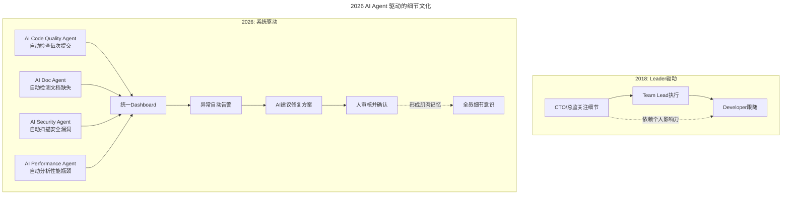

# 第26讲 | 让细节的"病毒"感染你的团队

> **适用范围**：技术决策者（CTO/技术 VP/研发总监）以及需要在大规模分工协作中把控产品体验与技术质量的技术管理者，特别适合在"细节管理成本高、团队规模扩大、AI 工具普及"的背景下参考。
>
> **更新摘要（v2 · 2026-08 更新）**：
> - 结构化升级为 6 节骨架（导言 / 核心方法论 / 关键流程 / 工具与实战 / 常见误区 / 进阶延展）
> - 在原"AI 时代升级注解（2026）"基础上重组内容，强化"AI 时代细节管理新范式"
> - 补充"细节优先级矩阵"（业务影响度 × AI 可自动化程度）及 KPI 建议
> - 一张 Mermaid 图补齐 title frontmatter 并增加图后文字解读
> - 将原"病毒式细节文化""2026 行动建议"统一归入"关键流程""工具与实战""进阶延展"三节

## 1. 导言

很多大公司的技术高管，既要思考战略和执行，又要管理繁杂的业务，有限的时间都占得满满当当。那么，作为企业的技术决策者，是否还需要关注细节呢？对于这个问题，我的答案是肯定的。

"细节决定成败"，这个道理自古就有，尤其是在这个全球商业竞争激烈的时代，更是很多成功公司奉行的理念。如果要找一个最能代表这种精神的公司，那就非苹果公司莫属了，其产品如 iPhone、MacBook、MacOSX 等都堪称当今工业界最高水平。最近几十年在中国市场上发展起来的很多本土企业，也日益肯在细节上下功夫，出现了很多极为成功的科技公司。

在知乎上有篇写腾讯 CEO 马化腾领导风格的帖子，提到其经常在深夜还发邮件和团队探讨产品细节问题，最厉害的是这些讨论往往第二天就能被团队落实。这个帖子中还提到，QQ 邮箱在 2008 年的 400 多个创新点中，有近 300 项是由马化腾本人发现和提出。马化腾发现这些问题的方法很简单，就是反复使用。

连大公司 CEO 都在半夜讨论产品细节，作为 CTO 或者技术决策者，还好意思说自己没时间关注技术细节吗？并且，我工作这么多年，有个感受，就是越到高层的老板，越重视细节、越抠细节。

谷歌 CEO 埃里克·施密特（Eric Schmidt）在他写的《重新定义公司》书中提到，在偶遇一位许久不见的高管时，一句诚恳的问候之后，埃里克便会开门见山地提问："你最近的工作进展如何？遇到了哪些问题？应该交付的产品进度如何？"这些问题的效果有两重：不仅让埃里克掌握了对方的业务细节，还让他知道这些主管是否掌握了他们的业务细节。在埃里克看来，没有掌握细节的管理者，是不胜任工作的。

所以说，作为技术负责人，同样需要关注技术的细节。而善于提出问题，就是很好的了解细节的方法。

### 2026 年新背景：AI 时代的"细节管理"新范式

原文强调技术管理者需要关注细节，"让细节的病毒感染团队"。在 2026 年，**GPT-5.5、DeepSeek V4 等 AI 工具的普及**让"关注细节"的方式发生了 **根本性变化**：

1. **从人工审查到 AI 自动检查**：代码规范、文档质量、安全漏洞都可以由 AI 7x24 自动监控
2. **从微观管理到智能预警**：不需要事无巨细地盯着，AI 会在异常时主动提醒
3. **从个人经验到数据驱动**：细节标准不再依赖 leader 的个人判断，而是基于行业最佳实践和量化指标

## 2. 核心方法论

### 2.1 细节决定成败

前通用电气 CEO 杰克·韦尔奇（Jack Welch）曾在他的回忆录《赢》中讲述过一个案例。

起初通用电气在核磁共振设备的市场中一路领先，韦尔奇曾发现自己的产品口径太过小，使人受到的压抑感太大，而此时日立公司正在研究大孔径设备。韦尔奇与医疗事业部门讨论发现：孔径加大会导致成像的准确度下降，医院的人不会接受。韦尔奇后来一有机会就会督促医疗部门考虑改进成像技术，但得到的反馈都是敷衍。随后不久，原本处于领先地位的通用电气被日立公司超越，其追赶之路辛苦万分。韦尔奇在自传中写道：我非常后悔，为什么自己没有付出更大的努力，对下属提出更严厉的要求。

孔径之大小，能如此影响一个公司的发展，使我们不得不重视细节。

技术做为一个业务中的重要部分，是保障业务成功的基础。由于互联网的应用，涉及到客户端程序和服务器端程序共同实现，也普遍有多个技术系统的相互依赖。在一个大规模分工合作的团队中，产品体验要做到极致，没有技术决策者的亲自参与，就不能有效调动和协调必要的资源，也没法保证执行的快速精准。也只有技术决策者关注到技术细节中去，才能掌握全面的信息，做出准确的判断。否则就会造成很多工作的处理结果，犹如隔靴搔痒，劳而无功。

### 2.2 细节管理的演进对比

| 维度 | 传统做法 (2018) | AI 增强做法 (2026) |
|------|----------------|-------------------|
| **代码质量** | 人工 Code Review | AI 自动 Review + 人工聚焦架构 |
| **文档完整性** | 定期抽查 | AI 实时扫描 + 缺失提醒 |
| **命名规范** | Code Review 时指出 | AI Linter 实时提示 |
| **错误处理** | 测试时发现 | AI 静态分析提前预警 |
| **性能细节** | 上线后监控 | AI 在编码阶段就给出优化建议 |
| **安全细节** | 安全团队审计 | AI Security Scanner 每次提交 |

### 2.3 AI 时代的"病毒式细节文化"

原文提出"让细节像病毒一样传播"。在 2026 年，我们可以用 **AI Agent 网络**来实现：

上图对比了两种细节文化的传播路径：2018 年依赖 CTO/总监的个人影响力，自上而下层层传导；2026 年则通过多个 AI Agent（代码质量、文档、安全、性能）汇聚到统一 Dashboard，再以"异常告警 → AI 建议修复 → 人审核确认"的闭环自动推动全员形成细节意识。后者的关键优势是不再依赖单点领导者的精力，且能 7x24 持续运行。

## 3. 关键流程

### 3.1 抓住细节的"七寸"

既然关注细节如此重要，是不是技术管理者就应该深入了解每一个细节？这是一部分管理者尤其是初级管理者经常会遇到的困境，关注细节本身没错，但前提是抓住大的，再聚焦小的，找到影响整体工作的关键细节，以免自己被细节缠身。

2014 年我还在前东家时，曾经参与过微博客户端图片和视频的加载性能优化，当时的问题是运营部门经常抱怨，总是说用户投诉图片点开显示慢，或者打不开。客户端团队和存储、CDN 团队做了一些排查和优化，但还是有用户投诉，大家就很疑惑这到底是不是个严重问题？问题在哪里？怎么改进？

当时也是有一些性能监测数据，但是不能直接反应用户端体验，运营部门不认。当时我负责的微盘云存储应用，通过采集客户端性能数据，做性能持续优化，所以我提出先建立微博用户端性能的量化评估指标，比如加载时长、成功率，确保各个业务方都认可这些指标，这相当于大家有了统一的性能标准。

当时先和业务运营方负责人沟通定义好客户端加载性能的几个一级指标，然后推动建立了客户端性能数据采集机制，建立全面的性能数据分析体系，以及不同环节的性能类和质量类二级指标体系，覆盖客户端到服务器端、和多家 CDN。一级指标主要用于运营方评估用户体验，二级指标用来监测各个技术系统的性能质量情况，二级指标对一级指标有重要的影响。并且在我负责的部门内指定了各指标相关的责任人，具体的工作由他们去负责落实、并且为指标达成负责，这样工作就分解下去了。

通过合理的工作安排，和我在重要细节上的关注和参与，最后的工作成果让大家非常满意，有了清晰的数据体系，还消除了很多工作上的争议。经过半年时间持续优化，图片下载速度加快了 25%；对于用户投诉，也能够提供量化的错误率数据，基于用户帐号可以检索全部的服务端日志，以及客户端上报的错误日志，还能排查出是客户端软件异常、手机网络异常、运营网络异常、还是服务器端异常，这些信息对于解决问题和改进产品的帮助也很大。

### 3.2 让细节的"病毒"感染你的团队

只有技术决策者关注细节是不够的，业务上的很多细节，是需要每一个人去关注去抠的，只有这样才能让整个团队重视每一个环节，尤其把重要环节在细节上做极致，才能给用户超出预期的体验。这种对细节的态度，不是每个人天生就会的，而一个业务的负责人，如果能够具备这样的素养，把这样的态度融入在工作中的每一个环节，影响到团队中的每一个成员，就可能培养出更多具备这种能力的员工。

如何打造一个重视细节的团队，我再分享几点经验。

首先，做好招聘环节，更倾向本身就关注细节的人，面试时多问问候选人工作中细节的问题。关注细节体现在不同的方面，关注代码的质量、风格是细节，关注产品的技术方案是细节，关注产品的上线流程是细节，关注业务的成本构成也是细节，关注业务的运营数据更是细节。

其次，通过自己不断对细节的把控来影响团队、树立榜样，尤其对重要事情的细节上斤斤计较，提出细节上的问题，参与细节上的改进，当然，你更多的是分析、沟通、决策，具体的工作更多的是团队来落实。

然后，带领团队梳理流程和方法，通过流程规范的完善，使团队成员更能关注细节。

### 3.3 秒开案例：细节决定体验

最近几年流行的短视频和视频直播应用，各家比拼的体验中，秒开就是一个技术上追求极致的例子，就是在细节上的深入探究和改进。

秒开是指手机视频应用中显示的视频，只要点播放，1 秒内就要完成视频的下载并播放。要做好这个体验，需要把点击播放、下载视频、首次播放等环节的处理时间记录日志，并进行分析，来决定哪些环节需要优化来缩短处理时间，这种分析往往会沉淀为日常的机制，确保秒开比例保持在高水平。

为了提高秒开比例，除了手机客户端应用作优化，我们白山云作为视频分发的 CDN 服务商，也需要让速度变得更快，尤其是快速填满客户端上视频播放缓冲区。

对于这个目标，开始团队做了一些改进但是没有大的突破，后来我们的技术 VP 苗辉作为技术专家亲自参与和组织，通过对 TCP/IP 和网络传输的深入研究，优化 TCP 重传、窗口拥塞、慢启动等机制，整体上加快客户端视频下载速度；通过智能 DNS 的动态 IP 库和四维调度算法优化，更实时的把用户调度到网络质量最优的 CDN 边缘节点。那么结果怎么样呢？根据我们一个 CDN 客户提供的数据，其直播客户端首次播放时间稳定在 450 毫秒左右，远远小于 1 秒。

### 3.4 2026 细节病毒传播三阶段

借鉴原文的思想，结合 AI 能力：

**Phase 1: 种子期（第 1 个月）**
- 选择 1-2 个 **高可见度、易量化** 的细节领域（如代码格式、commit message 规范）
- 部署 AI 工具自动检查
- 在公开场合 **表彰** 做得好的例子（正向激励）

**Phase 2: 扩散期（第 2-3 个月）**
- 扩展到更多细节维度（文档、测试覆盖率、性能）
- 建立 **细节积分制**：AI 自动统计每个人的细节得分
- 让早期采纳者成为 **"细节大使"**，影响更多人

**Phase 3: 固化期（第 3-6 个月）**
- 细节标准写入 **团队 Onboarding 文档**
- 新人入职第一天就接触 AI 细节检查工具
- 形成"**这是我们做事方式**"的文化认同

## 4. 工具与实战

### 4.1 哪些细节值得关注？——AI 时代的优先级

不是所有细节都同等重要。在 2026 年，我们用 **业务影响度 × AI 可自动化程度** 来排序：

| 优先级 | 细节类型 | 示例 | AI 处理方式 | 人工介入 |
|--------|---------|------|-----------|---------|
| **P0 必须做** | 安全相关 | SQL 注入、XSS 漏洞 | AI 100%自动检测 | 仅处理误报 |
| **P1 高价值** | 性能关键路径 | N+1 查询、内存泄漏 | AI 90%自动发现 | 审核修复方案 |
| **P2 中等** | 代码风格 | 命名规范、格式化 | AI 100%自动修复 | 设置规则即可 |
| **P3 低优先级** | 注释完整性 | 函数注释、复杂逻辑说明 | AI 80%自动生成 | 补充业务上下文 |
| **P4 可选** | 文档美观 | README 排版、图表 | AI 按需生成 | 不强求 |

> 💡 **核心原则**：**把机器能做的细节交给 AI，人的精力聚焦在"有业务含义的细节"上**

### 4.2 2026 年技术管理者必备的 AI 细节工具

| 工具类别 | 推荐工具 | 检查的细节 |
|---------|---------|-----------|
| **代码质量** | SonarQube + AI, CodeClimate | 复杂度、重复代码、潜在 Bug |
| **安全细节** | Snyk, GitHub Advanced Security | 漏洞、依赖风险、密钥泄露 |
| **性能细节** | Lighthouse CI, Artillery | 加载速度、资源大小、渲染性能 |
| **文档细节** | Docstring AI, Swizz | 注释覆盖率、API 文档完整性 |
| **Git 纪律** | Conventional Commits Linter | Commit message 规范、PR 模板遵循 |
| **测试细节** | Coverage Agent, Mutation Testing | 测试覆盖率、测试有效性 |

### 4.3 2026 可执行建议

1. **部署 AI Pre-commit Hook**：每次代码提交前自动运行质量检查，不达标无法合并
2. **建立细节评分系统**：AI 为每个提交打"细节分"，纳入开发者画像
3. **每周生成细节报告**：AI 汇总本周的细节问题趋势，在 Team Meeting 上分享

### 4.4 流程机制的建立

工作的发展，也是不断完善和细化的过程，比如业务最开始，最先解决的是核心的功能，仅仅满足能用。而在发展过程中，随着业务要求的提高，之前很多没有做的工作就逐渐提出来了，比如运营、质量、监控、流程等等，这些工作的落实，都需要负责人参与到细节中去。

比如去年初，白山云因为一些重大项目推进中的问题，决定建立项目管理机制。一位同事起草了初步的项目管理方案，通过讨论和完善方案，最后定下来项目管理机制、项目需要的文档、立项结项需要的文档等，这些我也仔细看过并且确认。制度确立后，前期的几个重要项目立项，我也参与，一方面是观察团队的接受程度和执行情况，一方面也需要了解制度是否还有些问题。几个月后，我就只关注重点项目的周报、月报，关注项目本身的细节，而不在于项目管理制度的细节上了。

随着项目管理方法被更多团队接受，很多工作的细节就更有保障了。还有其他如客户需求管理、故障管理、变更管理、变更流程等机制的建立完成，让整个团队的工作能力得到提升，在工作上更加有序、也更可控。对于细节的重视，被融入在各个流程机制中，未来随着业务变的更加复杂、团队规模更大，我相信也能保证各项工作高质量的输出。

## 5. 常见误区

### 5.1 误区一：AI 导致的"伪完美主义"

> ❌ **现象**：AI 指出 100 个代码风格问题，团队花大量时间修复，却没时间做核心功能
>
> ✅ **对策**：
> - 设定"细节预算"：每个 Sprint 只能花 X% 的时间在细节优化上
> - 区分 **Blocking Issues**（必须立即修）和 **Nice to Have**（技术债 backlog）
> - 用 **ROI 思维** 看待每个细节：修这个 bug 能带来多少业务价值？

### 5.2 误区二：细节文化的异化

> ❌ **现象**：为了追求"0 warning"，团队不敢使用新特性，变得保守
>
> ✅ **对策**：
> - 细节标准的制定要 **与时俱进**：AI 时代的最佳实践在变化
> - 鼓励 **合理的权衡**：有时候"够好"比"完美"更好（especially for MVP）
> - 定期 **审视细节规则**：过时的规则要及时废弃

### 5.3 误区三：Leader 成为细节 bottleneck

> ❌ **现象**：所有细节都要 CTO 审批，成为单点故障
>
> ✅ **对策**：
> - **授权**：明确哪些细节可以由 Team Lead 决定
> - **透明**：所有细节标准公开，不要藏在 leader 脑子里
> - **AI 辅助**：用 AI 工具让细节标准自动执行，减少人为审批

### 5.4 误区四：被细节缠身

关注细节本身没错，但前提是抓住大的，再聚焦小的，找到影响整体工作的关键细节，以免自己被细节缠身。要通过指标体系、责任人分解，把工作分解下去，而不是事必躬亲。

## 6. 进阶延展

### 6.1 2026 年细节管理的 KPI 建议

| 指标 | 定义 | 目标值 |
|------|------|--------|
| **Auto-Fix Rate** | AI 能自动修复的细节问题占比 | >70% |
| **Detail Debt Velocity** | 技术细节债的增减速度 | 趋势下降或平稳 |
| **First-time Quality** | 提交即符合细节标准的比例 | >85% |
| **Detail Review Cycle Time** | 细节问题的平均修复时间 | <4 小时 |
| **Team Detail Score** | 团队整体细节评分（AI 计算） | 逐季度提升 |

### 6.2 结语：从微观管理者到细节系统架构师

关注细节，就体现在日常的管理工作中，你了解的细节越多，对工作的问题看的就越准确，管理工作才能做到有的放矢。

深入细节，既是你观察、培养人才的过程，也是团队磨合、建立信任和默契的过程。对于达到稳定的业务，或者配合很默契的下属，你就充分放权，不必太多关注细节，把你省出的精力投入在其他地方。

如果所有的问题，团队都能帮你搞定，那你自然不用太关注技术的细节。但是实际情况不会这么乐观的，总会有一些团队自己搞不定的事情，所以这才是你作为技术决策者存在的价值。

原文的核心观点——**技术管理者应该关注细节，并让这种关注成为团队的 DNA**——在 2026 年 **不仅成立，而且更容易实现**。

AI 的变化在于：
- **执行层面**：细节检查可以自动化，不再依赖 leader 的个人精力
- **标准层面**：细节标准可以量化、公开，不再是"领导觉得"
- **文化层面**：通过 AI 工具的正向反馈循环，细节意识可以更快地传播

**最后一句**：
> 2026 年的细节管理，不是让你变成一个 **事必躬亲的微观管理者**，而是成为一个 **设计"自进化细节系统"的架构师**。最好的细节文化是：**每个人都在意细节，不是因为害怕被批评，而是因为 AI 让他们看到了更好的可能性，并且改进成本极低。**

### 6.3 与其他理论的连接

- **第一性原理思维（First Principles Thinking）**：细节管理的本质是"信息获取与决策精度"，AI 降低了信息获取成本，所以管理者的精力应转向决策精度
- **PDCA 循环（Plan-Do-Check-Act）**：AI 让 Check 环节自动化，使循环速度从"周/月"缩短到"小时/天"
- **技术债管理（Technical Debt Management）**：细节问题本质是技术债的微观表现，AI 让技术债的可视化和偿还成本大幅降低

---

*本注解基于 2026 年 6 月的最新技术动态生成，包括 GPT-5.5、DeepSeek V4 的普及，以及 84% 开发者使用 AI 编程的行业现状。细节决定成败，而 AI 让关注细节的成本降到了前所未有的低。*

**作者简介**

童剑，白山联合创始人兼首席技术官， [TGO 鲲鹏会](http://tgo.geekbang.org) 北京分会董事会成员&学习委员。前新浪研发中心总经理，2016 年 5 月加盟白山，迅速搭建和完善各产品线技术梯队，构筑云链产品技术体系，带领团队推出云存储、云聚合产品，助力白山抢先布局云后市场。
