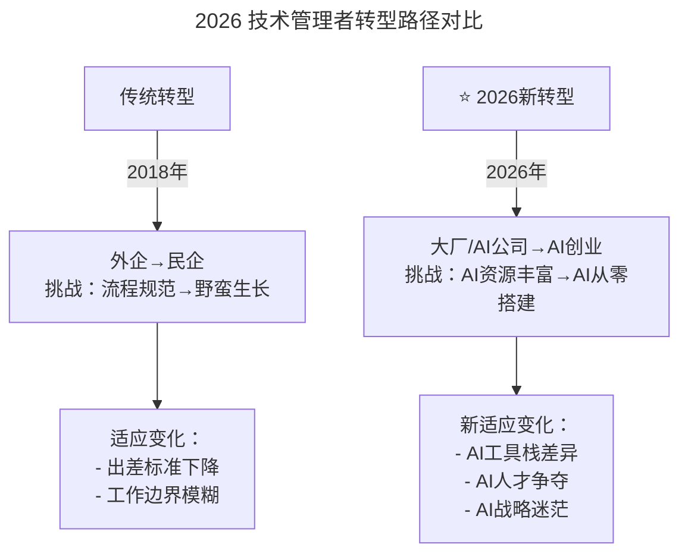

# 第154讲 | 谢东升：说说技术管理者从外企到民企的挑战

> **适用范围**：即将或正在从外企/大厂跳槽到民企/AI 创业公司的技术管理者（CTO/技术总监/研发经理），特别适合在新环境"水土不服"、JD 模糊、AI 资源从丰富变从零的场景下参考。
>
> **更新摘要（v2 · 2026-08 更新）**：
> - 结构化升级为 6 节骨架（导言 / 核心方法论 / 关键流程 / 工具与实战 / 常见误区 / 进阶延展）
> - 在原"AI 时代升级注解（2026）"基础上，把"外企→民企"扩展为"大厂/AI 公司→AI 创业"的新场景
> - 补充"AI 能力自评""心态调整清单""避坑指南"三张表格
> - 一张 Mermaid 图补齐 title frontmatter 并增加图后文字解读
> - 将原"⭐2026 可执行建议"统一归入"工具与实战"和"进阶延展"两节

## 1. 导言

纵观国内 IT 或者互联网企业的发展史，90 年代的时候，国内的 IT 企业无论是数量还是质量和外企都没法比，所以那时候 IT 类专业的学生毕业都将能进入一流欧美外企作为一个目标来努力。这就造成了最老的大型外企聚集了国内一堆优秀的技术人才，成了中国 IT 的黄埔军校。2005 年以后，以 BAT 为代表的互联网民企开始崛起，民企的竞争力大增，特别是这些年，在资本力量的推动下，国内各行各业的互联网创业公司如雨后春笋般冒了出来，对外不断地抛出橄榄枝。同时，黄埔军校的学生们这些年通过自身的不懈努力，也已经挂上了 Manager/Director 的抬头，成为外企的中高端技术管理者了，准备"学成毕业"了。对于毕业出发前的技术管理者们，需要了解到以下这些挑战。

### 2026 新场景：从"外企到民企"到"大厂到 AI 创业公司"

2026 年的技术背景：GPT-5.5 发布，DeepSeek V4 国产大模型崛起，84% 开发者已将 AI 编程作为日常工作方式，Agent（智能代理）进入加速落地期，人机协作成为新常态。原文的"外企→民企"挑战，在 2026 年演变为"大厂/AI 公司→AI 创业公司"的新挑战，核心矛盾从"流程规范→野蛮生长"扩展为"AI 资源丰富→AI 从零搭建"。

## 2. 核心方法论

### 2.1 从"外企到民企"到"大厂到 AI 创业公司"



上图把 2018 年的"外企→民企"转型与 2026 年的"大厂/AI 公司→AI 创业"转型并列对比。前者的核心矛盾是流程规范与野蛮生长的落差，后者在此基础上新增了 AI 工具栈差异、AI 人才争夺、AI 战略迷茫三重挑战。这意味着 2026 年的转型者需要同时完成"环境适应"和"AI 能力迁移"两件事。

### 2.2 心态调整的 AI 版本

| 传统对比 | 2026 新对比 |
|---------|-------------|
| 五星酒店 → 锦江之星 | **GPT-4o Team → 开源 DeepSeek V4** |
| 头等舱 → 廉价航空 | **100+ AI 工具 → 精选 3-5 个核心工具** |
| 流量无限 → 200 元封顶 | **API 无限调用 → 成本敏感的 Token 预算** |
| 规范流程 → 找活干 | **成熟 AI 平台 → 自建 AI 基础设施** |

### 2.3 "找活干"的 AI 能力迁移

**原文**：民企没有清晰 JD（Job Description），需要自己找定位。

**2026**：

```
传统民企CTO职责（模糊）：
├─ 系统架构
├─ 团队管理
├─ 技术选型
└─ （老板可能都不懂技术）

AI创业公司CTO职责（更模糊但新增）：
├─ 原有职责...
├─ ⭐ AI战略规划
├─ ⭐ AI工具栈选择
├─ ⭐ AI团队能力建设
├─ ⭐ AI伦理与安全
└─ ⭐ 人机协作流程设计
```

## 3. 关键流程

### 3.1 第一步：调节好心态，放下表面的光鲜

作为一名管理者，你从顶级外企跳槽到创业型民企后，生活可能会有如下变化：

1. 住宿从五星酒店变为锦江之星。
2. 出差从头等舱变为廉价航空、火车、大巴车。
3. 出门随意打专车变为等公交、挤地铁。
4. 从土豪流量无限+电话无限打变为每月话费 200 元封顶。
5. 餐饮费用从随意报销变为沙县小吃、黄焖鸡等等。

对于这些生活变化，请以平常心看待。同样的，从事的工作也会有下面两点变化：

1. 在外企时，你可能会觉得天花板过低，对未来的发展也是一眼看到底，而来到民企后，你会感觉明天总是充满刺激和挑战。
2. 工作状态从混吃等死变为总感觉有新机会向你招手。

因此，明确了外企与民企的利弊与区别后，如果你还想跳槽，那请你想清楚为什么要来民企以及自己要追求什么样的生活。

### 3.2 第二步：需要学会找活干

外企是按照清晰的组织定位需求找管理者，有明确的岗位描述、职责范围及说明、汇报线路和相对完整的 KPI，有一套规范化和标准化的管理要求和逻辑。民企对技术管理者也有定位，但相对笼统和宽泛，边界不是很清晰，甚至是为了实现企业发展的某些"使命"而不是单纯的职责定位来找管理者。这样对一名技术管理者，工作难度会更大，因为老板和其他管理层可能都不懂技术，这样就容易导致技术高管入职后多少有些无所适从，磨合期的难度也增加了。另外，一个有趣的现象是，民企找 CTO 或者技术总监经常是没有 JD 的，能提供 JD 的，很多要求都直接说参见 BAT。不过换个视角，正因为民企没有框定太多细节，想象空间和发展空间才更有诱惑力。

说到这里，我分享一点自己的实践经验，对于"找活干"可以分为技术团队内部和技术团队外部。在技术团队内部"找活干"的方法比较容易，就不展开说了，这里重点说说我是如何在技术团队外主动干活的。

首先，主动找各个中前台部门的负责人聊天，最好是请对方吃饭（新来的人总归要拿出更诚恳的态度，千万不要认为自己是 CTO/技术总监，就高高在上），这样做可以更快速地了解彼此，为日后的革命友情打下基础。在互相信任的基础上，就可以了解到对方所在业务模块或者流程中的痛点，帮助他解决问题。这里值得注意的是，痛点可能有多个，要确定优先级，同时一般业务负责人都很忙的，为了最终推动问题的解决，一定要让业务负责人给一个对应的对接人。

接下来，就是跟着业务对接人将对应的痛点及其流程完整的过一遍，了解各个问题的具体环节，更重要的是了解实际操作的一线员工的感受，这样才是真的接地气。

当和所有部门都聊过之后，手上就有一个优先级任务列表。在公司管理层会议上，就可以和包含老板在内的管理层最终确认一遍需求。之后，就可以跟着产品与技术的兄弟们将需求一件一件的实现落地，同时每周在管理层会议上和大家同步进度。

### 3.3 第三步：学会在流程完善前就完成任务

外企的人在细密的流程和制度中生活久了，对流程、制度等就会产生莫名的习惯和依赖，认为做好项目，需要 Project Manager，需要按照日程表来发技术会议邀请，对民企而言，很多人以为是缺失流程，其实缺失的是执行流程的必要能力和资源。所以，我要说一个道理：作为一名技术管理者，我们要面对现实，先不要谈建立完美的流程，先找到可以利用的资源，把事情做起来，让管理层和团队看到成绩和效果。

当时，我刚加入新公司的时候，开发流程还不完善，也没有对外的标准接口对接规范，但这个时候我们需要和一家汽车金融公司进行系统对接，时间非常紧，要求 1 个月内必须要开发联调完上线跑业务，因此，不可能有时间先来梳理规范再进行对接。

当时，我的做法就是先把握好几个关键点：

1. 确定接口，我需要提供什么。和对方约定好对方需要提供的内容，我们才可以有效的处理并返回给对方需要的结果。
2. 异常情况如何处理，接口稳定性怎么保证？
3. 钱怎么算？单次收费还是按用户收费？套餐包还是无限量？
4. 抓住几个核心对接人，大家约定好在一起面对面办公开发，减少沟通成本。

后续这个项目也顺利上线，得到业务部门认可的同时，我们技术团队也通过本次对接，及时做了总结，生成了我们的接口开放规范。

### 3.4 第四步：需要学会融入公司的业务中

很多外企在国内开设的分支机构都是研发中心，具体的业务是在海外。这就意味着，技术管理者只要保证项目能按时按质交付，就完成个人的大部分工作了。但在国内的民企却不一样，业务就在身边，变化需要即时响应，因此做为技术管理者要保持与销售、市场和运营的交流互动，了解对方的迫切诉求，帮助业务团队提升战斗力。

比如深入去了解每个部门的业务报表，了解每张业务报表的字段。通过字段关联技术部的工作，这样就可以清楚的知道技术部可以为业务部门做点什么，在制定年度或者月度目标的时候，就可以和业务的目标做到高度一致。如果一个月下来，某张报表的指标发生了波动，就可以去回顾一下是否工作没有做到位，我们不要等业务来找技术提要求，而是主动找对应的业务负责人商量后续的行动方案。

### 3.5 第五步：养成创业者的思维方式

在外企的时候，作为一名技术管理者，你的直接汇报对象或老板往往也是职业经理人，只要相互之间和睦相处、各负其责便相安无事。但在民企，你的上司变成了老板或者核心创始人，如果还是保持不要犯错，稳字当头的思维，那么接下来的工作很可能"如履薄冰"。你最需要做的，就是放开手脚，和你的老板的思维保持一致。总之，民企老板和外企的职业经理人老板有很大区别，决定了我们的工作方式也需要作出相应的改变。

我们不仅需要重视这些区别，能驾驭这些区别更有实用价值。希望各位到民企大展宏图的技术管理者们，成功被 Offer 只是第一步，后续更要成功活下来，做足准备是大前提，因为这不是一次简单的跳槽。

## 4. 工具与实战

### 4.1 从大厂到 AI 创业的准备

1. **AI 能力自评**
   - [ ] 我是否只依赖大厂的 AI 平台？
   - [ ] 我能否独立搭建 AI 开发环境？
   - [ ] 我理解 AI 的成本结构吗？

2. **心态调整清单**
   - 接受：可能用开源模型而非最先进的大模型
   - 接受：需要自己动手搭建基础设施
   - 接受：AI 人才更难招、更贵

3. **快速证明价值**
   - 用 AI 在 1 个月内解决 1 个痛点
   - 建立"小胜"建立信任
   - 展示 AI 带来的效率提升

### 4.2 避坑指南（2026）

| 坑 | 表现 | 解决方案 |
|----|------|----------|
| **AI 工具迷信** | 认为大厂的 AI 工具最好 | 选择适合业务阶段的工具 |
| **人才标准错位** | 用大厂标准招创业公司人 | 招"AI 实战能力+创业精神"的人 |
| **战略迷茫** | 不知道 AI 用来做什么 | 从小场景开始，快速验证 |

### 4.3 实战心得：把"找活干"流程化

1. 主动找各中前台负责人聊天（最好请对方吃饭）
2. 在信任基础上了解业务痛点，确定优先级
3. 让业务负责人指定对接人
4. 跟着对接人过完整流程，了解一线员工感受
5. 汇总成优先级任务列表，在管理层会议确认
6. 每周同步进度，形成"找活-交付-复盘"闭环

## 5. 常见误区

### 5.1 误区一：用大厂 AI 工具标准套创业公司

大厂的 AI 平台资源丰富、API 无限调用，但创业公司预算敏感、Token 成本要精算。盲目照搬大厂工具栈会导致成本失控，应选择开源模型（如 DeepSeek V4）+ 精选 3-5 个核心工具的组合。

### 5.2 误区二：用大厂人才标准招创业公司人

用大厂的"名校+大厂背景+完整项目经验"标准去招创业公司的人，往往招不到也留不起。应优先招"AI 实战能力+创业精神"的复合型人才。

### 5.3 误区三：不知道 AI 用来做什么

战略迷茫是 AI 创业公司 CTO 最大的坑。应从小场景开始，快速验证，用 1 个月内的"小胜"建立信任，再逐步扩展 AI 应用范围。

### 5.4 误区四：先建流程再做事

外企背景的人习惯"先有 Project Manager、先有日程表、先有规范"再做事，但民企/AI 创业公司往往没有这个时间窗口。应先找到可利用的资源，把事情做起来，再在实践中沉淀规范。

### 5.5 误区五：稳字当头

在民企/AI 创业公司，稳字当头会"如履薄冰"。应放开手脚，和老板的思维保持一致，承担创业者的风险与机会。

## 6. 进阶延展

### 6.1 核心结论

谢东升老师的"外企到民企"经验在 AI 时代有了新内涵——**不仅是工作环境和方式的转变，更是 AI 思维模式和能力的迁移**。2026 年的技术管理者，无论来自大厂还是外企，都需要具备"AI 创业思维"：**用有限的资源创造最大的 AI 价值**。

### 6.2 与其他理论的连接

- **创新者窘境（Innovator's Dilemma）**：大厂背景的人容易陷入"成熟流程依赖"，AI 创业公司需要主动跳出舒适区
- **精益创业（Lean Startup）**：先做事再建流程，与小步快跑、快速验证的理念一致
- **第一性原理思维（First Principles Thinking）**：从"我能利用什么资源"出发，而非"流程应该是什么样"出发

### 6.3 长期愿景

- 从"外企→民企"转型者升级为"大厂→AI 创业"转型者：在原有转型能力基础上，叠加 AI 战略规划、AI 工具栈选择、AI 人才建设三项新能力
- 建立"AI 创业 CTO 100 天生存指南"：把心态调整、找活干、流程前完成任务、融入业务、创业者思维五步法与 AI 能力迁移结合
- 把"AI 成本敏感"变成核心竞争力：在 Token 预算约束下做出最优的 AI 系统设计，这本身就是一种稀缺能力

## 作者简介

谢东升，石投金融 CTO，负责系统架构和研发团队管理，有丰富的外企和民企技术管理经验。
