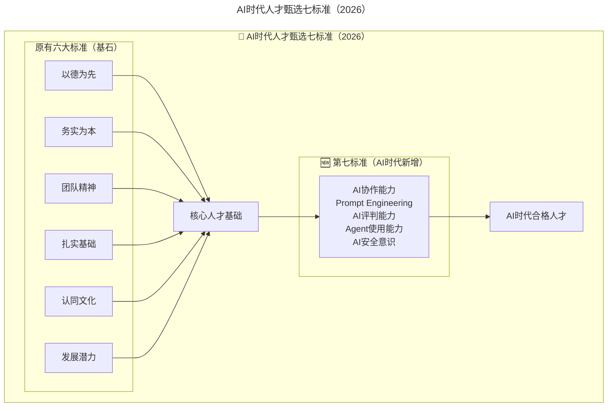
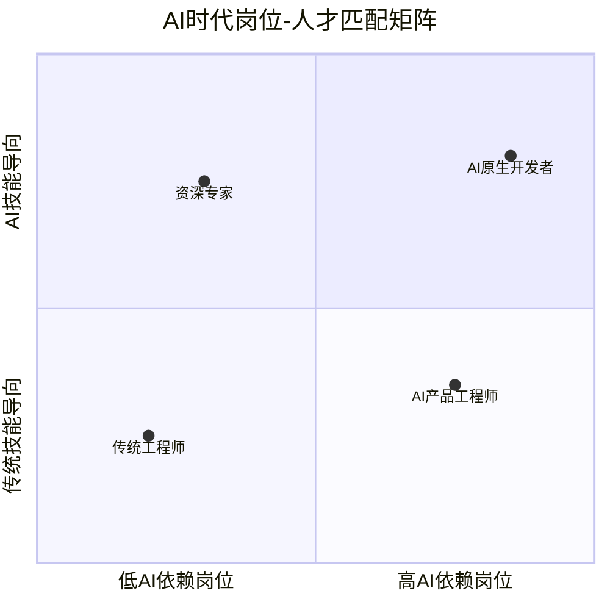

# 第33讲 | 选对的人，做正确的事情

> **适用范围**：负责招聘决策的技术负责人、CTO、研发经理，以及需要建立人才甄选标准与面试方法的管理者。
>
> **更新摘要（v2 · 2026-08 更新）**：
> - 结构化升级为 6 节骨架（导言 / 核心方法论 / 关键流程 / 工具与实战 / 常见误区 / 进阶延展）
> - 保留原文"甄选人才六大基本标准""识别六大素质方法""慎用六类人才"完整体系
> - 整合 2026 年 AI 时代升级注解，为所有 Mermaid 图补充 `title` frontmatter
> - 新增第七标准"AI 协作能力"、四类 AI 能力面试方法与岗位-人才匹配矩阵

## 1. 导言

人才队伍，对一个组织能否打胜仗起到至关重要的作用；人才结构，决定企业能够做多大走多远。人对了，事才能对，选对的人，做正确的事情，企业才能步入发展的快车道。企业经营的过程就是在招兵、练兵和用兵的过程，今天我们就来谈谈招兵买马这件事情。

招聘的岗位要求、流程和方法论，本文不作过多探讨，相信每个公司都有自己的操作章法。本文把重点放在招兵买马认知和实战经验上面：

选用什么样的人才？ —— 甄选人才的六大基本标准；

如何挑选人才？ —— 识别人才六大基本素质的实用方法；

哪类人才要慎用？ —— 管理者要慎重聘用的六类人才。

## 2. 核心方法论

### 甄选人才的六大基本标准

**"以德为先"作为选用人才的第一个标准。**

没有良好的职业道德、人生观和价值观的人才，往往缺乏奉献精神，很难将做好本职工作作为对自己的第一要求，严重时，其不良倾向会波及和影响整个团队，进而给团队带来较大的管理难度和管理风险。如果管理者道行不深，很有可能需要花费大量时间和精力纠正其行为，却效果不大，产出也很低。你的时间和精力是宝贵的，不应该投入在没有产出的人身上。

**"务实为本"是选用人才第二个标准。**

任何成功都是从点滴开始积累的，务实型人才往往乐于从基础工作做起，一步一个脚印。尤其是搞技术的，如果整天只是夸夸其谈，不干实事，浮于表面，将很难立足，很难给公司创造价值。唯独踏踏实实，认认真真，把心沉下来，用心做好事情，在做事情的过程中，不断磨砺自我，提升自我，方能成为企业的顶梁柱。

**"良好的团队精神"是选用人才的第三个标准。**

现代企业中几乎不存在个人英雄主义逞能的土壤，成功离不开团队全体成员竭诚协同努力。一个缺乏团队精神的人，表现为自私、利己、很难与别人合作、很难认可别人的贡献，这样的人会与团队格格不入。

**"较扎实的基础知识"是选用人才的第四个标准。**

较扎实的基础知识是能否进行有效培养继而使其成为"能人"的前提条件。其中最重要的是语文知识和数学知识。一个人如果具备良好的语文基础知识，则理解和表达能力通常不错，有利于与人的沟通；具备良好的数学基础知识，则逻辑思维能力会比较强，处理事情一般会比较严谨和细致。

**"认同企业文化"是选用人才的第五个标准。**

认同企业文化与招聘后人才的稳定程度有关。人才不稳定，不但不利于团队工作的开展，而且会增加人才招聘成本，给企业带来不必要的负担。有了共同的团队文化，大家用一种语言沟通，在同一频道上对话，有一致的想法，工作步调又一致，节奏一致，劲往一处使，形成合力产生共振，把组织效能发挥到最大，最后把事情做成，正所谓上下同欲者胜。

**"较好的发展潜力"是选用人才的第六个标准。**

较好的发展潜力是一个人能否快速成长的先决条件。企业需要的是这种具有较好发展潜力的人才，因为企业为这样的人才付出的成本可能不会很高，但其创造的价值却会不断增长。

### 第七标准：AI 协作能力（2026 新增）

2026年，原文提出的**甄选人才六大基本标准**（以德为先、务实为本、团队精神、扎实基础、认同文化、发展潜力）依然是基石。但在AI时代，需要在此基础上**扩展第七个标准：AI协作能力**。

**核心变化：**
- 84%的开发者使用AI编程工具，**不会用AI的人正在成为"新文盲"**
- GPT-5.5和DeepSeek V4的能力意味着：**AI可以替代"会写代码"的人，但无法替代"会判断代码质量"的人**
- 人才标准从"能不能干活"升级为**"能不能用好AI干活并判断质量"**

七标准模型在原有六大基石之上叠加第七标准"AI 协作能力"，强调只有同时具备传统品德/务实/基础与 AI 协作能力的人，才是 AI 时代的合格人才。

**⭐ 第七标准：AI协作能力的详细定义**

| 子维度 | 一级（入门） | 二级（熟练） | 三级（专家） |
|--------|-------------|-------------|-------------|
| **Prompt Engineering** | 会用基本提示词完成任务 | 能设计结构化Prompt链 | 能构建企业级Prompt模板库 |
| **AI评判能力** | 能发现AI的明显错误 | 能评估AI代码的安全性和质量 | 能制定AI输出质量标准 |
| **Agent使用能力** | 了解Agent概念，能使用现成工具 | 能配置和调优Agent工作流 | 能设计和开发自定义Agent |
| **AI安全意识** | 知道不能泄露数据给公开AI | 能识别常见AI合规风险 | 能制定并推行企业AI安全规范 |

## 3. 关键流程

### 识别人才六大基本素质的实用方法

应聘者是否具有良好的道德情操，可以通过了解他以前的工作和学习情况来发现，也可以通过他的言谈举止来观察，因为一个人内心的想法多数时候会"溢于言表"。

应聘者是否具有良好的务实精神，可以通过查看他以前的工作履历来了解。如果由于个人原因而频繁跳槽，这样的应聘者十有八九不属于这一类，聘用时需慎重考虑。

应聘者是否具有良好的团队精神，可以通过讲解项目研发过程，遇到的人和事，是怎么处理和面对的，通过设置好的一系列问题去深挖，去捕捉他处理的小细节和肢体语言来判断。

应聘者是否具有良好的语文基础知识和数学基础知识，可以请他就某一个问题进行书面（或口头）阐述，通过他的表达清晰程度和分析理性程度来判断。

应聘者对企业文化是否有认同感，可以通过向他介绍企业的规章制度、用人政策、薪酬政策等，来观察他所表现出来的认同程度。

应聘者是否具有较好的发展潜力，可以通过他对事物的个人见地去了解，是否具备相应的思维空间和相应的意识。有些时候，通过观察应聘者的精神面貌也可以作为基本的判断，精神面貌积极、阳光的人，一般来说发展潜力都不错。

### 识别方法的 AI 时代增强

| 原有方法 | 对应素质 | 🆕 AI时代增强方法 | 对应AI素质 |
|----------|---------|------------------|-----------|
| 了解工作/学习情况 | 道德情操 | **询问AI使用中的诚信表现** | AI安全意识 |
| 查看工作履历 | 务实精神 | **查看AI项目经历的真实性** | AI评判能力 |
| 讲解项目经历 | 团队精神 | **了解在AI协作中的角色定位** | Agent使用能力 |
| 书面/口头阐述 | 基础知识 | **让其对AI生成内容进行点评** | AI评判能力 |
| 介绍企业政策 | 文化认同 | **观察对AI规范的接受程度** | AI安全意识 |
| 个人见地/精神面貌 | 发展潜力 | **讨论对AI技术趋势的看法** | Prompt天赋 |

### ⭐ 实用的 AI 能力面试方法

#### 方法1：Prompt测试（15分钟）
**题目示例**："请用提示词让AI完成一个[具体任务]，我会观察你的提示词设计思路"

**考察点：**
- 是否理解任务需求
- 提示词的结构化程度
- 迭代优化能力

#### 方法2：AI输出审查（20分钟）
**操作**：提供一段AI生成的代码（故意包含若干问题），让候选人审查

**考察点：**
- 能发现哪些问题
- 问题分类是否清晰
- 改进建议是否合理

#### 方法3：AI工具调研（10分钟）
**问题**："你日常使用哪些AI工具？请分享一个你觉得最好用的和一个最不好用的"

**考察点：**
- 工具使用的广度和深度
- 批判性思维能力
- 学习和探索意愿

#### 方法4：AI伦理场景判断（10分钟）
**场景**："如果项目紧急，有人建议把公司代码直接喂给公开AI来加速开发，你怎么看？"

**考察点：**
- 安全意识
- 原则性
- 沟通方式

## 4. 工具与实战

### AI 时代的岗位-人才匹配矩阵

岗位-人才匹配矩阵以"AI 依赖度"为横轴、"技能导向"为纵轴：传统工程师位于低 AI 依赖、传统技能导向象限，AI 原生开发者位于高 AI 依赖、AI 技能导向象限，资深专家位于低 AI 依赖但高 AI 技能导向象限。

| 岗位类型 | 核心要求 | AI能力权重建议 |
|----------|---------|---------------|
| **传统维护型** | 业务理解、稳定性 | 20%（AI作为辅助） |
| **AI原生开发** | Prompt能力、Agent编排 | **50%+**（AI是核心生产力） |
| **架构/专家** | 深度技术、判断力 | 30%（AI辅助决策） |
| **AI产品型** | 产品思维+AI实现 | 40%（平衡两者）|

## 5. 常见误区

### 管理者要慎重聘用的六类人才（原文）

- **个人简历与实际情况不符者**：一个弄虚作假的人，不要期望他能在以后的工作中干出多少名堂。不诚实守信就很难和上下级建立信任，是个双输的结果。

- **频繁跳槽者**：往往把跳槽作为"快速"提升自我价值的有效手段，急功近利。大多数频繁跳槽者的工作经验和技能不如同工龄的工作比较稳定者。

- **眼高手低者**：高估自己的工作能力，只想做"大"事，不愿做"小"事，"小"事不想做，"大"事做不了。

- **夸夸其谈者**：口若悬河、夸夸其谈，不太务实，工作起来比较浮躁，通常只图将事情做完，而不关心事情是否做好。

- **过分看重个人利益者**：将企业能否满足他的"自我期望"作为是否"加盟"的首要甚至唯一条件，有不断膨胀的个人私欲。

- **过分追求自我表现者**：一味追求自我表现，不善于考虑别人的利益和感受，不愿意与别人协作。

### AI 时代新增三类慎用人才

#### 🆕 第七类：AI工具投机者
- **特征**：简历上罗列大量AI工具，但深入一问只会表面使用
- **风险**：实际产出可能不如踏实做事的人
- **识别方法**：**深度追问使用细节**，要求现场演示

#### 🆕 第八类：AI安全无视者
- **特征**：对数据安全毫不在意，认为"没什么大不了的"
- **风险**：可能导致严重的数据泄露或合规问题
- **识别方法**：**设置AI伦理场景题**，观察其反应

#### 🆕 第九类：AI依赖过度者
- **特征**：离开AI就无法工作，基础能力退化明显
- **风险**：AI出问题时无法应对，缺乏韧性
- **识别方法**：**安排无AI的编码环节**，观察真实水平

### AI 时代招聘的陷阱

**陷阱1：只看AI工具数量不看质量**
- **错误**：谁列的AI工具多就认为谁强
- **对策**：**深度考察使用深度和质量**，而非广度

**陷阱2：忽视基础能力**
- **错误**：认为会用AI就不需要好的基础
- **现实**：**AI放大能力差异**，基础差的人用AI可能产出更多问题

**陷阱3：AI能力与岗位不匹配**
- **错误**：所有岗位都要求高AI能力
- **对策**：**根据岗位特性设定合理的AI能力要求**

## 6. 进阶延展

### 结语

李云龙的部队无论走到哪里，都不会忘记两件事，一是招兵买马，二是筹备武器装备（工具），这才由千多人的团队发展到后来将近万人。对于现代企业来说，这两件事同样重要。互联网公司的核心竞争力是人才，人才多寡、人才结构、人才分布和人才搭配决定组织效率，决定公司生死存亡。祝各位管理者都能找到适合的人才。

### 📊 2026年人才选拔 Checklist

- [ ] 更新**岗位JD**，明确AI能力要求（根据岗位类型差异化）
- [ ] 设计**AI能力面试题库**（Prompt测试、输出审查、伦理判断）
- [ ] 将**AI协作能力**纳入评分表（建议权重15-30%）
- [ ] 增加**AI安全背景调查**问题
- [ ] 建立**AI能力等级标准**，统一评估尺度
- [ ] 避免**AI工具迷信**，回归"以德为先"的根本原则

> 💡 **一句话总结（2026版）**：
> 黄玉超老师的六大标准——**以德为先、务实为本、团队精神、扎实基础、认同文化、发展潜力**——在AI时代不仅没有过时，反而更加重要。因为**AI越强大，人的品格、态度、基础能力就越关键**。我们需要做的只是**加上第七条标准：AI协作能力**。记住：**AI可以教会人写代码，但教不会人靠谱**。

_**作者简介**_

黄玉超，现任拉卡拉金融集团研发经理，有十余年的软件开发、架构和技术管理经验，其中有八年互联网金融行业经验，喜欢阅读，乐于分享，爱好技术管理和领导力的深化，使其工具化的落地。

---

*本注解基于2026年6月技术环境生成，强调AI对人才甄选标准与面试方法的深远影响。*
