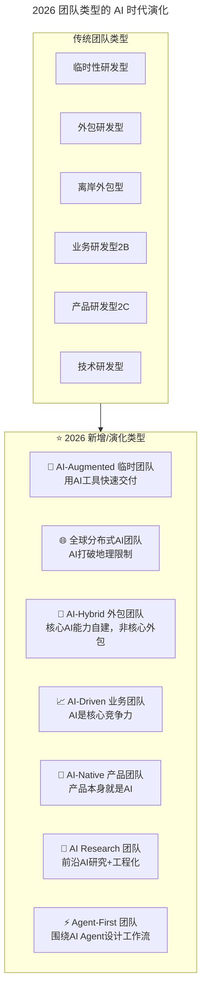
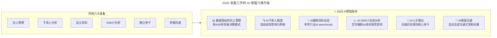
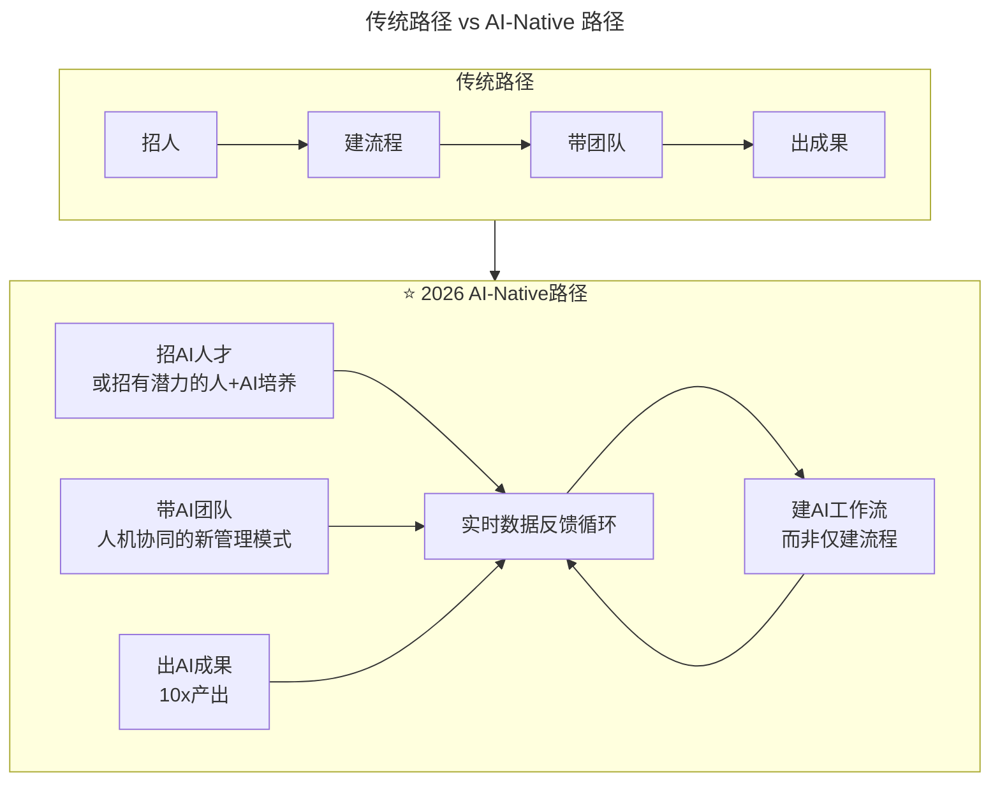
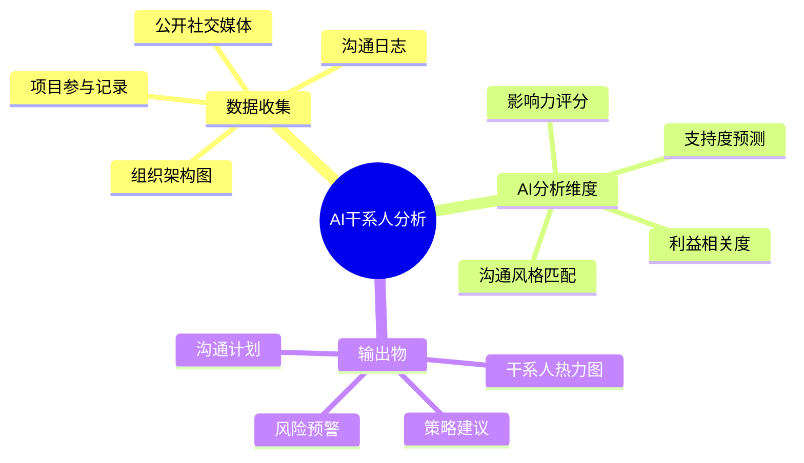

# 第174讲 | 邱良军：打造高效技术团队，你准备好了吗！

> **适用范围**：即将从零组建或空降接管技术团队的负责人（研发经理/技术总监/CTO），特别适合在 AI 时代需要重新设计团队类型、准备工作和管理方式的场景下参考。
>
> **更新摘要（v2 · 2026-08 更新）**：
> - 结构化升级为 6 节骨架（导言 / 核心方法论 / 关键流程 / 工具与实战 / 常见误区 / 进阶延展）
> - 在原"AI 时代升级注解（2026）"基础上，把团队六种类型扩展为 AI 时代七种新增/演化类型
> - 补充"AI 增强版准备工作"六维升级表与 AI Readiness Checklist
> - 三张 Mermaid 图均补齐 title frontmatter 并增加图后文字解读
> - 将原"⭐2026 可执行建议"统一归入"工具与实战"和"进阶延展"两节

## 1. 导言

### 写在前面

在 18 年的职业生涯中，我从一名专注技术的码农，到研发经理，再到研发总监，中间踩了无数的坑，体验了从技术到管理的各种艰辛历程，也不断学习各种理论慢慢悟出了很多道理。我的成长阶段大体上分为三个阶段：

1. 学习各种技术技能自己做事；
2. 带领团队做事；
3. 找人、组建团队、用好每个成员做事。

我提取了成长过程中的几个数据指标，一类数据是管理的团队人数变化，一类是技术、管理、认知能力的变化（自我打分），绘制成了个人的成长曲线图。

### 核心理念

- 完美的理论，没有完美的现实
- 根据实际情况灵活机动
- 在有限的条件下完成设定的目标才是一个合格的团队负责人

### 2026 新背景

邱良军老师强调的"根据实际情况灵活机动"在 AI 时代有了新的含义：过去的灵活是根据业务需求调整人员配置；2026 年的灵活是根据 **AI 技术演进节奏** 调整团队结构和工作方式。AI 技术的发展速度（月级别迭代）远快于传统的业务周期（季度/年度），因此团队打造必须具备"AI 敏捷性"——能够快速采纳新的 AI 工具和方法。

## 2. 核心方法论

### 2.1 团队六种类型（原文）

在准备打造一支技术团队前，先看看自己当前的现状如何？你是从零开始组建一支技术团队，还是改进现有的技术团队。不同场景、不同条件、不同现状、不同阶段所使用的方法都有差别，没有一套放之四海皆准的方法，我们应该根据具体情况作出具体应对。下面我列出六个技术团队的种类，你可以对比一下自己的具体情况。

**首先，需要思考一下：要打造什么样的技术团队？**

1. 临时性研发型团队：临时承接系统研发任务，项目结束后团队解散；
2. 外包研发型团队：承接软件外包项目，或按工时付费的软件外包项目等；
3. 离岸外包研发型团队：承接国外或者异地转移的部分软件外包系统开发；
4. 业务研发型团队（2B 业务）：给自己公司业务发展做产品系统方案，自研自用，迭代开发完善产品，支持业务的发展，扩大抢占市场；
5. 产品研发型团队（2C 或小 B 业务）：做行业产品的系统解决方案，一般有行业 SAAS 平台开发，行业软件系统开发，比如餐饮系统、信贷系统、呼叫中心系统等等；
6. 技术研发型团队：做技术基础软件研发，比如 PAAS 平台，中间件、数据库、报表类等工具产品。

### 2.2 团队类型的 AI 时代演变



上图把原文的六种传统团队类型映射到 2026 年的七种新增/演化类型。演化的核心逻辑是：AI 工具的普及让"临时团队"可以借助 AI 快速交付、"业务团队"可以以 AI 为核心竞争力、"产品团队"可以让产品本身即 AI，同时新增了 AI Research 和 Agent-First 两种全新类型。这提示组建团队时除了考虑"项目/业务/技术"驱动，还要考虑"AI 密度"这一新维度。

#### 2026 各类型团队的 AI 特征对比

| 团队类型 | 主要特点 | AI 密度要求 | 典型 AI 工具栈 |
|---------|---------|-----------|-------------|
| **AI-Augmented 临时** | 快速交付、短期项目 | 中（40%+） | Copilot, Cursor, GPT-5.5 |
| **全球分布式 AI** | 跨时区、异步协作 | 高（60%+） | Slack AI, Notion AI, Zoom AI |
| **AI-Hybrid 外包** | 核心自建+外围外包 | 核心高/外围低 | 自定义 AI 平台 |
| **AI-Driven 业务** | AI 赋能业务增长 | 高（70%+） | 定制 LLM, Agent 系统 |
| **AI-Native 产品** | 产品即 AI | 极高（90%+） | 自研 AI 引擎, 模型训练 |
| **AI Research** | 前沿探索 | 极高（95%+） | PyTorch, Jupyter, HuggingFace |
| **Agent-First** | Agent 为中心 | 极高（85%+） | LangChain, AutoGPT, CrewAI |

### 2.3 准备工作的 AI 增强



上图把原文的六大准备工作一一映射到 2026 年的 AI 增强版本。每一项准备都从"人工+经验"升级为"数据+AI"：向上管理从观察猜测升级为 AI 分析决策模式，干系人分析从手工罗列升级为 AI 自动绘制影响力网络，依此类推。其本质是把"准备工作"从一次性的人工动作，升级为持续运行的 AI 辅助系统。

### 2.4 团队打造的 AI 时代关键差异



上图对比了传统路径与 AI-Native 路径的核心差异：传统路径是"招人→建流程→带团队→出成果"的线性推进，而 AI-Native 路径在每一步之间加入了"实时数据反馈循环"，使团队打造从一次性工程变为持续优化的闭环系统。这意味着 2026 年的团队负责人需要在"招 AI 人才、建 AI 工作流、带 AI 团队、出 AI 成果"四个环节都建立数据反馈机制。

## 3. 关键流程

### 3.1 团队打造前的准备：先看现状

在准备打造一支技术团队前，先看看自己当前的现状如何？你是从零开始组建一支技术团队，还是改进现有的技术团队。不同场景、不同条件、不同现状、不同阶段所使用的方法都有差别，没有一套放之四海皆准的方法，我们应该根据具体情况作出具体应对。

**其次，是从零开始还是改造现有的技术团队，改造技术团队需要分析是处在以下哪种情况：**

1. 改造自己组建的团队，让它提供更专业的服务，支持业务更好的发展；
2. 由于职位调动，空降并接管一个技术团队，更进一步发展团队；
3. 作为救火队员空降到一个问题团队，需要你稳定团队，并把它打造成有技术范的团队；

**在确定了团队目标和当前状态后，根据实际情况去搭建团队，需要思考的关键点有：**

1. 团队定位：项目驱动型、业务驱动型、技术驱动型；
2. 薪资预算：公司所能提供的薪资在行业内的水平分析；
3. 公司声誉：公司在业内的排名，是否是新兴行业；
4. 行业要求：除了技术以外，人才是否需要特定的行业背景，比如英文能力要求；
5. 人才市场特点：当地人才市场的分布，人才聚集的公司及地点；
6. 时间要求：团队组建的时间要求和时机情况；
7. 团队负责人：个人背景及魅力，行业影响，管理能力，领导力等；
8. 核心团队：核心团队如何获得；
9. 领导授权：放权是否足够，是否有充分的权力做决策。

### 3.2 不同定位类型的团队特点

如果是项目驱动型的团队，它的主要特点有：
1. 以软件外包为主，项目具有一次性，做完后会换其他项目做；短的项目几个月，长的项目会有 1 年，甚至几年时间。
2. 对于这样的团队来说，流程、项目管理非常重要，要确保项目按时交付，具有明显的成本、进度、范围的控制。
3. 项目一般来自于"业务型"团队来不及做的系统，或没有自己开发团队的公司需要做项目发包，比如大系统改造、重构、新系统开发等。
4. 项目驱动型团队对技术的要求处在一个相对比较低的等级。

此时团队规划中应该有需求分析员 BA、项目经理、开发组长/开发团队、测试团队等，如果是大项目的话，还需要有架构师。

**如果是业务驱动型的团队，它的主要特点有：**
1. 为业务发展做支撑，开发迭代速度比较快，多数互联网企业属于这个类型。
2. 系统设计要有产品化思路，能支撑业务的增长，当前投入是为了未来获得回报，能讲故事获得融资。
3. 团队对技术的要求会有所提升，技术对业务的支撑要有一定的前瞻性。

这时团队规划中应该有产品经理、开发组长/开发团队、测试团队、运维支持、架构师等。

**如果是技术驱动型的团队，它的主要特点有：**
1. 一般这类团队是指大型软件公司的架构组、基础组件团队，比如阿里、百度等；或者开发工具的软件公司，比如金山、360、TiDB 等。
2. 软件的复用性最高，能解决普遍的技术或者工程效能问题。
3. 团队对技术要求处在最高一个等级。

这样的团队规划中应该有技术专家、架构师和开发团队等。

此外，团队负责人和公司人力资源部门需要清晰理解对人才的定义，关于人才定义可以参考我之前分享的"人才画像"一文。先列出这些基本信息，再使用 SWOT 工具做优劣分析对比，找出当前的优势，扬长避短，就可以开始"撸起袖子加紧干"了。

### 3.3 五段实战经历

第一段，当时我临时组建了一个团队来完成一个临时性的项目，团队人员是流动的。核心人员是从其他团队借调的，另外临时招聘了几个刚刚入行的新人。客户对接、需求分析及任务跟踪都是我自己做的，总体上比较顺利，项目完成后团队就解散了。由于是在外企，同事关系比较简单，项目工期也不紧张，所以没有做准备工作。

第二段，我的职位升级后调任一支 15 人左右的团队负责人，任研发经理负责一个系统的研发交付，当时已经做码农近 10 年，但管理方法欠缺，因此恶补了很多管理方面的知识。

第三段，空降到一个 30 人的团队，准备工作主要是了解团队成员及系统开发的情况。

第四段，从零开始将团队发展到 300 人，开始时完全被忽悠，中间无数次想放弃退出，最后坚持下来，收获非常大，当时没有做任何准备工作，完全是摸爬滚打过来的。

第五段，从零开始快速组建创业团队到 40 人，此时组建团队已经轻车熟路了，基本上是按照本文所写的套路去做的。

### 3.4 准备工作六大要点

**通过自己数次组建团队的经验，在准备工作阶段，我们需要做的最重要的事情主要有六点：**

1. **向上管理**，观察你老板的为人是怎样的，是否获得充分授权及信任。
2. **干系人分析**，如果有条件的话，做一次干系人分析，包括你的老板，公司内部的各种角色，分析支持者与反对者（多从对方角度想想为什么？），还可以想想哪些是会帮助你的朋友，哪些是会落井下石的，联系那些不经常联络的朋友，扩大一下社交圈。
3. **设立目标**，在前进的路上不断看看是否偏离大目标，同时每个月设立可以完成的小目标。
4. 充分发挥 **SWOT 分析** 中的优势项，快速做出成果，给大家信心。
5. **确立核心骨干**，这是准备阶段最重要的事情之一。
6. 建立 **随时沟通、积极沟通、勤奋沟通** 的心态。

### 3.5 准备工作的 AI 增强详解

**① 向上管理的 AI 加持**

| 维度 | 传统做法 | 2026 AI 增强 |
|-----|---------|--------------|
| 了解老板风格 | 观察和猜测 | **AI 分析历史决策模式和偏好** |
| 汇报效率 | 手写 PPT | **AI 自动生成数据可视化报告** |
| 风险预警 | 直觉判断 | **AI 预测项目风险概率** |
| 资源争取 | 口头说服 | **AI 计算 ROI 数据支撑请求** |

**② 干系人分析的 AI 工具**



上图用思维导图展示了 AI 干系人分析的三大模块：数据收集（组织架构、项目记录、沟通日志、公开社交媒体）、AI 分析维度（影响力评分、支持度预测、利益相关度、沟通风格匹配）、输出物（干系人热力图、策略建议、风险预警、沟通计划）。相比传统手工罗列，AI 干系人分析能持续更新、量化评分，并自动输出可执行的沟通计划。

**③ 目标设定的 AI Benchmark**
- 使用 AI 扫描同行业团队的 AI 成熟度指标
- 参考 GitHub、HuggingFace 上类似项目的 AI 采用率
- 设定可量化的 AI KPI（如：AI 辅助代码占比、AI 工具覆盖率）

**④ SWOT 的 AI 动态更新**
```
传统SWOT: 一次性分析，静态结果

2026 AI-SWOT:
├── 实时数据源: AI技术新闻、竞争对手动态、团队指标
├── 自动更新频率: 每周/每月
├── 趋势预测: AI预测未来3-6个月的变化
└── 行动建议: AI根据SWOT变化推荐策略调整
```

**⑤ 核心骨干的 AI 识别**

| 识别维度 | 传统信号 | 2026 AI 信号 |
|---------|---------|-------------|
| 技术能力 | 项目经验、技术深度 | **GitHub AI 项目、HuggingFace 贡献** |
| 学习能力 | 快速上手新任务 | **AI 工具掌握速度、Prompt 质量** |
| 影响力 | 同事评价 | **AI 社区活跃度、内容传播力** |
| 潜力 | 成长轨迹 | **AI 适应曲线、创新尝试频次** |

**⑥ 沟通的 AI 提效**

| 场景 | 传统耗时 | 2026 AI 提效 |
|-----|---------|--------------|
| 会议纪要 | 30-60 分钟整理 | **5 分钟 AI 生成+人工校验** |
| 周报撰写 | 1-2 小时 | **10 分钟 AI 草稿+个性化修改** |
| 邮件回复 | 15-30 分钟/封 | **3 分钟 AI draft+审核发送** |
| 演示文稿 | 半天-1 天 | **1 小时大纲+AI 生成初稿** |

## 4. 工具与实战

### 4.1 团队打造 AI Readiness Checklist

**Phase 1: 准备阶段（Week 1-2）**
- [ ] 完成团队类型 AI 适配分析
- [ ] 制定 AI 工具栈选型方案
- [ ] 设计 AI 能力要求和评估标准
- [ ] 准备 AI 相关的面试题目和实操测试

**Phase 2: 组建阶段（Week 3-6）**
- [ ] 启动 AI 人才雷达扫描
- [ ] 招聘首批 AI-Augmented 核心成员
- [ ] 建立团队 AI 知识库和 Best Practices
- [ ] 部署统一的 AI 工具和环境

**Phase 3: 运营阶段（Week 7+）**
- [ ] 启动每周 AI 分享机制
- [ ] 建立 AI 项目和实践案例库
- [ ] 设计 AI 绩效指标和反馈循环
- [ ] 打造 AI 雇主品牌

### 4.2 AI 工具包推荐（按团队规模）

| 团队规模 | 必备 AI 工具 | 预算估算（人/月） |
|---------|-----------|-----------------|
| **<10 人** | ChatGPT Plus, Copilot, Notion AI | $30-50 |
| **10-50 人** | + Cursor, Midjourney, Slack AI | $50-100 |
| **50-200 人** | + 企业版 AI 平台, GPU 资源 | $100-200 |
| **200+人** | + 自建 AI 平台, AI Training 预算 | $200-500+ |

### 4.3 理论与实战结合

我认为在有限的条件下完成设定的目标才是一个合格的团队负责人，拿到 PMP 认证只是认可了你的管理理论水平，实际能力还需要通过做项目带团队来验证，并且只有通过做项目才能得到提高。理论可以作为指导，实际解决问题不能拘泥理论，需要把"十八般武艺"都用上。当你能利用学到的理论，结合实际工作磨练，把理论和实际结合起来，并不断优化提炼出最好的经验（Best Practice）时，你的能力才能得到真正提升。

## 5. 常见误区

### 5.1 误区一：一套方法放之四海皆准

不同场景、不同条件、不同现状、不同阶段所使用的方法都有差别，没有一套放之四海皆准的方法。只有完美的理论，没有完美的现实，需要根据实际情景灵活机动地应付各种情况。

### 5.2 误区二：准备工作走过场

向上管理、干系人分析、设立目标、SWOT 分析、确立骨干、积极沟通六项准备，每一项都值得反复学习、反复体验、反复思考。走过场会导致后续团队运转处处碰壁。

### 5.3 误区三：忽视核心骨干确立

确立核心骨干是准备阶段最重要的事情之一。没有核心骨干，所有工作都会压在负责人一个人身上，难以扩展。

### 5.4 误区四（2026 新增）：用静态方法应对 AI 月级迭代

AI 技术的发展速度（月级别迭代）远快于传统的业务周期（季度/年度）。如果用静态的团队类型、静态的 SWOT、静态的目标设定去应对，会很快落后。应建立"AI 敏捷性"——能够快速采纳新的 AI 工具和方法。

### 5.5 误区五（2026 新增）：只看技术能力不看 AI 适应曲线

在选拔核心骨干时，如果只看传统项目经验和技术深度，忽视 AI 适应曲线和创新尝试频次，会导致团队在 AI 转型中缺乏引领者。应同时考察 GitHub AI 项目、HuggingFace 贡献、Prompt 质量等 AI 信号。

## 6. 进阶延展

### 6.1 关键洞察

> **邱良军老师强调的"根据实际情况灵活机动"在 AI 时代有了新的含义**：
>
> - **过去的灵活**：根据业务需求调整人员配置
> - **2026 年的灵活**：根据 **AI 技术演进节奏** 调整团队结构和工作方式
>
> **AI 技术的发展速度（月级别迭代）远快于传统的业务周期（季度/年度），因此团队打造必须具备"AI 敏捷性"——能够快速采纳新的 AI 工具和方法。**

### 6.2 与其他理论的连接

- **PMP 项目管理（Project Management Professional）**：原文强调学一点项目管理知识绝对是有好处的事情，很多事情使用项目管理的方法去做就成功一半了
- **SWOT 分析（SWOT Analysis）**：原文把 SWOT 作为准备工作第四项，2026 年升级为 AI 动态 SWOT
- **人才画像（Talent Persona）**：原文引用"人才画像"一文，2026 年应叠加"AI 适应曲线"和"AI 创新尝试频次"两个新维度
- **Best Practice（最佳实践）**：理论与实际结合后不断优化提炼，是能力真正提升的路径

### 6.3 长期愿景

- 把"AI 敏捷性"写入团队 Onboarding：新成员第一天就理解团队的 AI 工具栈、AI 工作流和 AI KPI
- 建立"AI 团队健康度年度评估"：从 AI 密度、AI 工具覆盖率、AI 人才占比、AI 成果产出四个维度年度评估
- 从"组建团队"升级为"组建人机协同团队"：在每一个岗位定义中明确"人负责什么、AI 负责什么、人机协同点在哪里"

## 作者简介

邱良军，极智嘉研发总监，TGO 鲲鹏会会员，负责组建极智嘉苏州研发团队，以及筹建苏州研发中心，4 个月将团队发展到 40 人，并承接两个系统开发，数条支持线的工作。曾在新电任职超 10 年，带领团队交付数个项目，团队峰值人员超 70 人。2014 在文思海辉担任总监，从零开始将团队带至 300 人。18 年 IT 老兵，管理经验丰富。

---

*本注解基于 2026 年 6 月技术环境生成，强调 AI 对团队类型、准备工作和管理方式的全面重塑。*
