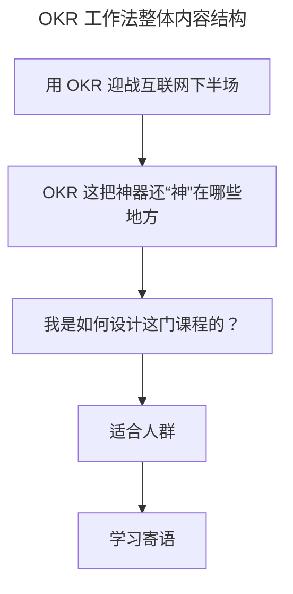

# OKR 工作法：组织目标管理的神器

> **适用范围**：组织管理者、部门负责人、Team Lead、HR 及即将导入 OKR 的企业，面向互联网下半场目标管理与绩效转型场景。
>
> **更新摘要（v2 · 2026-08 更新）**：
> - 结构化升级为 6 节骨架（导言 / 核心方法论 / 关键流程 / 工具与实战 / 常见误区 / 进阶延展）
> - 梳理 OKR 在互联网下半场的三重价值路径与"形式化"根因
> - 保留京东落地案例与课程模块设计，为 Mermaid 图补充文字解读

## 1. 导言

说起 OKR，相信你并不陌生，它起源于英特尔，发扬光大于谷歌。国外的领英、亚马逊、Dropbox、Zynga 等成熟和创业公司都在用；国内的华为、BAT、字节跳动、京东等互联网和高科技企业也纷纷在推 OKR，那么，OKR 为什么如此受欢迎呢？

随着流量红利的消退，增长越来越乏力，互联网进入下半场后，有越来越多的组织管理问题被放大。比如，我们经常听到组织中不同角色的吐槽。

- 员工："感觉自己就是个干活的，根本不知道大部门的方向和做这些事的价值是什么。"
- Team Lead："团队没什么活力，执行力不行。"
- 部门负责人："计划总赶不上变化，KPI 定了也白定。"
- 决策层："战略定了，时间过了大半，还没什么结果。"

诸如此类的问题，在 OKR 应用后都得到了有效解决。一位经理人曾跟我说，团队中竟然有人在用 OKR 自发做着老板没有要求的事情，感觉团队更有干劲儿了；也有团队成员找到我说，用了 OKR 感觉自己工作更加有意义，知道组织中的战略是什么，也知道自己所做的工作竟然可以支撑组织战略的实现，非常开心。OKR 就是有着这样的魔力，而在互联网的下半场，这把组织目标管理的神器能帮助我们解决的问题还有更多。

## 2. 核心方法论

从本质上来说，**OKR 是一套目标管理方法论，是一个包括了从目标的制定，目标实现过程的管理，再到目标完成的效果评价的系统工程**。这个闭环的目标管理过程几乎涵盖了工作中的方方面面，覆盖到了组织中各个层级的人。也就是说，用好 OKR 能给工作的各个环节以及各类人员都能带来不同的价值。

我们大部分人都是在组织中工作和成长，即使你去创业，本身也是在创立一个组织，**而一个组织所能成立的理由就是去实现目标**。所以管理好目标，对于组织发展和在组织中成长的人来说都非常重要。此外，每个组织都面临内外部环境的挑战，一方面是如何灵活应对不断变化的外部经营环境，另一方面是如何建设好一个具备竞争力的内在组织。学好用好 OKR，这些问题都能迎刃而解。

## 3. 关键流程

OKR 这把神器还"神"在哪些地方？其价值实现路径可以拆解为以下三个关键方面。

### （1）解决"唯 KPI 论"难题，灵活获得组织绩效

以往"唯 KPI 论"，只看结果数字的做法势必带来过程管理问题，导致文化差，激励不公平，领导力丧失。更重要的是，KPI 通常只用来管理既定的计划，忽略了外部经营环境的不确定性。试想，如果在计划赶不上变化时，你还紧盯着既定的 KPI，势必南辕北辙。OKR 方法则通过建立一系列跟踪和回顾机制，以及对目标的持续检视和调整活动，能够灵活应对 VUCA（Volatile / Uncertain / Complex / Ambiguous）的经营环境，取得高质量的组织绩效。

### （2）解决组织增长问题，保证组织目标落地执行

定战略，核心就是要能解决组织增长的问题，OKR 通过更加结构化的方式帮助我们进行战略管理，承载了组织战略所要的增长。O 就是战略方向，KR 则是增长的量化指标。而 OKR 通过业务型 OKR + 非业务型 OKR 的组合，不仅关注财务和用户型的业务增长，也关注过程效率和能力提升等非业务型增长。

此外，OKR 的制定遵循着基本的约束和生成规律：

- 通过自上而下对齐 O 把握方向，让组织中不同层级生成的目标都是一致的，形成合力；
- 通过 KR 对目标具体实现路径的讨论和共识，拆解和分工，有力地支撑了目标的完成；
- 通过对个人 OKR 生成的制定分类，让每个人的工作目标都能聚焦在与上级目标对齐上、与外部支持目标对齐上，保证了每个人的目标都是与组织目标相关的。

所以 OKR 结构化的管理战略，有效解决了组织增长的问题，并通过 OKR 的层层关联，互相支撑，有力确保了组织目标的落地实现。

### （3）提升组织文化建设和领导力，激活组织中的人

OKR 持续的协同制定过程，以及团队 OKR 的通晒机制，有助于团队明确目标，强化信任关系，为组织带来协作和诚信的优秀文化。此外，OKR "制定—过程检视和调整—闭环评估"的工作机制，更是拉动了管理者和被管理者持续对目标制定和实现过程的沟通、确认和共识，建立了上下级良好的工作关系。

在个体层面，21 世纪是知识工作者（Knowledge Worker）时代，激活知识工作者，让他们更有动力，核心就是让他们的工作能够更有目标感、要有自主性、要能持续成长。OKR 首先就是从目标出发来思考工作的起点，鼓励创意和自主，改变了传统的"命令+控制"的管理方式，甚至激励大家自己定出想做的方向，最后结合组织目标和自己自主发起目标的实际完成情况来综合评价绩效，进行晋升和认可。这样一来，组织中的"人"开始被激活。

至此，相信你已经感受到 OKR 工作法的魅力。而**这把神器想要在组织目标管理中有效且持续地发挥好"神力"，我们不仅需要对于理论的学习和理解，更需要实践的指导**。我从 2019 年中开始，有幸全程参与了京东引入和推动 OKR 落地的过程，并在京东零售、京东健康、京东物流三个子集团辅导过 OKR 转型，见证了 OKR 给组织带来的巨大价值。

## 4. 工具与实战

在这些内容中，我依托**京东和行业上多个 OKR 实战案例（字节、百度、快手等）**，帮你系统化理解 OKR 方法的运用，不仅有理论也有实操，不仅有案例也有提炼的方法论。

- **模块一，全局：OKR 工作法**。介绍 OKR 与其他目标管理方法的差异和联系，并从业务、经营、组织管理和人四个维度，全盘解读 OKR 火起来的真正原因，再通过百度李彦宏的 OKR 案例，加深理解 OKR 与组织战略的关系，最后掌握组织中各个层级和个人 OKR 的生成规律。
- **模块二，实操：O 和 KR 怎么写**。围绕"什么样的 O 才是有价值的""O 总改不清""KR 怎么量化""几个 O、几个 KR 合适"等实操问题给出万能公式，助你下笔如有神。
- **模块三，落地：OKR 的流程和变革管理**。教会你一套建立 OKR 的流程机制，告别"OKR 根本就落不了地，用着用着就变成 KPI"的担心。结合京东案例介绍设定和管理流程中核心环节的有效实践，对比 KPI 和 OKR 的异同，并介绍如何升级激励和文化来匹配 OKR 的落地转型，最后提供变革阻力的解决方案。

上图展示了本文的内容主线：从互联网下半场的挑战切入，引出 OKR 的三重价值（神器之处），再到课程三模块设计，最后落到适合人群与学习寄语，构成"为什么—是什么—怎么学—给谁学"的完整叙事链。

## 5. 常见误区

不少组织落地 OKR 却落成形式化，是因为缺少了对 OKR 全局视角的理解和实践，比如仅仅在团队维度进行应用，忽略了组织绩效的获得是一个整体；或者是引入了新的 OKR 目标和绩效管理方法后，组织中的流程、激励和文化却没有调整和升级，没有为 OKR 落地营造匹配的组织环境。久而久之，OKR 形式化就不可避免。规避这一误区的核心是：把 OKR 当作系统工程，做到理论理解与实践指导并重。

## 6. 进阶延展

### 适合人群

- 如果你的组织即将导入 OKR，你肯定特别焦虑，OKR 到底是什么，到底该咋做，有没有一个相对完整成体系的 OKR 课程让我来学习参考一下？
- 如果你是一名经理人，肯定特别期望激活所带团队中的每个人，提高团队的执行力，领导团队取得业绩突破和创新。
- 如果你是部门负责人，一定特别期望部门业务能获得持续地增长，并想找到更好的方法来聚焦增长方向，设立增长指标，也一定特别在意战略目标确定后，如何才能保证落地不偏移。
- 如果你是负责绩效的 HR 同学，当 KPI 的绩效管理方法正变得越来越形式化和无效，你肯定特别期望能找到取得更好绩效的新的目标管理方法。

### 学习寄语

OKR 正在国内外如火如荼的发展，将来势必成为每个组织都会使用的新的目标管理方法。此外，OKR 不仅能用在工作上，甚至也能用在你自己生活和学习上，比如给自己定个学习的 OKR，定个锻炼身体的 OKR，定个旅游的 OKR，你也可以通过 OKR 来持续自我管理好自己的生活和学习，实现更美好的人生价值。关于 OKR 应用的各种问题和经验，欢迎在留言区交流探讨。
