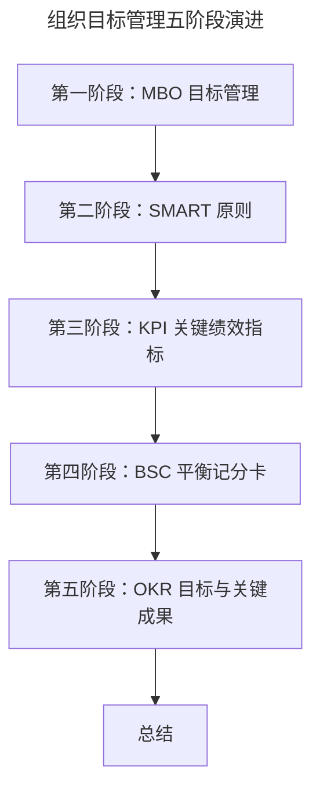

# 目标管理发展：OKR 之前，大家都在用什么管理组织目标？

> **适用范围**：组织管理者、HR、战略与绩效负责人，以及希望系统理解目标管理演进脉络的从业者。
>
> **更新摘要（v2 · 2026-08 更新）**：
> - 结构化升级为 6 节骨架（导言 / 核心方法论 / 关键流程 / 工具与实战 / 常见误区 / 进阶延展）
> - 梳理 MBO→SMART→KPI→BSC→OKR 五阶段演进逻辑与各阶段价值/问题
> - 保留 SMART 原则图与五阶段总结表，为 Mermaid 图补充文字解读

## 1. 导言

咱们的第一课时，我想跟你分享组织目标管理经历的阶段及挑战，以便你能够对各阶段的目标管理方法和实践有一个全局的认识。

2020 年 3 月 12 日，在字节跳动成立八周年之际，张一鸣发布了内部信。在信中，他提道：

> "德鲁克对于目标管理的思考，启发了我们对于组织有效性的重视和 OKR 的实践。"

这句话，有这么几个关键词特别值得我们关注："目标管理""组织有效性""OKR 实践"。我们先来看"组织有效性"。组织是否有效，就在于组织是否实现了目标。所以无论是字节，还是百度、京东、阿里或是腾讯，各个企业只有完成了目标，才有存在的意义，从而一个组织才能有效。

既然目标如此重要，那么我们就要对目标进行管理。一百多年来的管理学发展，都在揭示一个规律：**管理就是为了提高效率**。所以，目标管理的意义就是为了让我们能在组织目标维度，提高目标从制定到落地的效率，而效率一定是跟方法论和优秀实践相关的。从而，我们可以看到诸如 OKR 目标管理实践，从 2000 年以后便席卷了各大互联网公司，并作为非常主流的目标管理方法论发展至今。

那么，提高组织目标管理的效率，难道只有 OKR 这一种实践方法吗？有没有其他的方法和实践的沉淀？接下来，让我们带着这样的疑惑，一起来盘点下组织目标管理都经历了哪些关键阶段。

## 2. 核心方法论

组织目标管理经历了五个关键阶段，每一阶段都对应一种方法论，并解决前一阶段遗留的问题。

### 第一阶段：MBO 目标管理

MBO（Management by Objectives，目标管理）由管理学大师彼得·德鲁克在 1954 年提出，他从实践的角度提醒我们，企业一定要重视和管理目标，否则就会面临效率低下的问题。倘若目标都没有得到重视和跟进，那么组织就无法形成合力，如同一盘散沙，混乱熵增直到消逝于市场竞争。所以，组织中目标管理不仅要成为企业的管理制度、领导方式，还是企业提升绩效的重要保障。MBO 的意义，就是从 0 到 1 提出了目标管理的重要性，帮助我们把组织管理的注意力拎回到起点。

### 第二阶段：SMART 原则

SMART 是 5 个英文单词首字母的缩写，如下所示：

SMART 原则是目标设定的基本原则，换句话说，五个原则如果有一个没被遵守，或是没能做到，那么目标的制定和实现就充满了挑战。比如目标不够具体，就会产生理解歧义；目标不能度量，就没法评价结果好坏；目标制定的不可实现，就是竹篮打水一场空；目标没有相关性，就是偏离了组织目标主航道没法形成合力；目标没有时限，也就没有压力，没有压力成本效率就是问题。正因为 SMART 方法是目标设定要遵守的最基本的五个维度，所以无论是后来产生的 KPI、BSC 还是 OKR 方法也都要求符合目标管理的 SMART 原则。

### 第三阶段：KPI 关键绩效指标

随着组织管理的发展，20 世纪 90 年代，用于组织绩效管理的实践出现了 KPI（Key Performance Indicator）方法。KPI 是对组织战略目标的拆解，且在运用的过程中，KPI 符合一个重要的管理原理——"二八原理"：每个部门和每一位员工的 80% 的绩效结果是由 20% 的关键目标完成的，抓住 20% 的关键，就抓住了主体。

### 第四阶段：BSC 平衡记分卡

和 KPI 同时期出现的，还有平衡记分卡（Balanced Score Card，BSC），BSC 是从财务、客户、内部运营、学习与成长四个角度进行组织战略目标管理的方法，和 KPI 不同的是，BSC 将组织目标的完成和考核进行了系统化的分类。BSC 不仅考虑了财务和非财务的考核因素，也考虑了内部运营和外部客户，同时也有短期利益和长期利益的相互结合。

### 第五阶段：OKR 目标与关键成果

OKR（Objectives and Key Results，目标与关键成果），是一套明确和跟踪目标及其完成情况的沟通管理方法，由英特尔公司前首席执行官安迪·格鲁夫（Andy Grove）发明，其在《格鲁夫给经理人的第一课》一书中诠释了为何创造出了 OKR：

- 我要去哪？答案就是目标（Objective）。
- 我如何能达到哪里？答案就是关键结果（Key Results）。

OKR 将组织目标管理更加结构化，每个目标都是由 O 和 KR 组成，O 是方向，KR 是所选择方向期望达到的关键结果。更重要的是，OKR 对于目标管理的理念突出了灵活性，倡导自驱进行目标设定，自驱给组织贡献更多价值，这正好契合了知识型工作者需要进行自我管理的最大特征。

上图勾勒出组织目标管理的五阶段演进路径：从 MBO 提出"要管目标"的认知，到 SMART 给出"怎么把目标说清楚"的维度，再到 KPI/BSC 解决"聚焦哪些目标"的问题，最后由 OKR 在不确定环境下补齐"灵活、自驱、结构化"的能力。每一阶段都在前一阶段基础上做加法，而非替代。

## 3. 关键流程

理解五阶段的价值与问题，是落地目标管理的关键。

在长期使用 KPI 的组织，KPI 被应用成了业绩考核指标，过分依赖对于数字的考核和关注，让我们失去了对于组织过程管理的重视。比如缺乏了文化、激励、领导以及团队相关的建设，用着用着就变得机械死板，丧失了组织活力。此外，KPI 基于了一个更加重要的基本假设：从上往下拆解战略目标，同时指标也是从上往下对齐分解，如果考核的数字能够达到，组织就能获得成功。该假设忽略了如何让每个人可以为组织创造绩效的可能性。

而 BSC 从多个角度诠释了组织目标完成需要系统的思考，不能单一地看市场规模，还要注重内部效率和成长性。然而，无论是 KPI 还是 BSC，仅仅是帮助我们解决了目标管理需要聚焦，以及目标的选择需要系统化侧重的问题。当下，面对不确定性的环境以及知识工作者的时代，OKR 出现了：其倡导建立灵活、敏捷目标管理响应机制，在整个目标实现过程中，允许根据实际情况对目标内容进行调整和修改，当出现更多机会的时候，我们可以通过新增 OKR 及时管理抓住机会。

## 4. 工具与实战

你可以借助对于这 5 个阶段的理解和应用，让组织的目标管理变得更加有效。比如，在和团队讨论目标的时候，参考 SMART 原则，这样就减少了在制定目标时容易产生的歧义。再如，基于对 BSC 的理解，引导团队去制定关注组织效能和人力资源的指标，因为过程性的这两类指标对于一个团队和组织的长期发展也很重要。

我围绕组织目标管理经历的阶段、价值和问题给你总结成一个表格，方便你回顾和吸收今天的重点内容。

这张总结表把五个阶段的"价值贡献"与"面临问题"并排列出，是判断"自己组织当前处于哪个阶段、下一步该补什么能力"的对照工具。

## 5. 常见误区

最常见的误区是把 KPI 当成目标管理的全部——"唯 KPI 论"。KPI 的基本假设是"指标从上往下对齐分解，数字达到即成功"，这忽略了如何让每个人都可以为组织创造绩效的可能性，也忽略了组织中的每个个体都为组织贡献力量，组织才会更加成功。只看数字、不重过程的用法，会让组织失去文化、激励、领导与团队建设，最终机械死板、丧失活力。规避这一误区的方向，正是 OKR 所代表的灵活、过程化、自驱的目标管理。

## 6. 进阶延展

### 阶段总结

本文带你了解了组织目标管理 5 个重要的发展阶段。组织目标管理经历了 MBO、SMART、KPI、BSC、再到 OKR 的演进，每一阶段都在前一阶段基础上做加法：

- MBO 从 0 到 1 提出目标管理的重要性；
- SMART 给出目标设定的五个基本维度；
- KPI 用"二八原理"聚焦关键指标；
- BSC 从财务/客户/内部运营/学习成长四角度系统化目标；
- OKR 在 VUCA 环境下用结构化、灵活、自驱的方式管理目标。

### 思考题

组织目标管理经历了这么多阶段，如今百度、京东、华为、腾讯、字节跳动、Uber、谷歌等国内外头部公司都在使用 OKR，那么 OKR 到底有哪些理念和特点？它又是如何帮助组织更好管理目标的呢？下一部分我将介绍"为什么互联网公司都在用 OKR？"。
