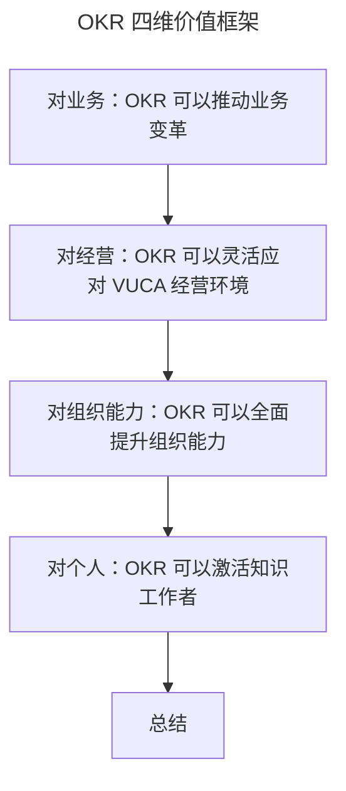

# OKR 价值：为什么互联网公司都在用 OKR？

> **适用范围**：业务负责人、经营管理者、组织能力建设者及希望理解 OKR 价值根因的从业者。
>
> **更新摘要（v2 · 2026-08 更新）**：
> - 结构化升级为 6 节骨架（导言 / 核心方法论 / 关键流程 / 工具与实战 / 常见误区 / 进阶延展）
> - 提炼"业务/经营/组织能力/个人"四维价值框架
> - 保留英特尔、谷歌、微软、京东案例与产研团队调研数据，为 Mermaid 图补充文字解读

## 1. 导言

前文，我们提到，组织目标管理经历了 MBO、SMART 原则、KPI、BSC、再到 OKR 的多个阶段。那么，OKR 作为当下最流行的目标管理方法，它为什么这么火呢？其原因有四：对业务、对经营、对组织能力、对个人，OKR 都能带来独特价值。

## 2. 核心方法论

### 对业务：OKR 可以推动业务变革并支撑业务长期成功发展

OKR 源于英特尔，发扬光大于谷歌，其前期发展都离不开约翰·杜尔（John Doerr）的影子。在英特尔，杜尔参与了公司从存储器转型为微处理器的业务变革，而当时的 CEO 格鲁夫正是通过 OKR 的导入和应用，帮助英特尔管理层和员工设立业务转型的工作目标和优先级，最后成功完成了业务蜕变，奠定了英特尔成为全球芯片行业的领先地位。在谷歌，杜尔作为谷歌早期投资者及董事局成员，在谷歌早期组织管理一穷二白的情况下把 OKR 引入到组织目标的管理中，牵引谷歌发展成为全球市值和品牌效应均名列前茅的搜索引擎公司。

所以，OKR 火起来最重要的原因之一，正是它能在英特尔和谷歌发展起来的"根基"：**OKR 支撑了组织目标的成功落地，可以推动业务成功转型，促成业务的持续成功。**

### 对经营：OKR 可以灵活应对组织经营环境的 VUCA 化

2017 年 10 月份，京东 CEO 刘强东在一篇名为《第四次零售革命下的组织嬗变》文章中提到了组织面临 VUCA 环境的挑战。VUCA 指什么？就是不稳定（Volatile）、不确定（Uncertain）、复杂（Complex）和模糊（Ambiguous）。随着数字化覆盖到我们日常生活、学习和工作场景的方方面面，环境的 VUCA 化变得更加突显，用户需求多元、多变且充满了未知，这就要求组织能够建立更加灵活响应的经营机制来及时跟上用户的变化。

灵活的经营机制，首先就要从组织目标的制定和运转上来进行灵活调整。OKR 的目标管理理念则不同，其倡导建立灵活、敏捷目标管理响应机制。在整个目标实现过程中，允许根据实际情况对目标内容进行调整和修改，当出现更多机会的时候，我们可以通过新增 OKR 及时管理抓住机会。这就是 OKR 为什么这么火的原因之二：**经营环境的 VUCA 化，我们急需一套 OKR 式灵活的组织目标管理方法。**

### 对组织能力：OKR 可以全面提升组织能力，制胜互联网下半场

美团王兴有一段关于互联网上半场和下半场的精彩论述：**上半场靠红利，下半场就得靠组织能力。** 一旦提到组织管理的能力，就离不开领导、激励和文化三个维度的建设。OKR 的工作方式，建立起了基于目标从制定、过程评审，再到闭环的管理流程，拉动了上下级对于目标制定和实现的沟通节奏，定期跟进目标完成过程，互相探讨对于实现工作目标的期望和问题，打造了一个良好的上下级工作关系，提升管理者领导力。此外，OKR 鼓励个体自驱对组织目标进行思考和制定，由 **"要我干"变成"我要干"**，提升了员工执行力。最后，OKR 通晒机制有助于组织沉淀协作、透明、诚信的文化。

这就是 OKR 为什么这么火的原因之三：**OKR 提升了组织中管理、领导、激励和文化建设的能力，有利于组织在互联网下半场的竞争中取胜。**

### 对个人：OKR 可以激活组织中的知识工作者，助力组织绩效突破和创新

对于知识工作者，使用"胡萝卜加大棒"这么简单粗暴的管理方式，会忽略知识工作者创造更高绩效的过程因素，需要给予知识工作者更多的自主和创造空间。OKR 的出现正好契合了知识工作者对于工作更能产生绩效的追求：**鼓励个体自驱为组织目标的完成贡献更多好的想法，甚至鼓励每个人能自发生成新的方向，为组织绩效带来创新和突破**。最后，OKR 基于组织目标和个体自驱目标的完成情况，通过综合评价绩效结果来进行人员激励和晋升。这就是 OKR 为什么这么火的原因之四：**OKR 激活了组织中的知识工作者，为组织带来更多绩效创新和突破。**

上图把 OKR 的"火"拆成四个递进的视角：业务（能否促成转型与持续成功）→ 经营（能否应对 VUCA）→ 组织能力（能否提升管理/领导/激励/文化）→ 个人（能否激活知识工作者）。四者由外向内、由宏观到微观，构成完整的 OKR 价值闭环。

## 3. 关键流程

以京东的实战为例，可以看到 OKR 灵活响应经营变化的流程价值。在京东内部，原本有着一套用于目标管理的绩效合同（即 KPI）。然而这套绩效合同的制定节奏是每三个月一次，且中途不允许随意变更，这就导致了我们缺乏管理不确定性的能力。甚至说，由于计划赶不上变化，每个季度末基于 KPI 型目标管理的绩效结果，跟实际的工作内容和产出已经大相径庭，根本无法通过 KPI 来反映组织真实的经营结果。

比如，京东在拓展 2B 业务时，2020 年 8 月中下旬开启了和北汽的合作，并把这个合作目标拆解到了我所在的部门。但在 7 月初制定 Q3 季度部门 KPI 时，与北汽合作这个经营目标还没有发生，像诸如此类的经营目标变化，都可以用 OKR 及时管理起来。Q3 季度末进行绩效评估的时候，就能结合 OKR 整体把握部门和组织的经营绩效结果。这样，我们就能通过 OKR 帮助组织敏捷地管理经营目标，灵活获得绩效，而非 KPI 的僵化管理。

## 4. 工具与实战

我曾在京东一个产研部门做过一个测试，让大家写出驱动自己工作的主要动力有哪些？后来获得的数据显示，作为一个全部以知识工作者为主的软件产品开发团队，其排名前三最能驱动自己工作的动力为：**要有目标感、要获得成长、要有更多自主性**。其中，对于自主性，大家就是期望能有更多自主决定做事的权利，而不是什么事都被他人管控、被牵着鼻子走。

这一调研数据直接对应了 OKR 对个人的激活路径：明确的目标感对应"O 从目标出发思考工作起点"，成长对应"综合评价绩效进行晋升和认可"，自主性对应"鼓励自驱目标与实现路径自决"。这构成了用 OKR 激活知识工作者的可复用实践模型。

在组织中落地时，季度初制定个人绩效目标时，确实需要从上往下对齐战略目标，但是**如何实现这个目标，就倡导员工自己拿主意想办法，管理者在一旁给予支持和帮助，而不是强加干涉，说一言堂**。除了从上往下对齐的战略目标，也鼓励大家制定完全自驱的目标，只要对组织有价值就行。季度末给员工打绩效时，不仅参考和战略对齐的目标完成情况，也参考大家自驱目标的完成情况，来进行绩效的综合评价。

## 5. 常见误区

最常见的误区是对知识工作者继续沿用"胡萝卜加大棒"（做得好就给奖励，做得不好就惩罚）的简单粗暴管理方式。这会忽略知识工作者创造更高绩效的过程因素，压制他们需要的自主和创造空间。另一个误区是引入 OKR 后仍用 KPI 考核激励、用 OKR 装点门面——由于激励会引导群体行为，组织只会继续认 KPI，OKR 形同虚设。正确姿势是：把激励设计与 OKR 绑定，让自驱目标也进入综合绩效评价。

## 6. 进阶延展

### 总结

以上，我分别从业务、经营、组织能力和组织个人的四个视角，和你介绍了 OKR 为什么这么火的四个原因，这也是互联网公司为什么都在用 OKR 的根因：

- 对业务：推动业务变革并支撑业务长期成功；
- 对经营：灵活应对 VUCA 化的经营环境；
- 对组织能力：全面提升管理、领导、激励和文化建设能力；
- 对个人：激活知识工作者，带来绩效创新和突破。

### 下节预告

OKR 除了以上的价值，在 O+KR 的结构中还隐藏了一个大招，这个大招是什么呢？下一部分我将介绍"OKR 如何解决组织增长的问题"。
