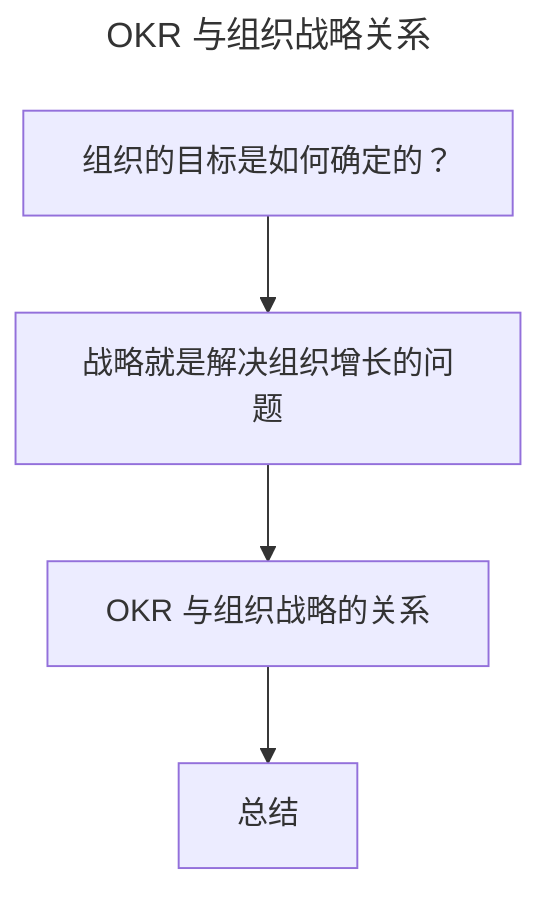

# OKR 与战略：OKR 如何解决组织增长问题？

> **适用范围**：决策层、战略负责人、部门负责人，以及希望把 OKR 与组织战略打通的实践者。
>
> **更新摘要（v2 · 2026-08 更新）**：
> - 结构化升级为 6 节骨架（导言 / 核心方法论 / 关键流程 / 工具与实战 / 常见误区 / 进阶延展）
> - 提炼"愿景—使命—核心能力—战略—OKR"的贯通逻辑
> - 保留京东零售与百度李彦宏 OKR 案例，为 Mermaid 图补充文字解读

## 1. 导言

如上一节所说，OKR 之所以火，互联网公司为什么如此热衷 OKR，是因为 OKR 可以帮助我们在 VUCA 环境下取得更好的经营效果，并能激活组织中的个体。那么，组织中需要管理的目标到底跟什么相关？OKR 又是如何解决组织增长问题的呢？这两个问题如果不思考清楚，再好的目标管理方法和实践，可能只是在形式上做文章，而不能真正解决组织长期发展的根因问题。

## 2. 核心方法论

### 组织的目标是如何确定的？

组织经营者在从事一项事业时都应该有自己的经营理论，这个经营理论首先需要解决三个基本问题：

- 一是组织的愿景是什么？
- 二是组织的特殊使命是什么？
- 三是完成组织使命所需的核心能力是什么？

> **愿景（Vision）**：组织最终想要去往的目的地，走向的远方，在大环境中想要的角色和定位。
> **使命（Mission）**：是一个组织因为什么而存在，是一个组织存在的价值理由，是支撑愿景实现的价值取向。
> **核心能力（Core Competence）**：细分领域所拥有的知识和技术沉淀，正是因为拥有了核心能力，组织履行使命才能有保障。

给你举个京东案例。

- 京东的愿景：成为全球最值得信赖的企业。
- 京东的使命：技术为本，致力于更高效和可持续的世界。
- 京东的核心能力：以供应链为基础的技术和服务公司。

京东的愿景，就是京东想要在整个行业和环境中的定位，是京东的终极奋斗目标。使命是京东实现愿景的价值基石，不能让世界变得高效和可持续，京东便没有存在的意义。最后，供应链是京东的核心能力，正是因为供应链的核心能力，才能让京东履行使命有保障，供应链是京东业务选择所依赖的能力基础，用来指导未来业务的扩展和创新方向。

所以，我们可以发现，组织长期目标对应的就是组织的愿景，而阶段性支撑愿景实现的目标就是基于组织核心能力的选择，我们常把这个选择称作战略（Strategy）。

### OKR 与组织战略的关系

首先，我们把目标管理 OKR 方法进行结构化展开：

> OKR = Objective + Key Results

Objective 就是目标，Key Results 就是多个关键结果。结合本文上两个小节的分析，OKR 中的 O 对应的其实是战略确定的组织目标，KR 则对应的是所选战略方向的增长指标，即：

> OKR = 战略方向（O） + 多个增长指标（KRs）

上图把全文的逻辑链串起来：先回答"目标从哪里来"（愿景/使命/核心能力），再回答"战略解决什么"（增长），最后落到"OKR 如何承载战略"（O=战略方向，KR=增长指标）。这条链是判断 OKR 是否真正对齐战略的检查路径。

## 3. 关键流程

### 战略就是解决组织增长的问题

2020 开年，京东零售 CEO 徐雷进行了演讲，其确定了京东零售的主基调就是"有质量的加速增长"，并表示："不成长便退场，加速增长是我们的必然选择。2020 年，京东零售将在交易额、收入、用户、利润这四大核心指标上均实现加速增长。"而围绕增长主基调，京东所选择的三大必赢之战分别是：全渠道、下沉新兴市场和平台生态。在京东，战略选择的方向，内部被称为"必赢之战"。

从京东零售 CEO 徐雷的分享中，我们可以得到三个非常重要的对应关系：

- 战略确定了组织目标方向，对应了上述的三大必赢之战；
- 所选择的业务方向需要解决增长的问题，这就是上述提到的主基调；
- 增长体现在指标上，对应了上述"四大核心指标"。

我们把这三个对应关系串成一句话：**由战略确定的组织目标，需要帮助组织解决增长的问题，并把增长反映在多维度的指标上。**

在这里，我想提醒你：作为一个商业组织去实现战略目标（增长），还要匹配相应的能力。这个能力包括业务能力和人员的能力，以及组织文化、效率等方面的考虑。所以战略所选的方向以及带来的增长仅围绕交易额、收入、用户、利润这四大核心指标是不够的。也就是说，我们不仅需要关注财务的指标，也要关注非财务的指标，不仅要关注业务上的，也要关注组织上的。

## 4. 工具与实战

接下来，我给你举一个百度李彦宏的 OKR 案例，看看 OKR 是如何与百度战略目标相匹配，又是如何支撑组织目标增长的。

2019 年春节前夕，百度元老崔珊珊在百度内部掀起了一场 OKR 变革风暴，这场风暴席卷了从最高决策层到最基层的几乎所有百度员工。作为百度的掌舵人，李彦宏也在第一时间为自己制定了 OKR：

通过李彦宏的 OKR，我帮你做以下三点分析：

- 作为百度创始人兼 CEO，李彦宏的目标（O）就是百度的战略方向，一共包括了三个战略：打造移动生态、跑通 AI 商业模式以及提升组织能力。
- 李彦宏的三个目标（O）中，**不仅仅包括了移动生态和 AI 赛道的业务目标，也包括了提升组织能力维度的非业务目标。** 换句话说，组织战略方向的选择不能仅仅局限于业务方向，也需要综合考虑组织能力的方向。
- 李彦宏的每个目标（O），都有对应的 3 个 KR，3 个 KR 就是 3 个维度的增长量化结果。也就是说，每个战略方向，都需要制定多维度的增长指标。

这就是 OKR 与组织战略目标的关系，O 是选择的战略方向，KR 是所选方向的增长量化结果。每个组织会有多个战略方向（O），每个战略方向会有多个增长指标（KR）。

## 5. 常见误区

一个常见误区是：把战略增长等同于"四大核心指标（交易额/收入/用户/利润）"这类纯财务指标。这种做法忽略了非财务指标（组织优化、文化建设、人才管理）对"有质量的增长"的支撑作用。另一个误区是：战略方向只选业务型 OKR，忽略组织能力型 OKR。百度李彦宏的 OKR 中"提升组织能力"作为第三个 O，正是反例——战略方向必须兼顾业务型与非业务型，否则增长不可持续。

## 6. 进阶延展

### 总结

本文，我主要帮你解答了三个核心问题。

- **通过什么方式来确定组织长短期目标？** 组织长期目标对应的就是组织的愿景，而阶段性支撑愿景实现的目标，就是基于组织核心能力的选择，而这个选择就是组织的战略。
- **战略解决了组织什么核心问题？** 战略要帮助组织解决增长的问题，并把增长反映在多维度的指标上。但要注意：战略的选择以及带来的增长我们不仅仅需要关注财务的指标，也要关注非财务的指标，不仅仅要关注业务上的，也要关注组织上的。
- **OKR 与组织战略的关系是什么？** O 是选择的战略方向，KR 是所选方向的增长量化结果。每个组织会有多个战略方向（O），每个战略方向会有多个增长指标（KR）。

### 思考题

你所在公司的使命愿景是什么？阶段性战略又是什么？战略如果继续拆成 OKR，你们会拆解成几个 O，几个 KR 呢？
