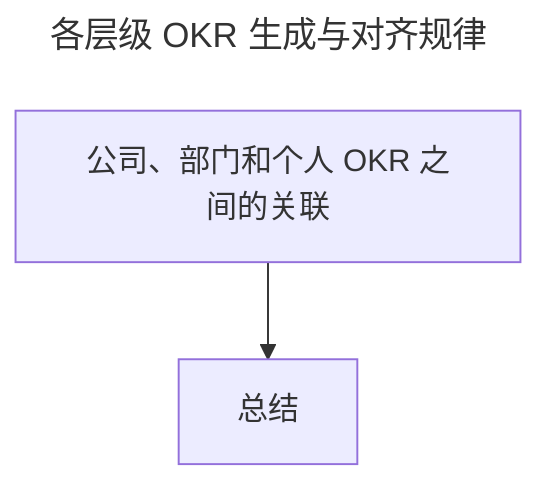

# OKR 生成：各层级的 OKR 要遵循什么规律？

> **适用范围**：组织各层级管理者、OKR 教练、HR，以及需要制定个人 OKR 的一线员工。
>
> **更新摘要（v2 · 2026-08 更新）**：
> - 结构化升级为 6 节骨架（导言 / 核心方法论 / 关键流程 / 工具与实战 / 常见误区 / 进阶延展）
> - 提炼"公司级—部门级—个人级"三层 OKR 生成与对齐规律
> - 保留京东平台生态部战略会与个人 OKR 表格案例，为 Mermaid 图补充文字解读

## 1. 导言

前文，我介绍了 OKR 的应用可以帮助我们更好地管理和制定组织战略目标，通过 OKR 的结构化拆解去解决战略所要的增长问题。那么，当一个组织战略确定后，我们是如何通过层层对齐和拆解，帮助组织战略落地的呢？这个时候我们就要掌握 OKR 在组织中各层级的生成规律。掌握组织中不同层级 OKR 的生成和对齐规律，有利于我们制定支撑组织战略和对于组织有价值的 OKR，否则组织从上到下就无法形成合力，战略落地也就存在挑战。

## 2. 核心方法论

### 公司、部门和个人 OKR 之间的关联

在 2019 年，我帮助京东平台生态部主持了一次战略会，在现场，部门 VP 以及各个二级部门负责人进行了非常富有成效的探讨，最终产出了部门的多个战略方向：

> O1：构建自营生态
> O2：构建店铺价值
> O3：打造平台价值主张
> O4：多样化平台治理
> O5：提升平台基础能力
> O6：赋能商家，提升效率
> O7：提升组织协同能力
> O8：促进商家成长

我们通过战略会的共识，产出了生态部 8 个战略方向，也就生成了部门 8 个维度的 O。此外，战略会上，部门 VP 也谈及到了京东零售的四大必赢之战：

> O1：下沉市场
> O2：全渠道
> O3：平台生态
> O4：大中台

京东零售的四大必赢之战也就是京东零售的四个战略方向，对应着，就是生成了公司层面 4 个战略维度的 O。其中的平台生态方向就是指我们部门的业务。最后，我作为京东平台生态部的一员，我希望帮助部门做好敏捷和 OKR 转型来提高组织的效能，所以再来看看我个人在 2019 年的 3 个工作方向：

> O1：提升京东敏捷影响力
> O2：提高产研效能
> O3：落地 OKR 方法

至此，我给你介绍了 3 组 OKR 的案例。案例中不仅有公司层级的战略方向，也有部门维度的战略目标，还涉及了个人的工作方向。为了更好地诠释他们之间的关系，我画了一张示意图：

一个公司由于组织架构和层级的存在，至少有三个层级的 OKR。如果用以上的案例来对应，那么公司级 OKR 就对应着京东零售的 4 个必赢之战，部门级 OKR 对应着平台生态部门的 8 个战略方向，个人 OKR 则对应我自己的 3 个工作方向，具体可以用下图来表示。

而且，这三个层级的 OKR 互相影响，互相支撑。京东零售 4 个必赢之战包含了平台生态的业务方向，也就是说公司级制定的战略方向影响着部门级的战略制定，而作为平台生态部的 8 个方向之一的"提升组织协同能力"则与我制定的 3 个工作方向息息相关。平台生态部的其他方向则由其他负责人认领并具体 OKR 化，至于每个 O 中包含的多个 KR 内容，则需要持续沟通达成共识即可。

上面这张图系统化呈现了各个层级的 OKR 制定和上下对齐的把控，可以让组织刚性的战略目标落地不偏移，这也是我们要掌握的公司、部门和个人 OKR 的生成和关联规律。

上图虽然是精简结构，但承载了全文核心：OKR 的生成规律在于"公司级→部门级→个人级"三层互相影响、互相支撑，靠上下对齐与横向支撑让战略落地不偏移。

### 业务型与非业务型 OKR

除了主持过部门战略会，在一次和 HR 合作的制定 OKR 工作坊上，我带领平台生态部 HR 侧的小伙伴产出了 HR 部门的工作方向：

> O1：引进高职级人才
> O2：提升员工专业力和通用力
> O3：建设和传播文化
> O4：沉淀组织机制

当时做完工作坊，我很诧异，HR 的工作方向竟然和上述公司级以及部门级战略方向并不一致，这是为什么呢？

一个商业组织最重要的是要有核心的业务能力定位，并通过该核心业务能力来确定战略，选择业务的增长方向。然而，组织中一个业务目标的实现，最终靠的还是人，所以组织中人员能力的持续提升以及影响人行为的文化的持续建设对于组织的长期发展也很重要。我把这部分职责划给了 HR 部门，在京东属于 CHO 体系。再换句话说，京东零售的战略目标是公司级的业务增长 OKR，一般由公司 CEO 来关注并确立；而 HR 侧小伙伴的 OKR 是非业务型的增长 OKR，属于 CHO 体系的战略目标，一般由公司 CHO 来关注并确立。只是从优先级上来说，一个公司的业务型 OKR 肯定比非业务型 OKR 重要，但这两者都缺一不可。

所以，OKR 生成的另外一个规律，就是组织中 OKR 的类型不仅包括了业务型，也包括了非业务型。但无论是哪种类型 OKR，最终落地都要靠人去执行。

## 3. 关键流程

### 个人 OKR 的生成规律

个人 OKR 的制定，可以有上下对齐、自驱以及外部支撑三种来源。为了帮你更好地理解这个生成规律，我依旧列举个人的案例来进行说明。

| 我的上级 OKR 示例 | |
| --- | --- |
| O1：产研效能提升 | KR1：敏捷成熟度达到85分 |
| | KR2：敏捷团队OKR覆盖度80% |
| | KR3：需求平均交付时长为32天 |
| | KR4：重点接口自动化覆盖达70% |
| O2：业务组件化建设 | |
| O3：平台生态核心项目支持 | |
| O4：商品平台能力提升 | |

如上表，我的上级 OKR 包含 4 个 O，我把 O1 进行了具体描述，分为了 4 个 KR。接下来，来看一下我的 OKR：

| 我的OKR示例 | |
| --- | --- |
| O1：通过敏捷能力建设，提高产研运团队的产品需求交付效率 | KR1：通过 Scrum 方法、Kanban 方法、敏捷需求实践3个维度的敏捷能力建设，每个季度保证 24 个敏捷团队的敏捷能力达 85 分 |
| | KR2：对每个季度的敏捷能力评估得分较低的团队进行辅导，每周持续跟进2个团队的改进措施并以邮件的形式进行改进的跟踪和落地 |
| O2：OKR工作法落地和执行，保证业务目标高质量增长 | KR1：通过季度初 OKR 制定-季度中 OKR 评审-季度末 OKR 闭环评价的流程落地，帮助整个部门 OKR 的应用覆盖达到 80% |
| | KR2：在本季度通过 5 场培训和 20 场团队级 OKR 辅导，培养 10 名团队级后续能带领团队独立运转 OKR 工作法的 OKR 教练 |
| O3：通过多元化的方式，提升部门和京东的敏捷影响力，并赋能其他部门提升敏捷和OKR的应用能力 | KR1：对京东外，通过图文、视频等多元化的方式，每月产出一个敏捷类 /OKR 类文章，每个文章在微信域平均阅读 UV300 以上 |
| | KR2：对京东内，以线上/线下的方式，给京东兄弟部门分享培训敏捷/OKR 方法，每月至少一次 |

我的 OKR 则包含了 3 个 O，每个 O 继续拆解成了 2 个 KR。从上级和我的 OKR 中，我们可以得出以下个人 OKR 的生成流程：

1. **个人的 OKR 部分来源于上级的 OKR 拆解**：上级 O1 中 KR1 的敏捷成熟度和 KR2 的 OKR 覆盖度对应着我的 O1 和 O2，我从上往下对齐形成的个人 O1 和 O2 继续拆解成能支撑这两个目标完成的 KR。
2. **个人的 OKR 部分来源于个体职责的自驱**：我 O3 中提到的提升敏捷影响力，上级的 O 是没有该方向的，所以个人 O3 中的敏捷影响力的塑造是基于本人能力以及组织的发展，完完全全是自驱希望给组织带来的绩效价值。
3. **个人的 OKR 部分来源于对外部的支持**：在京东内部有很多部门会找我去培训敏捷和 OKR 方法，对应着我在 O3 中提及的赋能其他部门能力提升方向，这一类的 OKR 就属于外部支撑型。

这就是生成个人 OKR 的规律，当工作中个人去制定 OKR 时，**需要注意从上往下的对齐拆解以及横向的支持**，并能基于自己的能力自驱给组织创造额外的绩效价值。

## 4. 工具与实战

个人 OKR 生成规律可直接作为工作坊模板使用：在制定季度 OKR 时，把"上级 OKR 拆解""岗位职责自驱""外部支持"作为三栏，分别填写候选 O，再合并共识。这样既保证纵向对齐战略，又给自驱和外部协作留出空间。京东的实践表明，通过这种三来源生成法，OKR 鼓励挑战和自驱的理念才能真正落地——员工不再只是"接活"，而是主动定义对组织有价值的方向。

## 5. 常见误区

一个典型误区是：把个人 OKR 完全等同于上级 OKR 的拆解，忽略自驱和外部支撑。这种做法会让 OKR 退化为任务分派，丧失激活个体的作用。另一个误区是：看到某个部门目标和公司战略"不一致"就认为对齐失败——实际上 HR、CHO 体系的目标属于非业务型 OKR，本就与业务型 OKR 互补而非直接对齐。判断对齐的标准不是"字面一致"，而是"是否共同支撑组织长期发展"。

## 6. 进阶延展

### 总结

今天我和你分享了我亲身经历的 OKR 产生过程，揭示了组织中各层级 OKR 的生成规律。概括起来，就是以下这 3 个重要结论：

- 组织中各个层级的 OKR 互相影响，互相支撑。如果各层级各自做各自的，就无法通过 OKR 帮助组织战略目标更好地落地。
- 战略目标分业务型和非业务型，OKR 的生成也对应着有业务型 OKR 和非业务型 OKR。组织中，不仅要关注业务型 OKR 的制定和落地，也要关注组织发展和能力建设的 OKR。
- 个人 OKR 由三个部分生成，分别是：与上级 OKR 对齐拆解、个体岗位职责自驱、外部支持相关。

### 思考题

在你的组织中，是通过什么方法来让战略目标从上往下对齐落地的呢？又是采取什么方式去制定个人目标呢？你的组织在制定战略方向时关心组织能力建设吗？在掌握了 OKR 生成的规律后，你是不是已经迫不及待地想要写一写 OKR 了？别急，写 OKR 也有很多要点。下一部分我将介绍"怎么样才能写好 OKR"。
