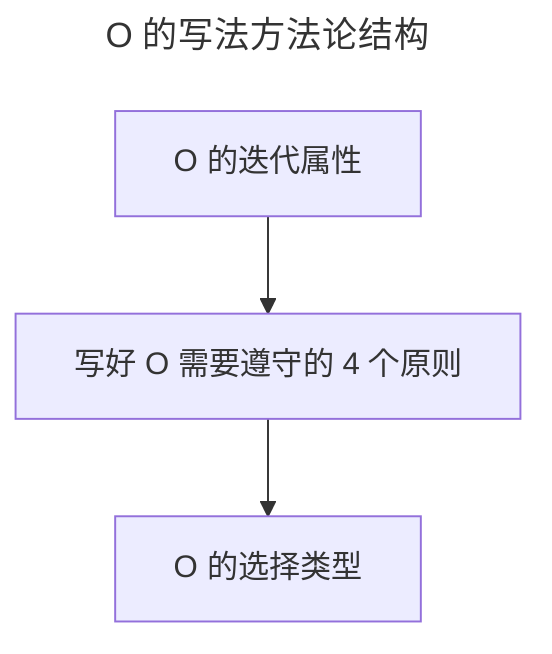

# O：什么样的 O 得领导赏识？

> **适用范围**：需要编写 OKR 的个人贡献者、Team Lead、业务与技术负责人，以及辅导团队写 OKR 的管理者。
>
> **更新摘要（v2 · 2026-08 更新）**：
> - 结构化升级为 6 节骨架（导言 / 核心方法论 / 关键流程 / 工具与实战 / 常见误区 / 进阶延展）
> - 提炼 O 的迭代属性、4 个写作原则与 4 种价值类型（营收/用户/效率/能力）
> - 保留快手 K3 战役与京东业务/技术负责人 OKR 案例，为 Mermaid 图补充文字解读

## 1. 导言

在上一节，我给你介绍了组织中各个层级的 OKR 生成规律。通过该规律，可以帮助我们在制定 OKR 时，保证和组织的战略对齐并通过额外的自驱方向来支撑组织发展。那么，一旦涉及某个具体的 OKR，选择哪些 O 对于组织是有价值的，有没有规律可循？有没有"万能公式"，来帮助我们更高效地编写 KR 呢？这就是接下来我要帮你解决的问题。

首先，我们来看一个快手的 OKR 案例。2019 年 6 月 18 日，一场在快手内部被称作"K3"的战役正式打响，创始人宿华和程一笑在全员内部信中表达了对公司现状的不满，并给出了"战斗"的明确目标：2020 年春节前后，3 亿 DAU。随后，快手采取了一系列的行动来完成 K3 目标，如果把快手的 K3 目标 OKR 化，可以梳理成如下所示：

> O：通过"K3"战役，在 2020 年春节前后，快手达 3 亿 DAU。
> KR1：依靠**极速版**，春节前 DAU 峰值突破**3 亿。**
> KR2：通过**丰富垂类内容、大量签约 MCN、进行活动策划和运营、给予流量扶持**等做法来保持留存率，保证春节前 DAU 峰值突破**3 亿。**
> KR3：依靠**春晚红包**，春节后三个月 DAU 平均值达到**3 亿**。

这是一个典型的 OKR 写法，**通过 O 来描述我想要做什么，然后对应着 3 个具体的 KR 来支撑 O 的实现。** 我相信，看过 2020 年春晚的同学一定会知道，快手和春晚确实是通过红包的形式展开了合作，并且给快手拉新了大量的用户，这就是其中 KR3 的落地。

## 2. 核心方法论

### O 的迭代属性

对于目标，我们很少有人能在一开始就思考得非常清楚，总是感觉做着做着，目标才渐进明细，这其实就是 O 的基本属性——迭代属性。我通过列举个人 2020 年 Q1、Q2 和 Q3 季度某个 O 的 3 种写法来说明：

> Q1 该 O 的描述：京东 OKR 工作法落地和执行，帮助全部门高质量完成业务目标。
> Q2 该 O 的描述：京东 OKR 工作法落地和执行，高质量完成业务目标，灵活进行组织绩效管理。
> Q3 该 O 的描述：京东 OKR 工作法落地和执行，高质量完成业务目标，灵活进行组织绩效管理，并激活组织中的个体。

这三个 O 其实属于同一个方向。但你会发现，每一个 Q 我的描述都会变，因为随着时间的推移，我对 OKR 方法实践理解的加深，会发现这个方向越来越多的价值，从而对于 O 的描述也在迭代升级。所以，我们个人在写 O 时，不用纠结于一次性就想写得完美，可以及时修改（立马想到就立马改），也可以定期修改（每周或每月迭代），让描述逐渐变得更加准确。

### 写好 O 需要遵守的 4 个原则

我们在写 OKR 中的 O 时，需要遵守这 4 个原则：纵向和横向对齐、本季度切实可行、聚焦性以及需要融入自驱&挑战理念。

#### 1. 纵向和横向对齐

O 需要对齐组织或者部门从上往下拆解下来的战略方向，我把上下级方向上的一致性称为"纵向对齐"，有了纵向对齐才能让组织中的战略落地。此外，个人的工作当中，有很多需要外部支援的事情，我把这种外部依赖和支持的方向称为"横向对齐"。

#### 2. 本季度切实可行

国内大部分包括京东在内的组织都是按照季度来制定的，所以我们每季度中所写的 O 要能在本季度可执行，不能执行的就不要写。**本季度努力一把是够得着、达得到的**，而不是制定根本就完成不了的"虚荣目标"。

#### 3. 聚焦性

根据我在京东带领部门进行 OKR 工作法转型的经验来看，我们每个人 O 的数量在 2~5 个是相对合理的。一个季度只有一个 O，那工作量的饱和度会有问题；但一个季度设定的 O 过多，则又会出现不聚焦的情况，最后就会导致这么多 O 都没做出好的效果。

#### 4. 融入自驱&挑战理念

在 O 中倡导鼓励包含自驱&挑战的方向，**不能说老板让我做什么我才做什么，只完成老板布置的任务，要能自发着去挑战其他一些额外的对组织有价值有突破的工作。**

华为创始人任正非曾说"方向大致正确，组织必须充满活力"。这句话，正好对应了我们上述内容。

上图把 O 的写法拆成三步递进：先理解 O 的"迭代属性"放下完美主义，再用 4 个原则约束写法质量，最后用价值类型指导 O 的选择。三者构成"心态—约束—选型"的完整方法论。

### O 的选择类型

我列举业务维度和技术维度的两个案例，来说明选择什么样的 O 对于组织才是有价值的。

这是京东某业务负责人 Q2 的 O（负责京东 ISV 开放业务），在其 Q2 的 OKR 制定中，写了 4 个方向的 O。

如果更加概括地来分析这 4 个方向，我们可以发现：O1 最终目的是提升 GMV，即营收方向；O2 围绕的是业务能力建设和提升方向；O3 还是在说商业化的事，只不过 O1 是商家侧的营收，而到了 O3 是 ISV 的营收；O4 则与 618 备战相关，最终目的是提升用户体验。总结下来，该业务负责人 O 的方向聚焦在这 3 类：营收型、能力提升型以及用户型。

接下来，我们再来看一个技术负责人的案例。该技术负责人是负责前端开发团队的管理和专业化能力提升，在其 Q2 的 OKR 制定中，写了 3 个方向的 O。

我们依旧来概括性地分析下这 3 个方向：O1 的目的是团队成员的成长，其实就是提升员工能力；O2 的目的是通过建能力，来提升开发效率，并为了用户体验；O3 中的商家也就是用户，那么目的也是为了提升用户体验。总结下来，该技术负责人 O 的方向聚焦在 3 个类型：能力型、效率型和用户型。我把以上两个典型案例的方向进行汇总，就形成了 O 的 4 种类型：

- **营收型**：比如案例 1 中提到的提升商家 GMV 和 ISV 商业化金额。
- **用户型**：比如案例 1 中提到的 618 备战，提升用户购物体验，以及案例 2 中提升用户使用页面的体验。
- **效率型**：比如案例 2 中提到的开发效率。
- **能力提升型**：比如案例 1 中提到的提升业务能力以及案例 2 中提到的提升员工能力。

这 4 个类型，其实就是组织绩效的构成。**一个商业组织，不仅仅要能营收，也要关注用户价值，不仅仅要内部效率，也要关注能力的沉淀和提升**。

## 3. 关键流程

如果我们要从这 4 种 O 的类型中进行优先级排序，显而易见，对于商业组织而言，营收是第一位的。如果没有营收，那么一个组织就很难长期存活，从而就没有足够的资金投入来持续提升用户体验、持续效率提升和能力沉淀。

排在第二位的是用户型的 O，一个商业组织能营收是因为持续解决了用户的问题，给用户带来了持续的价值和好的体验，从而用户才愿意持续为组织提供的产品&服务付费，这些会反应在用户满意度、用户量等方面。

最后，在有了营收和能持续为用户提供价值的基础上，组织需要不断关注效率和组织能力的提升，成本效率决定了组织的市场竞争力，而能力的提升则有助于效率提升。但是，能力的沉淀和培养是长期的，朝夕间并不能看到效果。那么我们在选择 O 时，如果立马能给组织带来效率提高，优先级一定高于长期的能力培养。

**所以，当你在写 O 时，选择从营收、用户、效率和能力提升 4 个类型入手，一定对组织的经营和发展有价值。如果在 4 个类型中，再做出取舍，我建议你 O 选择的优先级是：营收型＞用户型＞效率型＞能力提升型。**

## 4. 工具与实战

把"4 个写作原则 + 4 种价值类型"组合起来，就是一张可复用的 O 编写检查表。写完 O 后逐项自检：是否纵向横向对齐？是否本季度可达？数量是否在 2~5 个？是否含自驱&挑战？属于哪类价值类型？若四个类型都没覆盖，要警惕目标组合的失衡。京东测试团队的案例很有代表性：某人在 Q3 OKR 中不仅定了上级所要求的既定测试任务的 O，还自驱制定了"精准测试"这一测试专业化能力提升的 O——这就是把"自驱&挑战"原则与"能力提升型"类型结合的实战范例，整个组织中的个体由此被盘活。

## 5. 常见误区

- **追求一次性写完美的 O**：违背 O 的迭代属性，导致迟迟不下笔或反复推翻。正确做法是先写下来，随实践理解加深再迭代。
- **O 的数量失控**：要么只写 1 个导致不饱和或颗粒度过大，要么写 7~8 个导致不聚焦、资源分散。
- **只承接老板布置，无自驱方向**：让 OKR 退化为任务清单，丧失激活个体的价值。
- **O 全部偏向一类价值**：比如全是能力提升型、无营收/用户型，目标组合与组织经营脱节。

## 6. 进阶延展

### 结语

到此，相信你已经了解了怎么样才能写好 O，也对自己的工作方向想到了新的 O。O 的方法论可以浓缩为：接受迭代属性 → 遵守 4 个原则（对齐/可行/聚焦/自驱挑战）→ 从 4 种价值类型中选择并排序（营收＞用户＞效率＞能力提升）。

### 下节预告

在掌握了 O 的写法之后，小伙伴是不是会问 KR 又是怎么写的呢？下一部分，我将给你介绍一个写好 KR 的万能公式，通过这个万能公式，你写 KR 就再也不用"愁"了。
