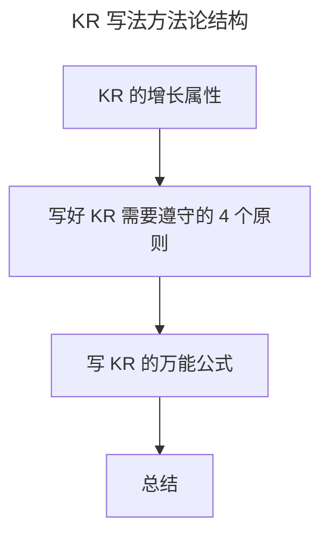

# KR ：写好 KR 的万能公式

> **适用范围**：需要编写 KR 的业务、技术、产品、运营同学，以及辅导团队写 OKR 的 OKR 教练与管理者。
>
> **更新摘要（v2 · 2026-08 更新）**：
> - 结构化升级为 6 节骨架（导言 / 核心方法论 / 关键流程 / 工具与实战 / 常见误区 / 进阶延展）
> - 提炼 KR 的增长属性、4 个写作原则与"万能公式"最终形态
> - 保留微软战略权重、快手 K3、百度李彦宏 KR 案例，为 Mermaid 图补充文字解读

## 1. 导言

在前文，我介绍了 O 的写法，而 OKR 是 O+KR 的组合，KR 作为如何完成 O 的关键支撑，不仅需要有具体的实现路径和方式，也需要有量化结果。而对于 KR 的应用和写法，我们大多数人了解的是要做量化的工作，但我首先要和你分享的是 KR 对于组织和业务发展特别重要的一个属性：**增长**。

## 2. 核心方法论

### KR 的增长属性

2018 年 11 月 23 日，时隔十年之后，微软市值再超苹果，重回世界第一。错过移动时代的微软能有如此的成就，是因为在萨提亚·纳德拉（Satya Nadella）2014 年上任微软 CEO 后，进行了一系列变革，为了匹配战略转型，微软也进行了激励制度的调整。在其现金奖金的激励占比中，设置的战略指标权重如下：从三个维度的权重来考核战略效果——产品与策略占比 16.67%；客户与利益方占比 16.67%；文化和组织占比 16.66%。可以看到，微软对于战略的选择，没有仅仅局限于偏向业务的产品与客户，而是把文化和组织也纳入了战略制定的维度。

**而战略就是要解决组织增长的问题，即战略思维就是增长思维。** 那么承载微软组织和业务发展的增长落脚点，就落实在 KR 中。比如，从微软发布的 2019 年第四财季财报上我们可以知道，其生产率和业务流程业务收入增长至 110 亿美元，智能云业务收入增长至 114 亿美元，个人计算业务收入增长达到 113 亿美元。这些增长结果，如果用 OKR 来管理微软的战略目标，就需要体现在 KR 中，这就是 KR 最重要的增长属性。

KR 的增长属性对于组织发展毫无疑问是重要的，**一个组织失去了增长性，就代表着财务、用户的增长停滞，内部效率和组织能力的提升停滞**，如此在竞争中就会失去优势，渐渐被市场淘汰。所以，我们在写 KR 时，需要牢记 KR 要能回答组织增长，这个增长属性不能丢。

### 写好 KR 需要遵守的 4 个原则

为了让你能更好地理解 KR，我列举了 3 个 KR 案例：

> 案例1：通过每两周拍摄 1.5 个短视频的方式来记录所有敏捷团队的敏捷过程，在微信领域每个视频平均阅读和传播达到 UV300 以上
> 案例2：Q2 通过京粉为京东主站拉新 1000 万
> 案例3：依靠快手极速版，春节前 DAU 峰值突破 3 亿

#### （1）过程量化且结果量化

KR 的量化不仅包括了过程量化，也包括了关键结果的量化。过程量化就是指"拍摄 1.5 个短视频的方式""京粉""极速版"，简单来说就是指具体实现关键结果的路径、举措或者方式。结果的量化就是"UV 达 300 以上""拉新 1000 万""DAU 突破 3 亿"。但在日常工作中，比如产研团队的阶段性工作内容，并不能直接用数值量化，可以通过"时间+产出"的形式进行量化。比如某个功能或者版本是 2 月底上线，但是运营的节奏是安排在 3 月，3 月份可能才会出业务效果数据，那么研发部 2 月份制定 OKR 的 KR 可以写成"在 2 月底，完成 XX 功能的上线"。项目型 OKR 也是同样，可用"项目里程碑+产出"的形式来写，比如"在 6 月份，完成项目方案的讨论和制定"。

#### （2）时限性

KR 中需要有时限来对产出进行约束，时限就是指"每两周""Q2""春节前"。结合目标 O 制定的节奏，KR 的时限会以季度为基本的最大限制周期。**KR 需要遵守时限原则的意义是为了效率。** 完成目标的具体实现过程有了时间的约束就会带来压力，有压力才有动力，动力就会带来效率的提高。就像阿里内部流传的那句话："没有结果的过程就是放屁"。

#### （3）多维度支撑 O 的实现

一个 O 会包含多个 KR，且数量在 3~5 个左右。如果某个 O 包含的 KR 个数过多（比如超过 5 个），有可能是 KR 的粒度拆分的过于细，可以进行归类合并；但如果某个 O 包含的 KR 个数过于少（比如就 1 个 KR），要么是 KR 的粒度过于大需要拆分，要么是所定的 O 优先级较低。比如某个复杂的项目在 Q2 底要能上线，就要拆解出多个阶段性的 KR：

- KR1：在 4 月，完成需求的调研和论证；
- KR2：在 5 月，完成方案的产出和开发准备；
- KR3：在 6 月，完成项目的上线。

由于 KR 有着增长属性，那么 KR 是通过多维度的增长来支撑 O 的实现。就像百度李彦宏的 OKR，其想要把 AI 赛道的业务方向跑通，就用了 3 个维度的增长 KR 来支撑该 O 的实现：

> O：主流AI赛道模式跑通，实现可持续增长
> KR1：小度小度进入千家万户，日交互次数超过*亿
> KR2：智能驾驶、智能交通找到规模化发展路径，2019、2020均能有*倍速收入成长
> KR3：云及AI2B业务至少在*个万亿级行业成为第一。

#### （4）具备挑战性

**那到底定什么样的数值才具备挑战呢？我们可以从两个方面进行把控，一个是跟行业比，一个是跟自己比。** 在 2018 年年中，抖音的日活用户超过了快手，快手的增长一度陷入停滞，甚至出现了负增长。后来在竞品抖音 2019 年年中 DAU 突破 3.2 亿的大背景下，快手在 2019 年 6 月 18 日下定决心要告别"慢公司"，这才有了 3 亿 DAU 的 KR 制定。而 3 亿 DAU 的关键结果的数值，也建立在快手截至当年 5 月 DAU 达到 2.5 亿的背景下。虽然 3 亿 DAU 与抖音还有些差距，但对于快手自身而言已经算是一个挑战和突破型的关键结果。所以说，KR 的挑战性体现在与行业的竞争上，体现在跟自我业绩的比较上。

上图展示 KR 方法论的三段式：先确立"增长"这一核心属性，再用 4 个原则（过程+结果量化/时限/多维支撑/挑战性）约束写法，最后收敛到万能公式。增长属性是出发点，4 原则是质量约束，万能公式是落地形态。

## 3. 关键流程

### 写 KR 的万能公式

我给你分别列举业务和技术的两个 KR 案例：

> 业务案例1：通过极简入驻的方法，Q3缩短商家平均入驻时长达10天。
> 技术案例2：通过实践骨架屏技术，Q3让商家满意度达85分。

作为 KR 的展示形式，有一个共性的结构，也就是写好 KR 的万能公式：

> 通过XXX方法，
> 在XXX时间点，
> 达到XXX成效。

"通过XXX方法"，就是指具体实现目标的路径、措施或是手段。"在XXX时间点"，意味着要有时限的概念。"达成XXX成效"，说的就是要有获得结果的量化效果。通过这个结构，就可以满足 KR 需要遵守原则中的过程和结果量化以及时限性。

这个万能公式暂时满足了我们写 KR 的基本要求，但是从内容上缺少了对于组织经营的关注。在 2019 年开年，京东零售 CEO 徐雷提出一条经营理念"以信赖为基础，以客户为中心的价值创造"，**这句话的核心是在说明组织中经营的方方面面要能给客户解决问题，创造价值。** 2019 年 11 月 11 日，腾讯发布了文化 3.0，在其使命愿景中说到"用户为本，科技向善，一切以用户价值为归依"，这句话的核心又是在说明组织在制定的目标中要能给用户解决问题，提供用户价值。

**目标的制定，必须首先考虑给用户/客户带来什么价值，解决什么问题，这是企业经营能立足的根本。** 所以，结合组织经营目标需要给用户/客户带来价值，解决问题的理念，我把 KR 的万能公式进行了升级：

> 通过XXX方法，
> 解决用户/客户XXX问题，
> 在XXX时间点，
> 达到XXX成效。

对应着，我在本节所举的案例，在应用更全面的 KR 万能公式后，就升级为：

> 业务案例 1：通过极简入驻的方法，解决商家入驻流程复杂，学习成本高的问题，Q3 缩短商家平均入驻时长达10天。
> 技术案例 2：通过实践骨架屏技术，解决前后端分离中页面加载白屏过长导致用户体验差的问题，Q3 让商家满意度达 85 分。

升级后的万能公式，增加了组织经营需要给用户/客户创造的价值。只不过，OKR 的类型分为业务型和非业务型，业务型 OKR 的 KR 真的需要首先思考如何创造用户/客户价值。但是，非业务型的 KR，比如提升组织效率以及提升组织中人能力的 KR，会离业务较远，属于支撑业务发展的工作。**提升效率是因为组织效率一定面临了问题，需要提升人员能力也是因为能力出现跟不上的问题**，所以当我们在写非业务型 KR 时，需要把解决了什么组织问题纳入其中。因此，对于上述的 KR 万能公式，我们进行简单调整就能适用于组织中的所有人：

> 通过XXX方法，
> 解决（用户/客户）XXX问题，
> 在XXX时间点，
> 达到XXX成效。

这就是我们写 KR 万能公式的最终形态。如果你有偏向业务的工作，在写 KR 时，就需要把解决的用户或者客户问题写清楚，这是组织经营的核心。如果你有非业务的工作，在写 KR 时，就把用户或者客户的字眼去掉，直接说明解决的组织问题是什么，从而达到什么成效。

## 4. 工具与实战

万能公式可直接作为 KR 编写模板套用。以京东实践为例，业务侧 KR 套用"方法 + 解决用户问题 + 时点 + 成效"，技术侧 KR 套用"方法 + 解决组织/体验问题 + 时点 + 成效"。对于产研团队难以直接量化业务数据的情况，"时间+产出"是兜底写法：以里程碑节点的关键产出（如"调研报告""功能上线""方案制定"）作为 KR 的成效，确保即使业务效果滞后也能被度量。这种分级套用法让万能公式同时覆盖业务型和非业务型 OKR。

## 5. 常见误区

- **只量化结果、不量化过程**：KR 只写"DAU 突破 3 亿"却没有实现路径，团队对"怎么做"没有共识。
- **KR 没有时限**：缺乏时间约束导致拖拉无结果。
- **KR 数量过多过细**：把每天琐碎任务都写进 KR，失去"关键成果"的意义；正确粒度是以两周或月为周期的产出/效果。
- **KR 没有挑战性**：数值定在舒适圈内，组织绩效无法突破。
- **业务型 KR 不回归用户/客户视角**：只讲做了什么，不讲解决了用户什么问题，失去经营价值。

## 6. 进阶延展

### 总结

如何获得业务的增长是一个永恒的话题，而在组织中，增长一定是基于目标的制定来实现。所以结合 OKR，用好 KR 的增长属性，就帮我们找到了一种管理组织业务增长的方法，并通过 KR 的万能公式，从经营的用户、客户、组织痛点出发，明确实现增长的关键路径，促成组织目标制定的详细沟通和快速共识，有效解决了组织经营的成长性。

### 下节预告

为了帮你加深对于 O+KR 写法上的整体理解和需要注意的问题，在下一部分，我会结合具体完整的 OKR 案例，并通过点评案例的优缺点，教你写出高质量的 OKR。
