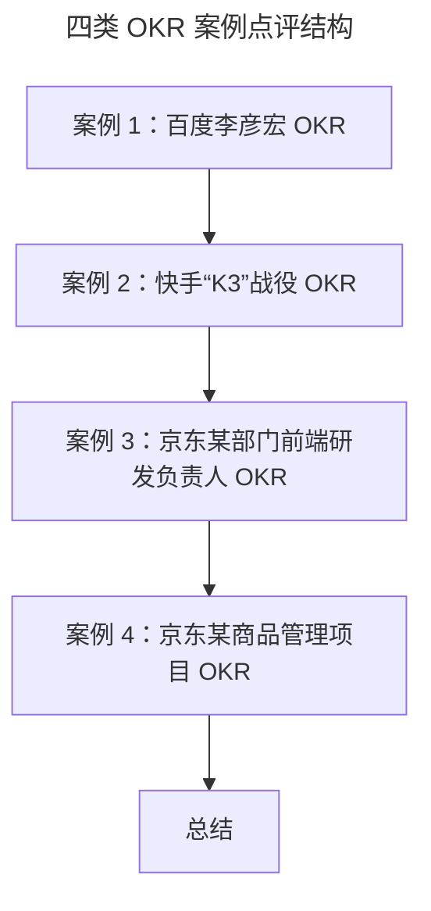

# 案例实战：教你写出高质量的 OKR

> **适用范围**：所有需要编写和评审 OKR 的从业者，尤其是研发、项目型团队负责人及 OKR 教练。
>
> **更新摘要（v2 · 2026-08 更新）**：
> - 结构化升级为 6 节骨架（导言 / 核心方法论 / 关键流程 / 工具与实战 / 常见误区 / 进阶延展）
> - 收录创始人/战略型/研发型/项目型 4 类 OKR 案例点评
> - 保留百度李彦宏、快手 K3、京东前端研发、京东商品管理项目案例，为 Mermaid 图补充文字解读

## 1. 导言

在和你介绍完 O 和 KR 的写法之后，相信你已经能输出一个相对完善的 OKR 了。为了帮你加深对于 OKR 写法的全局印象，助你写出高质量的 OKR，这一节，我列举了多个完整的 OKR 案例，并进行一些点评，通过晒出案例中 OKR 制定的优缺点，相信你可以完全掌握高质量的 OKR 写法和评判标准。

## 2. 核心方法论

高质量 OKR 的评判方法论可以归纳为：O 是否符合 4 原则（对齐/可行/聚焦/自驱挑战）并落在 4 种价值类型（营收/用户/效率/能力）上；KR 是否符合 4 原则（过程+结果量化/时限/多维支撑/挑战性）并满足万能公式（方法+解决用户/组织问题+时点+成效）。下文 4 个案例分别覆盖创始人、公司战略、研发负责人、项目型 4 种场景，是这套方法论的实战检验集。

## 3. 关键流程

### 案例 1：百度李彦宏 OKR

> **O1：打造一个空前繁荣、强大的百度移动生态**
> KR1：恪守安全可控、引人向上、忠诚服务、降低门槛的产品价值观，持续优化用户体验，提升百度系产品的总时长份额
> KR2：恪守良币驱逐劣币的商业价值观，实现在爱惜品牌口碑、优化用户体验基础上的收入增长，收入\*亿，增长\*%
> KR3：产品要有创新，不能总是 me too，me later
> **O2：主流 AI 赛道模式跑通，实现可持续增长**
> KR1：小度小度进入千家万户，日交互次数超过\*亿
> KR2：智能驾驶、智能交通找到规模化发展路径，2019、2020 均能有\*倍速收入成长
> KR3：云及 AI2B 业务至少在\*个万亿级行业成为第一
> **O3：提升百度的组织能力，有效支撑住业务规模的高速增长，不拖战略的后腿**
> KR1：全公司成功推行 OKR 制度，有效降低沟通协调成本，激励大家为更高目标奋斗取得比 KPI 管理更好的业绩
> KR2：激发从 ESTAFF 到一线员工的主人翁意识，使之比 2018 年更有意愿有能力自我驱动管理好各自负责的领域
> KR3：建立合理的管理人员新陈代谢机制，打造出不少于 2 名业界公认的优秀领军人物

**点评**：在百度对外公布的 OKR 案例中，由于商业数据的敏感性，并没有把相关量化的数据结果透明出来。但我相信心细的小伙伴还是能发现百度老板 OKR 的其他**问题**。比如：

- O1 的 KR3 根本就**没有量化**，而是写了一个泛泛的描述，**到底创新什么，怎么创新都不清楚；**
- O2 的 KR1 没有写具体的实现路径，但如果看过 2020 年《奔跑吧 第四季》的小伙伴应该知道百度"小度"在节目里投了广告，还请沙溢做了代言，所以这个 KR 写成"小度通过邀请沙溢代言并与《奔跑吧》节目的合作，提升用户对小度的认知和使用率，达到日交互次数超过*亿"就是一个好的 KR 呈现。

在这个案例中，除了整体上大部分 KR 都缺少量化实现目标的过程路径之外，也有写得比较**好的 O 和 KR**。比如：

- O1 "打造一个空前繁荣、强大的百度移动生态"，就显示了百度要做移动化的决心。从曾经 BAT 的并驾齐驱，到如今百度和阿里、腾讯早已不是一个量级，百度就是没把握住移动化的趋势和机会，所以这个 O 具有坚定做好移动化的自我突破的定位，符合我们去制定具有挑战&自驱方向的原则。
- O3 的 KR3，不仅有"建立合理的管理人员新陈代谢机制"的过程量化，也有"打造出不少于 2 名领军人物"结果的数值量化。

### 案例 2：快手"K3"战役 OKR

> **O：通过 "K3" 战役，在 2020 年春节前后，快手达 3 亿 DAU**
> KR1：依靠极速版，春节前 DAU 峰值突破 3 亿；
> KR2：通过丰富垂类内容、大量签约 MCN、进行活动策划和运营、给予流量扶持等等做法来保持留存率，保证春节前 DAU 峰值突破 3 亿；
> KR3：依靠春晚红包，春节后三个月 DAU 平均值达到 3 亿。

**点评**：快手 K3 战役的 OKR 化，从目标 O 的制定上，充满了挑战，不仅是行业中抖音带来的竞争压力迫使快手需要加速争夺市场的脚步，同时 DAU3 亿的增长目标也是对当时快手 DAU 达到 2.5 亿的突破。此外，对于整个 K3 战役，快手有着明确完成 DAU3 亿的实现路径和时限，在 KR 中就需要把这些量化的关键要素体现出来。**这样的战略级 OKR 在从上往下对齐的时候，会让人一目了然，减少理解歧义和沟通成本，团队和组织形成合力的速度才更快**，有了"春节前后"的时限，完成目标的效率也能更有保证。

所以，我给你所举的快手 K3 战役 OKR 化的案例，是典型写得好的 OKR。但是，如果参照我教给你的写好 KR 万能公式的最终形态，好像在快手 KR 中还缺了对于用户维度的关注。一位快手高管曾向记者表示："快手在战略上最值得反思的不是数据，不是打法，而是战略目标的设立。K3 战役的目标，更多只是公司视角的目标，不是用户视角的目标。**未来快手在战略思考时，会更加回归初心，思考用户真正需要什么**"。从这个案例，我想再次提醒你，**对于偏向业务型目标的 OKR 制定，必须要回归用户/客户视角**。

上图按"创始人 OKR → 公司战略型 OKR → 研发负责人型 OKR → 项目型 OKR"的难度递进排列。前两类偏战略、看方向与挑战；后两类偏执行、看实现路径与时间节点。四类合起来覆盖了组织中绝大多数 OKR 编写场景。

## 4. 工具与实战

### 案例 3：京东某部门前端研发负责人 OKR

> **O：建设前端工具能力，持续提升前端开发效率和用户体验**
> KR1：通过实践骨架屏技术，解决前后端分离中页面加载白屏过长导致用户体验差的问题，让商家满意度提升达 85 分。
> KR2：通过升级 Wot Design 移动端组件库UI，发布 2.0 版本，解决移动化中 H5 和小程序的插件页面与京麦 App 整体前端规范不一致的问题，从而提升用户对京麦 App 的使用体验，沉淀团队移动端组件库能力。
> KR3：通过实践 PWA 渐进式网络应用技术，尝试将优秀的前端新技术引入到业务项目中，从而提升项目的用户体验，沉淀团队的 PWA 实践经验。

（说明：该前端研发负责人的 OKR 是 Q2 制定的，所以在时限上，整个 OKR 是在 Q2 完成。）

**点评**：首先，该前端开发团队的 O 这里有"能力""效率""用户体验"三个关键字眼，对应了 O 需要围绕营收、用户、效率和能力这四种类型来制定，是一个典型的以价值导向 O 的写法。接下来，在所有的 KR 制定中，不仅把具体的实现路径明确了，**更重要的是每个 KR 我们从内容上就能看出都是想要解决用户的问题，从而来提升用户体验**。这个 KR 案例对于技术研发的 OKR 制定非常具有参考性，研发同学平时可能过于关注功能开发和上线，长期就会导致缺乏经营意识，也会让研发自我感觉沦为了工具般存在。

该 OKR 制定的另外一个优点，就是在 KR3 的具体实现方法中，采用了新的 PWA 前端技术，**挑战型的 KR 制定就是要回到行业上来看，把行业中的新技术、新方法能够引入到组织工作当中**。当然，KR3 的不足点是没能把具体解决的用户问题说清，同时和 KR2 一样，缺乏了通过什么量化的数值结果来度量用户体验的提升，KR2 和 KR3 量化的用户体验结果，可以仿照 KR1 的满意度提升来进行改善设计。

### 案例 4：京东某商品管理项目 OKR

> **O：打造行业领先的商品运营阵地，为商家降本增效**
> KR1：**8 月份中旬**，通过对行业调研及竞品分析、商家和事业部调研，产出调研报告和结论，精准识别商家商品发布的痛点问题；
> KR2：**8 月底**，通过统计商品发布页商家使用时长，用数据来验证识别的商家商品发布痛点问题的假设合理性；
> KR3：**9.30 前**，圈定商品发布改造的试点商家，通过试点类目的智能商品发布流程简化版MVP上线，灰度覆盖至少\*个三级类目，保证商品信息自动填充率达\*%以上；
> KR4：**在 10.31 前**，完成\*个三级类目的智能简化版商品发布的扩充和应用，确保商品信息自动填充率均达\*%以上。

（说明：为了项目脱敏，我已将关键数据和方法进行了模糊处理。）

**点评**：由于项目有着明确的起止时间和重要里程碑节点，所以在项目型 OKR 的制定中，KR 需要通过"时间+产出"的形式来进行量化。在该案例中，每个 KR 都有明确的时间节点，而且对于探索型项目，项目阶段性的产出会经历"调研-数据验证假设-试点应用-规模化扩张"的阶段，并不是每个阶段都会有量化业务效果的数值结果，前期会以"调研报告、验证假设有效性"作为关键产出，项目进入试运行和规模化运营阶段，才会产出量化的业务效果。且从 KR1 的制定内容上，我们就能知道该项目是通过和行业竞品对标展开，在整个 KR 的实现过程中，团队几乎是以内部创业的玩法，在进行探索式的尝试和验证，所以完成整个 OKR 都充满了挑战性。

最后想特殊说明的是，在时限上，项目型 OKR 没有完全遵循季度 OKR 的制定规则，**为了项目管理的连贯和持续性**，以项目的起止时间来展示一个完整的 OKR 会更加合理，比如这个项目就是横跨了 8~10 月，跨了不同季度。我和你分享的这 4 个案例，都特别具有参考性，包括了**创始人的 OKR、公司战略型 OKR、研发负责人型 OKR 和项目型 OKR**。

## 5. 常见误区

- **KR 缺乏过程路径**：如百度 O2 的 KR1 只写结果数值，不写实现路径，团队无法对齐"怎么做"。
- **业务型 OKR 不回归用户视角**：如快手 K3 战役只从公司视角定目标，缺少对用户问题的洞察和解决。
- **研发 KR 只写功能上线**：缺乏经营意识，没有回到"解决了用户什么问题"的视角。
- **探索型/项目型 OKR 强求每阶段都有业务数值**：前期阶段应以"调研报告""验证假设"作为关键产出，强行套用业务数值反而不合理。
- **项目型 OKR 强行按季度拆解**：破坏项目连贯性，应按项目起止时间展示完整 OKR。

## 6. 进阶延展

### 总结

最后，为了方便你及时学习、复习，我把在写 O 和 KR 时需要掌握的知识点放在了一张表格中：

这张表把 O 和 KR 的写法要点并排列出，是评审 OKR 质量时的对照清单。建议在团队 OKR 评审会上，逐条对照该表给每个 OKR 打勾或标记问题，形成可追溯的质量评审记录。

### 下节预告

讲完了 OKR 的实操，想要在组织中落地 OKR，仅仅靠写是不够的，这个时候你就需要结合流程管理，那么这个落地 OKR 的流程该怎么打造呢？在下一部分，我将介绍"OKR 的制定和流程管理"。
