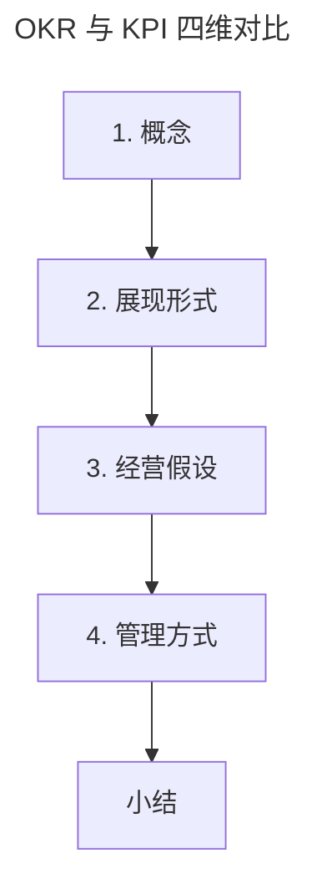

# OKR 与 KPI 的区别和联系

> **适用范围**：从 KPI 转型 OKR 的组织管理者、HR、绩效负责人，以及担心"OKR 用着用着变成 KPI"的实践者。
>
> **更新摘要（v2 · 2026-08 更新）**：
> - 结构化升级为 6 节骨架（导言 / 核心方法论 / 关键流程 / 工具与实战 / 常见误区 / 进阶延展）
> - 从概念/展现形式/经营假设/管理方式四维度对比 OKR 与 KPI
> - 保留"带孩子成长"OKR vs KPI 对照表，为 Mermaid 图补充文字解读

## 1. 导言

前文，我介绍了落地 OKR 需要组织中的流程机制做支撑，通过季度初的 OKR 制定-季度过程中对 OKR 的检视&调整-季度末的 OKR 闭环管理，我们就可以把 OKR 用起来。但是，我常常还是会听到有人说"OKR 用着用着就变了形，做着做着就变成了 KPI"，你是不是也有这样的担心？我们该如何避免这个问题呢？接下来，我会从多个维度对比分析 OKR 与 KPI 的应用和落地抓手。你在掌握了这两个方法的设计理念和相关实践后，就能知道 OKR 与 KPI 的异同，从而在应用 OKR 时避免继续沿用 KPI 式的管理方式。

## 2. 核心方法论

### 1. 概念

> OKR：Objectives and Key Results，目标和关键成果
> KPI：Key Performance Indicator，关键绩效指标

**KPI 从概念上就给了我们错误的引导**，以至于让很多使用 KPI 的人**误认为只要把这个"关键绩效指标"拿出来，目标管理就完成了**。长此以往，就出现了"唯 KPI 论"和"交数文化"，只看数字，只交付数字，严重忽略了过程。而 OKR 从概念上，首先就把"目标"拎出来作为了我们需要关注的第一维度。**先有方向，继而关注该方向所期望获得的"关键成果"**，这至少能让我们清晰地知道所从事工作的上下文，了解产出和目标的对应关系。

### 2. 展现形式

为了让你能更好地理解，我列举了一个几乎每个人都会经历的例子。

| 关于年度带孩子成长目标的 OKR 和 KPI 写法 | |
| --- | --- |
| OKR 展现形式 | KPI 展现形式 |
| O： 让孩子快乐、健康的成长到 10 岁 KR1： 今年陪伴孩子至少出去旅游一次，让孩子了解大千世界。 KR2： 今年让孩子掌握游泳体育运动，并和宝宝每个月能一起去游泳馆游一次。 KR3： 今年鼓励宝宝读 3 本关于名人传记的书，开拓宝宝的思维和认知。 | 孩子长到 10岁 |

我使用生活中的例子，是因为我们每个人都是从小孩子长起来的。孩子需要有陪伴过程，尤其在开始形成价值观和世界观的时候，通过父母的陪伴孩子才能真正身心健康地成长。通过对于该目标的 KPI 化，可以发现**KPI 的展现形式太过偏向于数字结果**，只要孩子能长到"关键绩效指标10岁"就行，无所谓怎么去长。而该目标的**OKR 展现形式既有过程也有结果**，孩子的成长过程错过了真的一辈子就错过了，没有再来的机会。同理，用只看数字的 KPI 来管理组织中的目标和绩效结果，就会造成像阿里内部流传的那句话"没有过程的结果是垃圾"。所以目标管理**一定是一个工作过程，不能只看结果数字。**

### 3. 经营假设

KPI 出现的 90 年代，国内改革开放才 10 多年，那个时候的企业经营环境任何行业都是供小于求，蓝海一片。**在那个产品稀缺的时代，组织绩效的获得是由组织自己决定和可掌控的**。此时，用 KPI 来管理组织绩效：某区域装 10 个固话，直截了当，简单可实现。组织还因此能持续不断地获得成功，长此以往，就形成了 KPI 式的经营固化思维。

然而，当把时间线拨回当下，产品稀缺的时代结束了。**对于产品的选择权正在从企业转为用户，由用户来决定用不用你的产品，组织绩效便开始由外部决定，而用户的需求是多元易变的**。这个时候，如果我们还期望用一个定完就放任不管的 KPI 数值来取得组织经营成功，就变得越来越不可能。OKR 从制定完成，就要进入持续的过程检视&调整的原因，就是期望及时管理好过程，拥抱过程中的变化，通过 OKR 管理的灵活性，来适应经营环境的 VUCA 化。

所以，**KPI 式的固化实现绩效方式，根植于对组织经营的外部环境是确定的，是可以掌控的假设。**而**OKR 的灵活实现绩效方式，是基于对当下组织经营环境是不确定的，是需要探索式前行的假设。**

### 4. 管理方式

以确定性思维来经营组织，带来的就是对目标管控，甚至拒绝目标变化，这一管理理念会反映在组织中的 KPI 绩效管理系统上。在执行 KPI 的组织中，当你的 KPI 一旦在系统里填写完成提交后，任何关于 KPI 的改动都必须要上级管理者审批。**KPI 管的是目标，目标指导的是个人行为**，管理者一直没有点击"打回"按钮，就预示着目标还没变，组织中的个人行为就不能随意乱动。久而久之，被动接受了"**上级动，我才动；上级不动，我就在那等着**"的工作模式。更可怕的是，由于**基于 KPI 的绩效管理系统的设计不能及时地响应外部环境的变化**，无论员工还是管理者，每次修改目标会特别麻烦，变更成本极高，这就导致大家不愿意在制定和管理 KPI 上花太多时间，流于形式。

而 OKR 在落地组织中，首先会按照短周期的月度或者季度来制定 OKR。此外，一线员工可以在 OKR 的管理系统中随时对 O 和 KR 进行及时新增、修改和删除操作，而且这些操作并不需要任何人的审批。这样的 OKR 管理方式有以下两个核心理由：

- **如今市场环境变化多端，无法通过预定义的方式来做很长周期的计划，这时就要求我们把计划周期变短，设定的目标变小，才能够及时调整目标的打法和资源配置。**
- VUCA 化的经营环境，其实和战场的环境一样，**计划一旦做好，就像战斗一旦打响一样。这时，就必须让一线的人员能够拥有及时响应变化、及时做决策的权利去应对突发的事情**。

上图把 OKR 与 KPI 的对比拆成四层递进：从"概念"的字面引导，到"展现形式"的过程/结果差异，再到"经营假设"的确定/不确定之分，最后到"管理方式"的管控/授权之别。四层逐层深入，揭示了"OKR 用着用着变成 KPI"的根因在于经营假设和管理方式没有同步切换。

## 3. 关键流程

**为了能建立灵活响应外部 VUCA 经营环境的管理模式，让听得见炮火的人及时做决策。** KPI 式的"命令+控制"管理方式突显死板和僵化，长期不仅带来"唯 KPI 论"，更会丧失组织活力和创新。而 OKR 管理的灵活和敏捷性，不仅体现在建立短期迭代式小目标的 OKR 制定周期上，也体现在响应目标的变化和授权给到一线拥有自主及时调整目标的权利上，最后**再结合前文我和你讲的 OKR 过程管理流程，就能做到上下级对变更信息的及时同步和共识，这样也会避免一线的随意决策导致的组织风险。**

避免"OKR 变 KPI"的关键流程是：经营假设层面，先承认环境的不确定性；管理方式层面，把目标调整权下放给一线；过程管理层面，用日/周/季中检视机制代替"打回审批"机制，让变更通过同步共识而非层层审批完成。三者同步切换，OKR 才不会变味。

## 4. 工具与实战

判断"自己组织的 OKR 是否已经变 KPI"的可操作检查项：① OKR 修改是否需要上级审批？是→偏 KPI。② 目标周期是否短到月/季度且可随时调整？否→偏 KPI。③ 是否有过程检视机制（日站会/周报/季中盘点）？否→偏 KPI。④ 一线员工能否自主新增/修改 OKR？否→偏 KPI。⑤ 激励是否基于 OKR 评分而非 KPI 数字？否→偏 KPI。五项中任意一项"偏 KPI"，都说明 OKR 落地存在变形风险，需要回到经营假设和管理方式上做切换。

## 5. 常见误区

- **混淆概念**：把 OKR 当成"另一种 KPI 数字"，只关注 KR 数值不关注 O 方向。
- **保留 KPI 式审批**：OKR 修改仍需上级打回，一线失去自主调整能力。
- **经营假设未切换**：仍以"环境确定、指标可达即成功"的思维用 OKR，忽略过程管理。
- **打着 OKR 旗号做 KPI 管理**：这是最隐蔽的误区，名义上用 OKR，实质上沿用"命令+控制"，组织依旧僵化。
- **认为 KPI 一无是处**：经营环境相对稳定、市场蛋糕足够大时，KPI 同样可以给组织带来业绩成功；OKR 的优势体现在动态、不确定环境中。

## 6. 进阶延展

### 小结

当我们去理解 OKR 和 KPI 这两个目标管理方法时，如果不能结合时代和环境背景，没法区分这两者的管理理念和具体实践，很容易踩坑："OKR 用着用着就变了形，做着做着就变成了 KPI"。

- 经营环境相对稳定，市场蛋糕也足够大，用 KPI 同样可以给组织带来业绩成功。环境相对动态，经营充满不确定性，用 OKR 会更加灵活响应变化。
- 在管理方式上，KPI 是管控型，"老板不动，我不动"，从而带来僵化的组织。OKR 是授权型，"让听得见炮火人做决策"，给组织带来了柔性和活力。
- 在过程管理上，KPI 严重忽略过程，容易形成交数文化。OKR 建立了拥抱变化的过程管理机制，提升了组织过程管理能力。

VUCA 时代，OKR 显然比 KPI 更有优势，能让组织更好地取得成功。你在应用 OKR 时，要有意识地避免继续沿用陈旧的 KPI 式的管理方法，更不能打着 OKR 的旗号，去做 KPI 的管理。

### 下节预告

在知道了这些区别后，你现在就可以行动起来，带领团队和组织开始实践 OKR。当你长时间的在团队内应用 OKR 时，会发现团队越来越有活力，那么 OKR 到底是怎么激励团队更有工作动力，自愿为工作付出的呢？在下一部分，我会介绍"如何用 OKR 激活你的团队"。
