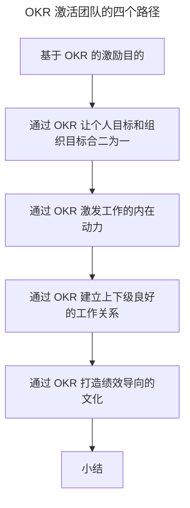

# 激励：如何用 OKR 激活你的团队？

> **适用范围**：组织管理者、HR、激励设计者，以及希望通过 OKR 提升团队活力的 Team Lead。
>
> **更新摘要（v2 · 2026-08 更新）**：
> - 结构化升级为 6 节骨架（导言 / 核心方法论 / 关键流程 / 工具与实战 / 常见误区 / 进阶延展）
> - 梳理"激励基于 OKR→个人与组织目标合二为一→激发内在动力→建立上下级关系→绩效导向文化"激活路径
> - 保留京东早会/周会/月会实践与"绩效 vs 苦劳"对照图，为 Mermaid 图补充文字解读

## 1. 导言

前文，我主要和你介绍了 OKR 和 KPI 的区别，我们在应用 OKR 时，需要把 OKR 所倡导的理念和抓手落到实处，避免沦为 KPI 式的管理模式，从而才能更好适应 VUCA 的经营环境，给团队带来活力。然而一提到活力，我们在组织管理中也不得不提激励，因为激励就是期望去激活组织、激活团队、激活个体。作为一个成体系的目标管理方法，OKR 管理涉及目标制定-过程管理-绩效产出的工作全过程，那么 OKR 到底是怎么盘活团队，让每个人更有干劲的？落地过程中，组织中又该如何升级激励机制来匹配 OKR 的落地转型呢？

## 2. 核心方法论

### 基于 OKR 的激励目的

游戏之所以能让人沉浸其中不能自拔，最重要的就是有一套激励体系。比如，遇到类似元旦跨年的特殊节日，游戏运营商会做一些发弹幕中稀有装备、稀有宝宝或者永久衣服之类的特殊活动，这个时候，只要时间点一到元旦跨年的 12 点，游戏屏幕上就会出现满满的各种弹幕。这说明：**激励可以引导群体行为。** 拼多多就是靠砍价激励引导人在微信群转发，从而达到了裂变疯传的目的。

那么回到组织里，我们期望所做的激励，一定是围绕在如何更好地取得绩效结果上，也就是说，**组织里的激励是为了引导全体员工更愿意产生获得组织绩效的行为。而 OKR 就是管理组织目标和绩效结果，所以组织中的激励一定要基于 OKR 来做。** 然而我常常看到一些团队和组织在引入 OKR 后，依旧还是基于 KPI 来进行考核和激励，那么长此以往，组织中引导的群体行为还是会基于 KPI 来运转。

所以说，组织中的激励机制需要升级基于 OKR 来做，**只有激励设计和 OKR 相关，组织中的人才认 OKR，才会用 OKR，才会通过 OKR 来产生更好的绩效结果。**

### 通过 OKR 让个人目标和组织目标合二为一

在 OKR 的制定过程中，个人的 OKR 生成主要来自 3 个方面：1、和上级对齐；2、自身岗位职责自驱；3、外部支撑相关。和上级对齐的 OKR，方向 O 需要保持一致，但是作为 KR 可以自下而上地生成，也就是实现 O 的具体路径可以由个人来思考确定，和上级达成共识即可。而在自身岗位职责自驱生成的 OKR 中，无论 O 还是 KR 则完完全全都是由自己来确定，只要满足能支撑组织的发展就行。

相反，**如果在一个组织中，被分配的工作大部分都不是自己想做的，就会导致个人目标和组织目标产生偏离**。再比如，**阿里的合伙人机制**，就是让合伙人在定战略时拥有决策权，而不是仅仅听创始人一个人的，这时，**合伙人的想法会融合在组织战略方向的制定中，就会更有动力为组织付出**。我在京东又是怎么做的呢？在季度初带领团队制定 OKR 时，包括**O 和 KR 都是让团队先自行产出**，然后我会和团队进行归纳总结，讨论共识，这时就**充分考虑了团队中所有人的意见**。而且，我会鼓励个人制定完全自驱的 OKR。

### 通过 OKR 激发工作的内在动力

人要工作的原因是复杂的，而为了满足这些需求，我们常常会看到外在的诸如金钱、荣誉证书等激励。然而，长期使用外激励，会让我们逐渐忽略了人要工作的另一个因素：**内在动力**。外在激励总是少数的，比如股权、荣誉，总不可能让人人都拿到。所以说，我们不能只做外激励，**更要做好内激励，让更多人自发，从内在就愿意为工作而付出**。

**OKR 则弥补了组织中经常缺失的内在激励。** OKR 制定的过程，紧紧围绕组织目标展开，提倡自主性，更去鼓励个体制定自驱的沉淀方法论或者影响力的方向，基于 OKR 的管理流程则不断地会跟进完成目标的进度和问题，从而让影响目标完成的问题能够及时得到反馈和解决。**明确的目标、工作更加自主、人能够获得成长、做事情有明显的推动进展感，这些内在动力都能极大地促成人对工作的热情**。

### 通过 OKR 建立上下级良好的工作关系

马云曾说，人离职无外乎两个重要原因：要么钱给少了，要么人不爽了。那么在工作当中，除了薪资的激励，可以给人更有动力的工作之外，建立起一个和谐的上下级的工作关系也尤为重要。在京东内部，从高管到一线员工都有开早会的习惯，每天早上固定时间点，上级就会带着所管理的团队一起就实现目标的进度、问题和风险进行沟通和探讨。除了早会，还有按周开展的周会，按重要项目开展的月会，**开这些会的目的，是给了上下级能够正式沟通的机会，互相探讨问题，交换意见，保持信息上下流动，从而带来工作过程的信任**。

在应用 OKR 的团队和组织，需要建立以日、周、季中三个维度的针对目标完成过程的检视和调整机制，那么**上下级就可以在 OKR 拉动的这个工作方式中，来达到与上述京东各类会议同样的目的和效果，建立起良好的上下级工作关系，管理者可以在这种工作方式中充分影响他人去达成群体目标，也就塑造了我们常说的领导力。**

上图把"激活团队"拆成五条递进路径：先让激励基于 OKR（引导群体行为），再让个人目标与组织目标合二为一（动机），接着激发内在动力（自主/成长/进展感），然后通过日周季中机制建立上下级信任关系（领导力），最后落到绩效导向的公平文化（公开透明的激励导向）。五条路径共同构成 OKR 激活团队的完整机制。

### 通过 OKR 打造绩效导向的文化

在**面向结果的激励**中，无论是给予奖金、晋升还是荣誉等，在组织里，我们唯一的导向就是绩效。OKR 从制定时如何确保支撑战略落地、如何进行流程的过程管理，再到 O 和 KR 的写法，完完全全都是围绕如何高效地制定和实现目标在做。**尤其在 O 的选择中，聚焦营收、用户、效率和能力维度，就是在让制定的目标都是以价值导向，因为这些就是组织绩效的构成维度**。

**此外，激励在以绩效导向时，还要注重公平。** 基于 OKR 的结果评分机制，通过多个相关方的评价，则体现了相对公平性，避免了唯上和一言堂。并且 OKR 系统通晒了所有人的 OKR 和评价结果，则有力保证了绩效评价的公开透明。

然而，我特别担心很多组织内部形成的"没有功劳也有苦劳"的激励思维，**兼顾苦劳的激励，就是在看工作量的多少，不仅不是绩效导向，而且会带来不公平，会让真正产生组织绩效的人失望和不满意，这时伤的不仅是绩效，更是组织文化。**

这张图直观对比了"绩效导向"与"苦劳导向"两种激励思维。绩效导向看的是工作带来的效果（赚了多少钱、提升了多少用户、提高了什么效率、培养了多少人才），苦劳导向看的是工作量（加班、不迟到不早退）。前者留住人才，后者留下"划水"和"养老式"工作的人。

## 3. 关键流程

OKR 激活团队的落地流程可以归纳为五步：① 把组织激励体系从 KPI 切换到 OKR（HR 与管理者表态绩效评估必须转移到 OKR 上）；② 季度初让团队自行产出 O 和 KR 并鼓励自驱 OKR（个人目标与组织目标合二为一）；③ 通过 OKR 流程激发内在动力（明确目标/自主/成长/进展感）；④ 用日/周/季中检视机制建立上下级沟通节奏（良好工作关系与领导力）；⑤ 季末基于 OKR 多方评分做公平的绩效导向激励。五步缺一不可，跳过第①步直接做后面四步，就是最常见的"双轨制"失败模式。

## 4. 工具与实战

在京东内部，基于 OKR 工作方式的内激励，我们做了如下实践：

- OKR 制定好后，会让团队进行"OKR 解码"，发起 OKR 整体解读和共识会，让每个人都能非常清晰地知道团队的所有工作目标。（**明确的目标**）
- 让团队所有的 OKR 都通晒在内部的 OKR 系统上，还会建议把 OKR 打印贴出，直接透明在团队工作周围的物理看板上。（**明确的目标**）
- 在物理看板上，会结合纵向泳道 to do | doing | done，把 OKR 拆解出来的工作任务进展透明出来，并做及时更新。（**管理 OKR 实现过程且带来进展感**）
- 让团队自主建立基于 OKR 工作的每日站会，但不干涉具体会议内容，更关心团队在实现目标过程的问题和阻碍解决。（**更自主、推动问题解决带来的进展感**）
- 在打绩效时，综合考虑 OKR 中个人的方法论沉淀和影响力情况，这一点甚至纳入在京东高职级晋升的汇报 PPT 模板中。（**个人成长**）

京东内部每个季末，HR 侧都会发起面向整个一级部门的绩效评估，内容包括了本季度的绩效评价及下个季度的目标设定，而绩效评价会跟员工的绩点相关，被打更大等级绩点的员工就会有更高的绩效奖金激励。在该场景下，如果组织中导入了 OKR，**HR 就要表态整个绩效评估必须要转移到 OKR 上来进行，管理者也是参考 OKR 中的实际绩效产出及 OKR 闭环管理时的评分来给下属打绩点**。

## 5. 常见误区

- **绩效管理"双轨制"**：既用 KPI 考核激励，又用 OKR 定挑战目标。由于激励引导群体行为，组织只会认 KPI，OKR 形同虚设。正确做法是激励必须基于 OKR。
- **只做外激励、忽略内激励**：股权、荣誉等外激励总是少数人拿到，忽略明确目标/自主/成长/进展感等内在动力会让多数人失去持续动力。
- **"没有功劳也有苦劳"的激励思维**：看工作量而非效果，带来不公平，让真正产生绩效的人失望，文化过滤下来的是"划水"和"养老式"工作的人。
- **认为 OKR 不该用来考核**：如果没有考核，拿什么识别优秀人才、保证公平？OKR 和组织绩效息息相关，不仅要考核，而且要找到基于 OKR 的正确考核姿势。

## 6. 进阶延展

### 小结

行业上，有不少人会说 OKR 不应该用来考核，我非常不认同该理念。试问，如果没有考核，我们拿什么来识别组织中优秀人才，没有考核如何保证公平呢？OKR 和组织绩效息息相关，不仅要考核，而且要找到基于 OKR 的正确考核和激励的姿势。

本文，我首先给你详细解释了需要基于 OKR 来升级组织激励机制的原因。在调整完整个组织绩效管理都基于 OKR 来做后，OKR 通过让个人目标和组织目标更好地结合，激发内驱力，建立了良好的上下级工作关系，打造了组织中绩效导向的公平文化，正是这样的 OKR 落地实践才真正可以让每个人都激发出工作热情和动力，起到了激活团队的价值。

### 下节预告

既然 OKR 有这么多优点，那我们如何才能让组织长期地使用呢？在下一节，我将介绍"OKR 文化的塑造和沉淀"，你可以通过 OKR 文化建设，来把这个优秀的方法坚持用下去，给组织带来持久的绩效突破。
