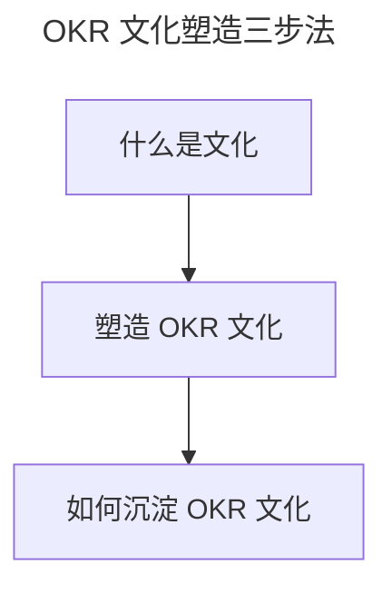

# 文化：OKR 文化的塑造和沉淀

> **适用范围**：组织管理者、文化建设者、HR、OKR 变革推动者，以及希望让 OKR 长期沉淀为组织习惯的团队。
>
> **更新摘要（v2 · 2026-08 更新）**：
> - 结构化升级为 6 节骨架（导言 / 核心方法论 / 关键流程 / 工具与实战 / 常见误区 / 进阶延展）
> - 基于"沙因文化三层次"梳理"调思维—做管理—定规则"三步塑造法
> - 保留京东培训/思维大赛/OKR 系统/文化评估表案例，为 Mermaid 图补充文字解读

## 1. 导言

在企业中，虽有负责文化建设的职责部门，但由于在互联网场景下，人员的流动和组织结构的不断调整，好的文化不仅难以沉淀，而且会随着变动常常被稀释得无影无踪。所以，我们就需要掌握文化建设的方法和实践，通过这些方法在组织中持续拉动 OKR 文化的生成。那么，什么是文化？文化的建立与什么相关？怎么设计和沉淀优秀的 OKR 文化来应对这个不断变化的时代？

## 2. 核心方法论

### 什么是文化

当你外出旅游时，最能感受到文化这个词的魅力，你会被代表某个国家的文字、语言或是特殊符号所吸引。同样，当我们去到企业，会看到刻在墙上的愿景使命价值观，也会注意到不同企业有着各自特定的装饰风格、氛围、语境，还会发现员工的行为举止遵循着特定的仪式和做法，继续和他们深入交流，就会知晓所作所为都有背后特定的理由。我们把这些也统称为企业文化。

那么，文化到底是怎么构成的呢？"企业文化之父"**沙因文化的三个层次**揭示了文化的本质。

沙因把文化分为三个层次：人工饰物（Artifacts，所见所听所感）、外显的价值观（Espoused Values，纸面上的主张）、基本假设（Basic Assumptions，深层的思维定式）。而要生成新文化，这三个文化层次缺一不可，也就是说，我们想要塑造 OKR 文化，既要抓 OKR 的人工饰物和外显的价值观，也要抓 OKR 所代表的基本假设。

### 塑造 OKR 文化

企业文化一旦形成就比较难改变，但为了生存，为了适应当下环境，企业文化需要有不断演进的过程，而**文化演进的过程归根结底是人的行为习惯调整**。所以，在组织中塑造 OKR 文化，我们可以通过**调思维、做管理、定规则来影响群体的行为进行 OKR 文化升级。**

#### 1. 调思维

我曾在一家某军工集团下属的研究所工作过，在这样的环境中，我会**严格遵守瀑布式产品开发的交付流程来管理整个软件项目，严控甚至拒绝需求变更**。后来投身到互联网的世界，才发现瀑布式的开发方法在一个变化非常快的互联网环境中根本不适用，**只有迭代式、及时响应需求变化的敏捷产品开发才能让组织更好地活下来**，我的整个思维方式都被颠覆了。

> 瀑布式产品开发（Waterfall）：前期花很长时间确定大量需求范围，通过文档驱动，严格遵循预先计划的需求、分析、设计、编码、测试的步骤顺序进行，过程中做严格的需求变更控制，一般一个交付周期半年~1 年。
> 敏捷产品开发（Agile）：2001 年敏捷宣言开启软件敏捷开发时代。强调短周期迭代满足用户需求，边开发边求证，一般一个迭代周期为 2~3 周。

所以，有什么样的文化就会形成什么样的思维，文化就是组织中人的思维方式。那么，我们想要塑造 OKR 文化，首先就需要把 OKR 所代表的核心思维和理念明确出来，然后不断去给组织中的个体灌输这样的 OKR 思想：

- **对环境**：未来充满不确定性，需要拥抱变化，不断迭代试验前行。
- **对人**：每个人都能被激活，发挥作用，才能抓住更多机会。
- **对业务**：战略不仅仅是制定，更重要的是如何落地执行拿到增长结果。
- **对组织**：组织目标实现过程中的管理、领导、激励和文化建设的能力影响着绩效完成。

通过调整人的思维来进行文化升级，就让 OKR 文化具备了沙因文化中的基本假设层次。在组织内部，我们可以**采用持续的培训、分享、讲座、思维大赛等方式来传播 OKR 思想。**

*（左侧为本人 OKR 培训现场，右侧为 OKR 思维大赛奖杯）*

比如，为了让大家更好地理解 OKR 是什么，前期在部门内部导入 OKR 时，我每周二都会给团队中的经理、Leader 做培训，目的就是给大家布道 OKR 的理念及所代表的核心价值观。我还联合 HR 侧举办过"OKR 思维"大赛，通过比赛的形式，拉动大家来学习 OKR 的理念。

#### 2. 做管理

文化在生活中是一种生活方式，在组织中就是一种管理方式。而**管理是一种实践**，有着什么样的管理实践，对应就会有什么样的管理和被管理的行为，从而就会产生相应的文化。想要生成 OKR 文化，就需要**找到从 OKR 基本假设中衍生出来的具体落地 OKR 的管理实践，而文化的外显价值观正是由管理实践来体现的。**

塑造 OKR 文化的外显价值观层，可以从管理的四个核心实践角度来做：

- **目标**：短期小目标、员工参与 OKR 制定、含有增长量化指标。
- **事**：优先级、周会把控 OKR 变化情况、透明事的物理看板。
- **人**：可随时更新 OKR、鼓励自驱型目标的设立。
- **结果**：考核以实际增长绩效导向、OKR 结果通晒、互相评分。

**管理聚焦的这四个维度的具体 OKR 实践，背后都遵循着 OKR 所代表的拥抱不确定性、以人为本、增长导向、重视过程的理念，是 OKR 理念在管理实践维度的具象化。**

*（京东内部用于创建 OKR 的系统，员工可以在上面随时更新 OKR）*

#### 3. 定规则

在组织中，有什么样的规则就会产生什么样的约定行为，从而就会带来什么样的文化，**我们常常把这类规则称为规章制度或运行机制**。那么，我们想要塑造 OKR 文化，就需要产生 OKR 执行和落地的规则，**建立两个核心机制**：

- **流程机制**：基于 OKR 打造组织中目标管理的流程。
- **激励机制**：基于 OKR 来进行组织中的激励设计。

只有组织中的工作流程、引导群体行为的激励全部基于 OKR 展开和制定，且能刚性执行，OKR 文化才能立起来。有了基于 OKR 的流程和激励机制的升级保障，就让 OKR 文化具备了沙因文化中的人工饰物层次。

*（团队按照 OKR 的流程跑起来，就会带来各种制定和讨论 OKR 的行为和言语，外人从这些表面上看到的听到的都是 OKR 文化的人工饰物层）*

同时，**流程和激励机制会和管理实践交融在一起发挥作用**，比如在 OKR 流程的目标设定环节，我们就会采用小目标、优先级的管理实践，在 OKR 的过程检视&调整时采用每日站会结合物理看板的管理实践；基于 OKR 的激励，就会用到通晒、评分、目标合二为一的管理实践。这样，就会**让 OKR 文化的人工饰物背后，都能找到与之匹配的 OKR 外显价值观，彼此互相支撑**。

上图把 OKR 文化建设浓缩为三步：先理解"文化是什么"（沙因三层次），再通过"调思维—做管理—定规则"三步塑造（对应基本假设/外显价值观/人工饰物三层），最后通过载体和文化监控实现沉淀。三步分别对应沙因文化的三个层次，是一套自洽的塑造模型。

## 3. 关键流程

通过调思维、做管理、定规则三步走，来调整组织中群体的行为习惯，就可以塑造出 OKR 文化拥有沙因文化的三个层次。然而我常常看到，很多推行 OKR 的组织，仅仅在团队层面基于 OKR 来进行工作的展开，管理者和高层从来不用，组织中从高层开始就无视规则、挑战规则、不遵守规则，团队中的规则执行也就可想而知，这也是国内很多组织 OKR 落地生根不了的重要原因之一。所以，**涉及 OKR 的流程和激励规则一旦制定，必须要刚性执行，甚至组织中的高管也不能例外**。我们可以看到字节跳动和百度在推动 OKR 时，创始人张一鸣和李彦宏就开始写 OKR 的原因，就是从高管开始执行 OKR 制定的流程，才能保证流程机制不被挑战，否则一旦例外过多， OKR 文化就树立不起来。

## 4. 工具与实战

### 如何沉淀 OKR 文化

中国文化，源远流长，我们依旧可以通过书籍、流传的故事、文物等来了解相应年代的文化特征，而这些就是文化沉淀下来的载体。沙因文化的三个层次，都可以通过载体来呈现。要沉淀 OKR 文化，也需要这些实实在在、能让人"摸得着"的 OKR 文化载体（如下）。

OKR 文化有了这些载体，就具备了传播和延续能力，可以持续不断地通过这些具象的文化沉淀去影响更多群体产生应用 OKR 的行为，直至成为一种组织习惯。

而新的组织习惯并非一朝一夕就能练就，还需要通过**文化监控**的手段来持续塑造 OKR 文化，也就是**调思维、做管理、定规则**这三步 OKR 文化塑造的方法需要长久地推动下去。我在京东内部，是通过每个季度做评估的方式，进行 OKR 文化的监控和测量。在这里，我把 OKR 文化评估设计的一些问题分享给你，你在后续进行 OKR 文化建设时可以参考使用。

*（评分说明: 0-完全做不到，1-极少做到，2-偶尔做到，3-经常做到，4-高频做到，5-总能做到）*

每个测评的问题，按照执行程度，共 0~5 分，问题设计好后，发放给部门所有成员，进行打分。在收集了整个部门的 OKR 文化监控数据后，我会根据评分的高低，来制定后续改进的方案。比如，从得分上，看到团队执行 OKR 的流程上有问题，我就会深入到具体得分较低的团队或部门，进行 OKR 执行流程的复盘，形成具体关于 OKR 流程的改进意见。为了保证文化监控和测量的数据真实可靠，你需要亲力亲为，带领文化管理团队下一线，收集一线员工的反馈，进行抽查，并把每次文化度量的结果向上汇报，持续不断地得到老板的支持和意见。

## 5. 常见误区

- **只抓人工饰物、忽略基本假设**：墙上贴满 OKR 标语、系统也上了 OKR，但思维方式仍是 KPI 式管控，文化立不起来。
- **高管不执行规则**：高层从不写 OKR、不参与流程，规则只对一线生效，例外过多导致 OKR 文化无法树立。
- **导入 OKR 却保留原始管理方式**：尤其保留 KPI 式管理，OKR 文化怎么也建立不起来。
- **文化一次性建设、不监控**：文化建设是长期工程，缺少季度文化评估和持续改进，OKR 文化会随人员流动被稀释走样。
- **照搬其他企业做法**：每个组织文化、目标周期、人员水平、行业背景不同，不能完全"照抄"复制，要基于试点总结适合自己组织的实践。

## 6. 进阶延展

### 小结

文化，小到个体、团队，大到企业、国家，都会受其影响，它是我们为了生存，对环境的适应方式。企业文化虽各不相同，但我们需要理解，只有适应市场经营环境的文化，才是好的文化。OKR 所带来的文化理念，不仅绩效导向，鼓励创新，关注过程，还能够拥抱不确定性，激活组织和个体，可以让组织活得更好活得更久，所以我们就要学会塑造和沉淀 OKR 文化。

塑造和沉淀 OKR 文化的方法论可以浓缩为：理解沙因三层次 → 调思维（基本假设）/做管理（外显价值观）/定规则（人工饰物）三步塑造 → 用载体沉淀 → 用季度文化评估监控。

### 下节预告

我们也都知道改变文化何其难，所以代表 OKR 文化的各种管理理念和实践在落地过程中一定会面临阻力和困难，我们有没有一些套路能帮助我们更好地推行 OKR 呢？请看下一部分"OKR 转型的难点和解决方案"。
