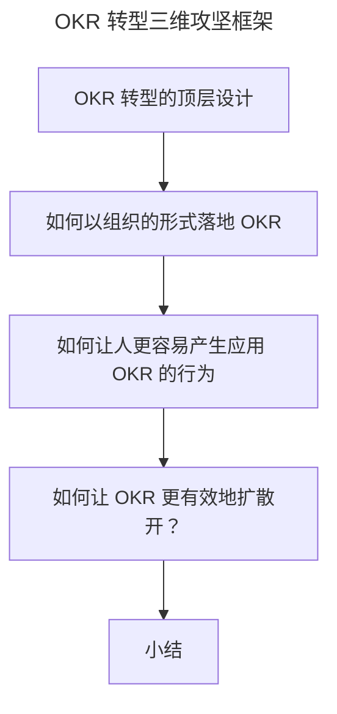

# 变革：OKR 转型难点及解决方案

> **适用范围**：OKR 变革推动者、组织发展（OD）负责人、高管、OKR 教练，以及正在或即将推动 OKR 转型的团队。
>
> **更新摘要（v2 · 2026-08 更新）**：
> - 结构化升级为 6 节骨架（导言 / 核心方法论 / 关键流程 / 工具与实战 / 常见误区 / 进阶延展）
> - 基于"组织系统—人—交互"三维框架梳理 OKR 转型顶层设计
> - 保留京东 OKR Master/OKR 变革小组/OKR NPS/罗杰斯创新扩散案例，为 Mermaid 图补充文字解读

## 1. 导言

通过前面课时的学习，你可以发现 OKR 作为一种新的目标管理方法，有着其所倡导的价值理念和管理实践，这样的文化特征进入到任何一个组织都会带来变化。然而，人天生对于变化是排斥的，尤其在组织原有文化的裹挟下，会更加抗拒新兴的理念和方法。所以，OKR 转型一定会面临阻力和挑战。

同时，我们也会发现**优秀的组织仍然会坚持"长期主义"，坚决做出文化的演进和升级。** 比如阿里和腾讯都在 2019 年发布了文化 3.0，京东同年也对文化价值观做了新的调整，目的都是让组织的文化能及时适应当下的环境，持续获得组织的成功。所以，我们要坚定 OKR 转型的决心，告别陈旧的管理模式，掌握科学的方法，做好 OKR 落地的变革管理。

## 2. 核心方法论

### OKR 转型的顶层设计

首先，我们把一个组织抽象成一个**系统**，在这个系统中，还包括了**人以及人与人之间的交互**。那么，当一个变化，如 OKR 转型，进入到这个组织系统，就会对这三个部分带来调整，同时也会面临这三个部分的落地挑战，这些难点在于：

- 如何**以组织的形式**落地 OKR？
- 如何让人能**更容易**产生应用 OKR 的行为？
- 如何让 OKR**更有效地**扩散开？

换句话说，我们可以从组织系统、人、交互三个维度入手，实施全面改进，引入好的方法，解决以上难点，降低 OKR 的变革"阻力"，促成 OKR 更好落地。

### 如何让人更容易产生应用 OKR 的行为

涉及个体行为，有一个非常著名的公式，它来自斯坦福大学福格教授：**B=MAT**。

> **B**：Behaviour，行为
> **M**：Motivation，动机
> **A**：Ability，能力
> **T**：Trigger，触发

也就是说，个体的行为受到动机、能力和触发三个变量的综合影响。那么，在组织里，我们就需要从这三个变量切入，来解决人怎么才能更容易产生应用 OKR 的行为：

- **在动机维度**：最重要的激励，组织中的激励机制和激励设计围绕 OKR 来做，就可以引导群体更有动力来使用 OKR。此外，变革的引入还要说明能帮助组织解决什么问题或未来什么危机，从上往下传递紧迫感。
- **在能力维度**：必须让人具备 OKR 的整套理论知识和实践方法。**组织中的学习不是让人学多少，而是用多少**。根据"学习金字塔"，一个人对某个知识理解最为深刻，就是能讲出来或是教别人。
- **在触发维度**：让人长期能被触发使用 OKR，靠的就是管理流程和机制。此外，**在组织里讲究责任和权利，组织结构中职位越高的人，拥有越高的权利，相应也就拥有越大的影响力**，所以需要高层的加入和支持，利用高层来影响人群接受和使用 OKR。

上图把 OKR 转型拆成三个攻坚维度：组织系统（如何以组织形式落地）、人（如何让人更容易产生应用 OKR 的行为，用 B=MAT 拆解）、交互（如何让 OKR 更有效扩散，用罗杰斯创新扩散模型）。三维框架是降低变革阻力的顶层路线图。

## 3. 关键流程

### 如何以组织的形式落地 OKR

**在正式组织里做任何事情，我们都是回到目标以及相匹配的职责上。** 正式组织是为了**实现目标而存在**，而为了实现目标，继而会**设计很多角色来承担实现目标的职责**，然后**通过分工给到具体的执行人**。

*（京东内部 OKR Master 角色的职责定义，供参考）*

举个例子。我在京东某部门推动落地 OKR 时，首先定义了一个名为"OKR Master"的角色，并赋予了该角色需要落地 OKR 的职责，然后在该部门以业务条线的维度找承担该职责的人。当时，我一共找到了 20 多个团队的 Leader 来进行分工承接。接下来，我自己和这 20 多位 OKR Master 成立了**OKR 变革小组**，通过设立**OKR 变革小组的工作目标**，来带领部门 200 多人进行 OKR 转型。在这里，我把变革小组的阶段性目标中的关键量化指标分享给你，你可以参考作为 OKR 变革时的核心过程指标：

- **OKR 覆盖度**
- **OKR NPS**
- **OKR 实现过程管理能力水平**

设立 OKR 覆盖度指标的目的，是让 OKR 流程 100% 覆盖所有业务条线，让所有业务条线的工作目标的制定和过程管理都基于 OKR 来展开；此外，覆盖还包括每人都能用 OKR 来制定绩效目标。

*（OKR NPS 调研问卷问题设置及部分结果，供参考）*

NPS（Net Promoter Score，净推荐值）原本是用来衡量用户向其他人推荐某个产品或服务可能性程度的指标。OKR 作为一个新的目标管理方法，到底能不能帮助组织解决问题，到底好不好，这就得听听长期在应用这套方法的当事人怎么说才行。OKR 若是真的非常有价值，那么运用这套方法的团队就会越来越接受，也会越来越满意，并乐于向其他人推荐这套工作方法。所以，OKR NPS 设立的目的，就是用来收集使用 OKR 这个方法的用户好差反馈，我们可以按照月度或者季度来收集该数据。

**有了 OKR 覆盖度，可以确保组织中所有人都能把 OKR 用起来。然后通过 OKR NPS 来收集使用过程中的问题，做持续的问题识别和改进，最后再结合 OKR 实现过程管理能力水平，来塑造和沉淀 OKR 文化，这样就能全方位地推 OKR。**

### 如何让 OKR 更有效地扩散开？

2020 年，是深圳经济特区成立 40 周年。40 年前国家推动改革开放的变革手段，就是用深圳作为试点，进而总结经济特区建设经验，提炼了方法论"实践是检验真理的唯一标准"后，才开始更广泛地推广改革开放。所以，在做变革时，**为了避免上来就"一刀切"给组织带来的风险，我们需要先做试点，然后总结试点的成功经验，继而再规模化铺开。**

*（罗杰斯创新扩散模型）*

上图的创新扩散模型，由美国埃弗雷特·罗杰斯（E.M.Rogers）提出。当一个变化引入一个群体后，群体中的个体拥抱变化的态度上会有明显差别，一般可分为创新者、初期采用者、早期大众、后期大众和落后者五类人。由于群体中这五类人的存在，**对于一个变化，进入一个群体后的扩散速度，就会有先后、快慢之分。** 所以，为了降低变革阻力，我们不能上来就找落后者或后期大众来推动 OKR，而是应该重点找到并激活整个组织中的创新者和初期采用者，通过他们作为 OKR 变革试点。

*（个人培训，把京东 OKR 的部门落地成功经验分享铺向其他兄弟部门）*

京东从 2019 年年中开始，选择了对 OKR 感兴趣和有热情的京东零售前台 3C 事业部、中台平台生态部等部门进行 OKR 试点。试点推广实践了半年之后，在 2020 年才开始大面积地铺向更多部门。而我部门作为实践 OKR 的排头兵，我就把实际在京东场景下推广 OKR 成功的方法论和经验带给了其他兄弟部门。

## 4. 工具与实战

按照时间线的维度，OKR 变革的可复用流程是：① 定义 OKR Master 等角色并定职责 → ② 找创新者/初期采用者部门做试点 → ③ 试点运营一段时间后总结提炼 OKR 解决的组织问题和带来的价值 → ④ 设立 OKR 变革小组工作目标（覆盖度/NPS/过程管理能力水平）→ ⑤ 把 OKR 工作法推向全公司。整个过程还需要不断寻求部门一把手的支持，并持续通过 B=MAT 中的方法影响组织中的人。

京东 Big Boss 变革体系就是一个典型实战案例。京东创始人刘强东曾说："……在复杂的、多业态、多场景、碎片化、去中心化、还要满足客户极致的个性化需求下，必须有一套适应业务的管理体系和方法论……我们需要组织先行、方法先行，找到适合未来企业形态、业务形态的组织管理方法，所以我们要做 Big Boss……"京东 Big Boss 变革体系其中涉及的 Big Boss 工作法就是指 OKR 工作法。有了创始人从上往下带来的组织需要进行变革的意志，就可以更好激发公司全体人员做出改变的动力。

## 5. 常见误区

- **上来就"一刀切"全公司推开**：违背试点—总结—规模化扩散的变革规律，风险极高。应先找创新者/初期采用者做试点。
- **找落后者/后期大众当试点**：成本高、效率低，容易让变革失败。
- **试点失败仍强行全推**：如果连试点都失败，OKR 这种新兴方法想在组织中全面推动几乎不可能。一定要确保试点成功。
- **完全照抄其他企业做法**：每个组织文化、目标周期、人员水平、行业背景不同，必须基于自己企业试点团队的实际情况，参考方法论总结形成适合自己的经验。
- **只抓一线、不搞定高层**：没有高层支持和影响力触发，变革难以持续推进。
- **只看覆盖度、不看 NPS**：覆盖度只说明"用了"，NPS 才说明"用得好不好"，两者缺一不可。

## 6. 进阶延展

### 小结

以上，就是我们要进行 OKR 变革的三个重点攻坚方向。按照时间线的维度，我再帮你梳理一遍：首先在组织中要成立 OKR 变革小组，由变革小组来牵头做 OKR 试点，试点运营 OKR 一段时间后，需要基于试点总结提炼 OKR 解决的组织问题和带来的价值，然后设立 OKR 变革小组的工作目标，把 OKR 工作法推向全公司。

整个过程还需要不断寻求部门一把手的支持，并持续通过 B=MAT 中提到的方法来影响组织中的人，让他们更易发生应用 OKR 的行为，这样我们就可以全面改进，降低 OKR 的变革"阻力"，科学落地 OKR。

我们正处在一个大变革时代，沿着旧地图，不可能找到新大陆，所以我们要掌握变革手段持续为组织引入更多新的管理思维和方法，持续给组织带来绩效突破，才能让组织获得持续成功。
