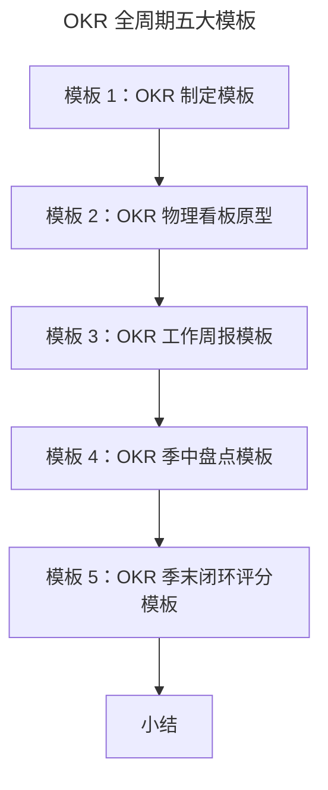

# OKR 填写模板及案例

> **适用范围**：OKR 教练、Team Lead、HR，以及需要在 OKR 关键节点（制定/站会/周报/季中盘点/季末评分）使用规范化模板的团队。
>
> **更新摘要（v2 · 2026-08 更新）**：
> - 结构化升级为 6 节骨架（导言 / 核心方法论 / 关键流程 / 工具与实战 / 常见误区 / 进阶延展）
> - 收录 5 个京东实战模板（制定/物理看板/周报/季中盘点/季末评分）及使用场景与注意点
> - 为 Mermaid 图补充文字解读

## 1. 导言

在我们落地 OKR 的过程中，会有很多关键的工作节点，比如 OKR 制定、每日站会、季度中 OKR 评审、季末 OKR 评分等。如果在这些关键节点，能有规范化的讨论内容展现形式和基本流程，就可以提高工作的效率。接下来，我就把在京东内部实践 OKR 的相关模板分享给你，并从应用场景和具体操作流程上帮你熟悉模板的使用。按照模板中的要素来进行 OKR 运行工作的设计和安排，便于我们及时记录 OKR 进程，也能随时查看和修改，还可以作为 OKR 文化的载体进行传播和互相学习。

当然，只有适合自己的才是最好的，你前期在组织内部导入 OKR 时，可以先参考使用我提供给你的模板，如果感觉用得不太顺，可以基于我的模板进行改善和裁剪，找到适合你组织的应用形态。

## 2. 核心方法论

OKR 落地的关键节点模板化方法论是：把 OKR 全生命周期（制定→日跟进→周跟进→季中盘点→季末评分）的每个节点都定义"使用场景 + 操作流程 + 注意点"三要素，使 OKR 从"写一次就放"变为"持续被跟进的活文档"。模板既是效率工具，也是 OKR 文化的载体——它把拥抱变化、过程管理、绩效导向等理念固化成可重复执行的行为。下文 5 个模板覆盖了 OKR 季度运营的全部关键节点。

## 3. 关键流程

### 模板 1：OKR 制定模板

**使用场景**：按照组织中绩效制定节奏，在开始制定或是过程中需要新增 OKR 时使用该模板（这里所提供的模板均是基于季度的 OKR 制定节奏来呈现的，下同）。

**操作流程**：先确定方向 O，再生成每个 O 的 KR，所有 OKR 都需要上下级共识。

**注意点**：

- O 和 KR 要遵循自上往下以及自下而上的生成规律；
- O 和 KR 的制定需要遵循先前讲过的原则；
- 每个 KR 明确责任人，如果有依赖方就把配合方也明确出来；
- OKR 的自主性也体现在主动和依赖相关方的沟通共识上；
- 每个 KR 需要投入的资源和精力不同，所以需要进行比较，设置权重。

### 模板 2：OKR 物理看板原型

**使用场景**：每天站会时使用该 OKR 物理看板。

**操作流程**：首先在团队工作现场搭建该物理看板，然后在团队内制定使用该看板的规则，也就是每日固定时间，来看板前基于每日站会三问过每个工作任务的进展。

**注意点**：

- 团队基于看板的每日站会，规则一旦制定必须刚性执行，否则看板就白搭了；
- 建议通过横向泳道区分出不同的项目或业务；
- 建议制定团队成员的头像，更加透明团队成员的工作分布；
- 建议在物理看板上贴出整个团队的 OKR；
- 看板上的工作任务支撑 KR 的完成，都是从 KR 中拆分出来的。

### 模板 3：OKR 工作周报模板

**使用场景**：每周写周报时。

**操作流程**：O 和 KR 都是制定时生成的，可以直接复制到周报里，但需要更新每个 KR 的进展和信心指数。遇到的问题、阻碍越多，信心指数就标注越低，对应着 KR 下方的问题&风险就要重点描述，反之信心指数越高，说明完成该 KR 没有阻碍，问题&风险可以写无。除此之外，周报中还需要体现完成每个 KR 所做的日常工作，包括本周所做工作（较详细）以及下周工作计划（简写）。

**注意点**：

- 1）2）3）对应的就是每日站会上的工作任务；
- 彻底完成的 KR，建议在周报中可以用灰色来标记；
- 建议可以突出周报中"问题&风险"内容，标记红色并加粗；
- 可以说明 OKR 变更情况，通过周报管理经营变化；
- 周报要发给与完成 OKR 都有关联的相关方。

### 模板 4：OKR 季中盘点模板

**使用场景**：过程中对 OKR 完成情况盘点时使用该模板，盘点节奏可以每月或者在一个季度的季中来进行。

**操作流程**：盘点时，个人要更新完 OKR 的整体进度，然后主动约上级时间进行 OKR 盘点，或者上级主动发起，来组织整个团队的过程盘点。

**注意点**：

- OKR 过程中的盘点，一定要正式化，也就是上级管理者必须要参与；
- 盘点时发现的问题，先做现场共识，及时记录并做后续跟进；
- 盘点时发现比较严重的问题，后续需要发起专题讨论，形成新共识；
- 管理者这时候充当的是教练，做绩效辅导，目的是帮助下属解决绩效实现过程的问题；
- 下属要主动叙述绩效完成情况，坦诚交流问题，并努力获得上级支持。

### 模板 5：OKR 季末闭环评分模板

**使用场景**：组织中绩效闭环管理时。

**操作流程**：一般由 HR 侧发起整个 OKR 绩效闭环评估，团队中个体先进行自评，然后拉起 OKR 实现过程的相关方，对每个 KR 进行评分，O 的得分自动计算。

**注意点**：

- OKR 实现过程的依赖方，需要参与进行评分，并给予评估意见；
- 上级必须要对下属进行评分，给予评估意见，并关注其他相关方评估意见；
- KR 的评分是进度和难度的综合评价，不能仅看进度；
- KR 的评分要绩效导向，关注营收、用户、效率和能力的增长情况；
- 关注自驱型 OKR 的实现情况，给予鼓励和激励倾斜；
- 组织中的激励要参考 OKR 评分结果来给予，否则 OKR 就会沦为形式。

上图按 OKR 季度运营的时间顺序排列五个模板：制定模板（季度初）→ 物理看板（每日）→ 周报（每周）→ 季中盘点（季中）→ 季末评分（季末）。五模板串起 OKR 全生命周期，每个节点都有标准化抓手，是 OKR 落地的最直接保障。

## 4. 工具与实战

5 个模板可直接作为 OKR 落地的起步工具箱。导入 OKR 的团队建议按顺序启用：先用模板 1 把 OKR 写出来，再用模板 2 搭物理看板跑日站会，接着用模板 3 落实周报跟进，季中用模板 4 做盘点，季末用模板 5 做闭环评分。模板不是僵化的——前期可参考使用，不顺手就基于自己的模板进行改善和裁剪。结合 OKR NPS 收集模板在应用过程中的问题，持续改进，迭代出最适用于自己组织的 OKR 模板。

## 5. 常见误区

- **制定模板填完就放**：OKR 制定模板不是一次性文档，需要在季中盘点和季末评分时持续更新。
- **物理看板规则不刚性执行**：规则一旦制定必须刚性执行，否则看板形同虚设。
- **周报只写工作不写信心指数和变更**：信心指数是风险量化，OKR 变更管理是经营变化响应，两者缺失会让周报退化为流水账。
- **季中盘点不正式化**：管理者不参与、不现场共识、不跟进问题，盘点就失去意义。
- **季末评分只看进度不看难度**：KR 评分是进度和难度的综合评价，仅看进度会鼓励"定低目标拿高分"。
- **激励不参考 OKR 评分**：组织中的激励若不参考 OKR 评分结果，OKR 就会沦为形式。

## 6. 进阶延展

### 小结

从无序混乱中变得高效，就是要有规范化的管理，而模板是承载规范化管理的落地工具之一。同样的，OKR 工作法中各个关键时间节点的模板，也是我们高效落地 OKR 的有效抓手。5 个模板覆盖 OKR 全生命周期：制定（季初）→ 物理看板（日）→ 周报（周）→ 季中盘点（季中）→ 季末评分（季末），是 OKR 不流于形式的最直接保障。最后，还可以结合 OKR NPS，来收集 OKR 模板在应用过程中的问题，持续改进，迭代出最适用于自己组织的 OKR 模板。
