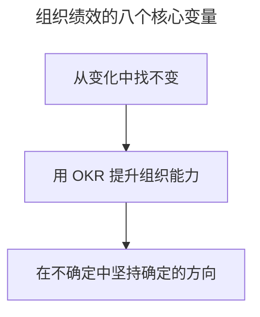

# OKR 工作法：制胜互联网下半场

> **适用范围**：组织管理者、决策层、OKR 变革推动者，以及希望从全局视角理解 OKR 与组织能力关系的从业者。
>
> **更新摘要（v2 · 2026-08 更新）**：
> - 结构化升级为 6 节骨架（导言 / 核心方法论 / 关键流程 / 工具与实战 / 常见误区 / 进阶延展）
> - 提炼"战略/变革/组织结构/管理/激励/领导/团队/文化"八变量框架与 OKR 的映射关系
> - 保留课程三模块回顾，为 Mermaid 图补充文字解读

## 1. 导言

在刚写这篇结束语时，窗外飘起了 2020 年北京的第一场雪。今年，已经是我在北京工作的第 10 年。还记得刚来北京时，常在路边招手打出租车的场景，也记得出门要带着钱包，里面会放点钱，以方便自己买东西。那个时候，给家里还是以打长途电话的形式来报以平安。

10 年间，互联网给我们生活带来了翻天覆地的变化，滴滴的共享出行、腾讯的微信、美团的生活服务、阿里的支付宝、京东物流、字节跳动的头条和抖音，等等。这些产品和服务重构了人与信息、人与商品、人与人以及人与娱乐的连接方式，2020 开年的新冠疫情又给这个世界带来了更多未知。

在这个总是被重构，迭代速度越来越快，也越来越不确定的时代。很多人也越来越焦虑，而焦虑会让人略显浮躁，尤其在组织里，不少管理者总期望通过引入一个流行的名词，或者一个新的概念，就想把组织管理好，却没有从根本上花时间去锻炼组织的核心能力。而这些组织的核心能力，才是我们在纷乱的世界中，让组织保持不乱稳步向前的定力。

## 2. 核心方法论

### 从变化中找不变

虽然在组织里，新的概念和方法层出不穷，但是有一些基本所需的能力没有变。

首先，在组织中做任何事情，无论是什么业务，还是什么项目，无论是不是敏捷交付，还是瀑布交付，我们始终离不开一个起点：**目标**。有了目标，无论是什么人去实现，无论用什么方法去实现，我们最终都会获得产出**绩效**。

从目标制定，到最终获得绩效，在这个过程中，还有很多影响绩效获得的关键变量。组织中的目标，一定源于**战略**。战略的制定，会带来两个方面的变化，要么产生了基于现有业务的增长目标，要么产生了基于新业务的创新目标，所以战略和源于战略的**变革**，影响了一个组织目标的制定。目标设定之后，承接目标的首先是**组织结构**，而不是人。这个时候确定的组织结构，会带来上下层级和左右职能的分工，这些设计会影响绩效的产出。而一旦目标和组织结构设定完成，是通过**管理手段**来实现目标的，所以管理的目的就是去高效取得绩效结果。

有了管理，就有管理者和被管理者，这两种角色的行为，形成了组织的**文化**，而文化则反过来深深影响所有人的行为。管理者的**领导能力**和**激励风格**，是能否激活团队的核心，也会影响被管理团队的行为，而被管理的一线**团队**的分工合作最终产出绩效。

所以，组织中的**战略、变革、组织结构、管理、激励、领导、团队和文化**这八个没有变的核心变量，深深影响着每个目标的最终绩效达成。当一个新的概念和方法涌现时，需要围绕这八个方面提升能力，对于组织而言才是有意义的。

上图把全文浓缩为三段：先从变化中找出八个不变的核心变量（战略/变革/组织结构/管理/激励/领导/团队/文化），再用 OKR 对照这八个变量提升组织能力，最后落到"在不确定中坚持确定的方向"。这是判断任何新方法（包括 OKR）对组织是否有意义的检查框架。

### 用 OKR 提升组织能力

我就是围绕 OKR 如何提升组织中的各项能力，来设计这些课时内容的：

- 在**模块一，全局**中，我介绍了**OKR 与战略的关系**，让 OKR 这种新的目标管理方法要能和组织的战略管理融合。因为有**组织结构层级的存在**，所以我还介绍了如何用 OKR 来做好各个层级的目标对齐和生成，确保战略能在多层级的组织中落地。
- 在**模块二，实操**中，我详细介绍了 O 和 KR 的写法方法论，有了方法论的指导可以提高我们在写 OKR 时的效率，也就提高了组织中绩效制定的效率。所以，**掌握 O 和 KR 的实操写法，就可以实打实地提高我们做绩效管理的能力**。
- 在**模块三，落地**中，我讲解了如何通过 OKR 来细化组织中**目标管理的流程**，如何通过 OKR 来**激励团队**（还涉及了**领导力**），如何通过 OKR 来建设组织中优秀的**文化**，以及如何通过 OKR 的变革来提高**组织变革**的能力。可以看到，OKR 落地过程，提升了组织中流程管理、激励、领导、文化和变革建设的能力。

所以，OKR 作为一种新的目标管理方法，其引入组织后，并没有去颠覆什么。我们要能回归本质，想清楚 OKR 可以给组织中各项能力提升的价值到底是什么，才可以让我们更有信心去落好 OKR。

## 3. 关键流程

把 OKR 与八个核心变量做映射，就得到 OKR 提升组织能力的关键流程：① OKR 与**战略**融合（O=战略方向，KR=增长指标）；② 通过各层级 OKR 生成对齐**组织结构**层级；③ 通过 O 和 KR 写法方法论提升**管理**与绩效制定效率；④ 通过 OKR 流程机制细化目标管理的流程；⑤ 通过 OKR 升级**激励**设计（基于 OKR 评分做公平激励）；⑥ 通过日/周/季中检视机制建立上下级工作关系提升**领导力**；⑦ 通过 OKR 通晒和自驱目标激活**团队**；⑧ 通过调思维/做管理/定规则塑造 OKR **文化**；并通过 OKR 转型实践提高**组织变革**能力。八变量逐一被 OKR 覆盖，OKR 才能全方位提升组织能力。

## 4. 工具与实战

在注重组织能力的互联网下半场，通过 OKR 可以全方位地提升组织中战略管理、变革管理、流程管理、激励和领导团队以及文化建设的能力，让我们更有组织定力，稳步向前，制胜未来。课程三模块的实战价值可对照检查：

| 模块 | 对应组织能力变量 | 实战产出 |
| --- | --- | --- |
| 模块一 全局 | 战略、组织结构 | OKR 与战略对齐、各层级 OKR 生成规律 |
| 模块二 实操 | 管理、绩效 | O 的 4 原则与 4 类型、KR 万能公式、4 类 OKR 案例点评 |
| 模块三 落地 | 流程、激励、领导、团队、文化、变革 | 季度三阶段流程、5 大模板、激励升级、文化三步塑造、变革三维攻坚 |

这张对照表是回顾全课程价值的索引，也是检查"自己组织在哪些变量上还缺能力"的工具。

## 5. 常见误区

- **引入流行名词就以为能把组织管理好**：焦虑和浮躁让人追逐新概念，却没有从根本上锻炼组织核心能力。OKR 不是名词，而是要落到八个变量的能力提升上。
- **认为 OKR 会颠覆原有管理**：OKR 引入后并没有颠覆什么，而是回归本质，提升组织中各项能力。
- **只学写法不学落地**：只掌握 O 和 KR 写法，不建立流程、激励、文化、变革机制，OKR 仍落不了地。
- **忽视八变量的系统性**：只抓其中一个变量（如只抓流程）而忽略其他（如激励/文化），OKR 价值会被其他变量的短板抵消。

## 6. 进阶延展

### 在不确定中坚持确定的方向

天下没有不散的筵席，要结束了，还真的有点不舍，希望这个 OKR 专栏能真正帮到你。作为组织，我们需要从变化中找不变。同样作为我们个体，在这个不确定的时代，确定的是我们要去学习，去成长，去奋斗，才能有属于自己更美好的未来。

在北京工作的这 10 年间，曾读到过一句特别感动我的话，在这里也分享给你，与君共勉：

> 什么是奋斗？奋斗不是让你上刀山下火海，也不是让你头悬梁锥刺股。奋斗就是每天踏踏实实地过日子，做好手里的每件小事，不拖拉、不抱怨、不偷懒、不推卸责任。每一天一点一滴地努力，才能汇聚起千万勇气，带着你的坚持，引领你到你想要到的地方去。

OKR 工作法的价值，最终要回到组织能力的持续提升上：战略/变革/组织结构/管理/激励/领导/团队/文化八个变量，是任何时代都不变的核心。在互联网下半场，用 OKR 全方位提升这八项能力，就是组织制胜未来的定力所在。
