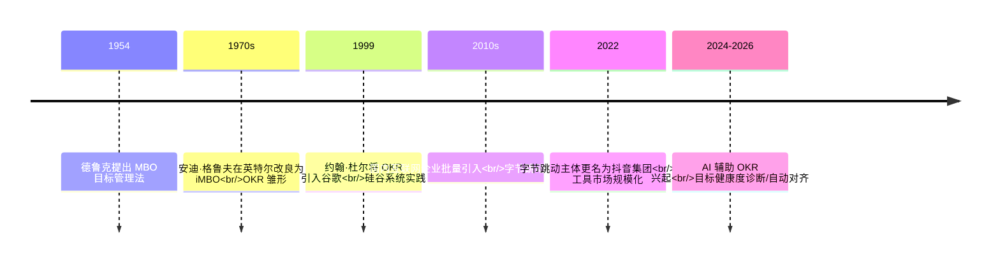
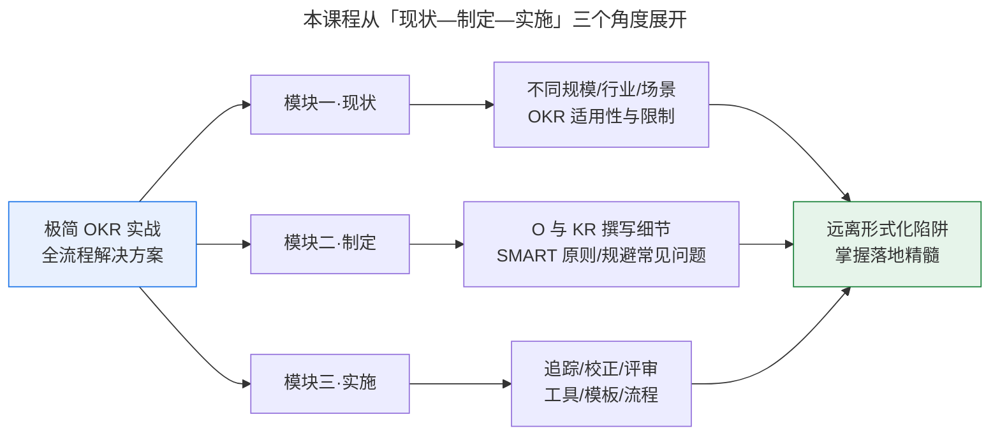

# 如何完成 OKR 理论到实践落地的跨越？

> **适用范围 / 更新摘要**：本文为「极简 OKR 实战」模块一·现状的开篇导论，面向各级管理者、HR 与企业员工，系统梳理 OKR 从理论到实践落地的跨越路径。v2 · 2026-08 更新：剔除已停运案例（豌豆荚），更正企业归类（字节跳动旗下主体 2022 年更名为抖音集团、蔚来归类为新能源造车而非传统行业），补充 2025 年中国 OKR 工具市场规模 47.3 亿元及头部厂商份额，新增 2024-2026 AI 辅助 OKR 实践趋势，并将失效图片替换为 Mermaid 图与文字表格。

## 1. 导言

目标与关键成果法（Objectives and Key Results，OKR）是近十年国内企业管理领域最受关注的方法论之一。国内互联网行业与金融、新能源造车、零售等传统行业的大量企业已应用 OKR 相当长时间，并取得了可量化的成果；与此同时，仍有更多企业正在踏上 OKR 转型之路。国内 OKR 理论的第一批追随者包括字节跳动（2022 年旗下主体更名为抖音集团）、百度、小米等互联网企业；随后金融、新能源造车等行业的企业也陆续完成了 OKR 转型。

实际上，OKR 并非新概念。它于 20 世纪 50 年代起源自彼得·德鲁克（Peter Drucker）提出的目标管理法（Management by Objectives，MBO），后经安迪·格鲁夫（Andy Grove）在英特尔（Intel）改良，于 20 世纪末与 21 世纪初被谷歌（Google）、领英（LinkedIn）等硅谷企业系统采用，进而逐步传入国内。

在十年以上的绩效考核实践经历中，笔者见证了 OKR 在国内的传播、应用与兴起过程：从最初的舶来理念，发展为百度、阿里、知乎等名企的重要企业管理思想与员工培训项目。受众主体也从前些年主要来自大型企业的 HR 与高管，扩展至中小型企业的管理人员、部门经理、项目经理等基层管理岗位，甚至包括部分纯粹为个人职业规划而学习 OKR 的学员。本文适用于希望系统性理解 OKR 落地全貌、避免形式化陷阱的各类组织与个人。

## 2. 核心方法论

### 2.1 定义与本质

OKR 是一套通过明确目标（Objective，O）和定义清晰的关键结果（Key Result，KR），辅以进度跟踪与对齐机制，实现战略落地的目标管理工具与思维框架。其本质是用「目标 + 关键结果」的简洁结构，替代传统以任务分解为核心的管理模式，让组织各级成员围绕同一目标协同。

- **O（目标）**：清楚传达行动的目的与意图，与公司战略紧密相连；客观、具体、可辨识，便于相互传达与判断是否达成；具备一定挑战性更佳。
- **KR（关键结果）**：描述目标达成的必要条件，具体、可衡量，用以通过追踪 KR 进度反推 O 的达成进度。

### 2.2 核心原则

OKR 的高效运作依赖四条核心原则：

1. **聚焦（Focus）**：每次制定目标 O 不超过 5 条，每个目标配置 3-5 条 KR，强制优先级筛选。
2. **对齐（Alignment）**：自上而下与自下而上双向对齐，确保各级目标向上承接战略、向下激活执行。
3. **追踪（Tracking）**：以可量化的 KR 为锚点，按周/月/季周期持续追踪进度，而非年终一次性评估。
4. **伸展（Stretching）**：鼓励设定具有挑战性的目标，理想完成度设定在 0.7（70%）而非 1.0，避免目标过于保守。

### 2.3 边界条件

OKR 并非万能工具，其适用性受以下边界条件约束：

- **战略层**：OKR 解决的是「战略如何落地」而非「战略如何制定」的问题，不能替代战略洞察本身。
- **文化层**：OKR 需要透明、信任、授权的组织文化土壤；在强管控、强科层文化中容易退化为换皮 KPI。
- **规模层**：不同规模、行业、发展阶段的企业，OKR 的重点实践存在显著差异（详见模块一后续章节）。
- **工具层**：在缺乏数字化追踪工具支撑时，OKR 的追踪与对齐成本会显著上升。

## 3. 关键流程

OKR 从理论到实践落地的全流程，可概括为「制定—对齐—追踪—校正—复盘」五步闭环。下图呈现了 OKR 发展演进的关键时间节点，帮助理解其方法论源流。

**图解**：从 1954 年德鲁克提出 MBO，到 1970 年代格鲁夫在英特尔改良为 iMBO（OKR 雏形），再到 1999 年约翰·杜尔（John Doerr）将 OKR 引入谷歌并形成硅谷系统实践，OKR 用了近半个世纪完成理论到方法的演化。国内互联网企业在 2010 年代批量引入，2022 年前后 OKR 数字化工具市场进入规模化阶段，2024-2026 年则进入 AI 辅助 OKR 的新阶段——这是理解「理论到实践跨越」不可忽视的时代背景。

下图进一步呈现本课程「极简 OKR 实战」三大模块的总体结构，作为后续学习的导航。

**图解**：本课程从「现状—制定—实施」三个角度展开。模块一从高维视角审视 OKR 在不同企业规模、行业、场景下的作用、适用性与限制，避免盲目借鉴导致「错误场景采用错误实践」；模块二聚焦制定细节，讲解 O 与 KR 的撰写、追踪与调整，帮助常年应用 KPI 的企业平稳过渡；模块三聚焦实施执行阶段，提供追踪、校正、评审的最佳实践与可学即用的工具模板。三者共同指向「远离形式化陷阱、掌握落地精髓」这一目标。

## 4. 工具与实战

### 4.1 国内 OKR 工具市场现状（2025）

根据博研咨询《2026 年中国目标和关键结果（OKR）工具行业发展现状与市场占有率及排名研究分析报告》（数据经 IDC《中国协同办公软件市场跟踪报告》及厂商财报交叉校验），2025 年中国 OKR 工具市场总规模为 47.3 亿元，同比增长 28.6%。头部厂商格局如下：

| 厂商 | 2025 年 OKR 相关收入 | 市场份额 | 核心优势 |
| --- | --- | --- | --- |
| 钉钉（阿里） | 9.2 亿元 | 19.4% | 与阿里云智能、Teambition、宜搭低代码深度集成，覆盖中大型制造/零售/互联网 |
| 飞书（抖音集团） | 7.6 亿元 | 16.1% | 依托字节跳动内部 OKR 实践沉淀与飞书 People HR 一体化架构，深耕科技/新消费/出海 |
| 北森 | 4.8 亿元 | 10.1% | OKR 与人才盘点、继任计划强耦合，金融/央企/专业服务机构高粘性 |
| ONES | 3.1 亿元 | 6.6% | OKR 嵌入敏捷研发协作，软件外包/游戏/AI 初创公司闭环 |
| Worktile | 2.4 亿元 | 5.1% | 轻量级 OKR+任务看板，50-500 人成长型公司覆盖率高 |
| 其他厂商合计 | 20.2 亿元 | 42.7% | 高度碎片化，含简道云、明道云、TAPD、纷享销客等 |

展望 2026 年，市场预计扩容至 60.8 亿元，同比增长 28.5%，行业正从爆发式增长转向结构性深化阶段。

### 4.2 AI 时代的 OKR 实践趋势（2024-2026）

2024 年被称为「AI 应用元年」，AI 原生 App 行业规模在 2024 年 12 月已达 1.20 亿（QuestMobile）；2025 年 AIGC 细分行业总使用时长同比增长 177%。这一波 AI 浪潮正在重塑 OKR 实践，三大方向已从概念走向落地：

1. **AI 辅助起草**：通过自然语言处理（NLP）解析业务场景描述，自动生成符合 SMART 原则的 OKR 组合，并标注各 KR 的可衡量路径与数据源。钉钉 OKR 模块已嵌入目标起草辅助，飞书于 2025 年 Q4 上线「OKR + 飞书多维表格 + AI Agent」工作流，支持将季度营收目标自动拆解至区域、客户层级并动态预警偏差。
2. **目标健康度诊断**：对 OKR 文本进行 SMART 合规校验，识别模糊表述、缺乏量化、方向冲突等问题。北森 AI 绩效助手内置 SMART 智能校验引擎，目标清晰度提升 60%；钉钉在 2025 年下半年试点「目标健康度 AI 诊断」功能，试点客户目标设定完成率平均提升 23.7%。
3. **自动对齐建议**：基于组织关系图谱与语义相似度计算，生成对齐热力图，可视化呈现横向依赖强度与纵向语义一致度，对低于阈值（如相似度 < 0.65）的目标对自动标红预警，并推送跨部门对齐建议。

需要指出的是，Microsoft Viva Goals 于 2025 年底正式退役，原 Ally.io 团队孵化的 Rhythms.ai 成为继任方向之一，其提出「OKR 仅解决约 10% 的对齐问题，剩余 90% 是战略与日常执行之间的连接组织」这一判断，值得国内从业者关注。

### 4.3 课程实战定位

本课程「极简 OKR 实战」基于笔者在 OKR 领域的咨询经验与扩展研究，包含大量企业真实应用案例，并在此基础上提炼操作要领与原则，共计 9 讲。从制定实施到追踪矫正，从场景还原到案例实战，大到与企业战略的对齐，小到操作模板的使用，深入各个细节层面。课程覆盖三类典型问题：KPI 思维如何向 OKR 思维转变；如何制定能真正激励员工的目标；如何建立自下而上的反馈机制并及时优化战略。

## 5. 常见误区与避坑指南

许多企业实践 OKR 时都会遇到以下问题，归根结底是「形式化」的表现：

- **制定耗时过长**：OKR 制定会议花费比 KPI 多好几倍的时间，挤占工作时间。
- **与 KPI 雷同**：制定完成后，OKR 与之前的 KPI 相比看不出本质区别。
- **束之高阁**：制定后将 OKR 搁置，平时工作仍沿袭旧有方式。
- **战略未统一**：目标经层层分解后，一线团队目标与公司战略并未实现高度统一。

许多员工用三个字总结对公司实施 OKR 的看法：「形式化」。其根本原因在于企业对 OKR 的理解仅停留在理论表面，或生搬硬套其他企业的实践经验，而没有抓住 OKR 的本质。OKR 是一种「理解易，操作难」的方法：「目标 + 关键结果」的格式看似简单，但实践落地过程中有大量至关重要的操作细节，细节操作是否准确，是决定 OKR 实践是否形式化的分水岭。

**避坑要点**：

- 不要把 OKR 当作换皮 KPI，重点在于「目标分解」而非「任务分解」。
- 不要照搬大厂经验，需根据自身规模、行业、阶段因地制宜。
- 不要重制定轻实施，追踪、校正、评审与制定同等重要。
- 不要忽视文化土壤，透明与授权是 OKR 发挥效用的前提。
- 不要拒绝 AI 工具，2024-2026 年 AI 辅助能力已成为降低 OKR 落地成本的关键变量。

## 6. 进阶延展与参考资料

### 6.1 进阶延展

- **OKR 与 KPI 的融合**：2025 年主流趋势是根据业务单元特性灵活配置——为传统职能部门保留 KPI 框架，为创新团队启用 OKR 模式，而非一刀切。
- **OKR Lag 概念**：指战略变化与执行之间的滞后。传统季度 OKR 周期难以匹配以周为单位变化的业务优先级，AI 辅助的持续监测与动态调整正在缩短这一滞后。
- **五四原则与 70% 完成度**：不超过 5 个目标、每个目标不超过 4 条 KR；理想完成度设为 0.7 分，避免目标过于保守或过于激进。
- **OGSMA 战略解码**：北森提出的目标（Objective）-目标（Goals）-策略（Strategies）-衡量标准（Measures）-行动计划（Actions）全链路拆解体系，可作为 OKR 上接战略的补充框架。

### 6.2 参考资料

本节时效性数据与趋势判断依据如下公开来源（2026-08 核查）：

- 博研咨询《2026 年中国目标和关键结果（OKR）工具行业发展现状与市场占有率及排名研究分析报告》（2025 年市场规模 47.3 亿元、厂商份额数据）
- IDC《中国协同办公软件市场跟踪报告，2024H2》《2025 年中国企业绩效管理数字化研究报告》
- QuestMobile《2024 中国移动互联网年度大报告》《2025 中国移动互联网年度大报告》（AI 原生 App 规模、AIGC 时长增速、抖音集团流量数据）
- 中华网山东频道、科创板日报、新京报贝壳财经（2022 年 5 月字节跳动香港主体更名为抖音集团系列报道）
- 北森绩效云官方资料（IDC 连续 4 年绩效管理 SaaS 市场份额第一、OGSMA 战略解码、AI 绩效助手）
- Synergita《AI OKR Software: How Generative AI Is Transforming Goal Setting》（2026-07，AI OKR 五阶段循环）
- Rhythms.ai、Betterworks 企业 OKR 执行平台公开资料（Microsoft Viva Goals 退役后继任方向）

下一篇将进入「为什么 OKR 广受企业青睐？」，通过旅游营销公司公众号案例与手机公司 UI 设计案例，对比 KPI 与 OKR 在战略传递、跨部门协作、员工创造力释放三个维度上的差异。