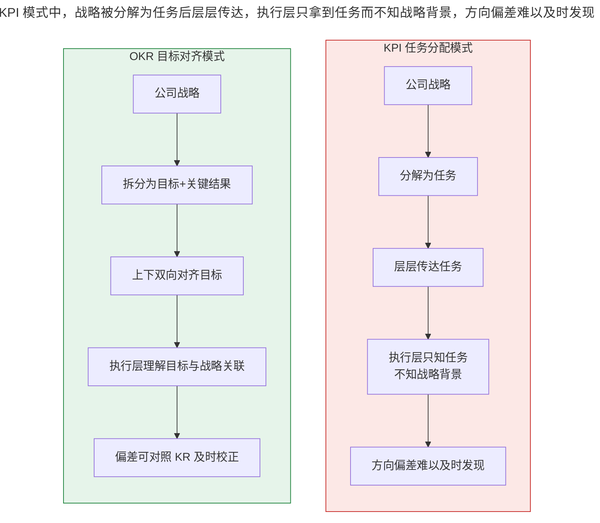
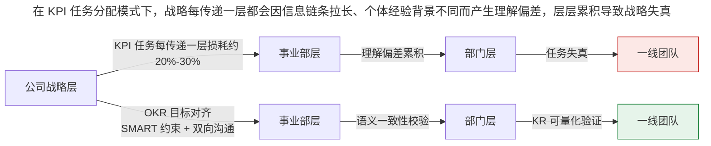

# 为什么 OKR 广受企业青睐？

> **适用范围 / 更新摘要**：本文为「极简 OKR 实战」模块一·现状第 1 讲，通过旅游营销公司公众号案例与手机公司 UI 设计案例，对比 KPI 与 OKR 在战略传递、跨部门协作、员工创造力释放三个维度的差异。v2 · 2026-08 更新：将原「今日头条、小米等新星企业」更新为「字节跳动（抖音集团）、小米」；失效图片替换为 Mermaid 对比图与文字表格；新增 2024-2026 AI 辅助 OKR 起草与对齐建议能力对三大优势的放大效应。

## 1. 导言

OKR 这两年在国内被普遍提及，很多企业都在实践和落地。那么，它到底具备哪些优势和魅力，迎来了大量拥趸？它和我们熟知的 KPI（Key Performance Indicator，关键绩效指标）又有什么样的差异？本讲先来解解惑，通过对比常见的绩效管理工具，帮助你后续更好地理解 OKR。

本文适用于已接触 KPI 但希望理解 OKR 差异化价值的各级管理者、HR 与业务骨干，也适用于正在评估是否引入 OKR 的组织决策者。

## 2. 核心方法论

### 2.1 OKR 的定义

OKR（Objectives and Key Results，目标与关键成果法）是一套通过明确目标和定义清晰的完成标准，辅以跟踪其完成情况的管理工具与方法。

- **O（目标）**：负责清楚传达行动的目的和意图，与公司的战略紧密相连；客观、具体，方便人们互相传达，以及轻易辨别一个 O 是否已经达成；具备一定挑战性更佳。
- **KR（Key Results，关键结果）**：用来描述目标达成的必要条件，具体、可衡量，以便让我们能够通过追踪关键结果的进度，知道目标的达成进度。

OKR 看起来很简单，但它的效用远远大于 KPI、KSF（Key Success Factors，关键成功因素）等传统方式。

### 2.2 SMART 原则

SMART 原则是制定 OKR 时必须遵守的原则，它保证了 OKR 的质量：

| 字母 | 含义 | 要求 |
| --- | --- | --- |
| S | Specific（具体） | 目标描述清晰、不模糊 |
| M | Measurable（可衡量） | 有明确的量化标准与数据源 |
| A | Attainable（可达成） | 具备挑战性但在能力可达范围内 |
| R | Relevant（相关性） | 与上级目标和公司战略相关联 |
| T | Time-bound（有时限） | 有明确的截止时间 |

### 2.3 OKR 相对 KPI 的方法论边界

KPI 的核心逻辑是「围绕战略制定任务，然后分解和传达任务」，本质是任务分配模式；OKR 的核心逻辑是「围绕战略制定目标，然后分解和对齐目标」，本质是目标对齐模式。两者并非互斥，而是适用于不同的业务场景——稳定可预测的业务适合 KPI，需要创新试错的业务适合 OKR。这一边界在后续「互联网行业 VS 传统行业」一讲中会进一步展开。

## 3. 关键流程

下图对比了 KPI 任务分配模式与 OKR 目标对齐模式在战略传递路径上的本质差异。

**图解**：KPI 模式中，战略被分解为任务后层层传达，执行层只拿到任务而不知战略背景，一旦方向偏差很难及时发现，造成「隐形浪费」。OKR 模式中，战略被拆分为「目标 + 关键结果」后通过上下双向对齐，执行层理解目标与战略的关联，偏差可对照 KR 及时校正。这一差异是 OKR 三大优势的方法论根源。

下图进一步呈现战略在不同层级传递时的损耗对比。

**图解**：在 KPI 任务分配模式下，战略每传递一层都会因信息链条拉长、个体经验背景不同而产生理解偏差，损耗累积后一线团队的目标可能与公司战略南辕北辙。OKR 通过 SMART 原则约束目标表达、通过双向沟通减少理解差异、通过可量化的 KR 实现一致性校验，显著降低了传递损耗。企业越大、层级越多，这一损耗差异越显著。

## 4. 工具与实战

### 4.1 案例一：旅游营销公司公众号

某旅游行业的营销公司举行了一次 OKR 制定工作坊，并邀请笔者帮助落地实行 OKR。他们的总目标是「打造一个在业内有影响力的旅游类公众号」。制定 OKR 之前，该项目的 KPI 是下面这样的：

> - 每周发布一篇游记文章；
> - 保证文章排版美观大方；
> - 每个月有一篇文章阅读量达到 1 万以上；
> - 及时回复公众号后台提问；
> - 每天各类渠道推广公众号文章不少于 10 次。

然后大家跟随着工作坊的流程，群策群力，制定出了如下 OKR：

> **O：打造一个在业内有影响力的旅游类公众号**
>
> - KR1：Q3 公众号粉丝数从 2 万增长至 8 万；
> - KR2：月均产生 2 篇阅读量 1 万以上的爆款文章；
> - KR3：公众号文章平均打开率达到 8%（行业均值 5%）；
> - KR4：后台咨询 24 小时内回复率达到 95%。

制定 OKR 之后，笔者跟踪了该公司的管理人员和其他员工，他们给出了如下反馈：

- 有了目标参考后，他们发现以前有些任务是偏离方向的，并且对任务的优先级也有了新的理解；
- 基于目标进行思考后，他们发现了许多对完成目标非常有价值的事情，而这些是他们以前完全没意识到的；
- 敢于试错和提出建议。以前大家执行任务发现有不对的地方时，由于缺乏依据，对提意见尽量采取「能免则免」的态度；而现在在执行过程中，他们能够及时地给予上级反馈，并大胆地提出建议，做出正确的调整。

所以，别小看 OKR 这个看似简单的方式，它能够帮人们聚焦在「目标」而非「任务」上，从而**改变整个组织的思维模式和行为模式**。

仍以这家营销公司为例，他们在使用 OKR 之前，有一条 KPI 是「保证文章排版美观大方」。这条 KPI 不够具体，也很难衡量，导致大家经常在文章排版上产生很多分歧。在 OKR 工作坊中，大家用 SMART 原则重新整理了该要求，变成了这样一条 KR：「排版标识明显，字体统一，图文搭配；各篇文章使用同一风格」。相比前者，后者更加具体、可衡量，在执行时也更易参考，不容易出现偏差。

### 4.2 案例二：手机公司 UI 设计

笔者曾服务过的某手机公司，他们 2017 年的战略目标是「通过提供更低成本、运行更流畅的产品，占领手机的中低端市场」。该战略目标经过内部的层层分解和传递，到达 UI 设计部门时，就变成了「生产一套时尚的 UI 界面」。

首先这个任务看起来就与服务中低端市场有所偏差，至少不是重点——因为中低端市场对价格更加敏感，对时尚也有独特的解读。其次，设计部门只拿到了分解完成的任务，对该任务背后的战略背景，以及从战略转化到任务的过程并不了解。他们根据自己拿到的任务和自己对任务的理解，最后生产了好几个版本，也没得到市场部的满意，最后勉强发布，市场反馈也平平。所以，任务和战略发生偏移，给企业带来的浪费是非常巨大的。

而 OKR 能有效避免战略传递失真，这主要体现在以下两方面：

- **目标描述清晰**：OKR 提供了「目标 + 关键结果」这样清晰易懂的书写模版，且符合 SMART 原则，二者结合让 OKR 传递时总能保持清晰、具体、可衡量。
- **目标分解过程中更容易保持一致性**：OKR 系统中各级单位分解和传递的是目标，而非将目标分解为任务再传递，大大减少了目标被解释和转译的次数；目标之间也更容易相互验证一致性。SMART 原则中的 Relevant（战略相关性），保证了各级在分解目标时始终保持向上对齐。

### 4.3 OKR 三大优势

通过上述案例可以看到，OKR 通过聚焦目标与遵守 SMART 原则这两大法宝，可以帮助企业达成以下目的：

1. **让战略目标有效地传递至基层**：许多企业都面临如何准确地把企业战略传达到基层的问题。企业越大，内部层级越多，链条越长，战略目标就越容易发生损耗和被曲解。OKR 通过清晰描述与目标分解机制有效缓解这一问题。
2. **让跨部门协作变得高效**：跨部门协作往往规模大、复杂度高，不同职能部门之间容易在事务和细节上争论不休。OKR 中的目标（O）提供了锚点作用，当跨部门协作产生分歧时，在有目标的参照下，大家更容易达成共识。
3. **释放员工创造力，进而提升积极性**：传统的自上而下传递任务的模式既束缚部门协作，也束缚员工创造力。有了 OKR 之后，员工可以轻易对齐上级与公司的战略目标，检视自己的行动是否有助于最终目标达成，及时发现过程中的问题并上报，提出切实有效的建议。

### 4.4 AI 时代对三大优势的放大（2024-2026）

2024-2026 年，AI 能力的注入正在显著放大 OKR 的上述三大优势：

- **战略传递**：AI 自动对齐建议基于组织关系图谱与语义相似度计算，生成对齐热力图，对语义相似度低于阈值的目标对自动预警。据公开资料，飞书「OKR + 多维表格 + AI Agent」工作流已在美团、理想汽车等标杆客户中实现人均目标管理耗时下降 41%。
- **跨部门协作**：AI 可基于任务关联词频与协作记录，识别跨部门 KR 之间的依赖强度，在评审会前自动生成依赖清单与冲突预警，减少会议中的低效争论。
- **员工创造力**：AI 辅助起草降低了 OKR 书写门槛，让员工从「填表」中解放出来，把精力集中在「目标思考」本身；同时 AI 基于历史绩效数据为员工推荐个性化发展建议，使 OKR 系统从考核工具向成长平台转型。

## 5. 常见误区与避坑指南

- **误区一：把 OKR 当作更严格的 KPI**。许多企业制定完 OKR 后与之前的 KPI 看不出区别，原因在于仍以任务思维而非目标思维撰写。判断标准：如果 KR 是动作（如「发布文章」）而非结果（如「粉丝增长至 8 万」），就是 KPI 化的 OKR。
- **误区二：O 缺乏挑战性**。O 若只是日常工作的复述，无法激发员工跳出舒适区。O 应具备鼓舞性，KR 才负责量化。
- **误区三：KR 不可衡量**。如「保证文章排版美观大方」这类 KR 无法追踪进度，必须用 SMART 原则重写。
- **误区四：忽视相关性（Relevant）**。各级目标分解时若不校验向上对齐，就会出现手机公司 UI 设计案例中的战略偏移。
- **误区五：拒绝 AI 工具辅助**。在 2026 年的工具环境下，仍坚持纯手工撰写与追踪 OKR，会显著放大制定耗时与对齐成本。

## 6. 进阶延展与参考资料

### 6.1 进阶延展

- **目标设定理论（Goal-Setting Theory）**：由 Locke 与 Latham 提出，研究表明具体且具有挑战性的目标能带来更高绩效，这是 OKR「挑战型 O + 量化 KR」设计的心理学基础。
- **OKR 评分惯例**：谷歌等企业采用 0-1.0 评分制，理想完成度为 0.7；持续 1.0 可能意味着目标过于保守，持续低于 0.4 则可能意味着目标过于激进或执行失焦。
- **OKR 与 360 度评估融合**：2025 年主流 OKR 工具已将 OKR 与 360 度评估、人才盘点集成，使目标达成数据成为绩效评价的多源输入之一，而非唯一依据。

### 6.2 参考资料

- 博研咨询《2026 年中国目标和关键结果（OKR）工具行业发展现状与市场占有率及排名研究分析报告》（厂商 AI 能力融合数据）
- QuestMobile《2024 中国移动互联网年度大报告》（2024 年 AI 应用元年、AI 原生 App 规模 1.20 亿）
- 北森绩效云官方资料（SMART 智能校验、目标清晰度提升 60%）
- Synergita《AI OKR Software: How Generative AI Is Transforming Goal Setting》（2026-07，AI OKR 五阶段循环：Generate→Align→Monitor→Adapt→Learn）
- 飞书 OKR 官方资料（OKR + 多维表格 + AI Agent 工作流，标杆客户人均目标管理耗时下降 41%）

既然 OKR 非常值得借鉴学习，那么我们可以照搬某些大厂的 OKR 落地经验吗？当然不可以。OKR 是个非常灵活的工具，在不同类型的组织中它都有着不同的表现形式，接下来的两讲将分别从「企业规模」与「行业属性」两个维度展开。