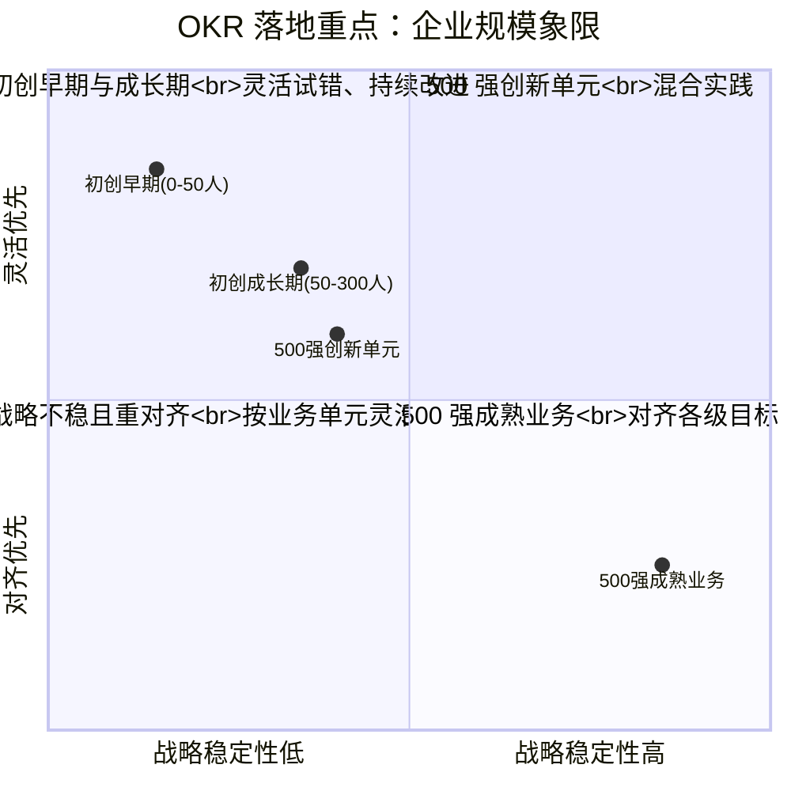
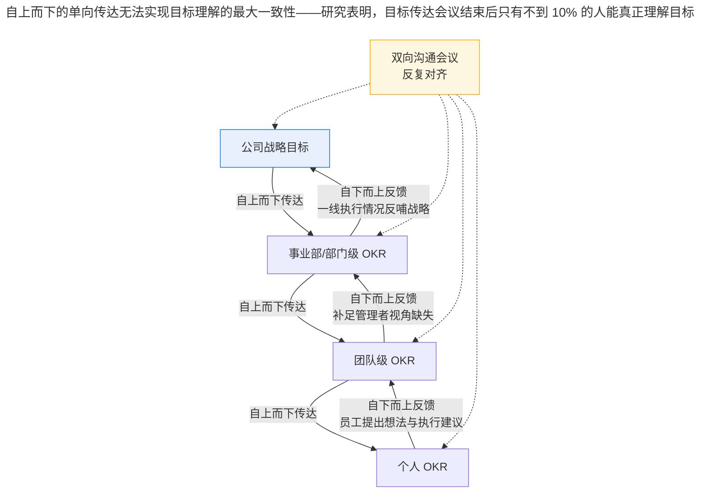

# 创业公司 VS 500 强公司，落地 OKR 重点关注什么？

> **适用范围 / 更新摘要**：本文为「极简 OKR 实战」模块一·现状第 2 讲，对比全球 500 强企业与初创公司在 OKR 落地时的重点关注差异。v2 · 2026-08 更新：失效图片替换为 Mermaid 对比象限图与双向对齐流程图；保留 Bug 率研发团队案例并标注时点；新增 2024-2026 AI 辅助对齐在大型组织中的应用数据，以及中型企业 OKR 渗透率从 19.4% 跃升至 47.8% 的市场结构变化。

## 1. 导言

上一讲提到 OKR 的诞生背景，以及它为何如此受欢迎。很容易看出，OKR 是一个非常完整的系统——从目标的制定和跟踪，再到如何更有效地引导和组织人们围绕目标工作，都提供了完整的理论和实践层面的指导。

然而，不同的企业在 OKR 上能够投入的精力和资源是有差别的。同时，对于目标管理这件事，不同的组织面临的具体问题，以及希望借助目标管理达成的效果也是有差别的。导致这种差别的主要因素有四：公司规模、公司自身的组织结构、公司发展阶段、公司所处行业的发展阶段。企业在实施 OKR 时，可以参考这四个要素，有重点地选择并实施，有针对性地解决问题，从而提高 OKR 的实施效果。

本文适用于正在评估或已启动 OKR 落地的不同规模企业管理者与 HR，尤其适合需要在不同业务单元间差异化配置 OKR 实践的集团型企业。

## 2. 核心方法论

### 2.1 规模差异下的核心命题

| 维度 | 全球 500 强公司 | 初创企业 |
| --- | --- | --- |
| 典型规模 | 1 万人以上，动辄十几万至几十万 | 数十人至数百人 |
| 组织结构 | 复杂、层级深 | 扁平、层级浅 |
| 信息传导链条 | 长，传递易失真 | 短，传递失真风险低 |
| 战略稳定性 | 高，经营模式成熟 | 低，内外部不确定性大 |
| OKR 重点 | 对齐各级目标、提升执行力 | 灵活性、持续改进、优先级 |
| 典型问题 | 战略传递失真、问题发现滞后 | 资源紧张、变化频繁 |

### 2.2 两条差异化路径的原则

- **500 强路径**：在更短时间内获取明显效果，应优先关注「对齐各级目标」与「提升员工执行力」相关的 OKR 实践。
- **初创路径**：在不确定性中尽早取得可视化成果，应优先关注与「灵活性」和「持续改进」相关的实践。

### 2.3 边界条件

规模并非绝对标准。部分大型企业的创新业务单元（如新事业部、出海团队）可能更接近初创企业的处境；部分初创企业在度过生存期后，组织结构复杂度上升，也会逐步面临 500 强的传递失真问题。因此，两条路径的判断依据应回归「信息传导链条长度」与「战略稳定性」这两个本质变量，而非单纯的员工人数。

## 3. 关键流程

下图以象限图呈现两类企业在 OKR 落地时的重点关注差异。

**图解**：横轴为战略稳定性，纵轴为 OKR 实践的优先方向（对齐 vs 灵活）。初创早期企业位于左上角，战略稳定性低、灵活优先；500 强成熟业务位于右下角，战略稳定性高、对齐优先。值得关注的是 500 强创新单元与初创成长期企业在象限中位置接近，说明规模差异并非唯一判据——当大型企业的某个业务单元面临高不确定性时，应采用接近初创企业的 OKR 实践方式。

下图呈现大型组织「自上而下 + 自下而上」双向对齐的关键流程。

**图解**：自上而下的单向传达无法实现目标理解的最大一致性——研究表明，目标传达会议结束后只有不到 10% 的人能真正理解目标。OKR 的制定会议需要管理人员和员工围绕目标反复沟通：管理者将好的想法吸入 OKR，补足自上而下视角的缺失；员工则在充分了解自身想法的前提下获得反馈，第一时间纠正理解偏差。同时，心理学研究表明，将人们卷入计划的制定过程，会让他们更愿意接受和支持该计划，从而提升认可度与主观能动性。

## 4. 工具与实战

### 4.1 全球 500 强公司：对齐优先

位列 500 强的大公司，规模普遍超过 1 万人，甚至动辄十几万、几十万。随着公司规模扩张，公司内部信息的传导链条变长，一方面会导致**战略目标在传递时失真**；另一方面会导致公司很难及时掌握各部门对战略的执行情况，**问题的发现往往具有滞后性**。最后的结果就是执行团队在对公司的战略理解发生偏差后，无法得到及时的纠正，在错误的道路上越走越远，造成更多的浪费。

所以大规模的组织在实施 OKR 时，会重点关注 OKR 在「对齐各级目标」上的操作。与对齐相关的操作主要有两点。

#### 4.1.1 自上而下 + 自下而上同时进行

在共同制定目标的过程中，这种方式能让上下级之间达到对目标理解最大一致性，而单方面传达和解释目标都是无法做到这一点的。管理者经常高估成员理解目标的能力——曾有一项针对美国 23000 名员工调查显示：只有 37% 的人清楚知道公司的目标和策略是什么，甚至只有 9% 的人认为他们团队有清晰可衡量的目标。

#### 4.1.2 符合 SMART 原则

SMART 原则能够使 OKR 的表达更加清晰，有效减少传递过程中因为理解不同带来的传递偏差，也让 OKR 的执行过程更容易追踪。当员工的行动有明确的目标，能将自己的行动与目标不断加以对照，并清楚地知道进度和与目标的距离时，他们行动的动机就会得到维持和加强。

以谷歌（Google）为例：个人 OKR 中 60% 以上的目标是员工自己提出的，只有 40% 的目标是从顶层分解下来；所有人写出的 OKR 必须是与战略目标密切相关、可量化、可达成的；考察间隔最长不超过一个季度。这种高参与度与 SMART 的彻底贯彻，使人们对目标的理解与责任感达到新高度。

**AI 时代放大效应（2024-2026）**：对大型组织而言，AI 自动对齐建议的价值尤为显著。基于组织关系图谱与语义相似度计算，AI 可在评审会前自动检测直属上下级目标冲突（一级预警，推送至 HRBP 协同干预）与跨部门横向依赖冲突（二级预警，生成影响范围热力图并通知对口负责人）。据公开资料，北森服务某汽车高科技制造企业时，借助 OGSMA 战略解码与可视化战略地图，实现战略向全球 12 个研发中心的层级穿透，战略执行效率提升 40%；协鑫集团借助该功能落地 1000+ 核心指标，构建全景目标地图。中型企业（500-5000 人）OKR 工具渗透率在 2023-2025 年间由 19.4% 跃升至 47.8%，反映出对齐能力正在从头部企业向中坚企业扩散。

### 4.2 初创企业：灵活优先

与大规模组织不同，创业阶段的小型公司人员较少，组织结构扁平，所以无论是公司战略还是任务执行，传递链条都相对较短，OKR 中「对齐各级目标」相关操作带来的效果相对较弱。小型组织想要尽早地在 OKR 实践中有明显的收获，可以优先关注以下三点。

#### 4.2.1 关键结果保持灵活性

初创公司的成长发展往往伴随着极大的不确定性，这种不确定性一方面来自外部环境（行业变动、技术迭代、竞争者频繁动作），另一方面来自公司内部（流程制度尚不规范、职责尚不明确）。解决这类问题的思路不是试图控制变化，而是拥抱变化，尽早试错和调整。

初创企业可以充分发挥 OKR「目标不变，关键结果可变」的特性。在执行过程中发现问题或发现实现目标的更优方式时，及时参照「目标 O」调整「关键结果 KR」，在不失「初心」的情况下灵活调整。巴西的塞氏企业（Semco）和瑞士的在线购物网站 Siroop 都很好地应用了这一实践——塞氏企业员工自定薪酬，员工想改进工作流程时得到公司全力支持；Siroop 则更进一步，公司只负责制定目标和战略，行动方案、项目和任务由员工掌握。

#### 4.2.2 制定有挑战的目标

初创公司内外部环境都充满不确定性，要求员工除执行力外还要有应变能力、开放思维与学习新技术的能力。通过不断给员工设立有挑战的目标，能够培养这些能力。设立挑战目标也有技巧——「挑战」意味着具备一定难度，但又不能超出当前团队和个人能力太远。

举一个笔者曾做过的案例（研发团队 Bug 率优化）：当时公司原本想给研发团队定的目标是「将 Bug 率减少 70%」，但员工积极性不高，给出了很多技术层面的理由拖延不办。经过调研后，将目标从 70% 调整为 20%，因为这样的目标更容易被团队接受。后来在实践中也验证了，20% 的目标虽然小，但正是因为难度较小，员工的接受程度更高，应对也更积极。如果一定要实现将 Bug 率减少 70% 的目标，那最好也将它分多次布置给团队——将大目标分解为多次实现，反而比一次性提出较高的目标能够更早地达成。

#### 4.2.3 持续关注优先级

和大公司相比，初创公司的弱点还在于资源紧张，所以更需好钢用在刀刃上。OKR 在优先级排序方面有非常棒的设计：每次制定目标 O 不超过 5 条，每个目标制定 3-5 条 KR（第一个筛选手段）；将制定好的 O 及其下的 KR 都进行优先级排序，并根据优先级进行有重点的追踪（第二个筛选手段）。通过这两个手段，可以将团队的资源和精力集中在真正重要的事情上。在 VUCA（Volatility, Uncertainty, Complexity, Ambiguity，易变/不确定/复杂/模糊）时代的初创公司，滞后就等于失败，只有「完成」的东西才会产生价值。

**AI 时代放大效应（2024-2026）**：对初创企业而言，AI 辅助起草显著降低了 OKR 的书写门槛与制定耗时。据公开资料，钉钉、飞书、北森等头部平台在 2025 年完成 AI 辅助目标拆解、智能进度预警与跨系统数据自动抓取等关键功能迭代后，中小企业部署周期从平均 6.8 周压缩至 2.3 周，用户 12 个月留存率由 2023 年的 51.6% 提升至 2025 年的 73.9%。这意味着初创企业可以用更低的成本获得「目标不变、KR 灵活」的动态调整能力。

## 5. 常见误区与避坑指南

- **误区一：500 强照搬初创实践**。大型组织若忽视「对齐」这一核心命题，直接套用初创的「灵活试错」，会加剧战略传递失真。
- **误区二：初创照搬 500 强对齐流程**。初创企业若照搬大型组织的多层评审与对齐会议，会因流程过重而拖慢迭代节奏，反噬灵活性。
- **误区三：挑战目标定得过高**。如 Bug 率一次性减少 70% 这类目标会让人沮丧、拖延甚至放弃；稍有难度的目标（如 20%）反而更易达成。大目标应分多次分解。
- **误区四：不舍得放弃目标**。兼顾太多目标对资源紧张的小公司而言会分散精力，导致整体进度滞后。
- **误区五：忽视规模动态变化**。企业从初创成长到中型后，信息传导链条变长，应及时从「灵活优先」转向「对齐优先」，否则会出现新的传递失真问题。

## 6. 进阶延展与参考资料

### 6.1 进阶延展

- **Google 60/40 原则**：个人 OKR 中 60% 由员工自提、40% 由顶层分解，是大型组织平衡对齐与自主性的经典配比，可作为 500 强落地 OKR 的参考基准。
- **OGSMA 战略解码**：北森提出的目的（Objective）-目标（Goals）-策略（Strategies）-衡量标准（Measures）-行动计划（Actions）全链路拆解体系，适用于大型组织实现「战略→目标→行动」的颗粒化落地。
- **AI 对齐预警分级**：一级（直属上下级目标冲突，推送至 HRBP 协同干预）、二级（跨部门横向依赖冲突，生成影响范围热力图并通知对口负责人），可作为大型组织评审会前的标准动作。
- **VUCA 语境下的初创优先级**：在易变/不确定/复杂/模糊环境中，OKR 的「5 个 O × 3-5 条 KR + 优先级排序」是资源聚焦的双重筛选机制。

### 6.2 参考资料

- 博研咨询《2026 年中国目标和关键结果（OKR）工具行业发展现状与市场占有率及排名研究分析报告》（中型企业渗透率 19.4%→47.8%、中小企业部署周期 6.8 周→2.3 周、用户留存率 51.6%→73.9%）
- 北森绩效云官方资料（OGSMA 战略解码、AI 对齐预警、协鑫集团 1000+ 核心指标、汽车高科技制造企业战略执行效率提升 40%）
- QuestMobile《2025 中国移动互联网年度大报告》（企业流量结构与行业渗透数据）
- Locke & Latham 目标设定理论相关研究（具体且具挑战性目标带来更高绩效）
- 塞氏企业（Semco）、Siroop 公开案例资料（员工授权与流程自主）

OKR 是一个复杂的系统，包含从目标制定到跟踪的诸多实践方法。无论是 500 强公司还是初创公司，每个公司在规模组织、行业环境、业务特色等方面的差异都是巨大的，所以没有万能的 OKR 方案，也没有可照搬的方式方法。上至管理者，下至基层员工，都需要正视这种区别，根据自身特色，因地制宜地实践 OKR，优先从能让企业取得最显著提升的实践方法入手，集中精力把实践做好、做深入，尽早取得可视化的成果。