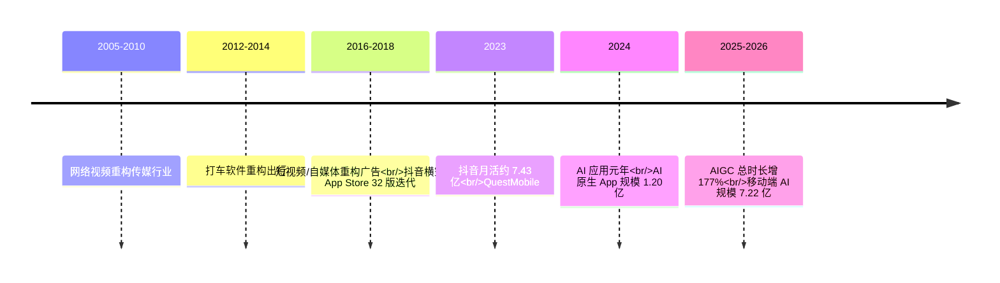
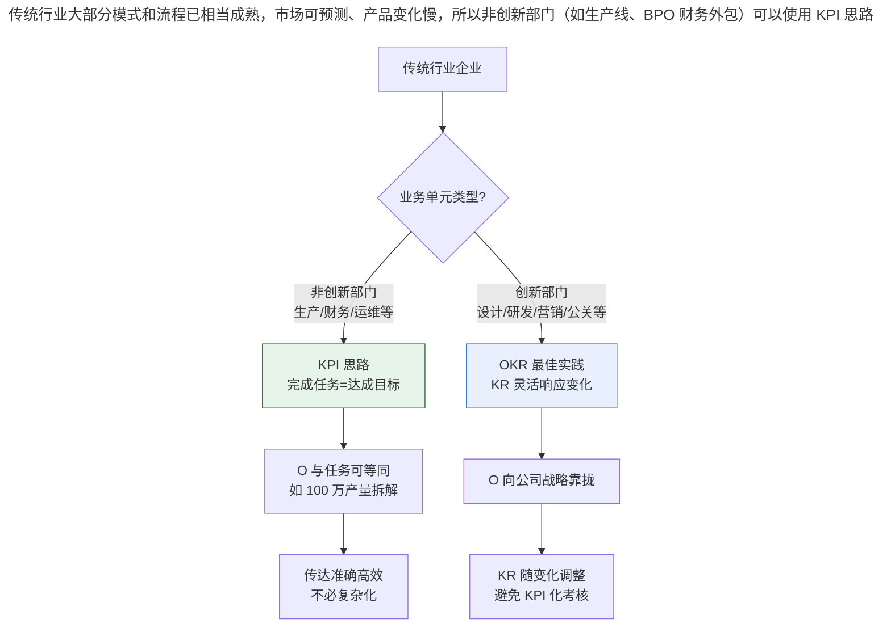

# 互联网行业 VS 传统行业，如何灵活应用 OKR？

> **适用范围 / 更新摘要**：本文为「极简 OKR 实战」模块一·现状第 3 讲，对比互联网行业与传统行业在 OKR 应用上的差异，并作为模块一收尾。v2 · 2026-08 更新：保留「2018 年抖音横空出世、App Store 32 个版本」作历史案例，补充 2023 年 9 月抖音月活约 7.43 亿（QuestMobile）与 2024-2026 现象级应用演进（AI/AIGC、大模型应用）作为「变化频率」新论据；失效图片替换为 Mermaid 时间线与流程图；保留软件公司快速交付案例、传统行业生产部 100 万产量案例、丰田汽车案例并标注时点。

## 1. 导言

在「创业公司 VS 500 强公司」一讲中，我们介绍了不同规模的企业内部信息传递的特点和问题，以及它们在 OKR 应用上的区别。事实上，除了规模之外，还有另外一个因素也会对 OKR 实践产生显著影响，那就是企业所在的行业。越是新兴的行业，其发展和变化就越快，企业目标也就越受行业变化的影响；相反，越是传统的行业，其发展和变化就越缓慢，其目标确定性也就越高。

多年来，笔者做企业管理咨询时发现，互联网公司在制定企业战略时往往只向前展望 1-2 年，时间再长变数就会增大，战略也将失去意义；而传统行业的企业制定战略时，却可以向前展望 3-5 年甚至更长时间。所以企业在引入 OKR 作为目标管理系统时，应该结合自身所处行业特点，有重点地应用 OKR 体系中的各类实践，从而将企业收益最大化。

本文适用于跨行业对比 OKR 实践方式的管理者与 HR，尤其适合传统行业正在推动转型、或互联网行业正在评估 OKR 适用性的组织。

## 2. 核心方法论

### 2.1 行业差异的本质

行业对 OKR 实践的影响，本质上是「变化频率」与「目标确定性」的差异。OKR 的源头最早可追溯到彼得·德鲁克提出的目标管理（Management by Objectives，MBO）概念（1954 年《管理的实践》），经过四十多年的实践和改进，到 20 世纪 90 年代末终于在软件互联网行业发扬光大。

以前在传统行业中，产品和商业模式已经是成熟的了，创业者要取得成功，需要拼供应链、拼成本，或者为处于垄断地位的企业做周边服务，也就是在需求基本确定的情况下拼成本和速度。而在 20 世纪 90 年代末，软件互联网行业则是一片未知的「蓝海」市场——创业者有更多空间通过不断发现新的需求，并利用互联网基础设施和技术来满足需求，便能异军突起。回顾谷歌、Facebook、苹果、Uber、腾讯等巨头的崛起，莫不都经历了这样一个「持续创新」的过程。

### 2.2 两条实践路径的原则

- **互联网行业**：KR 响应变化要高于遵循计划；O 始终向公司战略靠拢。核心命题是「完成任务 ≠ 达成目标」。
- **传统行业**：在「整体稳定、局部变化」的场景中，OKR 可因地制宜地与 KPI 等同使用；同时需区别对待创新部门与非创新部门。

### 2.3 边界条件

行业差异并非绝对。传统行业中存在肩负创新的部门（如外观设计、技术研发、营销公关），其面临的不确定性接近互联网行业，应采用互联网行业的 OKR 最佳实践；互联网行业中也有相对成熟的职能（如基础设施运维、财务结算），其稳定性接近传统行业，可采用更接近 KPI 的方式。判断依据应回归具体业务单元的「变化频率」与「结果可预测性」。

## 3. 关键流程

下图以时间线呈现互联网行业「现象级应用」的演进节奏，直观说明变化频率为何越来越高。

**图解**：每隔两三年，互联网行业就会突然爆发一个现象级应用，颠覆整个行业的生态——网络视频重构了传媒行业，打车软件重构了出行，短视频与自媒体重构了广告行业。抖音在红遍大街小巷之前，就已经在 App Store 上更新了 32 个版本，这 32 个版本意味着 32 次尝试，还不包括在办公室里被否掉的更多次尝试。据 QuestMobile 数据，2023 年 9 月前后抖音月活约 7.43 亿，标志着短视频赛道进入成熟期。但变化并未停止：2024 年被称为「AI 应用元年」，AI 原生 App 行业规模在 2024 年 12 月达到 1.20 亿；2025 年 AIGC 细分行业总使用时长同比增长 177%，截至 2025 年 12 月移动端 AI 整体规模达 7.22 亿。这意味着「现象级应用」的迭代周期正在从「两三年一次」压缩为「以年甚至季度为单位」，进一步强化了互联网行业 OKR「KR 响应变化高于遵循计划」的必要性。

下图呈现传统行业「整体稳定、局部变化」场景下，创新部门与非创新部门的差异化 OKR 应用流程。

**图解**：传统行业大部分模式和流程已相当成熟，市场可预测、产品变化慢，所以非创新部门（如生产线、BPO 财务外包）可以使用 KPI 思路，此时「完成任务就意味着达成目标」，OKR 与 KPI 等同是合理且高效的。但创新部门（如外观设计、技术研发、营销公关）面临大量未知与不确定性，应遵循互联网行业的 OKR 最佳实践，保持 KR 的灵活性，切忌以 KPI 方式进行考核。关键在于「因地制宜、区别对待」，而非一刀切。

## 4. 工具与实战

### 4.1 互联网行业 OKR 实践特点

互联网行业总是处于变化中，并且变化频率越来越快，往往会计划赶不上变化，老任务赶不上「新」目标。这给公司的经营者们一个非常重要的启示：互联网时代「**完成任务 ≠ 达成目标**」。所以互联网企业在实践 OKR 时，有两点必须高度关注。

#### 4.1.1 KR 响应变化要高于遵循计划

KR 关键结果可以看成是达成目标的子过程。在瞬息万变的互联网行业，「变化」是唯一不变的事情，在今天看来正确的策略，在明天看来这可能就成了「失误」。

举个曾经的案例：某互联网公司市场部在 2018 年年初制定的 OKR 是这样的：

> **O**：实现创纪录的销售目标，同时提升盈利能力；
>
> - KR1：对所有销售员工进行一次深度培训；
> - KR2：对核心产品增加 40% 的广告宣传投入；
> - KR3：在各大广告联盟，增加广告投放的数量和频率。

先不论该 OKR 的关键结果书写是否标准，从该 OKR 中可以看出，在 2018 年该市场部对广告宣传有非常强的诉求。那么 2018 年发生了什么？「抖音」横空出世，并在那年成了最具流量的新兴广告渠道。如果该公司在 2018 年初制定完该 OKR 后就埋头执行，那么它不但会错过新兴渠道的增长红利，还有可能在传统渠道蒙受损失——因为新兴渠道在爆发式增长时会对流量产生「吸血效应」，越是传统的渠道（例如传统的广告联盟）越容易被「吸血」和挤压。反之，如果该公司能及时调整战略，拓展抖音一类的新兴广告渠道，便能尽早享受到行业红利，而介入越晚沉没成本则越高。

正如敏捷宣言（Agile Manifesto）所说「响应变化要高于遵循计划」，关键结果（KR）作为达成目标的手段，更需要具有灵活性，能够随变化而变化。进入 2024-2026 年，这一命题更加尖锐：AI 原生应用的崛起速度远超短视频时代，企业若仍以季度为最小调整周期，将难以匹配以周为单位变化的业务优先级。这正是 AI 辅助 OKR 持续监测与动态调整能力在互联网行业尤为重要的原因。

#### 4.1.2 目标（O）始终向公司战略靠拢

曾经有一位软件公司的部门经理，希望笔者能为他部门的年度 OKR 提供建设性建议，他们的 OKR 是这样写的：

> **O**：打造具有快速交付能力的团队。
>
> - KR1：构建团队持续交付的能力；
> - KR2：缩短需求的响应周期；
> - KR3：提升交付的质量。

笔者看完之后问了三个问题：你们公司的战略是什么？「打造具有快速交付能力的团队」这一目标对公司战略的贡献是怎样的？在公司战略的大背景下衡量，你们当前制定的目标具有怎样的优先级？

该部门经理没能立刻回答出来。他想了一下说，他们制定目标时的出发点是自己部门的职责，以及周围干系人经常抱怨反馈的问题。比如一个重要的干系人常常反馈他们交付的速度慢，所以就围绕「快速交付」制定了 OKR。

笔者告诉他，「打造快速交付能力的好团队」看似是一个正确的目标，但在互联网行业，如果你和你的干系人没有将精力聚焦到公司战略上，你即使有了一个能快速交付的团队，也可能快速交付了很多公司并不需要的产品。

听后，该经理回去与部门团队重新回顾了公司战略，发现仅从自己的角度考虑「交付速度」这一要素实在太片面了。他们重新围绕公司战略，从产品、用户、业务等角度出发，制定了下方这样的全新 OKR：

> **O**：基于用户反馈尽快地更新产品版本。
>
> - KR1：根据需求分析结果，尽早产出原型；
> - KR2：每周都要与业务人员进行基于原型的沟通；
> - KR3：将需求的平均响应周期缩短 20%。

所以在互联网行业的企业内部，从部门到个人，在制定目标时围绕自己的职责还远远不够，一定要把目标上升到公司战略层面。在制定目标时，可以反复思考以下问题：公司的战略是什么？公司赖以生存和发展的底层逻辑是什么？我们要服务的用户是谁、用户的需求是什么？我们所制定的目标对企业战略有多大贡献？

### 4.2 传统行业 OKR 实践特点

制造业、商贸、餐饮、运输、通信、纺织、服装、食品加工、电子通信设备、建筑业等传统行业存在已久，商业模式也较为成熟。与互联网的激烈变化不同，这类企业已经度过了它们的高速发展变化期，进入稳定发展阶段——需求稳定，产品的形态也相对稳定，颠覆性产品发生的概率远远小于互联网行业。具体到企业内部的经营管理上看，这类企业已经实现了精细化分工，工作的流程化程度较高，所需的技能和岗位职责已经实现了标准化。

虽然 OKR 诞生在互联网行业，但在这类传统行业中也有用武之地。传统行业虽然主营业务稳定，但也存在局部变化、创新的需求；有一些有危机感的传统行业也在谋求转型，而转型则是一件不确定性相当高的事。这种情形下，OKR 就是一个不错的选择。在传统行业这种「整体稳定，局部变化」的场景中，如果决定引入 OKR，需要注意以下两个方面。

#### 4.2.1 一定情况下，OKR = KPI

许多 OKR 书本或教材中强调「目标 ≠ 任务」，这给许多传统企业的管理者带来很大困惑，因为他们制定出的 OKR 就是与任务等同的，也就是与 KPI 并无大的区别。

举个例子，某传统行业生产部的 OKR 是下方这样的：

> **公司生产总部 OKR：**
>
> - O：完成 100 万产量
>   - KR1：A 部门 50 万
>   - KR2：B 部门 50 万
>
> **生产 A 部门 OKR：**
>
> - O：达成 50 万产量
>   - KR1：A 小组 25 万产量
>   - KR2：B 小组 25 万产量

这样的 OKR 在互联网行业中无疑是教条的，企业很可能只专注完成 100 万产量，但失去完成 1000 万产量的机会。**但对于传统企业，这样的制定是没有问题的，这种情况下 OKR 就是等同 KPI**。因为在这种传统行业中，生产经营活动的变化周期长，最佳实践和历史数据的参考价值高。例如白色家电制造行业，其市场规模可以通过人口结构、收入结构等综合因素做出测算，企业的产能也可以根据竞争对手的情况进行预测；一旦制定了目标和计划，中途发生变化的可能性远远小于互联网行业，相同的例子还有大型机械制造行业、BPO 财务外包行业等。其产品的迭代演进也相对缓慢，不像互联网产品迭代和更新频率那样高。

所以很多时候在传统行业，**完成任务就意味着达成了目标**。在这样的前提下，具体部门目标可能就与任务等同。这种 OKR 的制定不但是合理的，而且传达起来准确、高效，完全不需要再将其复杂化，否则反而会弄巧成拙。

#### 4.2.2 区别对待创新部门与非创新部门

虽然传统行业中大部分的模式和流程已经相当成熟，市场可预测、产品变化慢，但传统行业中也一直存在着肩负创新的部门。在这些创新部门中，与互联网行业一样存在大量的未知和不确定性，且结果难以预测。这类部门在使用 OKR 时，显然也应该遵循互联网行业的 OKR 最佳实践，而切忌以 KPI 方式进行考核。

例如，精益方法（Lean）的发源地丰田汽车（Toyota），它的生产线是高度细分且指标可量化的，适合使用 KPI 考核；但它的汽车外观设计和技术研发部门，就面临很大的创新挑战——什么样的外观能在众多竞品中吸引到更多眼球？哪种技术能给客户留下与众不同的体验？这些都是具有高度不确定性的，也是无法计划的。随着信息传播模式的反复革新，除了创新部门外，传统行业的营销、公关等岗位也频繁地遇到各种挑战和机遇，这类部门也应该保持关键结果的灵活性，与传统部门区别对待。

### 4.3 AI 时代对行业差异的放大（2024-2026）

2024-2026 年的 AI 浪潮正在重塑互联网与传统行业的 OKR 实践差异：

- **互联网行业**：AI 原生应用迭代速度远超短视频时代，「现象级应用」周期从两三年压缩到以年甚至季度为单位。这要求互联网企业 OKR 的 KR 调整频率进一步提升，AI 辅助的持续监测与动态调整已成为标配而非选配。
- **传统行业**：传统行业的创新部门（如汽车外观设计、技术研发）正借助 AI 工具（生成式设计、AI 研发辅助）加速试错，其变化频率向互联网行业靠拢；而非创新部门（如生产线）仍保持稳定，OKR = KPI 的等式依然成立。这使得「区别对待」的必要性更加突出。
- **跨行业融合**：2025 年制造业客户在 OKR 工具市场的收入占比由 22.3% 提升至 27.8%，反映 OKR 方法论正突破互联网与高科技行业边界，向流程型、项目制组织深度渗透。传统行业引入 OKR 时，可借助 AI 工具降低制定与追踪成本，缩短部署周期。

## 5. 常见误区与避坑指南

- **误区一：互联网行业照本宣科套用传统行业 OKR**。互联网行业切忌制定完关键结果后只知道埋头苦干，或花长达一两个月的时间制定 OKR——「变化」并不会等你。
- **误区二：传统行业强行复杂化 OKR**。传统行业非创新部门 OKR = KPI 是合理且高效的，强行套用互联网行业的灵活 KR 调整反而会弄巧成拙。
- **误区三：传统行业一刀切**。传统行业若对所有部门统一采用 KPI 考核，会扼杀创新部门的试错空间；应对创新部门区别对待。
- **误区四：O 脱离公司战略**。无论是互联网还是传统行业，部门级 O 若仅从自身职责出发而不向公司战略靠拢，都会导致「快速交付了公司不需要的产品」这类浪费。
- **误区五：忽视 AI 时代的变化频率加速**。2024-2026 年现象级应用周期显著压缩，仍以传统季度为最小调整周期的 OKR 实践会加剧「OKR Lag」（战略变化与执行之间的滞后）。

## 6. 进阶延展与参考资料

### 6.1 进阶延展

- **OKR Lag 概念**：指战略变化与执行之间的滞后。AI 辅助的持续监测与动态调整（如飞书「OKR + 多维表格 + AI Agent」工作流）正在缩短这一滞后，尤其适用于变化频率高的互联网行业。
- **敏捷宣言与 OKR 的关系**：敏捷宣言「响应变化高于遵循计划」与 OKR「KR 响应变化高于遵循计划」在哲学上一脉相承，二者常被联合应用于互联网企业的研发与运营实践。
- **精益方法（Lean）与 KPI 的适配性**：精益方法发源于丰田汽车生产线，其高度细分与可量化的特征天然适配 KPI 考核；这为传统行业非创新部门 OKR = KPI 的实践提供了方法论支撑。
- **制造业 OKR 渗透趋势**：2025 年制造业客户在 OKR 工具市场收入占比由 22.3% 提升至 27.8%，反映 OKR 正向流程型、项目制组织深度渗透，传统行业从业者应关注这一跨行业扩散趋势。

### 6.2 参考资料

- QuestMobile《2024 中国移动互联网年度大报告》（2024 年 AI 应用元年、AI 原生 App 规模 1.20 亿）
- QuestMobile《2025 中国移动互联网年度大报告》（2025 年 AIGC 总时长增 177%、移动端 AI 规模 7.22 亿、抖音集团企业流量超 12 亿）
- QuestMobile 抖音月活数据（2023 年 9 月前后抖音月活约 7.43 亿）
- 博研咨询《2026 年中国目标和关键结果（OKR）工具行业发展现状与市场占有率及排名研究分析报告》（制造业客户收入占比 22.3%→27.8%）
- 飞书 OKR 官方资料（OKR + 多维表格 + AI Agent 工作流，缩短 OKR Lag）
- 丰田汽车（Toyota）精益方法（Lean）公开资料（生产线 KPI 考核与创新部门差异化管理）

至此，「模块一·走近 OKR 在企业的落地应用」结束。我们从 OKR 在企业的具体应用落地入手，全面认识了 OKR 的应用原则、特点作用，以及在企业管理中扮演的角色，然后对比讲解了不同企业规模、行业、场景下 OKR 的作用、适用性和限制情况。接下来，我们将进入「模块二：OKR 制定，细节成就完美」，深入理解 O 与 KR 之间的关系和相互作用。