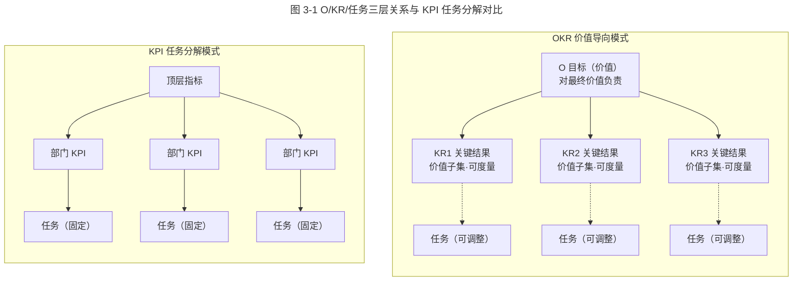
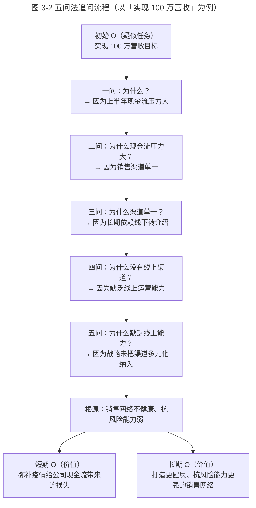

# 重识目标 O：任务和价值，应该以谁为导向？

> **适用范围**：本篇为「极简 OKR 实战 · 模块二·制定」第一节，面向正在引入或迭代 OKR 体系的中大型组织、初创团队及其管理者、HR 与 OKR Coach。
> **更新摘要**：本版（v2 · 2026-08 更新）相对原版做了三方面升级——其一，重写「任务导向 vs 价值导向」的方法论框架，明确术语 MBO（Management by Objectives，目标管理）、SMART、KR（Key Result，关键结果）的首现英文对照；其二，新增「五问法」追问流程图与 O/KR/任务三层关系图（Mermaid），并以表格替代失效的 `/okr-images/` 图片；其三，补充 AI 时代 OKR 制定新工具，包括飞书 OKR 填写助手、AI 起草、目标健康度评分（0–100）等 2024–2026 年实践。原 K12 机构案例保留并标注时点。

## 1. 导言

### 1.1 为什么再谈「目标 O」

作为「模块二：OKR 制定，细节成就完美」的第一节，我们先来回答一个被反复提及却很少被讲透的问题：**OKR 中的目标 O（Objective），到底应该以「任务」为导向，还是以「价值」为导向？**

业界有一种声音认为，OKR 最大的优势就是「以目标为导向」。但这种说法是片面的——「以目标为导向」并非 OKR 首创，它本就是各类组织长期以来的一致诉求。即使是使用 KPI（Key Performance Indicator，关键绩效指标）的组织，也都在尽最大努力践行以目标为导向。OKR 的真正差异，不在于它「提出了以目标为导向」，而在于它**通过结构和流程，让「以价值为导向」真正可执行**。

### 1.2 本篇要回答的三个问题

1. **Why**：为什么「完成任务」不等于「达成目标」？理想与现实之间的差距从何而来？
2. **What**：OKR 语境下的「价值导向」到底是什么？它和 KPI 的「任务导向」有何本质区别？
3. **适用范围**：本篇方法适用于季度/半年度 OKR 制定的开局阶段，尤其适合从 KPI 体系迁移到 OKR 体系的团队，以及 OKR 写来写去都像任务列表的组织。

## 2. 核心方法论

### 2.1 两个基础定义

在进入方法论之前，先对两个核心概念做严格定义：

- **任务（Task）**：组织为了实现目标而选择的途径和手段，是以目标为导向制定的一系列活动。在 KPI 体系里，常见做法是围绕关键绩效指标制定任务，然后层层向下分解与传达。
- **价值（Value）**：任务完成后产生的、对实现目标有促进作用的结果。任务可能产生多样性结果，若该结果对实现目标有利，则是有价值的；反之则是无价值的。

### 2.2 一条核心原则

OKR 抛弃了「以任务为导向」的路径，重新聚焦到最终成果的「价值导向」上来。其核心原则可以概括为一句话：

> **执行层首先对目标及其代表的价值负责，而不是只对任务负责。**

这条原则看似简单，却是 OKR 与 KPI 体系的分水岭。KPI 体系并非没有目标，而是在层层分解中目标被任务稀释；OKR 则通过结构强制让「目标」始终在场。

### 2.3 边界条件

价值导向并非万能。以下三种情况需要注意：

1. **业务需求高度确定**：当行业成熟、需求稳定、业务逻辑可预测时，KPI 与 OKR 的差异会显著缩小，此时「任务导向」并不会带来明显损失。详见《03 | 互联网行业 VS 传统行业，如何灵活应用 OKR？》。
2. **执行层认知不足**：如果执行层缺乏对业务全局的理解，强行要求其「对价值负责」反而会引发迷茫。需要配合透明化的目标对齐机制。
3. **目标本身尚未澄清**：若顶层战略目标尚未明确，谈「价值导向」就是无源之水。价值导向的前提是先有一个经得起追问的目标。

## 3. 关键流程

### 3.1 「理想」与「现实」的差距

理想状态下，组织根据目标制定详尽计划，为每位成员分配任务，然后便能实现目标——这是传统任务分解模式（典型如 MBO 在 KPI 体系下的实现）所依循的思路。

但现实中，完成任务并不意味着达成目标。差距来源于三类典型场景：

| 差距来源 | 具体表现 | 后果 |
|---|---|---|
| 计划未预估到的情况 | 新竞争对手出现、政策变化、技术突变 | 任务完成但目标落空 |
| 环境随时间漂移 | 市场需求、用户偏好、供应链变化 | 原计划失效 |
| 分解传递中的偏差 | 跨部门理解差异、信息损耗 | 执行结果与战略脱节 |

企业规模越大、项目越复杂，这些问题就越明显。如果执行层只能按计划执行、无法察觉任务与目标之间的偏差，就不可能及时纠偏，最终结果是执行层交付的结果与公司所需相差甚远，战略自然无法落地。

这种「理想—现实」差距，在当今复杂多变的时代尤为突出，这也是 KPI、KSF（Key Success Factors，关键成功因素）等以计划和任务为中心的管理模式在今天变得不再有效的根本原因。

### 3.2 O/KR/任务三层关系图

下图刻画了 OKR 体系中「目标—关键结果—任务」三层结构，以及它与 KPI 任务分解模式的根本差异。

**图 3-1 解读**：左侧 OKR 模式中，O 始终在场，KR 是 O 的价值子集，任务只是实现 KR 的可调整手段（虚线表示可替换）；右侧 KPI 模式中，顶层指标一旦分解为部门 KPI 与任务，便固化为静态契约，任务与最初价值之间的连接被切断。两条路径最关键的区别不在于「是否有目标」，而在于**目标在执行过程中是否始终可见、可对照、可回溯**。

### 3.3 K12 机构案例对比

某 K12 在线教育机构在 2020 年的目标是「成为最有影响力的 K12 教育辅导平台之一」。下表左侧是该机构围绕此目标最初制定的 KPI，右侧是经过辅导后修改的 OKR（时点：2020 年初，正值疫情催化线下转线上）。

| 部门 | KPI 模式（任务导向） | OKR 模式（价值导向） |
|---|---|---|
| 教研部 | 完成 40 项初高中教学教研项目 | **O**：建立行业领先的教学内容竞争力 **KR1**：课程访问量达到 X 万 **KR2**：与 5 家业界高声誉合作方达成合作 **KR3**：教研项目复用率达到 70% |
| 销售部 | 月度销售额达到 Y 万 | **O**：在饱和市场中获取差异化增长 **KR1**：销售额达到 Y 万 **KR2**：客户回购率从 X 提升至 Z **KR3**：单个客户获取成本降低 20% |
| 产品部 | 上线 N 个新功能 | **O**：提供客户满意和赞赏的产品体验 **KR1**：核心功能 NPS 从 X 提升至 Y **KR2**：上线后故障率不超过 10% **KR3**：从购买到使用流程时长缩短 20% |

2020 年 K12 教育辅导市场已出现饱和，疫情使大量原本线下授课的机构转为线上，线上课程数量、质量与多样性大幅提升，行业竞争加剧。这种情况下，若继续按左侧 KPI 思路不根据市场变化调整，即使完成旧指标也无法实现目标。

右侧 OKR 的显著特点是：**首先出现的是目标，然后才是实现目标的关键结果**。各部门员工首先对目标及目标代表的价值负责，而不是只对任务负责。在执行过程中，员工可不断对照目标检视：任务结果是否促进了目标完成？原计划任务是否已无助于目标达成？是否有更好的任务值得加入？——这种持续对照，使执行层始终围绕目标，并最终实现目标。**虽然执行层并未完全按最初计划行事，却真正实现了「以目标为导向」。**

### 3.4 五问法（Five Whys）追问流程

撰写 OKR 时最易掉入的坑是「格式上是 OKR，骨子里还是 KPI」——O 是一个大任务，KR 是分解后的子任务列表。要克服这种思维惯性，可以使用「五问法」。

**图 3-2 解读**：通过对原目标使用五问法，浮现出根源问题是「公司销售渠道单一，无法应对类似疫情这样的突发事件」，由此导致的短期结果是「上半年现金流压力很大」。而「实现 100 万营收」其实是应对根源问题短期结果的一个行动，即任务，而非目标。基于此可同时得出一个更好的短期 O（弥补现金流损失）与一个长期 O（打造更健康、抗风险能力更强的销售网络）。

新短期 O 相比原任务式 O 有足够的高度与启发空间：除了增加营收外，还可以降低产品成本、减少不必要开支、拓宽销售渠道等。若只把「实现 100 万营收」当作目标，不管背后原因，很可能销售额上升的同时销售成本同步上升，最后现金流并未改善——这就是典型的「完成了任务，没达到目标」。

五问法不限于追问 5 次，可多可少，只要找到根本原因即可。

### 3.5 填空法（Fill-in-the-Blank）

填空法更轻量，适合快速检验一个 O 是任务还是价值。如果你有了一个看起来像任务的 O，就填写下面这句话：

> **因为做到了「O」，所以获得了 ________。**

以「11 月前完成产品上线」为例，填空结果为：

> 因为做到了「11 月前完成产品上线」，所以获得了 **客户的满意和认可**。

「客户的满意和认可」才是能代表价值的目标，而「11 月前完成产品上线」只是实现该目标的其中一个 KR。当目光聚焦到真正的价值后，思维更宽广，其他 KR 也随之出现，整个 OKR 梳理后变为：

- **O**：提供客户满意和赞赏的产品
- **KR1**：产品不晚于 11 月上线
- **KR2**：保证产品上线后故障率不超过 10%
- **KR3**：从购买到使用的整个过程时间缩短 20%

通过「五问法」与「填空法」，能帮助从「任务」推导至「价值」，从任务思维转变为目标思维。

## 4. 工具与实战

### 4.1 AI 时代的 OKR 制定工具（2024–2026）

随着 LLM（Large Language Model，大语言模型）能力成熟，OKR 制定环节出现了三类值得引入的工具形态：

| 工具类型 | 代表产品/能力 | 适用场景 | 注意事项 |
|---|---|---|---|
| AI 起草助手 | 飞书 OKR 填写助手、Notion AI OKR Draft、Lark OKR Copilot | 季度初批量起草 O 与 KR 初稿 | AI 生成内容易偏向任务式表达，必须人工五问法复核 |
| 目标健康度评分 | 飞书 OKR 健康度（0–100）、Workboard Goals Score、Quantive Result Health | 评审阶段自动检测 O 是否价值化、KR 是否可度量 | 评分仅作辅助，不能替代业务判断 |
| OKR 对齐可视化 | 飞书 OKR 对齐图、Quantive Alignment Map、Lark OKR Tree | 多层级组织目标对齐与穿透 | 需保证纵向可追溯到战略、横向可见协作关系 |

**目标健康度评分（0–100）的典型维度**（以飞书 OKR 填写助手为例，2025 版）：

1. **价值度**（O 是否描述价值而非任务）——权重 30%
2. **可度量度**（KR 是否含基线值与目标值）——权重 25%
3. **挑战度**（KR 目标值是否高于历史均值的合理区间）——权重 20%
4. **对齐度**（O 是否与上级 O 有明确承接关系）——权重 15%
5. **聚焦度**（KR 数量是否在合理区间，建议单 O 不超过 4 条）——权重 10%

得分低于 60 分的 OKR 应退回重写。需要强调：**AI 工具能加速起草与检测，但「价值判断」必须由人完成**。AI 擅长识别「这看起来像任务」，但不擅长判断「这个价值是否符合本季度战略意图」。

### 4.2 实战流程清单

将上述方法整合为一个可复用的季度 OKR 制定流程：

1. **战略澄清**（Week 0）：CEO/事业部负责人确认本季度 1–3 个战略级 O，确保 O 经过五问法验证。
2. **自上而下传递**（Week 1 第一段）：战略 O 下发到部门，部门基于填空法撰写部门 O。
3. **自下而上补充**（Week 1 第二段）：员工基于部门 O 提出个人 O，比例建议占个人 OKR 总量的 30%–40%。
4. **AI 起草 + 人工复核**（Week 2）：使用飞书 OKR 填写助手批量生成初稿，逐条用五问法/填空法复核。
5. **健康度评分**（Week 2 末）：所有 OKR 进入健康度评分，<60 分退回。
6. **对齐评审会**（Week 3）：纵向对齐 + 横向协作确认，冻结本季度 OKR。

## 5. 常见误区与避坑指南

### 5.1 误区一：格式上是 OKR，骨子里还是 KPI

典型表现：

- **O**：实现 100 万营收目标
  - **KR1**：A 部门实现 50 万营收目标
  - **KR2**：B 部门实现 50 万营收目标

或：

- **O**：11 月前完成产品上线
  - **KR1**：8 月 11 日前完成原型设计
  - **KR2**：9 月 30 日前完成产品的研发
  - **KR3**：10 月 20 日前完成产品测试

O 是大任务，KR 是子任务列表。**避坑**：用填空法一句话检验——「因为做到了 O，所以获得了 ________」，如果填不出来，或填出来还是任务描述，就退回重写。

### 5.2 误区二：以为换格式就能换思维

决定 OKR 撰写质量的，不是 OKR 的特有格式或 SMART 原则，而是人们的思维方式。若思维仍停留在任务导向，使用 OKR 与 KPI 并无本质区别。**避坑**：在 OKR 培训中预留充足的「价值讨论」时间，不要急于落到格式。

### 5.3 误区三：用 AI 起草替代价值讨论

2024 年后大量团队开始用 AI 起 OKR 初稿，但 AI 生成的 OKR 普遍存在「任务化倾向」——因为训练语料中 KPI 风格的文本远多于真正的 OKR。**避坑**：AI 初稿仅作起点，必须经过团队五问法讨论与人工价值判断。

### 5.4 误区四：五问法变成「五连问」

五问法的本意是探究根本原因，不是机械地连问 5 次「为什么」。**避坑**：每次追问都要基于上一个回答的具体内容，且允许 3 次或 7 次——以找到根本原因为止。

## 6. 进阶延展与参考资料

### 6.1 方法论溯源

- **MBO（Management by Objectives，目标管理）**：彼得·德鲁克 1954 年《管理的实践》提出，是 OKR 的思想源头。OKR 可视为 MBO 在动态环境下的进化形态。
- **SMART 原则**：Specific、Measurable、Achievable、Relevant、Time-bound。SMART 是检验 KR 质量的工具，但不是 OKR 的全部——OKR 更强调「价值高度」与「对齐」。
- **XKIT/OKR 原始资料**：Andy Grove《High Output Management》（1983）首次系统化 OKR；John Doerr《Measure What Matters》（2018）将其推向主流。

### 6.2 与本系列其他篇章的衔接

- 上一节：《03 | 互联网行业 VS 传统行业，如何灵活应用 OKR？》——解释了为何在需求确定性高的场景下 KPI 与 OKR 差异缩小，这是本篇「边界条件」的延伸。
- 下一节：《05 | 关键结果 KR：如何制定才能体现目标「进度」？》——本篇解决了「O 是什么」，下一篇解决「KR 如何度量 O 的进度」。
- 模块三：《07 | 追踪：可视化追踪，让 OKR 公开透明》——本篇提到的「目标始终在场」需要通过追踪工具落地。

### 6.3 实践工具索引（2026-08 校对）

- 飞书 OKR（含填写助手、健康度评分、对齐图）：https://okr.feishu.cn/
- Quantive（原 Gtmhub）：OKR 平台，支持 AI 起草与对齐可视化
- Workboard：企业级 OKR 与目标对齐平台
- Lark OKR Copilot：海外版飞书 OKR 助手

### 6.4 要点回顾

- 在 KPI 与类似体系中，即使主张「以目标为导向」，也仅在制定顶级指标时紧密围绕战略；指标分解过程中职能部门就变成了以指标及其对应任务为导向。
- 使用 OKR 能比 KPI 更好地实现「以目标为导向」，关键原因是 OKR 中始终包含「目标」，执行任务时有目标作为参考。
- 撰写 OKR 时，目标要能提炼到阐述价值的高度；目标若描述的是任务，即使写成 OKR 格式，本质上与 KPI 无异。
- 任务导向的思维方式难以立刻改变，若写完目标后觉得像任务而非目标，可使用「五问法」或「填空法」重新梳理。
- AI 时代的新工具（飞书 OKR 填写助手、目标健康度评分 0–100）能加速起草与检测，但价值判断仍需由人完成。
