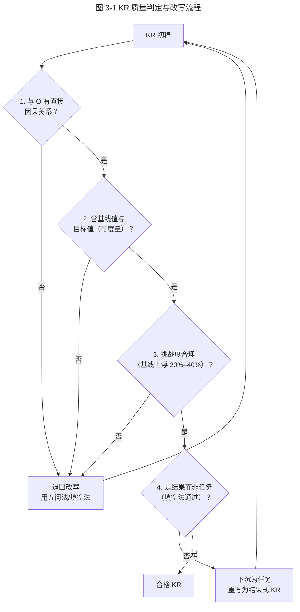
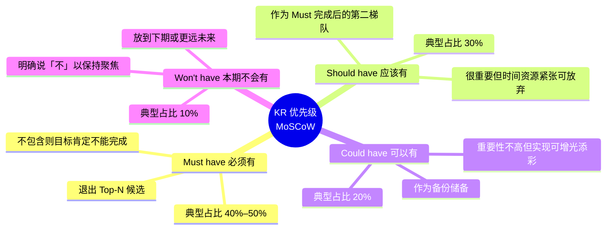

# 关键结果 KR：如何制定才能体现目标"进度"？

> **适用范围**：本篇为「极简 OKR 实战 · 模块二·制定」第二节，面向已完成目标 O 提炼、正进入 KR 撰写与评审阶段的团队负责人、OKR Coach 与 HR。
> **更新摘要**：本版（v2 · 2026-08 更新）相对原版做了四方面升级——其一，重写 KR 与任务、KR 与 KPI 的本质差异，统一术语首现英文对照（KR、SMART、MoSCoW、KPI）；其二，新增「KR 质量 MoSCoW 优先级」思维导图与「KR 制定流程」流程图（Mermaid），替代失效的 `/okr-images/` 图片；其三，补充 AI 时代 KR 工具实践，包括飞书 OKR 填写助手的 KR 健康度检测、AI 起草 KR 的常见任务化陷阱、基于历史数据的 KR 挑战度校准（2024–2026）；其四，扩充减肥案例与 K12 案例的对照分析，并新增 KR 数量与聚焦的量化研究参考。原 K12 机构与减肥案例保留并标注时点。

## 1. 导言

### 1.1 为什么单独讲 KR

上一节我们解决了「O 是什么」——目标必须提炼到价值高度。本节聚焦 OKR 的第二个元素：**关键结果（Key Result，简称 KR）**。KR 是连接「价值目标」与「日常任务」的桥梁。一个再好的 O，若 KR 写成任务清单，OKR 体系会瞬间退化为 KPI。

### 1.2 本篇要回答的四个问题

1. **Why**：为什么 KR 不能写成任务？任务与 KR 的根本差异是什么？
2. **What**：什么样的 KR 才是「好 KR」？质量维度的判定标准是什么？
3. **How many**：一个季度应该有多少条 KR？如何取舍？
4. **Who & vs KPI**：KR 该由谁制定？KR 与 KPI 指标有何本质区别？

### 1.3 适用范围

本篇方法适用于季度/半年度 OKR 的 KR 撰写、评审与裁剪环节，尤其适合 KR 数量膨胀、KR 看起来都像任务、KR 与 KPI 难以区分的团队。

## 2. 核心方法论

### 2.1 KR 的定义

KR（Key Result，关键结果）用来描述目标达成的必要条件，它是具体的、可度量的。**通过追踪 KR 的进度，我们能够知道目标的进度。**

这一定义包含三个关键约束：

- **必要条件**：KR 是 O 达成的必要条件，而非充分条件；KR 全部完成应能高概率推断 O 达成。
- **具体且可度量**：必须含基线值（from X）与目标值（to Y），仅写方向（如「提高」）不合格。
- **进度可追踪**：KR 的进度 = 目标价值的进度，二者应同步。

### 2.2 KR vs 任务：一条核心原则

> **KR 是一种反馈机制，它告诉你是否正在接近目标；而任务不一定能达到这种效果。**

如果 O 是我们要获取的最终价值，KR 则是价值的子集。每完成一个 KR，应该意味着收获了目标价值的一部分；完成所有 KR 后，目标代表的价值应全部达成。O 和 KR 是要到达的目的地，任务是到达目的地的手段。

### 2.3 KR 质量的三条原则

1. **直接因果**：KR 与 O 的实现有直接因果关系，而非间接相关。
2. **适度挑战**：KR 应有挑战性，激发内在驱动力（Intrinsic Motivation），但不能让人因挑战过大而气馁。
3. **可衡量**：KR 最好包含量化指标，含基线值与目标值。

### 2.4 KR 数量的边界条件

- 团队一周完成一个 KR 是合理且可持续的速度。
- 一个团队的季度 OKR，所有 KR 数量最好**不超过 12 条**。
- 若有 2 个季度目标，每个目标的 KR 不超过 6 条；若有 3 个目标，每个目标的 KR 不超过 4 条。
- 超过 12 条通常意味着：要么兼顾过多工作难以聚焦，要么 KR 分解过细徒增追踪成本。

## 3. 关键流程

### 3.1 KR 与任务的对比：减肥案例

春节期间，因暴饮暴食身材走样，迫切需要在假期结束前恢复原来身材。常见的错误写法如下：

| 维度 | 错误写法（任务式 KR） | 正确写法（结果式 KR + 任务） |
|---|---|---|
| O | 假期结束后恢复原来身材 | 假期结束后恢复原来身材 |
| KR1 | 每周跑 5 公里 | **KR1**：减少身体脂肪 5% 任务1：每周跑 5 公里 任务2：每天少摄入 300 卡路里 |
| KR2 | 每天摄入量减少 300 卡路里 | **KR2**：腰围减少 4 cm 任务1：每天做 3 分钟平板支撑 任务2：每天做 200 个仰卧起坐 |
| KR3 | 每天做 200 个仰卧起坐 | — |
| KR4 | 每天做 3 分钟平板支撑 | — |

**对比解读**：第一种写法里的 KR 并非「结果」，只是一些任务。完成这些任务不代表一定能实现目标——可能跑了 5 公里但吃得更多，脂肪反而上升。第二种写法里的 KR 是「结果」，这些结果若都完成，就能确认目标实现。任务下沉为实现 KR 的手段，可灵活替换。

### 3.2 KR 与 KPI 的本质区别

KR 与 KPI 都是可量化的指标，很多组织在引入 OKR 后发现 KR 与原 KPI 类似。但二者有本质区别：

| 维度 | KR（关键结果） | KPI（关键绩效指标） |
|---|---|---|
| 本质 | 达成某种有价值的结果，验证目标进度 | 更类似任务，指标一旦制定轻易不变 |
| 思维模式 | 动态思维：环境动态变化，目标明确但执行方式需验证调整 | 静态思维：行业成熟、需求稳定，业务逻辑可预测 |
| 任务关系 | 为实现 KR 可制定并调整任务 | 对任务负责，以完成任务为目标 |
| 价值追问 | 持续追问任务结果是否产生最终价值 | 较少考虑最终价值，认为是制定者的责任 |
| 适用环境 | 需求不确定性高 | 需求确定性高 |

**关键判断**：业务需求确定性越高，KR 与 KPI 区别越小，属正常现象；但需求不确定性高时，把 OKR 写成 KPI 是完全错误的。

### 3.3 KR 质量判定流程

**图 3-1 解读**：KR 质量判定是一条四步漏斗——因果、可度量、挑战度、结果性。任一步不通过都退回改写，其中「结果性」不通过时最常见的处理是把原「KR」下沉为任务，重新提炼结果式 KR。该流程可作为评审会的检查清单。

撰写 KR 时，应时刻追问两个问题：

- 我如何知道，我正在达到我的目标？
- 我如何知道，我没有在错误的事情上浪费时间？

### 3.4 KR 数量管理：MoSCoW 优先级

许多组织选择 OKR 的主要动机之一是提高专注度。要想专注，就要尽量避免同时兼顾多重工作。当团队难以舍弃任何一条 KR 时，推荐使用 **MoSCoW 优先级排序法**（Must-have / Should-have / Could-have / Won't-have）。

**图 3-2 解读**：MoSCoW 不是简单的四分类，而是一条「从上至下截取」的流水线。先标 Must，Must 满额即停；Should 在 Must 完成后接力；Could 作为备份在主要 KR 完成且仍有时间时启用；Won't 明确写入下期。该方法的真正价值不在于分类本身，而在于**强制团队对一些事情说「不」**——这才是聚焦的本质。

### 3.5 K12 机构案例的 KR 演化

仍以 2020 年那家 K12 机构为例（时点标注：2020 年初，疫情催化线上化）。其教研部目标「建立行业领先的教学内容竞争力」的 KR 经历了如下演化：

| 版本 | KR 写法 | 问题诊断 |
|---|---|---|
| v1（任务式） | 完成 40 项初高中教学教研项目 | 是任务不是结果；完成 40 项不等于内容有竞争力 |
| v2（结果式） | 课程访问量达到 X 万 | 因果关系成立，可度量 |
| v3（含挑战度） | 课程访问量从 X 万提升至 1.3X 万 | 含基线值与目标值，挑战度约 30% |

v3 即为合格 KR。需要注意的是，挑战度并非越高越好——**「恰到好处的挑战」对不同团队差别巨大**，取决于工作性质、团队能力、企业文化等，需经多轮观察调整。

## 4. 工具与实战

### 4.1 AI 时代的 KR 工具实践（2024–2026）

| 工具能力 | 代表实现 | 典型用法 | 陷阱 |
|---|---|---|---|
| KR 健康度检测 | 飞书 OKR 填写助手（2025 版）、Quantive KR Health | 评审前自动检测 KR 是否含基线值、是否任务式 | 评分高不代表战略对齐 |
| AI 起草 KR | 飞书 OKR Copilot、Notion AI、ChatGPT/Claude Prompt | 输入 O 与业务上下文，生成 KR 候选 | AI 普遍倾向任务式表达，必须人工改写 |
| 历史数据挑战度校准 | Quantive Forecasting、Workboard SMART Goals | 基于历史完成率推荐 KR 目标值 | 数据不足时建议保守，避免盲信 |
| KR 进度自动采集 | 飞书 OKR 数据源接入、Lark Metrics | KR 直连业务系统数据源自动更新进度 | 仅适合量化指标，质性 KR 仍需人工评估 |

**AI 起草 KR 的典型任务化陷阱**：当输入「O：提升产品用户体验」时，AI 倾向输出「KR1：完成 N 个用户访谈；KR2：上线新版导航；KR3：修复 50 个 Bug」——这些全是任务。正确改写应为「KR1：核心任务完成率从 60% 提升至 85%；KR2：新用户首周留存率从 X 提升至 Y；KR3：用户求助率降低 30%」。

### 4.2 KR 制定与评审清单

将上述方法整合为可复用清单：

1. **写**：基于 O，团队 brainstorm 出所有候选 KR。
2. **筛**：用「KR 质量判定流程」（图 3-1）逐条过滤。
3. **排序**：用 MoSCoW（图 3-2）排序，截取 Top-N（单 O 不超过 4 条）。
4. **量化**：每条 KR 补全基线值（from X）与目标值（to Y）。
5. **挑战度校准**：参考历史数据，目标值落在基线上浮 20%–40% 区间；团队新生可保守，成熟团队可激进。
6. **AI 复核**：用飞书 OKR 填写助手检测健康度，<60 分退回。
7. **协商定稿**：经理、团队成员、相关方共同协商，避免遗漏关键 KR。

### 4.3 谁来制定 KR

OKR 中的 O 源自公司战略，但 KR 最好由经理、团队成员及其他与目标相关的人**共同协商**制定。协商制定有两个好处：

- **不漏掉关键 KR**：以开发一款手机 App 为例，它应满足某种用户需求、用户体验友好、功能稳定——这三方面是衡量成功的 Must-have 条件，需要产品经理、设计人员、技术人员三种角色共同定义，缺一不可。
- **增强参与感**：参与感是 OKR 激励员工的一种方法（详见下一篇《06 | 团队激励难？OKR 目标思维轻松达成》）。

## 5. 常见误区与避坑指南

### 5.1 误区一：KR 写成任务

最常见错误。**避坑**：用「填空法」检验——「因为完成了这条 KR，所以获得了 ________」。若填出来还是动作描述（如「完成了访谈」「上线了功能」），就是任务，需重写为结果。

### 5.2 误区二：KR 只写方向不写数值

如「提高在线课程的销售量」「改善用户体验」。**避坑**：强制要求「from X to Y」格式，无基线值的 KR 不予通过评审。

### 5.3 误区三：KR 数量膨胀

团队列举大量 KR，每条都「必须达成」。**避坑**：用 MoSCoW 强制排序，季度 KR 总数控制在 12 条以内；学会对一些事情说「不」。

### 5.4 误区四：挑战度失控

两种极端：一是 KR 设得过高（如基线上浮 100%），团队直接放弃；二是设得过低（上浮 5%），失去激励作用。**避坑**：参考历史完成率，落在上浮 20%–40% 区间；并区分团队成熟度——新生团队偏保守，成熟团队可激进。

**重要提醒**：切忌以「设置有挑战的目标」为名，变相给员工施加压力。从心理学角度，「恰当的挑战」激发内在驱动力，带来主动性与积极性；「变相施压」带来被动接受与消极抵抗。两种情绪作用于同一目标，结果差异巨大。

### 5.5 误区五：AI 起草 KR 直接定稿

AI 生成的 KR 普遍存在任务化倾向，且容易给出看似量化实则无意义的指标（如「完成 10 次迭代」）。**避坑**：AI 初稿必须经过人工因果性检验与战略对齐审查。

### 5.6 误区六：混淆 KR 与 KPI

在需求确定性高的场景下，KR 与 KPI 可能重合，这是正常现象。但在需求不确定性高的场景下，把 OKR 写成 KPI 是完全错误的。**避坑**：用「静态思维 vs 动态思维」做判断——若你的环境是动态变化的，KR 必须保留调整空间，不能固化为 KPI 契约。

## 6. 进阶延展与参考资料

### 6.1 方法论溯源

- **SMART 原则**：George T. Doran 1981 年提出，是检验 KR 可度量性的基础工具。SMART = Specific / Measurable / Achievable / Relevant / Time-bound。
- **MoSCoW 优先级**：DSDM 动态系统开发方法（1990 年代）提出，原用于需求管理，迁移到 KR 裁剪非常契合。
- **挑战度研究**：Christina Wodtke《Radical Focus》（2016）建议 KR 完成度落在 70% 即为成功；John Doerr《Measure What Matters》（2018）建议目标值高于历史均值 30% 左右。两者本质相近。
- **内在驱动力与挑战度**：Deci & Ryan 的自我决定理论（Self-Determination Theory, SDT）指出，胜任感（Competence）的满足需要任务难度与能力匹配——这是「适度挑战」的心理学基础，详见下一篇。

### 6.2 与本系列其他篇章的衔接

- 上一节：《04 | 重识目标 O：任务和价值，应该以谁为导向？》——本篇承接 O 的价值提炼，进入 KR 的进度度量。
- 下一节：《06 | 团队激励难？OKR 目标思维轻松达成》——本篇提到的「适度挑战」「参与感」正是 OKR 满足四种内驱动力的入口。
- 模块三：《07 | 追踪：可视化追踪，让 OKR 公开透明》——KR 的进度追踪需要可视化工具落地。

### 6.3 实践工具索引（2026-08 校对）

- 飞书 OKR 填写助手（含 KR 健康度检测）：https://okr.feishu.cn/
- Quantive（原 Gtmhub）：支持 KR Forecasting 与对齐可视化
- Workboard：企业级 OKR 与 SMART Goals 校准
- Lark OKR Copilot：海外版飞书 OKR 助手

### 6.4 要点回顾

- KR 是反馈机制，告诉你是否正在接近目标；任务不一定能达到这种效果。
- 如果 O 是最终价值，KR 是价值的子集；每完成一个 KR，意味着收获目标价值的一部分。
- 好的 KR 须满足三条：与 O 有直接因果、适度挑战、可衡量（含基线值与目标值）。
- 季度 KR 总数不超过 12 条；难以取舍时用 MoSCoW 排序，强制对一些事说「不」。
- KR 由与目标相关的所有人共同协商制定，避免遗漏并增强参与感。
- KR 与 KPI 在需求确定性高时可能重合（正常），但在需求不确定性高时把 OKR 写成 KPI 是完全错误的。
- AI 时代的新工具能加速 KR 起草与健康度检测，但因果性检验与战略对齐仍需由人完成。
