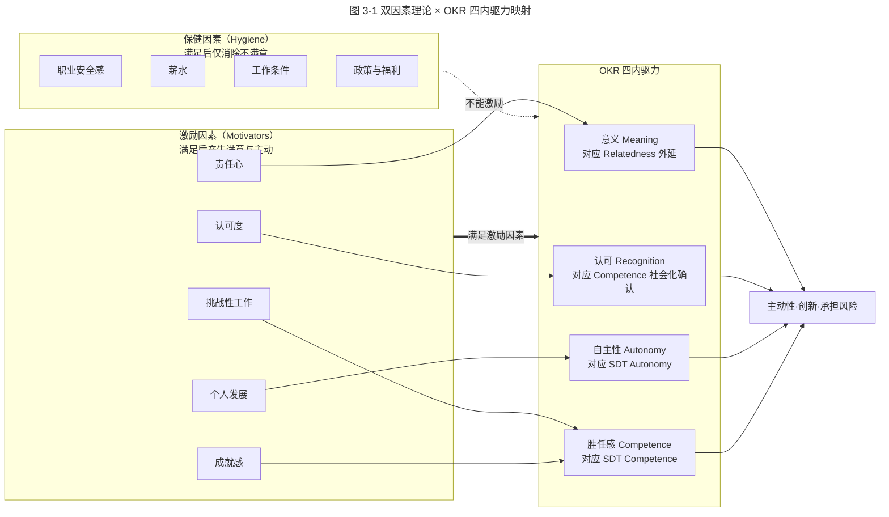
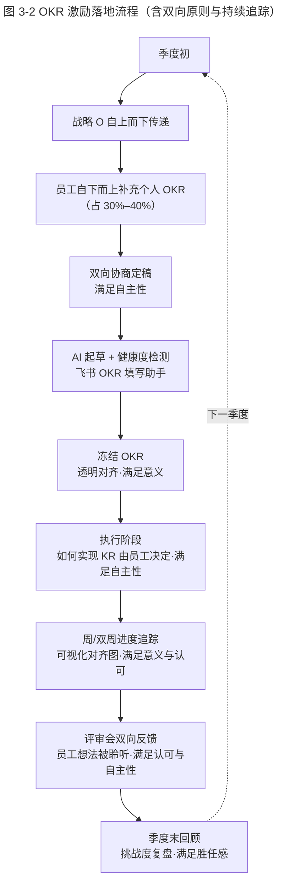

# 团队激励难？OKR 目标思维轻松达成

> **适用范围**：本篇为「极简 OKR 实战 · 模块二·制定」第三节，面向希望用 OKR 体系提升员工内驱力与组织效能的团队负责人、HR 负责人与 OKR Coach。
> **更新摘要**：本版（v2 · 2026-08 更新）相对原版做了五方面升级——其一，**关键事实校对**：原文称桑达尔·皮查伊「十年后成了 Google CEO」不准确，已修正为「皮查伊于 2015 年 8 月出任 Google CEO，2019 年 12 月起兼任 Alphabet CEO」；其二，**理论补充**：在赫茨伯格双因素理论（Two-Factor Theory）基础上，引入 Deci & Ryan 的自我决定理论（Self-Determination Theory, SDT），并补充 2024–2026 年内驱力相关新研究；其三，**结构升级**：新增「双因素理论 × OKR 四内驱力映射图」与「OKR 激励落地流程图」（Mermaid），替代失效的 `/okr-images/` 图片；其四，**工具更新**：补充 AI 时代的 OKR 激励工具实践，包括飞书 OKR 对齐图、AI 进度回顾、认可（Recognition）模块；其五，**案例标注**：原打车软件车内录音案例保留并标注时点。关键术语首现英文对照：Two-Factor Theory、Intrinsic Motivation、Self-Determination Theory、Autonomy、Competence、Relatedness。

## 1. 导言

### 1.1 为什么再谈激励

前面几章我们重点讲述了 OKR 的制定，以及 OKR 在拥抱变化、落地战略方面的作用与实践方法。除此之外，OKR 还有一个广为人知却常被误解的作用：**员工激励**。

员工激励是企业长期已有的诉求，该领域早已充斥大量理论与实践。那么是什么让后来者 OKR 在这方面声名鹊起？本篇要回答的核心问题是：OKR 通过哪些精妙设计满足了哪些内驱动力，从而实现了对绝大多数员工的普遍激励，以及如何避免在引入 OKR 后激励效果落空。

### 1.2 本篇要回答的三个问题

1. **Why**：员工为何会受到激励？双因素理论与自我决定理论如何解释？
2. **What**：OKR 满足了哪四种内驱动力？这些满足是如何通过 OKR 的结构设计实现的？
3. **How**：在 OKR 落地过程中，哪些操作要点决定了激励效果能否真正发生？

### 1.3 适用范围

本篇适用于已决定引入 OKR 但激励效果不及预期的组织，以及希望系统理解 OKR 激励机制设计原理的管理者。不适用于尚未澄清战略目标、试图用 OKR 直接替代薪酬体系的组织——OKR 满足的是激励因素，而非保健因素。

## 2. 核心方法论

### 2.1 双因素理论（Two-Factor Theory）

美国行为科学家弗雷德里克·赫茨伯格（Frederick Herzberg）于 20 世纪 50 年代提出双因素理论，将影响工作满意度的因素分为两类：

- **保健因素（Hygiene Factors）**：职业安全感、薪水、身份、工作条件、政策、附加福利等。保健因素不满足会产生负面激励；保健因素基本满足后，再进一步提升充其量只让人们以平常心对待工作，**不能起到激励效果**。
- **激励因素（Motivators）**：有挑战性的工作、成就感、个人发展、认可度、责任心等。激励因素得到满足，员工会表现得更加积极主动，愿意尝试、承担更多责任与风险——这正是组织需要的状态。

双因素理论的核心洞察是：**满意的对立面不是不满意，而是没有满意**。消除不满意（提升保健因素）不会自动产生满意（激励效果），满意需要独立创造激励因素。

### 2.2 自我决定理论（Self-Determination Theory, SDT）

赫茨伯格之后，Deci & Ryan（1985）提出的自我决定理论进一步细化了内在驱动力（Intrinsic Motivation）的来源，识别出三种基本心理需要：

- **自主性（Autonomy）**：个体希望对行为与方向有选择权与影响力。
- **胜任感（Competence）**：个体希望体验到掌控环境的成就感，能力与挑战匹配。
- **归属感（Relatedness）**：个体希望与他人建立连接，感受到归属与意义。

SDT 在 2024–2026 年的最新研究（如 Howard 等 2024 年发表于 *Motivation Science* 的元分析）进一步确认：在组织情境中，三种基本心理需要的满足与工作投入度、创新行为、留存率呈显著正相关；且三者之间存在补偿效应——例如自主性较高时，胜任感的边际激励作用会增强。**OKR 的四种内驱动力（意义、认可、自主性、胜任感）本质上是对 SDT 三因素的扩展**：意义对应归属感的外延（与更大目标连接），认可是胜任感的社会化确认，自主性与胜任感则一一对应。

### 2.3 OKR 满足的四种内驱动力

OKR 通过满足双因素理论中的激励因素，挖掘人们的内在驱动力，达到激励效果。其机制满足了以下四种内驱动力：

| 内驱动力 | 对应 SDT 因素 | OKR 的结构化设计 |
|---|---|---|
| 意义（Meaning） | Relatedness 的外延 | O 从任务层面提升到价值层面，目标透明可追溯至战略 |
| 认可（Recognition） | Competence 的社会化确认 | 高透明度 + 可度量 KR，使个人成绩易被看到与认可 |
| 自主性（Autonomy） | Autonomy | 自下而上的个人 OKR + 「如何实现」留给员工决定 |
| 胜任感（Competence） | Competence | 适度挑战的 KR 目标值，让员工有信心完成 |

### 2.4 边界条件

1. **保健因素必须先基本满足**：若薪酬、安全、工作条件等保健因素明显不足，再精妙的 OKR 也无法产生激励效果——员工的不满意会淹没一切。
2. **目标必须真正价值化**：若 OKR 写成任务形式，激励效果会大打折扣（详见第 5 节误区一）。
3. **双向原则必须落地**：仅自上而下传递的 OKR 无法满足自主性。

## 3. 关键流程

### 3.1 当前常用激励措施为何不奏效

在辅导企业做 OKR 转型时发现，许多企业虽然一直试图激励员工，但手段主要集中在保健因素范畴，很少涉及激励因素。

**惩罚与淘汰机制**影响的是职业安全感（保健因素），不属于激励因素。

**晋升机制**虽与成就感、个人发展、认可度等激励因素挂钩，但每级只有少数优秀者有机会成为候选人。对大部分人而言不在候选范围内——**只能激励潜在候选人群体，范围较小，不能形成普遍激励**。

> **案例（时点标注：2009 年起）**：Google 内部曾设有「创始人奖（Founders' Award）」，每年仅奖励 1–2 个有突出贡献的项目。2009 年，Chrome 浏览器研发团队获得该奖，该项目负责人桑达尔·皮查伊（Sundar Pichai）也由此开启了内部晋升之旅。**【v2 校对】皮查伊于 2015 年 8 月出任 Google CEO，2019 年 12 月起兼任 Alphabet CEO**——原文「十年后成了 Google CEO」的表述在时点与职位上均不准确，已修正。

该奖项看似激励效果不错，但 Google 在过去数年中已停止颁发。内部调查显示，每年只有极少数明星项目及其成员会因奖项激励而努力，其他多数得奖无望的人并不会因奖项存在而有丝毫行动变化。

公司晋升机制与 Google「创始人奖」本质相同——数量少、条件严，只能激励少数人，不能对大多数人形成普遍激励。

晋升机制之外，HR 常采取的「小额奖品」「改善工作环境」「节日礼品」等手段，**本质上都属于保健因素范畴**。

一些互联网企业的**期权激励**，背后逻辑是公司财富指数级增长时每人获得巨额奖励。但这需要公司具备爆发潜力，期权才起激励效果；对大部分企业而言，**爆发不是常态，不能用作常规激励手段**。

综上所述，大部分企业常用的激励方式中：一些本质上属于保健因素，达不到激励效果；一些属于激励因素，但要么只能激励小范围人群，要么激励范围大但效果差或不能常态化。**如果有方法能在大多数状况下有效激励绝大多数人，组织整体效能将获得很大提升——OKR 就是这样的方法。**

### 3.2 双因素理论 × OKR 四内驱力映射图

**图 3-1 解读**：图中虚线表示「保健因素再提升也不能激励」——这是双因素理论最易被忽视的洞察。实线箭头表示激励因素通过 OKR 的结构化设计被满足。OKR 的四种内驱动力并非凭空产生，而是 OKR 的「价值化目标 + 透明对齐 + 自下而上 + 适度挑战」四项结构设计分别对应了 SDT 的三种基本心理需要与认可这一社会化确认机制。最终汇入「主动性·创新·承担风险」这一组织所需状态。

### 3.3 OKR 四内驱动力的具体满足方式

#### 3.3.1 意义（Meaning）

若人们能知道自己工作的意义所在——感受到自己的工作如何影响未来、影响他人、影响外界——他们将受到极大激励与鼓舞。OKR 通过将目标从任务层面提升到价值层面，使人们看到工作的意义。

> **案例（时点标注：约 2018–2020 年）**：某打车软件准备在新版本 v13.3 中增加车内录音功能。对同一任务，可描述为「增加车内录音功能」（任务），也可描述为「通过增加录音功能减少纠纷和事故，为乘客提供安全保障」（价值）。从执行者角度，前者仅是一个任务，后者让他们看到工作价值，更能在执行时自我激励。

同时，OKR 执行时要求保持各级目标的透明度与一致性，员工知道自己的目标如何与团队、部门、公司目标相联系，从而了解工作对他人与公司的意义，进而被意义激励。而 KPI 体系倾向于传递任务与澄清任务细节，而非帮助员工理解更大意义。

#### 3.3.2 认可（Recognition）

工作成绩与能力获得他人认可和赞美，是内驱动力的另一来源。OKR 帮助人们增加被认可的机会：

- **高透明度 + 可度量**：个人成绩更容易被看到与认可。在 OKR 评审会议上，人们无须担心口才影响真实水平展示——KR 进度让一切一目了然。
- **围绕战略一致的目标工作**：明确目标 + 可度量 KR，使人们更可能交付出符合管理层期望的结果，获得高层认可。

KPI 体系下执行层缺少 OKR 这样的「灯塔」，信息传递偏差导致任务可能已与战略偏离，执行层很努力地工作但结果被弃用，获得认可的机会随之降低。

#### 3.3.3 自主性（Autonomy）

每个人都希望有选择权利，能一定程度影响甚至控制事情走向。在 LinkedIn 和 Google 这样的 OKR 典范中，每个员工的 OKR 分两部分：一部分源自战略目标自上而下分解；另一部分由员工自下而上提出，紧密围绕战略核心但源自个人想法或创意。**最终 OKR 是经员工补充后的目标**——通过参与制定，选择权与影响力得到满足，对目标有更多责任感。

另外，OKR 规定了目标和关键结果，但**对如何实现 KR 并未作任何规定**——这部分留给员工尝试与决定，进一步赋予选择权与掌握权。KPI 体系倾向于传递任务与澄清细节，要求越具体，执行层自主空间越小，越感觉自己只是机械的「工具」。

#### 3.3.4 胜任感（Competence）

胜任感指个体控制环境的需要，即从事各种活动时需要体验到成就感。能激发内驱动力的工作，与个人能力相匹配，或稍高于当前能力但员工有信心在短时间内提升至相应水平。

> **示例**：让某员工将他完成日常某项工作的时长缩短 10%。该员工根据经验判断稍有难度但调整方法后能做到，接受任务后会积极思考；若达成则有很大满足感——这在胜任范围之内。相反，若该员工觉得缩短 10% 不可能完成、难度太高，就不会展现积极主动状态——目标超出了胜任范围。

**OKR 的一个主张就是通过设立适度挑战的目标来激励员工**。这个「适当挑战」的度，就是让员工觉得能胜任这种挑战，从而愿意去完成。传统 KPI 体系也常设置挑战目标，但因任务导向，执行层任务可能与战略脱节——即使完成挑战，结果被丢弃，对员工是极大的负面激励。

### 3.4 OKR 激励落地流程

**图 3-2 解读**：OKR 激励效果不是在某一个环节突然产生的，而是贯穿季度全周期的复合设计——双向协商满足自主性、透明对齐满足意义、留出实现方式空间满足自主性、可视化追踪满足意义与认可、评审双向反馈满足认可与自主性、挑战度复盘满足胜任感。任一环节缺失都会削弱激励效果。这也解释了为什么「引入 OKR 但激励效果不及预期」通常不是 OKR 本身的问题，而是流程中某些环节被跳过。

## 4. 工具与实战

### 4.1 AI 时代的 OKR 激励工具（2024–2026）

| 工具能力 | 代表实现 | 对应内驱动力 | 注意事项 |
|---|---|---|---|
| OKR 对齐可视化 | 飞书 OKR 对齐图、Quantive Alignment Map、Lark OKR Tree | 意义 | 必须支持纵向追溯到战略、横向可见协作 |
| AI 进度回顾 | 飞书 OKR 周报 AI 总结、Lark OKR Copilot Review | 认可、意义 | AI 总结需人工补充定性反馈，避免空洞 |
| 认可（Recognition）模块 | 飞书点赞/打赏、Lark Praise、Bonusly | 认可 | 应绑定 KR 达成节点，避免泛化 |
| 挑战度推荐 | Quantive Forecasting、Workboard SMART Goals | 胜任感 | 数据不足时保守，避免盲信算法 |
| 双向反馈收集 | 飞书 OKR 评审表单、Lark OKR Review Form | 自主性、认可 | 必须有「员工想法被采纳」的闭环 |

### 4.2 操作要点

#### 4.2.1 OKR 制定要深入价值和意义层面，切忌写成任务形式

只有 OKR 把信息传递高度提升到解释清「为什么」和「要什么」，才能给人们足够清晰的指引；同时把「具体怎么做」的空间留给员工。在探索怎么做的过程中，员工的自主性、意义、认可等内驱动力才有机会获得满足。KPI 体系中任务和指标往往只是达成目标的某一种具体渠道，以它们为目标应变空间明显狭窄。**一旦将 OKR 写成任务模式，激励效果会大打折扣。**

#### 4.2.2 选择合适的 OKR 追踪工具

即使 OKR 能帮人们制定出明确、可度量的目标，也不能期待员工通过简单沟通就完全理解目标意义并立刻被激励。需要工作中频繁对照目标，频繁听取员工对目标的反馈并给予进一步说明。记录 OKR 的工具必须：

- **极易打开、随时调取**；
- 让员工看到自己的目标如何向上对齐，一直追溯到战略目标；
- 方便了解其他人的目标与进度，看到自己工作与同事、上级的联系与影响。

**OKR 追踪工具一定要能显示每一级别的纵向和横向联系**。使用 Excel、Word 甚至邮件管理 OKR 显然不符合要求。详见《07 | 追踪：可视化追踪，让 OKR 公开透明》。

#### 4.2.3 OKR 制定和评审采取双向原则

若 OKR 分解只是从上至下传达，下级不能参与目标完善与改进，就无法满足「自主性」内驱动力。设立挑战性目标时更要以员工感受为准，否则会伤害「胜任感」。制定 OKR 时每一级都要包含「从上至下」传递和「从下至上」改善两部分。

评审时不能仅是上级表达对结果的看法，员工也要有机会提出对目标和实现过程的想法；员工想法要被仔细聆听并尽可能采纳，而不是讲完后被忽视——这样才能进一步提高参与感，满足「认可」与「自主性」。

### 4.3 内驱力度化的尝试（2025 年新实践）

部分前沿组织开始尝试用问卷量表对 OKR 的内驱力满足度做季度度量，参考 SDT 研究中常用的 Intrinsic Motivation Inventory（IMI）简化版，包含四个维度的 5 级量表：

- 意义感：我的 OKR 让我看到工作对他人/公司的影响
- 认可感：我的 KR 进度能被同事与上级看见
- 自主性：我能参与 OKR 制定并选择实现方式
- 胜任感：我的 KR 挑战度让我有信心完成

得分趋势可辅助判断 OKR 体系激励效果是否在改善。需注意：度量本身是保健因素的工具，不能替代激励因素的真实满足。

## 5. 常见误区与避坑指南

### 5.1 误区一：OKR 写成任务模式

最致命的误区。一旦 OKR 退化为任务清单，「意义」与「自主性」两条内驱动力同时丧失。**避坑**：用上一篇《05 | 关键结果 KR》的「填空法」与「KR 质量判定流程」严格把关。

### 5.2 误区二：用 OKR 替代薪酬体系

误把 OKR 当作不发奖金的理由。**避坑**：OKR 满足的是激励因素，薪酬属保健因素；保健因素不足时再好的 OKR 也无激励效果。OKR 不应直接挂钩绩效奖金，否则会破坏自主性。

### 5.3 误区三：仅自上而下传达

下级无法参与目标完善与改进，自主性内驱动力丧失。**避坑**：每级 OKR 必须包含「自下而上」部分，员工个人 OKR 中 30%–40% 来自个人提议。

### 5.4 误区四：挑战度失控

挑战度过高伤害胜任感，过低失去激励作用。**避坑**：参考历史完成率，落在基线上浮 20%–40%；并区分团队成熟度。**切忌以「有挑战」为名变相施压**——「恰当的挑战」激发内驱力，「变相施压」带来消极抵抗。

### 5.5 误区五：评审会变成单向汇报

员工想法讲完被忽视，认可与自主性同时受损。**避坑**：评审会必须设「员工反馈」环节，且建立「想法被采纳」的闭环记录。

### 5.6 误区六：追踪工具选错

用 Excel/Word/邮件管理 OKR 无法显示纵向横向联系。**避坑**：选用飞书 OKR、Quantive、Workboard 等专业工具，确保对齐可视化。

### 5.7 误区七：忽视 AI 工具的「任务化倾向」

2024 年后大量团队用 AI 起 OKR 初稿，但 AI 普遍生成任务式表达，若直接定稿会从源头瓦解激励效果。**避坑**：AI 初稿必须经五问法/填空法复核与人工价值判断。

## 6. 进阶延展与参考资料

### 6.1 理论溯源

- **双因素理论（Two-Factor Theory）**：Frederick Herzberg 1959 年《The Motivation to Work》提出。核心洞察：满意与不满意是两个独立维度，而非同一连续体的两端。
- **自我决定理论（Self-Determination Theory, SDT）**：Edward Deci & Richard Ryan 1985 年《Intrinsic Motivation and Self-Determination in Human Behavior》提出，识别自主性、胜任感、归属感三种基本心理需要。
- **2024–2026 SDT 新研究**：Howard, J. et al. (2024) 元分析确认 SDT 三需要在组织情境中与工作投入、创新、留存的显著相关性；Gagné, M. (2024)《Self-Determination Theory in the Workplace》系统综述了 SDT 在目标管理中的应用。
- **OKR 与 SDT 的桥接**：John Doerr《Measure What Matters》(2018) 隐含了 SDT 思想；Christina Wodtke《Radical Focus》(2016) 强调自主性在 OKR 中的角色。

### 6.2 关键时点校对（v2 修订）

- **Google 创始人奖（Founders' Award）**：2009 年 Chrome 团队获奖，皮查伊由此开启晋升之旅。
- **皮查伊任期校对**：皮查伊于 **2015 年 8 月**出任 Google CEO，**2019 年 12 月**起兼任 Alphabet CEO。原文「十年后成了 Google CEO」在时点与职位上均不准确，已修正。
- **创始人奖停发**：Google 已在过去数年中停止颁发该奖项，原因是内部调查显示其只能激励极少数明星项目成员。

### 6.3 与本系列其他篇章的衔接

- 上一节：《05 | 关键结果 KR：如何制定才能体现目标「进度」？》——本篇的「适度挑战」「参与感」承接 KR 篇的挑战度与协商制定。
- 下一节：《07 | 追踪：可视化追踪，让 OKR 公开透明》——本篇提到的「目标始终在场」「追踪工具」将在模块三详细展开。
- 模块三：《09 | 反馈：自下而上，OKR 为战略提供优化导向》——本篇的「双向原则」与「认可」将在 CFR（Conversation / Feedback / Recognition）体系中深化。

### 6.4 实践工具索引（2026-08 校对）

- 飞书 OKR（含对齐图、填写助手、点赞/打赏）：https://okr.feishu.cn/
- Quantive（原 Gtmhub）：支持对齐可视化与挑战度 Forecasting
- Workboard：企业级 OKR 与 SMART Goals
- Lark OKR Copilot / Praise：海外版飞书 OKR 助手与认可模块
- Bonusly：独立的员工认可（Recognition）平台

### 6.5 要点回顾

- 激励员工首先要区分激励因素与保健因素。保健因素基本满足后再提升，仍只能让人们以平常心对待工作，不能激励；想进一步激励需创造环境满足激励因素。
- 企业常用激励方式中，一些本质属保健因素达不到激励效果；能达到激励效果的，要么范围小、要么范围大但效果差或不能常态化。
- OKR 通过独特设计在制定与实施过程中满足**意义、认可、自主性、胜任感**四种内驱动力，从而达到普遍激励目的——这四种内驱力对应 SDT 的三种基本心理需要与认可这一社会化确认机制。
- 使用 OKR 不意味着一定能激励员工，操作时还需注意：制定时深入价值与意义层面、选择合适的 OKR 追踪工具、制定与评审时采取双向原则、挑战度校准、避免 AI 初稿直接定稿等。
- **关键校对**：皮查伊于 2015 年 8 月出任 Google CEO，2019 年 12 月起兼任 Alphabet CEO——原文「十年后成了 Google CEO」已修正。
