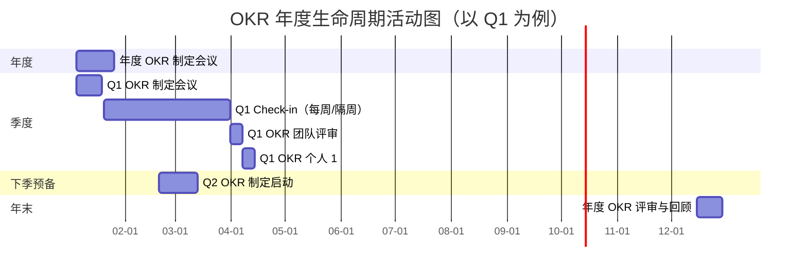
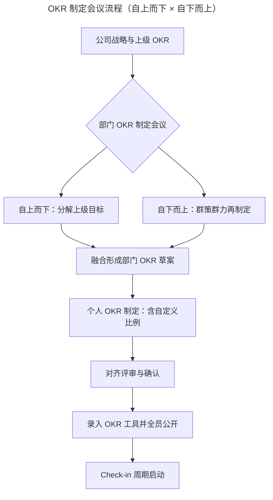
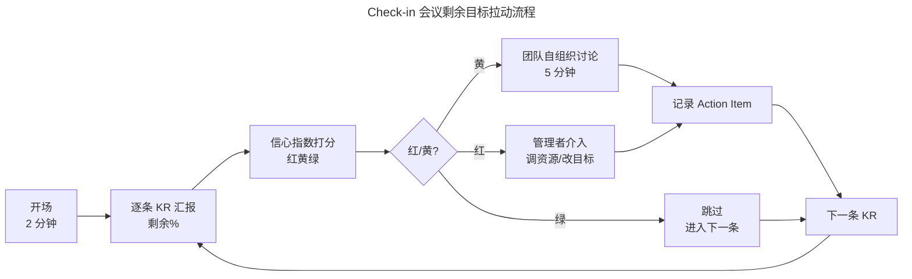
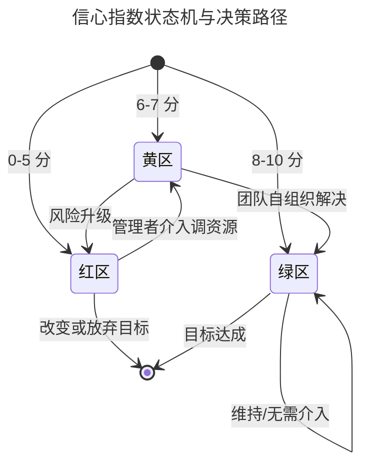

# 追踪：可视化追踪，让 OKR 公开透明

> **适用范围**：已确定公司级与部门级 OKR 框架、进入落地实施阶段的中大型组织；尤其适用于 VUCA 时代下面临季度战略对齐需求的科技、互联网及快速成长型企业。
>
> **更新摘要（v2 · 2026-08 更新）**：
> - 工具章节全面重写：基于 IDC 2025 年中国 OKR 软件市场报告（规模 47.3 亿元）及厂商财报交叉校验，更新市场结构与厂商份额，剔除已停更产品，新增 AI 填写助手、目标健康度评分等 2025-2026 主流能力。
> - 原文 `/okr-images/` 图片已失效，全部替换为 Mermaid 流程图与对比表，保证可渲染与可维护。
> - 补充 Check-in 会议「剩余目标拉动」流程与信心指数红黄绿状态机模型，强化可执行性。
> - 增补 AI 时代可视化追踪的新议题：异构数据源打通、自动对齐建议、健康度雷达等。

---

## 1. 导言

### 1.1 Why：为什么追踪比制定更难

OKR 生命周期包含「制定（Drafting）」与「实施（Execution）」两大阶段。许多组织在制定阶段投入大量精力，却在实施阶段陷入失速——OKR 文档被束之高阁，季度末才仓促收集数据应付评审。

OKR 与传统 KPI 的本质差异之一就在追踪方式：KPI 强调「年初定标、年中执行、年末考核」的线性流程；OKR 则主张「拥抱变化，根据执行反馈持续重构剩余目标」，从而由下至上反哺战略。这意味着 OKR 的追踪不仅是检查进度，更是**对剩余目标进行持续重构**的过程，是 OKR 释放最大效能的精髓。

### 1.2 What：本篇回答什么

- 一年视角下，OKR 生命周期包含哪些活动节点？
- 年度 OKR 与季度 OKR 的制定会议应在何时召开？
- 如何选择 2025-2026 主流的 OKR 管理工具以实现可视化追踪？
- Check-in（OKR 检查）会议与季度末评审会议的运转机制是什么？
- 信心指数（Confidence Level）红黄绿状态如何驱动管理决策？

### 1.3 适用范围

本篇方法论对组织规模不设硬性上限，但工具选型建议主要面向 50 人以上、需多层级对齐的组织。10 人以下小团队可参考轻量化方案（如飞书 OKR 免费版、Weekdone、Tablity async 模式）。

---

## 2. 核心方法论

### 2.1 关键定义

| 术语 | 英文对照 | 定义 |
|---|---|---|
| OKR 生命周期 | OKR Lifecycle | 一年内 OKR 从制定、追踪、评审到反馈迭代的完整活动集合 |
| 年度 OKR | Annual OKR | 公司/部门级年度战略目标，作为「北极星」 |
| 季度 OKR | Quarterly OKR | 年度 OKR 的季度分解，是追踪的最小度量单元 |
| Check-in | OKR 检查会议 | 季度内定期召开的进度同步与剩余目标重构会议 |
| 信心指数 | Confidence Level | 团队对剩余时间内完成目标的主观信心评分，常采用 0-10 或红黄绿 |
| 季度评审 | Quarterly Review | 季度末对 OKR 完成度与流程进行确认与回顾的会议 |

### 2.2 四大原则

1. **以季度 OKR 为度量单元**：年度 OKR 不直接追踪，通过季度 OKR 完成度间接反映。
2. **追踪剩余而非汇报过去**：Check-in 聚焦「目标还差多少」，而非「我已经做了什么」。
3. **公开透明即信源唯一**：OKR 数据全员可读，权限不设障，避免「公共文件夹式透明」。
4. **持续重构而非按部就班**：每季度根据执行反馈调整剩余目标，体现拥抱变化。

### 2.3 边界条件

- **确定性高的传统行业**：可在年初一次性制定全年四个季度 OKR；
- **互联网/科技行业**：仅年度 OKR + 一季度 OKR 在年初精确制定，其余季度先粗略规划、临近再细化；
- **月度 OKR 与周 OKR 不推荐**：颗粒度过细会显著增加制定与跟踪成本，对国内多数企业得不偿失。

---

## 3. 关键流程

### 3.1 OKR 年度生命周期总览

以一年为单位，OKR 生命周期包含年度制定、季度制定、Check-in、季度评审、年度回顾等活动。下图以 gantt 形式呈现一季度内的活动节点，其他季度同构。

**解读**：年度 OKR 与一季度 OKR 在次年初同步启动；季度内 Check-in 贯穿整个执行期；季度末安排团队评审与个人 1:1 评审；下季度 OKR 制定在当季第二个月（如 2 月 20 日、5 月 20 日、8 月 20 日）启动，避开季度末忙时但不致过早。年末则回到更高维度的年度评审与回顾，形成年度 PDCA 闭环。

### 3.2 OKR 制定会议流程

**解读**：制定会议不是单向下达，而是「自上而下分解」与「自下而上群策群力」的融合过程。下级不是无条件执行，而是在理解战略的基础上进行再创作。最终录入 OKR 工具并开放全员查询，才算完成制定与公开透明闭环。

### 3.3 Check-in 会议：剩余目标拉动流程

**解读**：Check-in 的核心是用「剩余目标」拉动会议进程，而不是汇报过去做了什么。绿区直接跳过以节省时间，黄区交给团队自组织讨论，红区触发管理者主动介入。这一流程把会议时长压缩到 15 分钟以内（每周）或 30 分钟以内（每月）。

### 3.4 信心指数红黄绿状态机

**解读**：信心指数以 10 分制采集，但决策只看三档。绿区无须介入；黄区是组织能力训练场，鼓励团队自行解决；红区是管理者必须主动介入的信号，必要时协调上级与其他部门调整目标本身。该模型把「主观信心」转化为「可执行的管理动作」。

---

## 4. 工具与实战

### 4.1 工具选型的核心评估维度

选择 OKR 管理软件时，建议从以下五个维度评估，避免「功能堆砌」陷阱：

1. **可视化与对齐能力**：能否在一张视图上看到公司—部门—个人三级 OKR 的对齐关系？
2. **集成度**：是否与组织现有协作套件（钉钉、飞书、企业微信、Microsoft 365）深度集成？
3. **API 开放度**：是否提供 OKR 读写 API，以打通 BI、研发协同、CRM 等异构数据源？
4. **AI 能力**：是否支持 AI 起草 KR、健康度诊断、自动对齐建议？
5. **CFR 支持**：是否内建 Check-in、Feedback、Recognition 模块，而不仅是表格工具？

### 4.2 中国市场 2025-2026 主流 OKR 工具

依据 IDC 2025 年中国目标管理软件市场报告与主要厂商财报交叉校验，2025 年中国 OKR 软件市场规模约 **47.3 亿元**，CR5 集中度约 57.3%。下表整理主流厂商及其差异化能力。

| 厂商 | 市场份额 | 核心差异化 | 适用场景 |
|---|---|---|---|
| 钉钉蒲公英 OKR | 约 19.4% | 深度集成阿里云与 Teambition；与钉钉 IM/审批原生打通 | 已用钉钉的中大型企业，追求一体化协同 |
| 飞书 OKR | 约 16.1% | 字节内部实践沉淀；开放 API `GET /open-apis/okr/v1/users/:user_id/okrs`；含 AI 填写助手与目标健康度 0-100 评分 | 互联网/科技企业，重视 API 与 AI 能力 |
| 北森 iTalentX | 约 10.1% | OKR × 人才盘点一体化；与绩效、继任打通 | 强 HR 体系建设诉求的大型企业 |
| ONES | 约 6.6% | 研发协同导向，与需求/缺陷/项目联动 | 软件研发团队，研发效能导向 |
| Worktile | 约 5.1% | 中小企业友好，OKR 与项目任务一体化 | 50-300 人成长型团队 |
| Tita | 长尾 | 仍在运营，已深度集成钉钉/飞书/企业微信，提供 200+ 行业模板与 AI 推荐 | 跨平台集成诉求，模板驱动型组织 |

**选型建议**：

- 已部署钉钉生态 → 优先评估**蒲公英 OKR**，避免重复采购；
- 已部署飞书生态 → **飞书 OKR** 几乎是默认选择，AI 填写助手可显著降低制定成本；
- 重 HR 一体化 → **北森**；
- 研发效能导向 → **ONES** 或飞书 OKR + Lark Project；
- 跨生态或尚无协作平台 → 评估 **Tita** 的多端集成与模板库。

### 4.3 国际市场主流 OKR 工具

国际厂商在数据驱动与 OKR × 绩效融合上更成熟，适合出海企业或对数据分析有深度诉求的组织。

| 厂商 | 定位 | 差异化 |
|---|---|---|
| WorkBoard | 企业级 OKR 平台 | 数据驱动；提供战略对齐图谱与高管仪表盘 |
| Lattice | OKR × 绩效一体化 | OKR 与 1:1、绩效评估、员工成长闭环 |
| Betterworks | 企业 OKR + 持续绩效 | 强调 CFR 持续反馈与认可 |
| Weekdone | 轻量周报 + OKR | 周报与 OKR 联动，适合远程团队 |
| Tability | async 轻量 OKR | 异步追踪，强调 AI 健康度诊断 |

> **注**：Quantive（前 Gtmhub）已与 WorkBoard 在不同细分市场形成差异化竞争，部分原 Quantive 客户在 2024-2025 间迁移至 WorkBoard 或 Lattice。选型时建议核实最新运营状态。

### 4.4 工具落地的三个实战要点

1. **建立「OKR 唯一信源」原则**：禁止将 OKR 同时维护在 Word、Excel、邮件附件中，所有正式 OKR 必须以工具中的版本为准。
2. **权限默认开放**：除薪酬敏感字段外，OKR 进度、信心指数、剩余目标对全员可读，避免「文件夹式透明」。
3. **打通数据回流**：通过 API 把研发协同（Jira/Teambition）、CRM（Salesforce/钉钉 CRM）、BI（Tableau/QuickBI）的指标自动回流到 KR，减少手工录入。

---

## 5. 常见误区与避坑指南

### 5.1 误区一：把 OKR 放进公共文件夹就等于公开透明

**症状**：OKR 文档存放在共享盘，但员工不知道自己上级的目标是什么，更看不到跨部门进展。

**根因**：获取成本高——版本更迭混乱、报表冗长不直观。

**避坑**：衡量透明的「关键结果」是「人人都清楚地了解自己、上级和公司的目标，并能看到各级 OKR 的进展」。引入专门的可视化工具，而非依赖文件系统。

### 5.2 误区二：季度末才启动下季度 OKR 制定

**症状**：季度末既要评审又要制定，工作量激增，制定质量与评审质量双双下降。

**根因**：未提前预留制定时间。

**避坑**：在每季度第二个月（2 月 20 日、5 月 20 日、8 月 20 日左右）启动下季度 OKR 制定，避开月末忙时但不致过早。

### 5.3 误区三：制定过早导致计划赶不上变化

**症状**：年初一次性制定全年四个季度 OKR，到 Q2 已严重偏离实际。

**根因**：对不确定性高的业务强行套用确定性高的规划模式。

**避坑**：互联网/科技行业只在年初精确制定年度 OKR + 一季度 OKR，其余季度先粗略规划，临近 1 个月再细化。传统行业若确定性高可适当放宽。

### 5.4 误区四：Check-in 沦为工作汇报

**症状**：每人花 10 分钟讲「过去做了什么、遇到什么困难、怎么克服」，会议严重超时。

**根因**：使用「进度」语言而非「剩余」语言。

**避坑**：强制采用四句汇报格式——「剩余 % / 信心指数 / 可能遇到的问题 / 需要的帮助」（详见第 08 篇）。

### 5.5 误区五：月度 OKR 与周 OKR

**症状**：颗粒度过细，OKR 制定与跟踪成本急剧上升，挤占业务时间。

**根因**：盲目模仿个别书籍建议。

**避坑**：对一般企业，制定到季度 OKR 即可；如确需更细，优先用周任务清单（Task List）而非周 OKR。

### 5.6 误区六：信心指数打分混乱

**症状**：每次 Check-in 在 7 分还是 8 分上耗时争论，无实质决策产出。

**根因**：缺乏统一评分标准。

**避坑**：采用红黄绿三档标准，10 分制仅用于趋势观察，不纠结微小差异。

---

## 6. 进阶延展与参考资料

### 6.1 进阶延展

- **OKR × 敏捷的协同**：迭代计划会议（Sprint Planning）讨论任务级细节，OKR 制定会议聚焦目标与关键结果，两者相辅相成而非重复。
- **AI 辅助追踪**：2025-2026 趋势是 AI 自动起草 KR、识别健康度异常、给出对齐建议，飞书 OKR、WorkBoard、Lattice 均已落地相应能力。
- **CFR 体系化**：将 Check-in、Feedback、Recognition 内建为日常节奏，而非季度末才发生。
- **跨组织 OKR 对齐**：对于生态型企业，可通过开放 API 与合作伙伴共享部分 OKR，实现战略协同。

### 6.2 关键术语对照

- PDCA：Plan-Do-Check-Act，计划-执行-检查-处理
- Check-in：OKR 检查会议
- CFR：Conversation-Feedback-Recognition，对话-反馈-认可
- VUCA：Volatility-Uncertainty-Complexity-Ambiguity，易变性-不确定性-复杂性-模糊性
- 信心指数：Confidence Level
- 健康度：OKR Health Score，0-100 评分

### 6.3 配套阅读

- 本系列《04 重识目标 O：任务和价值，应该以谁为导向？》
- 本系列《05 关键结果 KR：如何制定才能体现目标进度》
- 本系列《03 互联网行业 VS 传统行业，如何灵活应用 OKR？》
- John Doerr，《Measure What Matters》
- IDC，《中国目标管理软件市场报告，2025》
- 飞书开放平台 OKR API 文档（`/open-apis/okr/v1/`）

---

**下一篇**：《08 提优：如何打造高效率的 OKR 制定、评审会议？》将聚焦如何把 OKR 各类会议压缩到可接受的时间盒内，避免「引入 OKR 后会议变多」的反噬。
