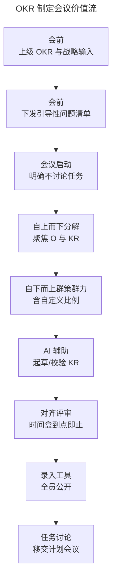
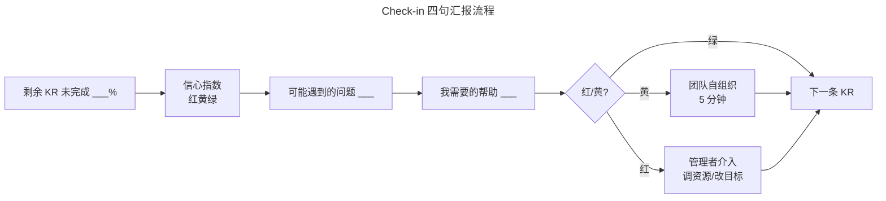
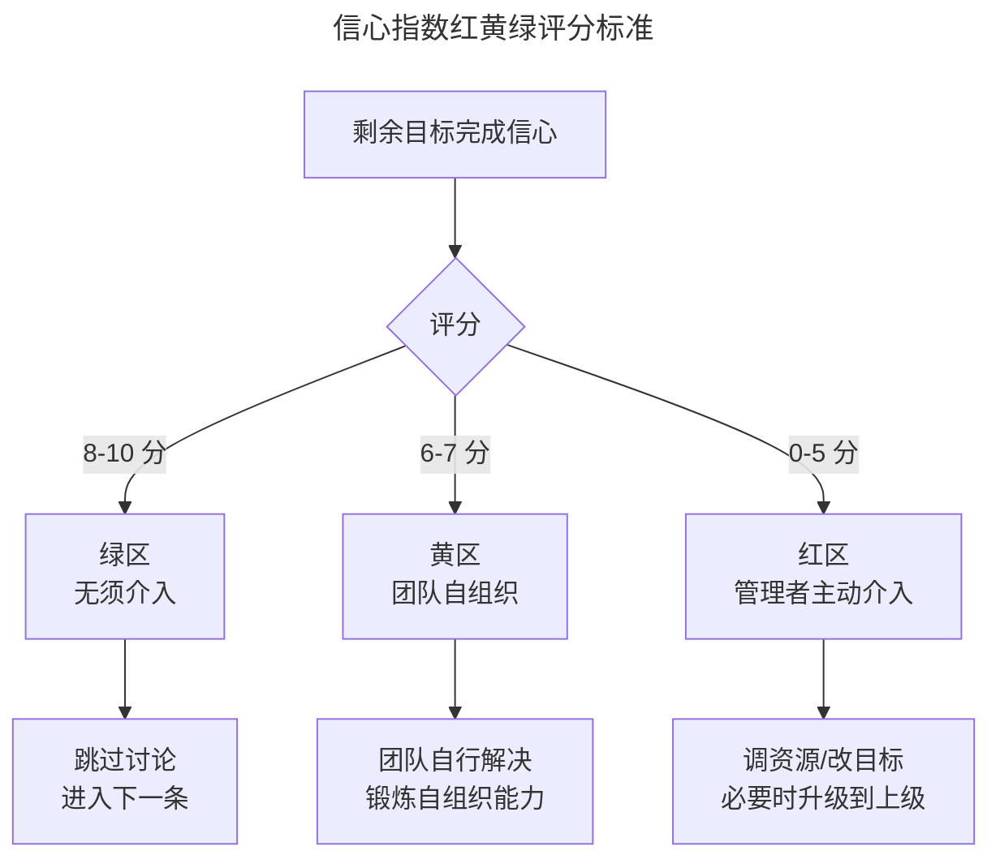
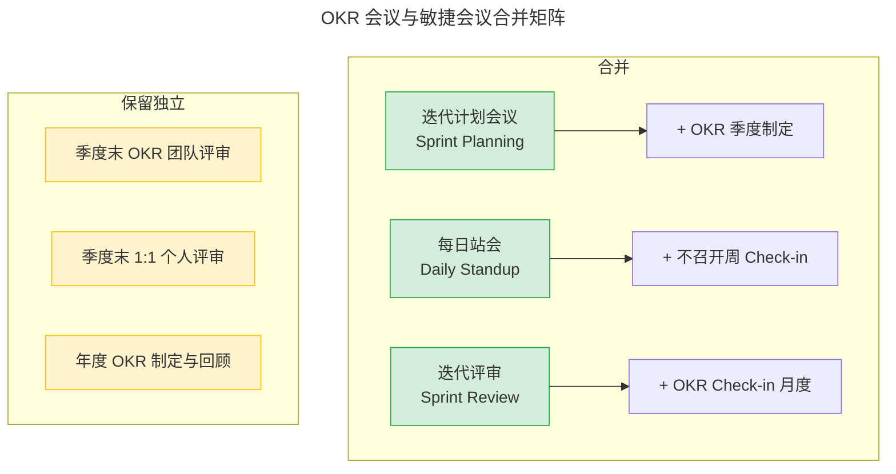

# 提优：如何打造高效率的 OKR 制定、评审会议？

> **适用范围**：已引入 OKR 但遭遇「会议变多、员工抱怨、偷工减料」反噬的组织；尤其适用于同时运行敏捷方法、会议负载本就偏高的科技与互联网团队。
>
> **更新摘要（v2 · 2026-08 更新）**：
> - 将原文「制定会议耗时」「评审会议频率过高」等问题结构化为「时间盒（Time-box）反模式」，给出可量化的时长上限。
> - 新增 Mermaid 图：OKR 制定会议价值流、Check-in 四句汇报流程、信心指数红黄绿评分标准。
> - 整合 2024-2026 实践：AI 辅助 KR 起草、异步 Check-in、与敏捷会议的合并策略。
> - 原文 `/okr-images/` 图片已失效，全部替换为 Mermaid 与表格。

---

## 1. 导言

### 1.1 Why：为什么 OKR 反而让会议变多

许多组织引入 OKR 后的第一感受不是效率提升，而是「会议又多了」。这种现象在同时运行敏捷方法的团队尤其明显：原有周例会、每日站会、迭代评审（Sprint Review）已经占满日程，OKR 又叠加上制定会议、Check-in 会议、季度评审会议。

更严峻的是，由于工作繁忙，组织上下往往「偷工减料」——制定时放弃群策群力改为上级告知；评审频率从周降为半年甚至只在年终。这直接抽空了 OKR「频繁检查、重新对齐上下级目标」的核心价值，使目标导向和战略落地沦为口号。

### 1.2 What：本篇回答什么

- OKR 制定会议与评审会议为什么普遍超时？
- 如何将年度制定会议压缩到 1 周内、季度制定会议压缩到 2 小时内？
- 如何把每周 Check-in 控制在 10 分钟、月度控制在 30 分钟以内？
- 信心指数的红黄绿评分标准如何避免打分争论？
- OKR 会议与敏捷会议如何合并去重？

### 1.3 适用范围

本篇方法对所有规模组织通用，但对**同时运行敏捷与 OKR 的双轨团队**收益最大。会议优化的核心是「时间盒」与「合并」，而非削减会议数量。

---

## 2. 核心方法论

### 2.1 关键定义

| 术语 | 英文对照 | 定义 |
|---|---|---|
| 时间盒 | Time-box | 严格设定的会议时长上限，到点即结束 |
| 制定会议 | Drafting Meeting | 制定年度或季度 OKR 的会议 |
| 评审会议 / Check-in | Review / Check-in Meeting | 季度内定期召开的进度同步与剩余目标重构会议 |
| 季度末评审 | Quarterly Review | 季度末对 OKR 完成度与流程进行确认的会议 |
| 信心指数 | Confidence Level | 对剩余时间内完成目标的主观信心评分 |
| 任务思维 | Task-oriented Mindset | 把任务当成果的常见反模式 |

### 2.2 三大原则

1. **制定会议聚焦 O 与 KR，不讨论任务**：任务由发布计划（Release Planning）、迭代计划（Sprint Planning）承接。
2. **评审会议用剩余目标拉动**：不汇报过去，只看剩余、信心指数与所需帮助。
3. **会议可合并、不可削减**：与每日站会、项目汇报、计划会议去重，但 OKR 的关键评审节点不可省。

### 2.3 时间盒上限（边界条件）

| 会议类型 | 频率 | 时间盒上限 |
|---|---|---|
| 年度 OKR 制定会议 | 每年 1 次 | 1 周内 |
| 季度 OKR 制定会议 | 每季 1 次 | 2 小时以内 |
| Check-in（周） | 每周 | 10-15 分钟 |
| Check-in（月） | 每月 | 30 分钟以内 |
| 季度末团队评审 | 每季 1 次 | 1-2 小时 |
| 季度末个人 1:1 评审 | 每季 1 次/人 | 30-45 分钟 |

> 超过上述上限即视为反模式，需要按第 3 节流程进行诊断与优化。

---

## 3. 关键流程

### 3.1 OKR 制定会议的优化流程

**解读**：制定会议的优化核心是「会前预热 + 会中聚焦 + 会后分流」。会前下发引导性问题让员工线下思考，会中明确禁止讨论任务，会后将任务讨论移交给迭代计划或发布计划会议。引入 AI 辅助起草 KR 可在 2025-2026 工具中显著降低群策群力的耗时。

### 3.2 Check-in 四句汇报流程

**解读**：四句汇报格式把每位发言人的发言时间压缩到 1-2 分钟，剩余时间留给红黄区的问题解决。绿区直接跳过，避免「流水账式工作汇报」。

### 3.3 信心指数红黄绿评分标准

**解读**：红黄绿三档把 10 分制的微小差异抽象为可执行的管理动作。绿区跳过、黄区训练、红区介入。许多团队在 7 分与 8 分之间争论无果，本质是缺乏动作映射；引入三档后争论自然消失。

### 3.4 OKR 会议与敏捷会议的合并策略

**解读**：合并策略遵循「度量层级互补」原则。每日站会已在度量任务级进度，OKR 周 Check-in 度量的是 KR 级进度，两者有重叠可合并为隔周或月度 Check-in。但季度末评审与年度制定是不可替代的战略级节点，必须保留独立。

---

## 4. 工具与实战

### 4.1 会议优化工具链

| 工具类别 | 代表产品 | 会议场景 |
|---|---|---|
| AI 起草 KR | 飞书 OKR AI 助手、WorkBoard Objective AI、Lattice AI | 制定会议会前预热，降低群策群力耗时 |
| 异步 Check-in | Tability、Weekdone、飞书 OKR Check-in 模块 | 替代低风险团队的周会，改为异步打分 |
| 信心指数可视化 | 飞书 OKR、WorkBoard、Betterworks | 红黄绿自动着色，避免会议中争论 |
| 会议时间盒 | 钉钉/飞书日历时间盒、Clockwise | 强制到点结束 |
| Action Item 跟踪 | Teambition、Jira、ONES | 会上记录、会下跟踪，避免会议结论蒸发 |

### 4.2 实战案例：某 SaaS 公司双轨会议优化

**背景**：500 人 SaaS 公司，同时运行 Scrum 与 OKR，原周例会 + 站会 + 周 Check-in 共占员工每周 4-5 小时。

**优化措施**：
1. 周 Check-in 改为异步——员工会前在飞书 OKR 中填写四句汇报，会议仅讨论红黄区；
2. 周例会与周 Check-in 合并为 30 分钟，前 10 分钟过 KR，后 20 分钟讨论红黄区 Action Item；
3. 季度制定会议前一周下发引导性问题清单，会议时长从 6 小时压缩到 2.5 小时。

**结果**：员工每周会议时间下降 40%，OKR 完成度同比提升 12%。

### 4.3 引导性问题清单（会前下发）

以下问题用于会前预热，引导员工线下思考，避免会议中无方向讨论：

1. 我（们）的职责是什么？
2. 为了实现上级目标和公司战略，有哪些工作必须完成？
3. 如果要在更短时间内完成目标，我们可以做哪些事情？
4. 如果要把目标难度提升 10%，我们需要做哪些事情？
5. 有哪些显而易见的风险和阻碍？
6. 为实现战略和上级目标，我们有哪些新东西需要学习？
7. 我们日常工作中有哪些工作与上级 OKR 和公司战略弱相关？
8. 弱相关的这部分工作是否有其独特价值？

> **2026 增补**：在 AI 辅助下，可让 AI 基于历史 OKR 与业务数据自动生成上述问题的初稿答案，员工在会上仅需校正与决策，进一步压缩会议时长。

---

## 5. 常见误区与避坑指南

### 5.1 误区一：年初一次会议制定全年四个季度 OKR

**症状**：年初召集全员，花 1-2 个月制定年度 OKR + 四季度 OKR，最后带着不清晰的目标开始工作。

**根因**：用确定性规划模式套用不确定性业务。

**避坑**：年初只精确制定年度 OKR + 一季度 OKR，其余季度先粗略规划，临近再细化（参考第 07 篇时间节点）。

### 5.2 误区二：制定会议讨论任务而非目标

**症状**：制定会议变成任务列举会，时长失控。

**根因**：任务思维（Task-oriented Mindset）主导，未区分「任务」与「关键结果」。

**避坑**：四条任务（代码评审三轮、自动化测试、压测、生产测试）往往只对应一条 KR（不因程序错误影响用户使用）。把任务讨论移交给发布计划或迭代计划会议。

### 5.3 误区三：评审会议变成工作汇报

**症状**：每人汇报过去做了什么、遇到什么困难、怎么克服，目标剩余多少被一笔带过。

**根因**：使用「进度」语言而非「剩余」语言。

**避坑**：强制四句汇报格式——剩余 % / 信心指数 / 可能的问题 / 需要的帮助。

### 5.4 误区四：信心指数打分争论不休

**症状**：7 分还是 8 分讨论 10 分钟，无实质决策。

**根因**：缺乏统一标准。

**避坑**：采用红黄绿三档，10 分制仅用于趋势观察。同一剩余目标，7 分与 8 分没有本质差异，不需要双方澄清。

### 5.5 误区五：为减负而削减评审频率

**症状**：把 OKR 评审频率从周降为半年甚至年终一次。

**根因**：用「砍会议」代替「优化会议」。

**避坑**：评审是 OKR 高效运转的保障，不可削减。优化方向是合并、压缩、异步化，而非取消。

### 5.6 误区六：忽视会议结论的跟踪

**症状**：会上讨论热烈，会后 Action Item 无人跟踪，下次会议同样问题重现。

**根因**：缺少工具承载与责任到人。

**避坑**：所有 Action Item 必须录入工具（Teambition/Jira/ONES），指定责任人与截止日期，下次 Check-in 第一项回顾上次会议的 Action Item。

---

## 6. 进阶延展与参考资料

### 6.1 进阶延展

- **异步 Check-in 模式**：对于跨时区或远程团队，可用 Tability、Weekdone 实现完全异步的 Check-in，会议只用于红区问题。
- **AI 起草 KR 的边界**：AI 适合起草标准化、有历史数据参考的 KR；战略级、创新型 O 仍需人工群策群力。
- **会议成本可视化**：将会议时长 × 参会人数 × 平均时薪，作为「会议成本」在 OKR 工具中显示，倒逼组织优化。
- **唐纳德·莱因茨森（Donald G. Reinertsen）度量观**：「如果靠度量就能解决问题的话，买个秤就能减肥了。」度量是手段，行动才是目的。

### 6.2 关键术语对照

- Time-box：时间盒
- Check-in：OKR 检查会议
- Sprint Planning：迭代计划会议
- Sprint Review：迭代评审
- CFR：Conversation-Feedback-Recognition
- Task-oriented Mindset：任务思维
- Result-oriented：结果导向

### 6.3 配套阅读

- 本系列《04 重识目标 O：任务和价值，应该以谁为导向？》
- 本系列《07 追踪：可视化追踪，让 OKR 公开透明》
- 本系列《09 反馈：自下而上，OKR 为战略提供优化导向》
- Donald G. Reinertsen，《The Principles of Product Development Flow》
- Christina Wodtke，《Radical Focus》

---

**下一篇**：《09 反馈：自下而上，OKR 为战略提供优化导向》将深入 PDCA 循环与自下而上的战略优化机制，并补 2024-2026 AI 辅助 OKR 趋势。
