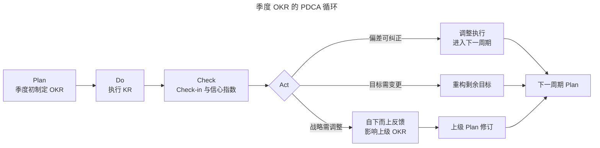
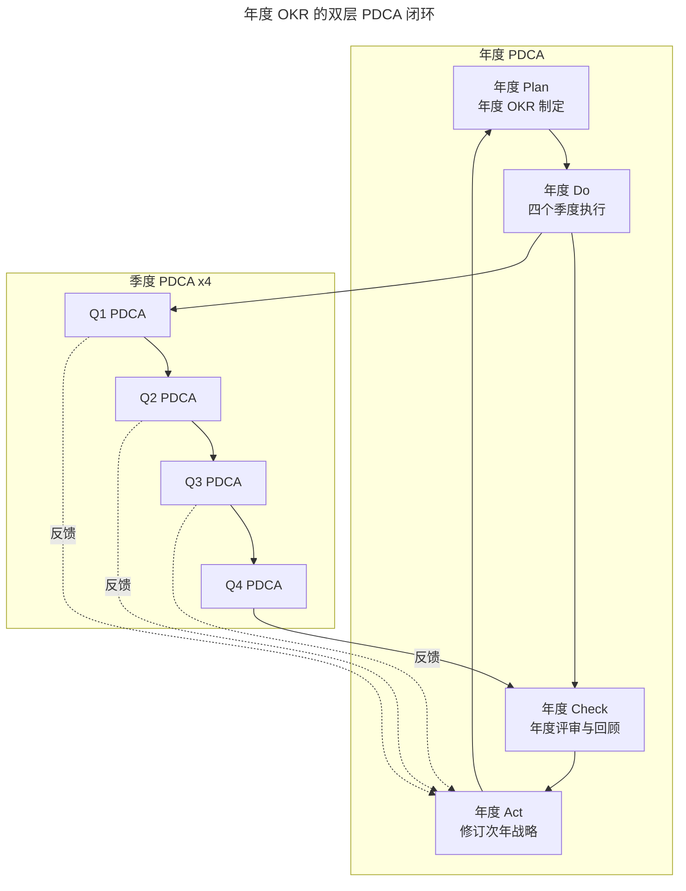
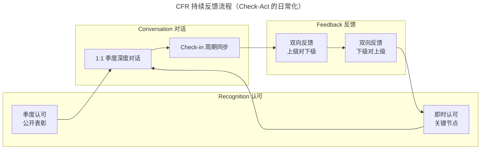

# 反馈：自下而上，OKR 为战略提供优化导向

> **适用范围**：面临 VUCA 环境挑战、希望借助 OKR 持续优化战略的中大型组织；尤其适用于战略对市场变化敏感、需要一线反馈驱动战略迭代的科技与互联网企业。
>
> **更新摘要（v2 · 2026-08 更新）**：
> - 在 PDCA 模型基础上补 2024-2026 AI 辅助 OKR 趋势：AI 起草 KR、健康度诊断、自动对齐建议、CFR 持续反馈与认可。
> - 新增 Mermaid 图：季度 PDCA 循环、年度 PDCA 双层闭环、CFR 持续反馈流程。
> - 强化「关键结果是结果不是任务」的判定标准与反例。
> - 原文 `/okr-images/` 图片已失效，全部替换为 Mermaid 与表格。

---

## 1. 导言

### 1.1 Why：为什么战略需要自下而上的反馈

无论企业处于何种规模，都需面对快速变化的市场需求、迅速迭代的科技创新和源源不断的跨界者挑战。在 VUCA 时代，市场环境充斥易变性（Volatility）、不确定性（Uncertainty）、复杂性（Complexity）、模糊性（Ambiguity），企业有时甚至难以搞清自己的对手是谁、做什么事才是正确的。

在这种环境下，年初制定一个战略计划、按部就班执行一年的做法，往往会在年末回顾时发现自己在低价值或错误的事情上浪费了大量时间，还错过了许多机会。能够提高战略计划有效性的办法是「**持续计划，持续改进**」——这正是 PDCA 模型的核心思想，也是 OKR 内建的管理逻辑。

### 1.2 What：本篇回答什么

- OKR 如何内建 PDCA 模型，实现持续计划与持续改进？
- 自上而下与自下而上如何兼容并包，形成战略优化闭环？
- 为什么「关键结果是结果不是任务」是反馈有效的前提？
- 2024-2026 AI 辅助 OKR 趋势如何重塑反馈机制？
- CFR（Conversation-Feedback-Recognition）如何承接 PDCA 的 Check 与 Act？

### 1.3 适用范围

本篇方法适用于所有已引入 OKR 的组织。对于战略层级较多、决策链条较长的大型企业，自下而上的反馈机制是破解「战略失真」的关键。

---

## 2. 核心方法论

### 2.1 关键定义

| 术语 | 英文对照 | 定义 |
|---|---|---|
| PDCA | Plan-Do-Check-Act | 计划-执行-检查-处理，持续改进的迭代模型 |
| VUCA | Volatility-Uncertainty-Complexity-Ambiguity | 易变性-不确定性-复杂性-模糊性 |
| CFR | Conversation-Feedback-Recognition | 对话-反馈-认可，OKR 持续反馈节奏 |
| 自上而下 | Top-down | 由公司战略逐级分解目标 |
| 自下而上 | Bottom-up | 由执行层自主制定并反馈优化目标 |
| 关键结果 | Key Result（KR） | 衡量目标达成度的可验证结果 |
| 任务 | Task | 完成某项工作的动作，非结果 |
| 信心指数 | Confidence Level | 对完成目标的主观信心评分 |

### 2.2 三大原则

1. **PDCA 内建**：OKR 的季度循环天然映射 PDCA，年度循环是更高维度的 PDCA。
2. **兼容并包**：自上而下定方向、调动资源，自下而上识风险、找机会，二者缺一不可。
3. **结果是反馈的前提**：只有追踪「结果」而非「任务」，才能为战略调整提供有效反馈。

### 2.3 边界条件

- **使用 OKR ≠ 目标被持续优化**：「使用 OKR」是过程与任务，「目标被持续优化」是结果。完成任务不等于达到结果。
- **自下而上比例无固定值**：Google CIO 部门自主制定目标比例高达 60%，但即使是 Google 也不存在完全由员工自主制定 OKR 的情况。
- **反馈有效性依赖管理方式转变**：传统 KPI 式管理下形成的习惯难以一夜改变，需要管理方式的同步变革。

---

## 3. 关键流程

### 3.1 季度 OKR 的 PDCA 循环

**解读**：季度 OKR 不是单次执行，而是一个 PDCA 闭环。Check 阶段通过 Check-in 与信心指数发现问题；Act 阶段有三条出路——执行偏差则调整执行、目标偏差则重构剩余目标、战略偏差则自下而上反馈影响上级 OKR。第三条路径正是 OKR 区别于传统 KPI 的关键。

### 3.2 年度 OKR 的双层 PDCA 闭环

**解读**：年度 PDCA 由四个季度 PDCA 迭代完成，每个季度的反馈以虚线累积影响年度 Act。这一双层结构使得企业既能在季度尺度快速纠偏，又能在年度尺度沉淀战略级修订。OKR 本质上是一个持续计划与持续改进的系统。

### 3.3 CFR 持续反馈流程

**解读**：CFR 把 PDCA 的 Check 与 Act 日常化。Conversation 是 1:1 与 Check-in 的对话节奏；Feedback 是上下级双向反馈，不仅是上级对下级；Recognition 是即时与季度结合的认可机制。三者共同构成 OKR 反馈的「软基础设施」，让自下而上的反馈有出口、被看见、被激励。

---

## 4. 工具与实战

### 4.1 2024-2026 AI 辅助 OKR 趋势

PDCA 方法论本身稳定，但 2024-2026 AI 能力的注入正在重塑 OKR 反馈机制的关键环节：

| 环节 | 传统方式 | AI 辅助方式（2024-2026） |
|---|---|---|
| Plan：起草 KR | 人工群策群力，耗时长 | AI 基于历史 OKR 与业务数据起草 KR 初稿，人工校正 |
| Do：执行追踪 | 手工录入进度 | AI 从研发协同、CRM、BI 自动回流 KR 进度 |
| Check：健康度诊断 | 信心指数主观打分 | AI 健康度诊断（0-100 评分），结合进度趋势与依赖关系 |
| Act：对齐建议 | 人工发现对齐问题 | AI 自动对齐建议，识别跨部门 KR 重复或缺口 |
| CFR：持续反馈 | 季度 1:1 + 周会 | AI 汇总异步反馈，识别需重点关注的红区目标 |

### 4.2 AI 辅助反馈的实战要点

1. **AI 起草 KR 的边界**：AI 适合标准化、有历史数据参考的 KR；战略级、创新型 O 仍需人工群策群力。
2. **健康度诊断的可解释性**：AI 健康度评分必须给出依据（进度滞后、依赖未达成、信心指数下滑等），避免「黑箱评分」导致团队不信任。
3. **自动对齐建议的接受机制**：AI 给出的对齐建议必须由人工最终决策，AI 仅作推荐。
4. **CFR 异步化**：对于跨时区或远程团队，AI 可汇总异步反馈，识别需重点关注的红区目标，把宝贵的会议时间留给真正需要讨论的问题。

### 4.3 关键结果是「结果」不是「任务」的判定标准

| 维度 | 任务（Task） | 结果（Result） |
|---|---|---|
| 描述 | 完成某项工作 | 衡量目标达成度 |
| 度量 | 完成度（0%/100%） | 量化指标（X% 提升至 Y%） |
| 反馈价值 | 无法回答「方向是否正确」 | 能回答「是否离目标更近」 |
| 典型反例 | 单元测试覆盖率提升至 70% | 用户好评率提升至 4.5/5 |

### 4.4 反例与正例对比

某 IT 团队目标：「开发用户喜欢的功能，优化用户对软件的使用体验」。

**反例（任务式 KR）**：
- 单元测试覆盖率提升至 70%
- 完成主要模块的代码重构
- 生产环境 bug 率降低 20%

**问题**：完成主要模块代码重构，代码层面技术债减少，但用户无任何感知；bug 率降低 20% 团队觉得不错，但实际要达到用户好评率提升的目的，可能需要降低 50%。追踪任务式 KR 的结果，就是每季度汇报距离 70% 单元覆盖率还差多少，无法回答「方向是否正确」「做得不够还是做多了」「有没有该做但没做的」三个战略级问题。

**正例（结果式 KR）**：
- 用户好评率从 3.8/5 提升至 4.5/5
- 月活用户数从 50 万提升至 80 万
- 用户推荐度（NPS）从 20 提升至 40

**优势**：以用户感知为度量，能在 OKR 季度评审上直接回答战略级问题，为上级调整战略提供有效反馈。

---

## 5. 常见误区与避坑指南

### 5.1 误区一：使用 OKR 就等于目标被持续优化

**症状**：组织已引入 OKR，但战略目标年末回顾时依然偏离实际。

**根因**：把「使用 OKR」当成了结果，忽视了 PDCA 各环节的质量。

**避坑**：使用 OKR 只是过程与任务，目标被持续优化才是结果。需要在 Plan、Do、Check、Act 各环节保证质量，尤其是 Check 与 Act 的真实发生。

### 5.2 误区二：自上而下或自下而上单边主导

**症状**：要么上级完全下达，下级机械执行；要么下级各自为政，与公司战略脱节。

**根因**：未理解二者兼容并包的本质。

**避坑**：上级擅长定方向、调动资源，下级能看清决策落地时的潜在问题与风险，二者结合才能形成完整视角。自主制定目标的核心原则是围绕公司战略目标，不能脱离。

### 5.3 误区三：关键结果写成任务

**症状**：KR 列满代码重构、单元测试、新技术尝试等条目，问及「项目为什么存在」时一脸错愕。

**根因**：思维中根深蒂固的「结果 = 任务完成」等式。

**避坑**：完成任务不等于有结果，有意义的任务也不等于有价值的结果。OKR 追问的是最终的价值或意义，通过度量交付价值的多少，把过程中的虚假努力打掉。

### 5.4 误区四：忽视员工反馈

**症状**：管理人员表示鼓励员工发表意见，但员工积极性和参与度不高，机械执行。

**根因**：传统 KPI 式管理下形成的习惯难以一夜改变。

**避坑**：管理人员不能指望 OKR 一夜之间改变员工行为，需要合适引导与耐心等待。OKR 是系统工程，需要管理方式与员工行为习惯的同步改变。

### 5.5 误区五：反馈无出口

**症状**：员工在 Check-in 中提出风险与机会，但无机制承接，下次会议同样问题重现。

**根因**：缺少 CFR 的 Recognition 与 Act 闭环。

**避坑**：所有反馈必须有 Action Item 与责任人，下次 Check-in 第一项回顾上次的 Action Item；对有价值的反馈给予即时 Recognition，激励持续反馈。

### 5.6 误区六：AI 辅助变成 AI 替代

**症状**：组织全面采用 AI 起草 KR、AI 打分、AI 对齐，但战略级 O 失真，团队对 OKR 失去信任。

**根因**：把 AI 辅助误用为 AI 替代。

**避坑**：AI 适合标准化、有历史数据参考的环节；战略级、创新型决策必须由人工主导，AI 仅作推荐与初稿。

---

## 6. 进阶延展与参考资料

### 6.1 进阶延展

- **OKR × 敏捷的协同**：OKR 提供目标级方向，敏捷方法提供任务级执行节奏，二者在迭代评审（Sprint Review）与 OKR 季度评审（Quarterly Review）形成呼应。
- **战略级反馈的升级路径**：季度反馈影响下季度 OKR；年度反馈影响次年年度 OKR；多年累积的反馈甚至能推动公司战略级方向调整。
- **AI 时代的反馈节奏**：异步反馈 + AI 汇总正在取代部分同步会议，但季度 1:1 与季度评审等深度对话不可被 AI 替代。
- **CFR 与绩效的解耦**：OKR 反馈应聚焦目标优化，不应直接与薪酬挂钩，否则会扭曲自下而上反馈的真实性。

### 6.2 关键术语对照

- PDCA：Plan-Do-Check-Act，计划-执行-检查-处理
- VUCA：Volatility-Uncertainty-Complexity-Ambiguity
- CFR：Conversation-Feedback-Recognition，对话-反馈-认可
- NPS：Net Promoter Score，净推荐值
- Health Score：OKR 健康度评分，0-100

### 6.3 配套阅读

- 本系列《04 重识目标 O：任务和价值，应该以谁为导向？》
- 本系列《05 关键结果 KR：如何制定才能体现目标进度》
- 本系列《07 追踪：可视化追踪，让 OKR 公开透明》
- 本系列《08 提优：如何打造高效率的 OKR 制定、评审会议？》
- John Doerr，《Measure What Matters》（含 CFR 章节）
- W. Edwards Deming，《Out of the Crisis》（PDCA 起源）

---

**下一篇**：《结束语 OKR，对价值的极致追求》将从思辨角度收束全篇，把「唯结果论」升级为「价值导向（Value-oriented）」框架，并补 AI 时代 OKR 对「虚假忙碌」的消解。
