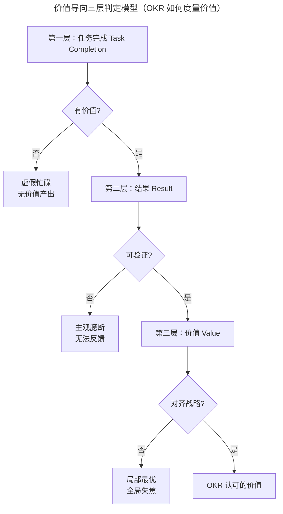
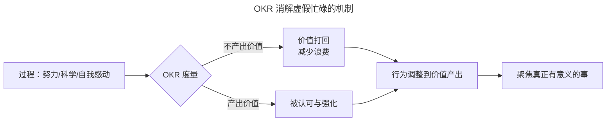

# 结束语 OKR，对价值的极致追求

> **适用范围**：完成 OKR 全套方法论学习、希望从思辨角度理解 OKR 本质的管理者与执行者；尤其适用于在「唯结果论」与「过程论」之间徘徊、希望借助 OKR 建立「价值导向（Value-oriented）」组织文化的团队。
>
> **更新摘要（v2 · 2026-08 更新）**：
> - 保留原文「唯结果论」思辨，但升级为「价值导向（Value-oriented）」框架，区分「结果」「任务完成」「价值」三层概念。
> - 补 AI 时代 OKR 对「虚假忙碌（Fake Busyness）」的消解机制。
> - 新增 Mermaid 图：价值导向三层判定模型。
> - 原文未引用图片，本版不引入图片资源，仅使用 Mermaid 与表格。

---

## 1. 导言

### 1.1 Why：为什么需要重新审视「结果」

在我个人职业生涯与咨询经历中，我经常从各级管理人员口中听到一句话：「我不管过程是怎样的，我只要看到我要的结果，如果结果没达到就不行。」我们管这种态度叫「唯结果论（Result-only Doctrine）」。

作为职场新人时，我曾在相当长的时间里对这种态度深恶痛绝，原因有二：

- 员工在过程中的努力、付出与才智，仅因结果不是领导想要的，就被全盘否定；
- 有时未达成结果并非员工错误，可能是决策偏离方向、沟通不到位，唯结果论实际上把决策与沟通的错误也让员工承担。

作为研究管理与绩效考核多年的人，我依然认为这是管理人员未尽到职责、将责任与风险转嫁给员工的懒政表现。但**我对「过程」与「结果」却有了完全不同的看法**——问题不在于「要结果」，而在于把什么定义为「结果」。

### 1.2 What：本篇回答什么

- 为什么 OKR 本质上是一种「唯结果论」，但发挥的却是正向作用？
- 如何把「唯结果论」升级为「价值导向（Value-oriented）」框架？
- 任务完成、结果、价值三层概念如何区分？
- AI 时代，OKR 如何消解「虚假忙碌（Fake Busyness）」？
- 引入 OKR 最常见的根本错误是什么，如何避免？

### 1.3 适用范围

本篇是《极简 OKR 实战》系列的思辨性收束。它不提供新的操作流程，而是为前九篇方法论提供价值论底座，适用于所有 OKR 实践者与决策者。

---

## 2. 核心方法论

### 2.1 关键定义

| 术语 | 英文对照 | 定义 |
|---|---|---|
| 唯结果论 | Result-only Doctrine | 只看结果不看过程的管理态度 |
| 价值导向 | Value-oriented | 以可验证的客户/业务价值为最终度量 |
| 任务完成 | Task Completion | 完成某项工作的动作状态 |
| 结果 | Result | 衡量目标达成度的客观状态 |
| 价值 | Value | 对客户、业务、组织有意义的可验证产出 |
| 虚假忙碌 | Fake Busyness | 用「忙」的过程缓解焦虑、感动自己或逃避真问题 |
| 任务思维 | Task-oriented Mindset | 把任务完成等同于结果的反模式 |

### 2.2 三大原则

1. **结果 ≠ 任务完成**：完成任务可能是完全无价值的。
2. **有意义的任务 ≠ 有价值的结果**：即使任务本身有意义，也不等于产出了价值。
3. **价值可验证**：OKR 的结果要求是有价值、有意义的，且是可验证的——能回答「是否走在正确的路上」「是否离目标更近」「是否做过头了」「是否做得不够」。

### 2.3 边界条件

- **唯结果论的正向与负向分野**：负向唯结果论把决策与沟通的错误转嫁给员工；正向唯结果论（OKR 式）通过度量最终价值，把过程中的虚假努力打掉。
- **OKR 不是万能的**：使用 OKR 不会自动让目标被持续优化，需配合管理方式与行为习惯的同步改变。
- **AI 不能替代价值判断**：AI 能度量进度、识别异常，但「什么是有价值的」仍需人工判断。

---

## 3. 关键流程

### 3.1 价值导向三层判定模型

**解读**：价值导向框架把「度量」分为三层。第一层判断任务完成是否有价值，过滤掉虚假忙碌；第二层判断结果是否可验证，避免主观臆断；第三层判断价值是否对齐战略，避免局部最优与全局失焦。OKR 站在交卷那一天，手里拿着这把三层尺子，度量折腾出来的结果。

### 3.2 OKR 对虚假忙碌的消解机制

**解读**：OKR 只看目标与关键结果，不看过程。无论过程是努力的、科学的，还是自我感动的，总有交卷的一天。OKR 在那一天用价值这把尺子度量结果，把过程中的虚假努力打掉，逼迫行为调整到产出有价值的结果上来。这是 OKR 消解虚假忙碌的核心机制。

---

## 4. 工具与实战

### 4.1 AI 时代虚假忙碌的新形态

2024-2026 AI 工具普及后，虚假忙碌出现了新的变种：

| 形态 | 表现 | OKR 的消解 |
|---|---|---|
| 工具堆砌 | 用 10 个 AI 工具替代 1 个核心问题 | 度量最终价值产出，而非工具使用量 |
| 会议幻觉 | AI 总结会议纪要，但会议本身无决策 | 四句汇报格式 + Action Item 跟踪 |
| 文档膨胀 | AI 自动生成 OKR 文档，但脱离业务 | 第三层判定：是否对齐战略 |
| 数据焦虑 | 追踪海量指标，但无战略对齐 | 关键结果要求「可验证且对齐战略」 |
| 假对齐 | AI 自动对齐建议被无脑接受 | 人工最终决策，AI 仅作推荐 |

### 4.2 实战：从「任务 OKR」到「价值 OKR」的迁移

某 IT 团队原始 OKR：

- KR1：单元测试覆盖率提升至 70%
- KR2：完成主要模块的代码重构
- KR3：生产环境 bug 率降低 20%

**问题诊断**：这些 KR 全是任务完成，无法回答「项目为什么存在」「用户是否感知到改善」。

**迁移后的价值 OKR**：

- KR1：用户好评率从 3.8/5 提升至 4.5/5
- KR2：月活用户数从 50 万提升至 80 万
- KR3：用户推荐度（NPS）从 20 提升至 40

**迁移要点**：把度量对象从「团队做了什么」转移到「用户/业务获得了什么」。AI 工具（如飞书 OKR AI 助手）可辅助生成 KR 初稿，但战略级价值判断必须由人工主导。

### 4.3 实战：单元测试覆盖率的思辨

提升代码单元测试覆盖率是一件非常有意义的任务。然而单元测试的开发与维护需要投入不小的人力与时间成本。对于中大型软件，约 30% 的功能是频繁使用和维护的，其余 70% 的代码使用与更改频率非常低。

- 如果只聚焦在「单元测试」这一任务上，会理所当然地认为这 70% 的代码应有配套单元测试；
- 但把目光提升到项目高度，会发现这个做法的投资回报率特别低，还占用资源、影响其他更有价值事项的进度。

**结论**：即使有足够理由认为现在做的事有意义，也不意味着它是 OKR 认可的结果。OKR 的结果不但要求有价值、有意义，还要求可验证——能告诉我们是否走在正确的路上，是否离目标更近，是否做过头了，是否做得还不够。

---

## 5. 常见误区与避坑指南

### 5.1 误区一：把目标和关键结果定义成任务

**症状**：许多企业制定 OKR 时，把原来的任务装进 OKR 的格式里，本质上跟踪的是任务而非 OKR，所谓目标管理本质上还是在管理过程。

**根因**：思维中根深蒂固的「结果 = 任务完成」等式。

**避坑**：完成任务不等于有结果，有意义的任务也不等于有价值的结果。OKR 中的关键结果是指有价值的结果，而非「任务完成」的结果。

### 5.2 误区二：用忙碌的满足感替代价值产出

**症状**：员工每天加班到很晚，会议排满，文档丰富，但季度末 OKR 评审时发现价值产出寥寥。

**根因**：陷入虚假忙碌，用「忙」的过程缓解焦虑、感动自己或逃避真正的问题。

**避坑**：OKR 只看目标与关键结果，不看过程。用价值这把尺子度量结果，把过程中的虚假努力打掉，逼迫行为调整到产出有价值的结果上来。

### 5.3 误区三：忽视「项目为什么存在」的追问

**症状**：拿着 OKR 让人看，关键结果列满代码重构、单元测试、新技术尝试等条目，问及「项目为什么存在」时一脸错愕。

**根因**：未把目光提升到价值层，停留在任务层。

**避坑**：OKR 追问的是最终的价值或意义。它通过度量最终交付价值的多少，把过程中的虚假努力与一厢情愿的想法全部打掉，逼你回到做真正有意义的事情上去。

### 5.4 误区四：把 AI 当成价值判断者

**症状**：组织全面采用 AI 起草 KR、AI 打分、AI 对齐，但战略级 O 失真，团队对 OKR 失去信任。

**根因**：把 AI 辅助误用为 AI 替代。

**避坑**：AI 能度量进度、识别异常、起草初稿，但「什么是有价值的」仍需人工判断。AI 是尺子的辅助，不是尺子本身。

### 5.5 误区五：唯结果论的负向使用

**症状**：管理人员把决策与沟通的错误转嫁给员工，仅因结果未达预期就全盘否定员工。

**根因**：未区分负向唯结果论与正向价值导向。

**避坑**：负向唯结果论是懒政，正向价值导向是 OKR 的精髓。二者的分野在于：是否在过程中提供方向与资源支持，是否度量的是「价值」而非「结果」本身。

---

## 6. 进阶延展与参考资料

### 6.1 进阶延展

- **价值导向的组织文化**：OKR 是工具，价值导向是文化。工具的落地需要文化的同步建设，否则 OKR 会沦为新的任务清单。
- **AI 时代的人机协作边界**：AI 适合度量、识别、起草；战略级价值判断必须由人主导。这一边界会随 AI 能力演进而动态调整。
- **从「唯结果论」到「价值导向」**：这是管理认知的升级，不是对结果的放弃，而是对「什么是结果」的重新定义。
- **OKR 与生活的迁移**：OKR 追问价值的逻辑同样适用于个人生活——不要让「忙碌」带来的满足感蒙蔽眼睛，虚度了岁月。

### 6.2 关键术语对照

- Value-oriented：价值导向
- Result-only Doctrine：唯结果论
- Fake Busyness：虚假忙碌
- Task Completion：任务完成
- Result：结果
- Value：价值
- NPS：Net Promoter Score，净推荐值

### 6.3 配套阅读

- 本系列《04 重识目标 O：任务和价值，应该以谁为导向？》
- 本系列《05 关键结果 KR：如何制定才能体现目标进度》
- 本系列《07 追踪：可视化追踪，让 OKR 公开透明》
- 本系列《08 提优：如何打造高效率的 OKR 制定、评审会议？》
- 本系列《09 反馈：自下而上，OKR 为战略提供优化导向》
- John Doerr，《Measure What Matters》
- Andy Grove，《High Output Management》

---

## 结语

OKR 不是又一个目标管理工具的换皮。它通过把「结果」重新定义为「可验证的价值」，把过程中的虚假努力、一厢情愿的想法、自我感动的忙碌全部打掉，逼迫组织与个人回到做真正有意义的事情上来。

希望读者们最终都能体会到 OKR 的这层含义，用它来指导工作、指导生活——不要让「忙碌」带来的满足感蒙蔽了眼睛，虚度了岁月。

> **本系列至此完结。愿你在 VUCA 时代，以价值为锚，持续计划，持续改进。**
