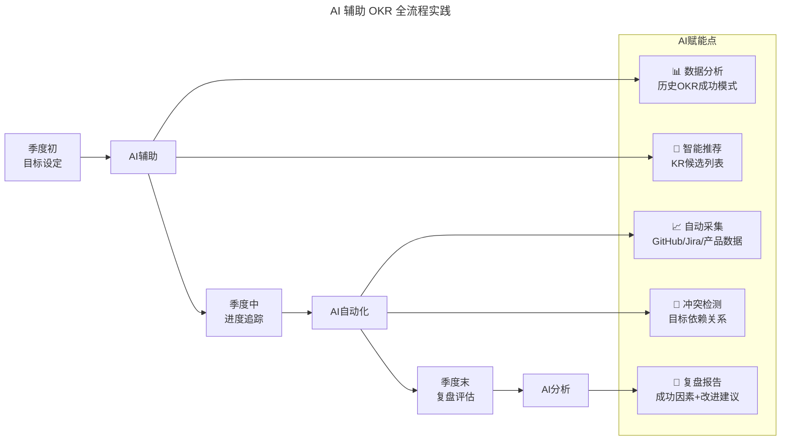

# 第23讲 | 产品技术团队OKR使用法则

> **适用范围**：CTO、技术 VP、产品技术团队负责人，以及正在评估是否在产品技术部门独立引入 OKR 工作法的管理者。
>
> **更新摘要（v2 · 2026-08 更新）**：
> - 结构化升级为 6 节骨架（导言 / 核心方法论 / 关键流程 / 工具与实战 / 常见误区 / 进阶延展）
> - 保留原 2019 年原文方法论与"五类产品技术 OKR"分类，并将"AI 时代升级注解（2026）"统一融入进阶延展
> - 补充 Mermaid 图标题与图后解读，强化"先决条件—五类目标—执行评估"的链路可读性
> - 在常见误区一节显式归集原文中散落的反模式（部门本位、KPI 化、任务分配而非任务设计等）

## 1. 导言

经常有团队问我，团队或者部门是否可以应用 OKR 工作法。我的回答一般是否定的。像销售、市场、人事、行政这样的职能部门，如果彼此独立设定 OKR，几乎必然是无法和公司的聚焦目标对齐的。而且这些孤立的部门无法形成完整的业务链条，如果不能从公司或者事业单元的角度出发，就无法识别出影响成长的瓶颈问题和可能存在的增长动因，也就无法做有意义的聚焦。

但是，这个问题在产品技术部门可能是个例外。尤其是产品型公司的产品技术团队。一方面是因为产品型公司的聚焦重点经常会放在产品本身；另一方面是因为很多互联网公司在产品技术方面遇到的问题和机会都非常接近，以至于我看到不少科技公司在企业层面的 OKR 设定都非常近似。

### 1.1 引入 OKR 的先决条件

即便如此，也并非所有的产品技术团队都适合独立引入 OKR 方法。如果要让这个方法在企业中发挥出成效，不产生部门本位主义，那么这个团队要符合以下这些特征：

1. 产品技术团队能够对产品的设计、开发和交付整体负责；团队具备主控性，而不是受制于多个部门的配合；
2. 非项目服务业务模式，产品技术团队服务的是本企业的产品，而不是客户的产品，否则这个团队的核心管理体制很难超越项目管理本身。而且外包项目的生命周期也不足以来激励 OKR 的实施；
3. 公司的业务成效很大程度上取决于产品本身的定位、特性与市场需求的适配度和产品质量；销售和营销职能起的是放大器作用。消费者应用领域的公司大多符合这个条件。如果是 2B 的产品则要视情形来看。

如果以上先决条件不存在，那么这样的团队独立实施 OKR 的成效是不乐观的。实际上，缺乏自治度和管理关注度的产品技术团队，本身也很难有动力来自行发起目标管理。即使做，一般也只是为了响应公司从上至下的管理要求而已。

## 2. 核心方法论

当我辅导了十家科技企业的 OKR 制定沟通会议以后，我发现这类企业的 OKR 选择有非常明显的规律。团队相对容易达成一致的目标意图（Objective）大体会分成以下五类。这五类目标构成了产品技术团队 OKR 设定的核心方法论。

### 2.1 产品特性交付里程碑

这可能是最常见的目标之一。产品技术团队因为担负交付产品和特性的责任，所以容易有这样习惯性的思维——本季度发布 xxx 特性，交付 2.0 版本产品等。

在这个动因下，产品技术部门设定目标要有更清醒的头脑和更整体的认知。为什么要交付 2.0 版本？2.0 版本主要解决的问题是什么？除了形式上的交付，用什么 KR 能够更好地定义交付成功？一个好的产品交付目标应该揭示背后的商业意图。比如："通过 2.0 解决客户自助部署问题"就是更加完整的目标描述。

正是因为如此，这类目标所配套的关键结果（Key Results）也要能够反映出意图达成的 KPI（请中性理解这里的 KPI 含义）。发布时间本身不应该成为 KR，发布后能够形成的一个关键数据指标才是。比如上面"通过 2.0 解决客户自助部署问题"的 Objective 可能需要配套一个 KR：自助部署页面的 UV 数量，它反映了这个特性交付带来的客户价值，每有 1000 个 UV，说明可能有 1000 个用户得到了自助部署系统的帮助。

在产品特性交付目标方面，我还经常发现一个常见困难，就是每个季度的 OKR 周期很难保证一个大宗的产品特性交付彻底完成，更加不要说获得使用相关的数据。这时候，我们就需要定义更加细分的里程碑，而不是一个版本的交付，比如"完成单元测试"、"完成数据架构设计"等。

### 2.2 提升开发和运维质量

在产品型公司的早期，因为经验和能力的原因，在产品开发和运维过程（devops）中存在大量缺陷。有一些质量问题也可能是因为"MVP"理念导致的。这些可能都是创业公司不可避免的阶段。

但当公司开启了商业化进程，建立了专门的销售团队，低质量的产品会消耗巨大的营销投入，不仅无法转化满意的客户，而且会让整个团队士气低落。

但站在公司的角度看，刚刚建立了销售团队，管理层的注意力通常被牵制在销售团队的形成和管理上，有时候是无暇顾及，有时候是没有意识到产品质量对于提高销售效率的重要性。与其等到部门之间相互指责和推诿，有全局观的 CTO 应该尽快聚焦在提升质量的目标上。在达成这类目标时，产品技术团队的自治能力至关重要。

技术产品的质量提升目标不难设定用于衡量的关键结果（KR），但指标选择的过程最好依然是从下至上的，因为非专业人员很难有相关的知识背景。如果是和软件缺陷有关的质量改进，这个关键结果最好能够落在测试流程内部（用例的数量和覆盖度，测试的自动化程度等），而不是去衡量客户投诉率这样的滞后性 KR；如果是和运维质量相关的目标，KR 则更容易选择一些，因为有足够多的监控工具来直接提供有意义的指标。

### 2.3 运营改善相关

产品运营的职能划分在不同公司不一样，但有很多互联网企业很重视产品运营，并且意识到产品设计和研发团队对运营管理的直接驱动力。所以，也有不少产品技术团队会直接提出和运营改善有关的目标，这通常发生在企业的成长阶段。

AARRR（获取，激活，转化，留存和推荐）是建立运营改善目标的最佳模型，它揭示出一个产品的总体成功来自这五个基本运营环节的成功。产品运营绩效目标的达成依靠的是方法、智力的投入，比如通过 User Onboarding Design（用户上手指南设计）提升新用户激活度，而它带来的产出在财务上却非常显要。卓越的产品运营能够大幅降低平均营销成本，提升用户终生价值。从这个角度看，来自产品技术团队的相关目标设定，能够大幅影响公司的最终绩效。

这类目标的描述可以非常直白，面对惨淡的留存，产品团队应该意识到"提升用户留存"是一个显然的目标意图。但是在每个公司的具体业务中，它的描述可以更加明确，比如"通过游戏化设计来加强用户留存"，"通过 Onboarding 模块加强用户留存"等。目标的设定越明确，在 OKR 执行过程中的任务设计就越顺畅，在复盘时头脑也更加清醒，不会被干巴巴的数字所制约。

和开发运维质量提升相关的目标类似，产品运营的 KR 制订也有它的专业性要求，比如有关用户留存的 KR，专业领域内有几十个可以使用的指标，到底哪个指标能够反映当下目标的实现度？次日留存和次月留存可能有完全不同的暗示。这需要专业的产品运营自发来选择指标，而不是等待管理层派发指标。同样，前面提到的目标描述的具体度也会影响我们选择 KR 时的精确度。

### 2.4 提升产品市场适配度

产品的功能和特性与客户的实际需求存在断层，这是一个普遍的企业失败原因，不仅在产品早期可能出现，在扩张阶段也可能再次遇到。杰佛瑞·摩尔在经典著作《跨越鸿沟》中阐明了出现这种情况的必然性。尤其是科技产品，早期用户和主流用户在需求和心理上的巨大差异使得一个新产品在进入早期市场和拓展主流市场的不同阶段面临完全不同的市场接受度。

产品市场部门很难独立定义这样的目标。不仅可能缺乏足够的决策信息，也很难有这样的决策权威，因为它很容易挑战到一个公司的品牌和市场定位，细分市场选择。所以，这类目标的设定通常都需要和管理层，销售业务部门充分的沟通。

设定好这一类的目标的前提是企业对"理想客户对象"有更加明确的定义。假设这个步骤能够达成共识，那么产品技术团队就需要和销售业务团队仔细沟通产品应该怎样改进才能更好地满足这类目标客户的需求。在以季度为周期的 OKR 执行中，聚焦解决那些能够有助于提高产品市场适配度的关键特性。这时候，选择对应市场的销售转化率作为 KR，可能是更明智的做法。因为在客户买单之前，我们很难找到可靠的前导性指标。对于 2C 产品，验证要更加容易一些，一般留存率和活跃度指标都能够很好地反映需求匹配度。

### 2.5 技术选型变更和偿还技术债

在业务成长到一个阶段时，有一些技术团队会意识到紧迫的架构调整、技术选型升级等偿还技术债问题。这更加是一个需要由下至上设定目标的领域，因为很少有公司的管理层和其他业务部门关注这一点。如果业务发展顺利，用户不断增长，那么该发生的事情一定会发生。警惕性高的 CTO 们会未雨绸缪。

设定这类目标时，要重视的是和管理层达成共识，因为这些技术工作必然会影响功能特性开发，锁死一些常规事务的进展，也可能涉及一些可控风险。如果没有事先的沟通，很可能会发生不必要的冲突。

当然，这些目标是否应该成为产品技术部门某季度必须面对的关键目标，不能是 CTO 的主观臆断。它应该建立在数据的客观分析和预测上。

衡量这类目标的 KR 也不难识别，甚至纯技术层面的压力测试就能够很好地回答这个问题。我们有没有让基础构架更加健壮？我们能否承受每小时 100 万次以上的访问？设定了这类目标和关键结构，就公开给其他部门的同事，这样既能够让团队周知这些事务的重要性，争取支持，也能够激励营销和销售部门，建立更强的业务拓展信心。

## 3. 关键流程

我列举了产品技术部门可能独立制定的五类目标类型，它们中的一部分依然有赖于和其他部门的深度协作，KR 的设计也考验团队的策略分析和批判性思维能力。但这些都还只是开始，OKR 目标的有效达成，并不是依赖选择出科学的 KR，而是需要设计出切实有效，尽责执行的任务项，并且连续跟踪这些任务的完成状况，遇到的问题，改进方案。

### 3.1 任务设计而非任务分配

我为什么要强调"任务设计"，而不是"任务分配"？因为 OKR 目标所对应的问题通常不是一个常规运营问题，更加不是一个逐步改良性的目标，而是一个阻碍企业成长的关键问题，必须集中精力去跃升。如果依靠一般的任务分配所能够达到的成效，是很难有惊喜的。当 OKR 脱离了传统的绩效考核范畴，参与者就可以解放思想，采用创造性的手段来达成目标，这就是为什么要叫"任务设计"。

### 3.2 持续跟踪与复盘

在产品技术相关的目标达成中，我发现卓越完成的情况往往依赖两个重要的驱动力，一是成员的敬业度，二是成员的学习能力。对于一个产品技术问题的解决，很少存在可不可行的问题，更多的是团队暂时没有取得相关的能力，不知道行业的最佳实践是怎样的。敬业度又和学习能力相辅相成，彼此关联。所以，想要 OKR 目标的达成度提高，CTO 和产品 VP 们应该长期关注的是人才的选拔标准，和团队共同学习进步的具体安排。

我在管理明道的几年中，最大的感悟就是这一点。科技公司的兴起来自于关键技术能力的提前掌握，同样，科技公司的衰败也是因为没有能够跟上产品技术进步的洪流，它和团队成员有没有及时完成一个短期绩效目标没有太多联系。所以，OKR 工作法看似是一个围绕短期，高速迭代的执行落地方法，但它的有效性有赖于使用者对长期绩效和价值创造的绝对关注。

## 4. 工具与实战

本节聚焦产品技术团队 OKR 落地的实战抓手，将原文五类目标与配套 KR 写法集中呈现为可复用的工作模板。

### 4.1 五类目标与配套 KR 速查

| 目标类型 | 典型 Objective 示例 | KR 设计要点 | 常见坑 |
|---------|---------------------|-------------|--------|
| 产品特性交付 | 通过 2.0 解决客户自助部署问题 | 用交付后形成的关键数据指标（如 UV）替代发布时间 | 把"上线日期"当 KR |
| 开发运维质量 | 提升核心服务稳定性 | 用例数量/覆盖度、自动化程度、监控指标 | 用客户投诉率等滞后性 KR |
| 运营改善 | 通过 Onboarding 模块加强用户留存 | 次日/次月留存、激活率、推送触达率 | 让管理层派发指标 |
| 产品市场适配 | 让产品更好地满足目标客户 | 销售转化率（2B）/留存率、活跃度（2C） | 缺乏"理想客户"定义 |
| 技术债偿还 | 让基础架构承受 100w QPS | 压测通过、架构升级里程碑 | CTO 主观臆断，未与业务对齐 |

### 4.2 作者实践案例

任向晖老师在明道担任 CEO 期间，长期以"长期绩效和价值创造"为 OKR 评估的底层视角。其经验表明：OKR 工作法看似是一个围绕短期、高速迭代的执行落地方法，但它的有效性有赖于使用者对长期绩效和价值创造的绝对关注——这是产品技术团队落地 OKR 不可忽视的实战前提。

## 5. 常见误区

在产品技术团队独立实施 OKR 的过程中，以下反模式值得警惕：

1. **部门本位主义**：职能部门彼此孤立设定 OKR，无法与公司聚焦目标对齐；产品技术团队必须先满足先决条件（主控性、产品型业务、产品决定成效）才适合独立引入。
2. **形式化交付目标**：把"本季度发布 xxx 特性"当作目标，而未揭示背后的商业意图；好的产品交付目标应回答"为什么要交付"。
3. **把发布时间当 KR**：发布时间本身不应成为 KR，发布后形成的关键数据指标才是。
4. **使用滞后性 KR**：质量改进类目标用客户投诉率衡量为时已晚，应落在测试流程内部的先行指标。
5. **任务分配而非任务设计**：OKR 目标对应的不是常规运营问题，依赖任务分配难以产生惊喜，需要创造性的任务设计。
6. **CTO 主观臆断技术债目标**：偿还技术债类目标必须建立在客观数据分析与预测上，并提前与管理层达成共识。
7. **忽视长期视角**：只关注短期绩效达成，忽视人才选拔与团队学习能力建设，会让 OKR 失去长期有效性。

## 6. 进阶延展

### 6.1 2019 vs 2026 OKR 实践演进

OKR 工作法在 2026 年因 AI 技术的加持而变得更加强大。**AI 不会取代 OKR 中的"人"的因素——方向判断、团队激励、价值认同——但 AI 可以让 OKR 的执行过程更加数据化、智能化和高效化**。

| 维度 | 2019 年做法 | ⭐ 2026 年 AI 增强版 |
|------|-----------|----------------|
| **目标设定** | 季度手动制定 | **AI 辅助分析 + 智能推荐 O** |
| **关键结果** | 人工拆解 KR | **AI 生成多维度 KR 选项** |
| **进度追踪** | 周会/月会汇报 | **AI 自动采集数据 + 实时仪表盘** |
| **复盘评估** | 季末人工复盘 | **AI 生成复盘报告 + 模式识别** |
| **对齐机制** | 手动上下对齐 | **AI 检测目标冲突 + 建议调整** |

### 6.2 2026 年 AI 时代的 OKR 新五类目标

基于原文的五类目标，增加 AI 时代的新维度：

#### 6.2.1 产品特性交付 + AI 增强

**原文 KR 示例**：自助部署页面 UV 数量

**⭐ 2026 新增 KR 类型**：

```
O: 通过 AI 能力提升产品交付效率
├── KR1: AI 辅助编码覆盖率从 0% 提升至 70%
├── KR2: 需求到上线的周期从 4 周缩短至 1 周
├── KR3: AI 生成代码的 Bug 率低于手写代码
└── KR4: 团队 AI 工具采纳率达到 90%
```

#### 6.2.2 开发运维质量 + AIOps

**⭐ 2026 新增 KR 类型**：

```
O: 构建 AI 驱动的工程质量体系
├── KR1: AI Code Review 覆盖 100% 的 PR
├── KR2: AI 自动生成测试用例覆盖率 > 80%
├── KR3: AIOps 故障预测准确率 > 85%
└── KR4: MTTR（平均修复时间）降低 50%
```

#### 6.2.3 运营改善 + AI 运营

**⭐ 2026 新增 KR 类型**：

```
O: 用 AI 重塑用户运营效率
├── KR1: AI 客服解决率从 30% 提升至 70%
├── KR2: 个性化推荐点击率提升 40%
├── KR3: 用户流失预警提前 7 天识别
└── KR4: 营销文案 AI 生成 + A/B 测试自动化
```

#### 6.2.4 产品市场适配 + AI 洞察

**⭐ 2026 新增 KR 类型**：

```
O: 利用 AI 加速 PMF 验证
├── KR1: AI 用户访谈分析覆盖 100 个样本/月
├── KR2: 竞品功能 AI 对比报告周更频率
├── KR3: 需求优先级 AI 评分模型上线
└── KR4: NPS 通过 AI 情感分析实时追踪
```

#### 6.2.5 技术选型变更 + AI 技术债管理

**⭐ 2026 新增 KR 类型**：

```
O: 建立 AI-Native 技术架构
├── KR1: 完成 AI 工具链标准化（Cursor/Copilot/v0）
├── KR2: 建立企业级 Prompt 模板库（100+ 模板）
├── KR3: AI 项目 ROI 追踪系统上线
└── KR4: 团队 AI 技能认证通过率 > 80%
```

### 6.3 AI 辅助 OKR 全流程实践



上图展示了 AI 在 OKR 季度周期中的三类赋能点：季度初的目标设定（数据分析 + 智能推荐）、季度中的进度追踪（自动采集 + 冲突检测）、季度末的复盘评估（复盘报告）。三类赋能点串成闭环，使原本依赖人工经验和会议沟通的环节具备数据基础。

### 6.4 给 2026 年技术管理者的 OKR 行动建议

#### AI-OKR 最佳实践清单

- [ ] 使用 AI 工具辅助目标设定（如 GPT-5.5 分析业务数据）
- [ ] 建立 KR 的数据源对接（Jira/GitHub/Google Analytics）
- [ ] 部署 OKR 进度自动追踪看板
- [ ] 每月用 AI 生成一次进度简报
- [ ] 季末使用 AI 进行深度复盘分析

### 6.5 关键数据参考（2026）

| 指标 | 传统 OKR | AI 增强 OKR | 提升 |
|------|---------|-----------|------|
| 目标设定时间 | 2-3 天 | **4 小时** | **90%↓** |
| 进度追踪及时性 | 周更新 | **实时** | **7x↑** |
| 复盘深度 | 依赖个人经验 | **数据驱动 + 模式识别** | **质量↑↑** |
| 目标达成率 | 60-70% | **75-85%** | **15%↑** |

### 6.6 2026 年的 OKR 公式

**OKR = (人的判断 × AI 的数据) + (团队的承诺 × AI 的效率)**

### 6.7 作者简介

任向晖，企业社会化协作平台明道创始人 & CEO。梅花网创始人。
