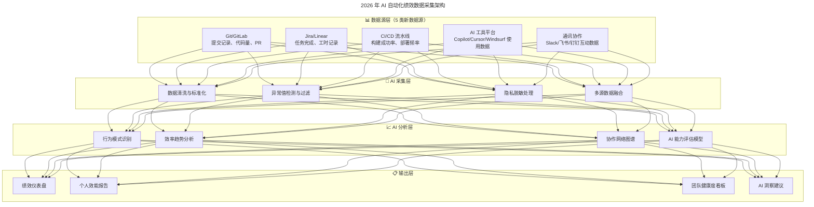

# 第120讲 | 刘俊强：必知绩效管理知识之绩效数据收集

> **适用范围**：技术管理者、团队 Leader、HRBP，以及需要在绩效评定阶段科学收集员工绩效数据、选择合适量表工具的管理者。
>
> **更新摘要（v2 · 2026-08 更新）**：
> - 结构化升级为 6 节骨架（导言 / 核心方法论 / 关键流程 / 工具与实战 / 常见误区 / 进阶延展）
> - 合并原文（上）"绩效评定不是一次性事件"与（下）"数据收集工具和方法"两篇内容
> - 保留三种认知陷阱（记忆力/系列位置效应/晕轮效应）、三维度数据来源（特质/行为/结果）、三种量表工具（李克特/BARS/BOS）的完整对比
> - 将"AI 时代升级注解（2026）"统一融入进阶延展，补充 AI 自动化数据采集架构与 5 类新增数据源
> - 补充 Mermaid 图标题与图后解读

## 1. 导言

我在之前同系列的《绩效管理循环》一文中分享过，绩效管理是一个周期内持续循环的过程，包括绩效目标制定、绩效辅导，以及绩效评定与反馈三个阶段。

不少管理者往往会忽视整个循环周期，直接在绩效评定与反馈阶段开始绩效管理工作，并将绩效评定看作是一次性事件，除非是在正式的评定考核阶段，否则他们不会进行绩效评定相关的工作。这是极为错误的做法，也是导致管理者认为绩效评定非常困难的主要原因。任何绩效评定考核过程的基础，都是收集和评估有关员工的绩效数据，本文就来系统聊聊绩效数据收集的方法与工具。

## 2. 核心方法论

### 2.1 绩效评定不是一次性事件

在实际执行中，绩效管理循环中的第二个阶段绩效辅导，是时间最长并且非常重要的阶段。成功的管理者应该主动地在这个阶段找到自己的方式来检视团队成员的表现。这样，在进行绩效评定、绩效考核阶段时，会减少管理者因认知偏见对绩效结果产生的影响。

有些客观事实是管理者必须了解的，它们构成了绩效评定的认知陷阱：

**第一个事实是管理者的记忆力会变差**。通常而言人类的记忆并不可靠，我们越忙越成功，大脑接收的数据就越多。随着时间的推移，回忆事情会变得很困难，特别是绩效评定通常需要以月为单位来看团队成员的绩效表现，因此，如果在绩效评定考核阶段仅通过回忆来进行评定，会造成极大的偏差。

**第二个事实是系列位置效应（Serial-position Effect）**。这是一种心理学现象，指人们倾向于对首先见到的事物和最后见到的事物有更好的印象，分为首因效应（Primacy Effect）和近因效应（Recency Effect）。首因效应是指在行为过程中，最先接触的事物会给人们留下深刻的感知或认知；近因效应指对事物的最近一次接触会给人留下深刻的感知或认知。在绩效评估方面，团队成员给你留下的第一印象和他最近的表现更容易让你记忆，因此会产生绩效评定的偏差。

**第三个事实是晕轮效应（Halo Effect）**。是指人们对他人的认知首先依据初步印象，然后再从这个印象推论出认知对象的其他特质。例如你喜欢或不喜欢某位员工，可能对你如何评估该员工的工作表现产生强烈影响。简而言之，就是以偏概全。

管理者避免以上认知陷阱的最佳实践是，使用"绩效表现记录本"来记录自己对团队和团队成员绩效表现的持续观察，可以是物理上的笔记本，也可以是数字化文件，或者两者皆有。在记录中需要清晰地记录日期、员工姓名和表现情况，每周至少 1-2 次。当然，每次记录也不用太复杂，例如，8 月 9 日，张三提前完成了某项功能的编码实现工作，使得测试同学可以提前介入进行集成测试，一条记录可能仅需要花费管理者 10 秒左右的时间。

### 2.2 员工绩效评估的数据来源

不论使用何种方法或工具来收集数据，都需要确保它们具备**有效性、可靠性和相关性**这三个特性。有效性意味着评估该评估的事项，可靠性意味着标准是持续一致的，相关性则意味着必须跟工作表现相关。

在实际执行中，我们对员工进行绩效评定考核时，通常会从三个主要方面进行评估，分别是特质、行为和结果：

- **特质**：指一个人的性格或态度。我们是否可以衡量一个人的人格特质，并认为它们是有效且可靠的工作绩效指标呢？答案是很难。但在实践中，特质还是会被用来评估，例如是否表现出热情、有责任心等。
- **行为**：是指人们说和做的事情，它们是可观察的，因此和特质相比，行为往往更可靠，基于行为做绩效评估会比基于特质进行评估更为公正和公平。
- **结果**：是指员工已达到或未能达到的结果，例如销售数据、项目完成情况等。与行为类似，结果通常被认为是可靠且有效的，而且员工往往也认同以结果为衡量标准是公平的。

在实践中，特征和行为的度量评估一般与胜任力模型相关，而结果的度量评估则与目标制定过程和后续工作内容相关。这些数据的主要来源是公司记录如考勤数据，员工提供的自评以及作为管理者你的评定记录等，当然有些公司还会用上 360 度评估和客户评价。

## 3. 关键流程

### 3.1 持续记录的流程

作为管理者，我们应该花时间做好"绩效表现记录本"的使用，记录团队和团队成员的当前表现，并观察总结其表现趋势。

这样，一方面在阶段二绩效辅导阶段，管理者能够有效地帮助团队成员进行提升；另一方面，通过多次的数据记录，管理者的评估就可以尽可能地贴近事实真相，可以保证在阶段三绩效评定考核时，不会给管理者和员工带来过大的压力，因为"绩效表现记录本"已经能够尽量客观的反映事实情况了。

### 3.2 量表工具的选用流程

管理者需要根据自己公司业务和团队的实际情况来选择合适的数据收集和分析工具，并依此设计一套相匹配的绩效评估系统，这样的系统才能正确地衡量绩效并激励团队成员。具体选用流程见第 4 节三种量表的对比。

## 4. 工具与实战

### 4.1 三种常见量表工具

#### 李克特量表（Likert Scaling）

评定量表在绩效评估系统中占主导地位。评定量表会为评估者提供维度列表，每个维度代表员工有效的评估方面，例如特质、行为或结果等，每个维度都有对应的评分，通常是五分制或七分制。评定为正面的时候，可以是"表现优异"、"超出预期"等，评定为负面的时候，可以是"不合格"、"待改进"等，而评定为中性的时候，可以是"符合预期"。通常这类方法被称为李克特量表。

李克特量表易于使用且开发成本很低，因此被大量采用，但是李克特量表也存在明显的问题：评定量表没有提供可以操作的反馈；存在准确性问题，评估者可以轻松地以不同的方式来解释评分。

#### 行为锚定量表（BARS，Behaviorally Anchored Rating Scales）

为了克服李克特量表的问题，人们后来开发出来了行为锚定量表。使用 BARS 时评估者仍然会对员工进行多个维度的评分，但不同之处在于 BARS 会呈现不同级别表现的特定工作行为，而不是简单的使用量表的数字和形容词。

以"展示有效的书面和口头沟通技巧"这个考核维度为例：不合格的行为表现是报告或文档写得不清楚、过于简单；待改进是书面和口头技能需要加强，经常混乱；符合预期是写作和说话清楚，有说服力，简明扼要；超出预期是书面和口头沟通始终清晰，有说服力，适合受众；表现优异是书面和口头沟通都是最高水平的。

相较于李克特量表，BARS 有着明显的进步，但也有一些限制：构建有效的行为锚定量表要困难得多；虽然确实向员工提供了更多可操作的反馈，但不能因此就证明 BARS 是衡量绩效的一种更好的方法。

#### 行为观察量表（BOS，Behavioral Observation Scale）

使用行为观察量表时，管理者会先针对各项评估指标给出一系列有关的有效行为，然后将观察到的员工行为同评价标准相比较进行评分，看该行为出现的次数频率。行为观察量表具体指出了员工需要什么样的行为才能获得高绩效得分，管理者也可以根据行为量表去匹配员工行为，并用具体的行为条件给出反馈。

#### 三种工具对比

| 维度 | 李克特量表 | 行为锚定量表 BARS | 行为观察量表 BOS |
|------|-----------|------------------|-----------------|
| **评价客观性** | 比较主观 | 相对客观 | 相对客观 |
| **量表开发成本** | 较低 | 较高 | 较高 |
| **评定结果反馈性** | 不明确，无法帮助员工更好发展 | 比较明确，员工可有针对性改进 | 比较明确，员工可有针对性改进 |
| **评估者易用性** | 简单易用 | 需持续记录员工行为，耗时较多 | 除耗时多外，需要评估的题目也多，更耗精力 |
| **其他问题** | 易产生过宽/过严问题，晕轮效应偏差 | 不同评估者之间一致性较高问题 | — |

可以看出，各种工具方法各有利弊，正如前面说的没有完美的工具或方法，都需要管理者根据自己公司的实际情况进行选用和开发。

### 4.2 实践案例：结合 BOS 与李克特的考核表

下面附上我们之前结合行为观察量表和李克特量表制作的绩效考核表，供大家参考。由于每家公司的工作内容都不一样，这里仅放出针对员工特质的考核部分示例（详见原文配图）。这种"主客观结合"的做法，既保留了李克特量表的易用性，又通过 BOS 的行为锚定提升了反馈的可操作性。

## 5. 常见误区

1. **把绩效评定当作一次性事件**：仅在正式评定考核阶段开始绩效管理工作，忽视整个循环周期，是导致评定困难的根本原因。
2. **仅凭回忆进行评定**：人类记忆力不可靠，以月为单位的绩效表现仅靠回忆会造成极大偏差。
3. **受首因/近因效应影响**：团队成员的第一印象和最近的表现更容易被记住，产生评定偏差。
4. **受晕轮效应影响**：以偏概全，因喜欢或不喜欢某员工而影响对其工作表现的评估。
5. **认为有完美的量表工具**：三种量表各有利弊，没有完美工具，需根据公司实际情况选用和开发。
6. **数据收集忽视有效性/可靠性/相关性**：只关注收集而忽视数据质量的三性保障，会导致评估失真。

## 6. 进阶延展

### 6.1 AI 增强的绩效数据收集

2026 年，绩效数据采集从人工填报全面转向 AI 自动化采集。Git 数据、Jira 数据、CI/CD 流水线数据、AI 工具使用数据可实时汇聚，形成 360° 行为画像。刘俊强老师的"持续记录避免认知偏差"原则在 AI 自动化下更容易执行。

| 传统痛点 | AI 解决方案 |
|---------|----------|
| 记忆力不可靠 | AI 自动记录工作日志和行为数据 |
| 首因/近因效应 | AI 提供全周期数据视图，消除时间偏差 |
| 晕轮效应 | AI 多维度评估，减少主观偏见 |
| 手动记录耗时 | AI 自动采集工具使用数据、代码提交等 |

### 6.2 AI 自动化数据采集架构

上图展示了 2026 年绩效数据采集的四层架构：数据源层汇聚 5 类新数据源，采集层完成清洗与脱敏，分析层进行行为模式识别与能力评估，最终在输出层形成绩效仪表盘与 AI 洞察建议。这条链路让原文"绩效表现记录本"的每周 1-2 次手工记录，升级为实时自动化的全周期画像。

### 6.3 2026 年 5 类新增数据源详解

| 数据源类别 | 具体指标 | 采集方式 | 绩效应用场景 |
|------------|----------|----------|--------------|
| **AI 工具使用数据** | 代码生成占比、Prompt 质量分、AI 接受率 | API 对接 Copilot Enterprise 等 | 评估 AI 协作成熟度 |
| **代码智能分析** | 代码复杂度趋势、技术债务增量、复用率 | SonarQube + AI 分析器 | 代码质量客观评价 |
| **协作深度数据** | Code Review 响应时间、知识分享频次、跨组协作数 | Git + IM 数据分析 | 团队合作能力量化 |
| **创新贡献数据** | 技术方案提案数、开源贡献、专利/论文 | 多源聚合 | 创新能力识别 |
| **学习成长数据** | 技术文档输出、内部分享、新技术探索 | 知识库 + 培训系统 | 成长潜力评估 |

### 6.4 2026 年绩效评估新原则

1. **不只看产出量，看 AI 放大效应**
2. **不只看个人产出，看对团队的赋能**
3. **不只看当前能力，看学习适应速度**

### 6.5 分阶段实施路线与数据伦理

- **阶段 1（1-2 月）**：接入 Git + Jira 基础数据，替代手工填报
- **阶段 2（3-4 月）**：集成 AI 工具数据（Copilot/Cursor 企业版 API）
- **阶段 3（5-6 月）**：构建 AI 分析模型，自动生成绩效洞察报告

**数据伦理红线**：明确告知员工哪些数据被采集及用途；AI 数据仅作为参考，不作为唯一决策依据；定期进行数据审计，防止算法偏见。

### 6.6 传统量表 vs AI 增强对比

| 维度 | 传统李克特/BARS | AI 增强版 |
|------|------------------|----------|
| 客观性 | ⭐⭐ 主观依赖强 | ⭐⭐⭐⭐⭐ 行为数据驱动 |
| 实时性 | ⭐⭐ 季度/月度汇总 | ⭐⭐⭐⭐⭐ 实时更新 |
| 反馈质量 | ⭐⭐⭐ 笼统评语 | ⭐⭐⭐⭐⭐ 个性化洞察 |
| 开发成本 | ⭐⭐⭐⭐ 低 | ⭐⭐⭐ 初期较高 |

### 6.7 作者简介

刘俊强（微信公众号：程序员精进），TGO 鲲鹏会会员，现任腾讯云资深架构师，曾任迅雷技术总监、某互联网公司技术副总裁，10+ 年以上互联网开发经验，8 年以上技术管理经验。

> *本注解基于 2026 年 AI 技术动态生成，强调数据采集自动化与隐私保护的平衡。*
