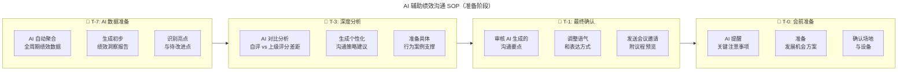

# 第127讲 | 刘俊强：必知绩效管理知识之绩效沟通

> **适用范围**：技术管理者、团队 Leader、HRBP，以及需要在绩效面谈中做好会议准备、期望管理、绩效讨论与员工发展沟通的管理者。
>
> **更新摘要（v2 · 2026-08 更新）**：
> - 结构化升级为 6 节骨架（导言 / 核心方法论 / 关键流程 / 工具与实战 / 常见误区 / 进阶延展）
> - 合并原文绩效沟通（一）（二）（三）三篇内容：准备面谈会议、管理会议期望、讨论绩效、专注于员工发展、讨论拓展机会、有效地结束
> - 保留"3W 准备法""10/50/40 时间分配""拓展角色"等核心方法论与张三李四对话案例
> - 将"AI 时代升级注解（2026）"统一融入进阶延展，补充 AI 辅助绩效沟通 SOP 与个性化发展计划生成器
> - 补充 Mermaid 图标题与图后解读

## 1. 导言

就员工在工作中的表现进行当面讨论可能会很困难，大多数管理者都不喜欢正式地批评员工，而且大多数员工也不喜欢被评估，所以，在绩效面谈沟通会议上正式地讨论绩效可能会让双方都有些紧张。本文将系统分享如何准备绩效面谈会议、管理会议期望、讨论绩效、专注员工发展并有效地结束会议，帮助管理者和员工以最为开放和积极的心态来面对绩效评估结果。

## 2. 核心方法论

### 2.1 准备绩效面谈会议的 3W 法

在绩效面谈会议前应该做哪些准备事项呢？简单来说主要是三个 W（When、Where、Who）：

- **When（会议时间安排）**：一般需要在第四周至第五周的时候，跟员工确定绩效面谈会议的时间。建议管理者可以先根据自己的时间来进行日程排列，然后跟员工确定该时间是否适合，沟通确认好了后建议管理者发出一封带日程的电子邮件。
- **Where（会议地点安排）**：不要使用自己的办公室做为绩效面谈沟通会议的地点，对于很多员工来说，去老板的办公室会有小学生去班主任办公室的感觉。尽量选择对员工而言比较中性舒适的地点，在注意隐私前提下，空间大些会更好。中型会议室、培训室和暂未启用办公区都是不错的选择。
- **Who（参会人员安排）**：一般情况下都是管理者和下属的一对一会议。但是也有例外，如果管理者有合理理由觉得这次沟通会议会比较艰难，那么有人力资源同事或其它经理的参加可能会有帮助。不过不论是基于怎样的考虑需要第三个人参加，建议都需要提前跟员工确认，不然会有很大的反作用。

### 2.2 管理会议期望

管理者如何管理好员工对于这次绩效面谈沟通会议的期望十分重要，一般可以从三个主要点来进行管理：

1. **员工对全年绩效评定的看法**：引导员工理解绩效评估流程，例如跟他们探讨绩效评估方法、胜任力模型以及绩效评估流程需要员工关注的地方等。
2. **会议开始前几周与员工沟通**：在绩效面谈沟通会议的日程邮件发出时，管理者也可以附上会议上会沟通讨论的重点事项。需要着重提醒的是，**不要在绩效面谈沟通会议上探讨薪酬调整和晋升的问题**，因为当员工知道这个会议要探讨薪酬和晋升时，那么他们很大程度上就不会再有效地倾听绩效结果和改进建议。
3. **实际会议中的期望管理**：在会议正式开始前，管理者可以先告诉员工这次会议的议程，可以先是绩效完成情况、自我评价与上级评价、解释探讨评价间的重大差距，然后再是员工发展部分。

### 2.3 绩效讨论的时间分配

最为重要的是时间分配，一般情况下我们建议，**10% 的时间用于回顾过去，50% 的时间用于介绍当前，剩余 40% 的时间用于讨论未来**。

- **回顾过去（≤10%）**：这个环节只是帮我们讨论绩效时设定好背景，例如员工在公司的工作年限、有过多少次晋升、目前在公司的职位、在该职位上的任职时间，以及上次绩效评定表现好或不好的地方等。
- **当前绩效周期表现（50%）**：管理者需要跟员工讨论他的目标达成情况和所有相关的评分，例如上级评定、自我评定以及同事评价等。
- **讨论未来（40%）**：员工发展部分，例如角色变更带来的挑战、培训和发展计划等。

### 2.4 拓展角色（Stretch Role）

"拓展角色"代表了一个临时的全新的责任领域，需要管理者以教练的方式进行辅导。它实际上是一个推动员工超越他们目前职责和技能的工作机会，通常情况下是临时性的，可以是数月或一年之久。

"拓展角色"的机会仅仅只分配给真正非常需要它的员工。如果管理者与员工讨论拓展角色的机会时，对方似乎不确定或是无动于衷，这时就需要慎重考虑他们是否是合适的人员。强烈建议管理者使用最优秀的人才，"拓展角色"不适合一般或良好的员工，它只适合优秀且非常愿意尝试新事物的员工。

## 3. 关键流程

### 3.1 绩效讨论流程

在快速回顾过去后，就进入绩效讨论的主要部分。管理者需要跟员工讨论他的目标达成情况和所有相关的评分。就目标达成情况而言，有一些可能已经达成，有一些可能仍在进行中，也有一些可能是无关紧要的或是需要改变的。

通常来说，绩效评估模板生成后应该要突显自我评分、同事评分以及上级评分间的差距，简单的方法就是各评分项作为行，各个评分人作为列进行并排比较。管理者需要关注这样的差距，并具体解释为什么会有这样的差距。

### 3.2 处理员工借口与抱怨

在绩效讨论中，员工很有可能会对你提出的讨论点找借口或抱怨，而管理者在处理员工的借口和抱怨时要格外谨慎，因为他们此时的情绪极有可能比较激动。记住对应情绪化的最好的方法就是不带情绪的回应，只是以非常冷静的方式来回应借口，就是听，但是不要做记录，因为这样会让员工认为你接受了他们的借口。

大多数情况下，管理者可以回复，我听到了你所说的，我在做评估时有考虑过这个情况；或者是，承认没有意识到这一点，但是评价不会修改。这里的关键是要明确，反馈的情况接收到了但是评价不会改变。除非管理者收到重要的意外信息，才可能会有例外情况。

### 3.3 有效地结束会议

之前的系列文章中有介绍过，在绩效面谈环节中，建议给每位员工提供一个小时的时间，如果管理者不知道如何有效地结束会议，那么会影响后面等待绩效沟通的员工。通常情况下都会有双方明确同意的部分和不太顺利的部分，这是很正常的，在阐述完绩效评价后，简单回顾下进展不顺利的部分，坦诚地看待事实情况。

员工、上级对绩效评定进行签字是绩效沟通后对于人力资源部门的输出。有些员工会毫不犹豫的签署，有些员工会质疑绩效评价的公平性，这里需要跟员工申明的是，最后的签字不代表着认可，而是代表着他们收到了绩效评定以及管理者对绩效评分的解释。如果管理者沟通后，员工还是不能认可绩效评定结果，管理者可以告知员工申诉流程。

## 4. 工具与实战

### 4.1 张三与李四的绩效讨论对话案例

以下对话展示了管理者张三如何处理员工李四的绩效讨论（节选）：

> **张三（管理者）**：到目前为止，胜任力模型中主要能力项的不同评分间的差距很小，甚至有些不存在，可以看出你的整体表现很强，但这里有个例外，正如你看到的，在有效沟通这一项，你给自己评了 8 分，同事评价是 6 分，而我给评了 5 分。我觉得这里我们有些理解偏差。
>
> **李四（员工）**：是的，我也认为沟通能力我还可以再加强，但是这里的评分差距之大让我惊讶。
>
> **张三**：嗯，来自于同事的数据和我的观察似乎表明了同一件事情，你的沟通风格比较匆忙和直率，当然，这会让人感觉很真诚，但同时也容易让人感觉有些冷。

这个案例展示了几个关键技巧：先用回顾设定背景，再聚焦评分差距最大的项，用同事评价和管理者观察双重佐证，最后引导员工自己正视沟通风格的差距，从而实现技能改进和提升。

### 4.2 绩效讨论的小贴士

1. **评分要尽量客观**：不要刻意贬低压分。管理者必须有自己明确的评分和评价，不要受其它因素的影响。如果员工在绩效讨论过程中表现出惊喜，就说明管理者的工作有做的不到位的地方。
2. **找到共情点**：员工的评估中找到一两个他们遇到的，同时也是你之前遇到过的问题，可以简要地告诉员工你的解决方案和改进方法，让员工感觉到你是在帮助他们解决问题。
3. **冷静处理情绪**：对应情绪化的最好的方法就是不带情绪的回应，听但不做记录。

### 4.3 员工发展的工作调整

绩效考核阶段专注于员工发展，主要需要考虑两个事情：一是能帮助员工或团队进行工作调整，二是能提供支持员工或团队持续发展的工具和资源。

关于工作调整，如果管理者增加了员工或团队工作目标的规模，就会占用他们用于不同类型的发展机会的时间。因此，在考虑对绩效表现良好员工进行工作调整时，需要考虑是**扩大现有职责**还是**发展新的能力**。除了"拓展角色"这样临时的全新领域的发展机会，管理者也可以跟员工讨论持久性的工作调整，一般是横向变化。关于垂直方向的变化（即晋升），建议在晋升环节独立操作。

## 5. 常见误区

1. **在自己的办公室进行面谈**：会让员工有"小学生去班主任办公室"的紧张感，应选择中性舒适的会议室。
2. **未提前确认就增加第三人参会**：在默认一对一的面谈中，如果员工在未被告知的情况下发现有第三个人参加，会让员工感觉到很不受尊重。
3. **在面谈中探讨薪酬和晋升**：会分散员工倾听绩效结果反馈和思考绩效提升的注意力，应专门抽时间处理。
4. **回顾过去占用过多时间**：回顾过去不应超过 10%，否则会挤占当前表现和未来规划的讨论空间。
5. **接受员工的借口并做记录**：这样会让员工认为你接受了他们的借口；应冷静倾听但不做记录，明确评价不会改变。
6. **把"拓展角色"分配给一般员工**：拓展角色只适合优秀且非常愿意尝试新事物的员工，否则失败风险极高。
7. **签字等同于认可**：签字代表"收到"而非"认可"，需向员工申明，并告知申诉流程。

## 6. 进阶延展

### 6.1 AI 辅助绩效沟通 SOP

2026 年，AI 可以辅助管理者准备绩效面谈材料、生成绩效洞察报告、提供个性化沟通话术建议，让绩效沟通更高效、更有温度。

上图展示了面谈前 7 天到当天的 AI 辅助节奏：T-7 完成数据聚合与洞察报告，T-3 进行评分差距分析与沟通策略生成，T-1 审核沟通要点，T-0 提醒注意事项。这条 SOP 让原文的 3W 准备法从"管理者凭经验准备"升级为"数据驱动的标准化流程"。

### 6.2 AI 赋能的 3W 升级

- **When（时间）— AI 智能调度**：AI 分析双方日程、项目节点、员工情绪周期，推荐最佳面谈时段，避开项目上线周、员工刚经历重大变更后的敏感期。
- **Where（地点）— 场景优化**：AI 根据沟通内容复杂度推荐场景——简单正面反馈 → 开放式咖啡区；需要深入讨论 → 配备白板的会议室；敏感话题 → 私密且舒适的空间。
- **Who（人员）— 智能辅助**：AI 作为"隐形第三者"，会前准备材料、预测可能的争议点，会中实时提示关键信息（非录音，仅辅助），会后整理纪要、跟进事项。

### 6.3 AI 时代的评分差距分析

原文中李四在"有效沟通"项出现评分差距（自评 8 分 vs 同事 6 分 vs 上级 5 分）。在 2026 年，AI 可以从多维度帮助分析这种差距：

| 差距类型 | 可能原因 | AI 辅助验证方法 | 建议应对 |
|----------|----------|----------------|----------|
| **自评 > 同事评** | 自我认知偏差 | 分析沟通数据（IM 回复率、会议发言） | 提供客观数据反馈 |
| **同事评 > 上级评** | 信息不对称 | 汇总多方观察数据 | 促进信息同步 |
| **各方评分接近但都低** | 能力确实不足 | 对比同职级基准 | 制定改进计划 |
| **评分波动大** | 评价标准不一 | 校准评分尺度 | 统一评估标准 |

### 6.4 "拓展角色"的 AI 时代版本

| 传统拓展角色 | ⭐2026 AI 时代拓展角色 | 能力要求 | 典型形式 |
|--------------|----------------------|----------|----------|
| 技术委员会成员 | **AI 治理委员会成员** | AI 伦理、合规、风险评估 | 参与制定 AI 使用规范 |
| 困境项目负责人 | **AI 转型项目负责人** | 变革管理、AI 技术应用 | 主导团队 AI 工具引入 |
| 跨部门协调人 | **AI 能力布道师** | 培训能力、影响力 | 组织 AI 最佳实践分享 |
| 新业务探索者 | **AI 创新实验室成员** | 快速实验、容错能力 | 探索 AI Agent 新场景 |

### 6.5 AI 个性化发展计划生成器

2026 年，管理者可以使用 AI 工具为员工生成定制化发展计划，覆盖"AI 工具深度应用 → AI 工作流设计 → AI 领导力启蒙"三阶段，并将"AI 算力配额奖励""AI 工具优先权""AI 项目参与权""AI 大会/培训资助"等新型激励与发展绑定。

### 6.6 2026 年可执行建议

1. **使用 AI 生成绩效洞察报告模板**：包含核心数据摘要、AI 识别的亮点、AI 关注的待改进、推荐沟通重点。
2. **期望管理 AI 化**：发送会议邮件时，附带 AI 生成的个性化议程预览，明确标注"本次不涉及薪酬/晋升讨论"。
3. **情绪感知与调节**：AI 可通过员工的近期工作模式、沟通语气变化，预警潜在情绪问题，建议管理者调整沟通策略。
4. **避免"数据霸凌"**：不要用 AI 数据"压服"员工，数据是用来启发讨论，不是用来证明"我是对的"，始终保持原文强调的合作心态。

### 6.7 作者简介

刘俊强（微信公众号：程序员精进），TGO 鲲鹏会会员，现任腾讯云资深架构师，曾任迅雷技术总监、某互联网公司技术副总裁，10+ 年以上互联网开发经验，8 年以上技术管理经验。

> *本注解强调 AI 是辅助工具而非替代者，绩效沟通的核心仍是人与人的真诚交流。*
