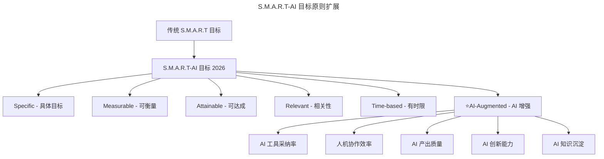

# 第116讲 | 刘俊强：必知绩效管理知识之绩效目标的制定

> **适用范围**：技术管理者、团队 Leader，以及需要在公司战略与员工发展之间平衡制定绩效目标的管理者。
>
> **更新摘要（v2 · 2026-08 更新）**：
> - 结构化升级为 6 节骨架（导言 / 核心方法论 / 关键流程 / 工具与实战 / 常见误区 / 进阶延展）
> - 保留原文"制定目标的正确姿势""绩效目标的本质是合作""S.M.A.R.T 原则"等方法论
> - 将"AI 时代升级注解（2026）"统一融入进阶延展，补充 S.M.A.R.T-AI 原则与 5 个 AI 相关 KR 设计示例
> - 补充 Mermaid 图标题与图后解读，强化目标制定链路的可视化表达

## 1. 导言

我们在前一篇文章中介绍了绩效管理循环，全局性地了解了绩效管理的三个阶段，在本篇文章中，我将来聊聊绩效管理循环里的阶段一，即绩效目标的制定。

现代企业管理中普遍使用的绩效管理工具有『关键绩效指标』（简称 KPI）和『目标和关键成果』（简称 OKR），不论是 KPI 或 OKR，目标的制定都是十分关键的，因为实际绩效需要通过目标完成情况来进行评定。在探讨具体如何进行目标制定前，需要明确的是，绩效目标一定要在考虑业务发展需要的前提下，与员工来一起制定，需要互相尊重地达成一致。

## 2. 核心方法论

### 2.1 制定目标的正确姿势

首先需要了解的是绩效目标的制定过程，它并不是由老板到下属设定任意目标的简单过程，而应该是一种平衡多种需求的过程。绩效目标本身应该给员工提供明确可实现的目标，从而激发员工产出优异的绩效。有效的绩效目标需要考虑以下几个方面：

- 目标需要在员工的能力范围之内，远超出员工能力的目标是不可取的；
- 目标需要有助于员工的发展和意愿，与员工发展意愿背离的目标可能会造成员工的不稳定；
- 目标需要帮助公司实现更高层次的目标，不能够帮助公司实现业务发展的目标是无效的；
- 目标需要帮助团队更好的成长和发展。

这里需要声明的是，没有完美的绩效目标，也就是说不能希望有个绩效目标是完美满足以上几个方面的，如果我们制定的绩效目标并不能满足其中的某一个需要，这种情况是可以接受的。但同时我们要明确的是，制定的绩效目标不要处在以上这些需要的对立面，毕竟咱们制定的绩效目标还是要正向循环的。

### 2.2 绩效目标的本质是合作

在过往几十年的企业管理中，以非常简单粗暴的自上而下的方式制定绩效目标是很常见的，处于组织架构上层的人给下层的人直接制定目标。这种方式的好处在于权力清晰和执行高效，但随着时间推移，在大多数公司或组织中，特别是互联网类公司中，这种方式已经不再适用，转变为通过合作协作的方式来创建绩效目标，因此我们说绩效目标的本质是合作。

这种转变的产生由几个因素共同推动：首先，脑力劳动的兴起需要公司对普通员工有更多的尊重；其次，为了更大程度的释放团队生产力，如今的组织架构会更多的趋向于扁平化或最小组织化等；最后一个因素是，合作协作模式释放了团队的综合心智，员工或管理者与他们上级间的关系，不再仅仅是接受指示的关系，而是需要他们更多主动地思考来达成更高的目标。

### 2.3 S.M.A.R.T 原则

一般我们会使用 S.M.A.R.T 原则来帮助团队和员工建立短期目标并实现它：

- **Specific**：目标必须是具体的；
- **Measurable**：目标必须是可以衡量的；
- **Attainable**：目标必须是可以达到的；
- **Relevant**：目标必须和其他目标具有相关性；
- **Time-based**：目标必须具有明确的截止期限。

S.M.A.R.T 原则十分重要，因为它可以帮助我们保持团队或员工的短期生产力，但这里需要提醒的是，长期发展承诺是需要我们在 S.M.A.R.T 原则之外来考虑的，比如，长期来看你希望团队如何发展，长期来看员工希望在团队、公司有什么样的发展等？

## 3. 关键流程

### 3.1 多层架构的目标分解

通常情况下，对于有多层管理架构的公司或组织，会先根据战略计划以及过往绩效循环的情况来制定年度目标，然后跟下一级的团队或部门进行共享，这些团队或部门的管理者需要根据公司年度目标来制定他们专业领域的绩效目标，一般来说，技术管理者需要根据公司年度目标来制定技术或工程团队的绩效目标，主要考虑技术或工程团队如何帮助实现公司的年度目标。

再往下一层是员工个人进行绩效目标的制定，这时候首先需要考虑员工个人目标与团队目标、公司目标的方向一致性。另外，根据特定员工的绩效趋势，跟员工制定绩效目标时，除了要考虑团队目标与员工个人的发展需要外，还需要考虑员工在技能和知识领域的提升需要。

### 3.2 关注员工特质与意愿

在跟员工制定绩效目标时，需要考虑员工的特质和意愿，例如在最近的绩效循环中表现优异的员工，可以给予更多的机会。这些机会可以是纵向的，例如增加相同类型的工作或相关工作；也可以是横向的，例如更高级别的职权等。对于这样的员工，我们在制定绩效目标时，需要基于这些成长机会来设定新基准绩效标准。

这里需要注意的是，有些人面对成长机会非常高兴，甚至会主动告诉你他们希望在新的绩效循环里达到什么位置。但是也有些员工是很内向的，不会跟你主动分享自己的意愿，因此你作为技术管理者就需要跟他们有私密的交流沟通，在沟通中了解他们的意愿和期望，并将其记录下来。做好记录的目的是帮助自己之后能全面深入的思考。

### 3.3 兼顾团队需要

最后，制定绩效目标时也要考虑团队的需要，有时候团队中需要有一定的牺牲和取舍，团队中会出现一些工作内容是员工不愿意负责的，这时候就需要有员工做出一定的牺牲来承担。对于这样的员工，你需要对其保持肯定的态度，另外不要让这些做出牺牲的员工偏离他们的意愿太长时间，否则就很有可能会失去他们。

综上所述，制定正确的绩效目标需要你在公司需求、团队需求以及员工需求之间进行有效的平衡和满足，但不期望这些需求全部都能满足，找到需求之间的平衡点才能帮助你制定更有效的绩效目标。

## 4. 工具与实战

### 4.1 绩效目标制定贴士

最后，再分享一些绩效目标制定时的小贴士，大家可以记录下来方便日后查阅：

- 考虑员工的能力；
- 考虑员工的意愿；
- 给予绩效好的员工更多纵向、横向的机会；
- 留意员工的绩效趋势；
- 非正式的记录员工表现；
- 考虑团队的需求。

### 4.2 长期与短期的平衡实践

在我们明确了长期目标之后，可以尝试在绩效目标中的一小部分加上长期发展相关的工作内容，当然这也是在跟团队和员工沟通的前提下进行的，我们需要以合作协作的心态来进行绩效目标的制定。短期生产力靠 S.M.A.R.T 原则保障，长期承诺则靠管理者与员工持续对话来维系，两者缺一不可。

## 5. 常见误区

1. **自上而下硬性下达目标**：把绩效目标制定当作权力行使，忽视合作本质，会导致员工认同感低、执行打折。
2. **追求完美目标**：希望一个目标同时满足公司、团队、员工、能力发展所有需求，反而无法落地；接受不完美，但避免站在各方需求的对立面。
3. **只看短期 S.M.A.R.T，忽视长期承诺**：迷失在短期目标之中，忽略员工长期发展意愿，会造成核心人才流失。
4. **忽视内向员工的意愿**：只关注主动表达意愿的员工，对内向员工不做私密沟通，会错失人才发展机会。
5. **让做出牺牲的员工长期偏离意愿**：团队中承担"不愿意做的工作"的员工若长期得不到回调，会很快流失。

## 6. 进阶延展

### 6.1 AI 时代目标制定的变革

2026 年，84% 开发者已使用 AI 编程工具（GitHub Copilot、Cursor、Windsurf 等），GPT-5.5 与 DeepSeek V4 推动 Agent 加速落地。绩效目标制定必须纳入 AI 协作能力维度。AI 时代目标制定的三大变革：

1. **从"个人产出"到"人机协同产出"**：目标不再只考核"你写了多少代码"，而是"你 + AI 共同创造了多少价值"。
2. **从"固定技能"到"AI 适配能力"**：员工的目标应包含学习新 AI 工具、适应 AI 工作流的成长性指标。
3. **从"竞争型目标"到"共生型目标"**：鼓励团队成员分享 AI 使用技巧，形成 AI 能力共同体。

### 6.2 从 S.M.A.R.T 到 S.M.A.R.T-AI

原文提到的 S.M.A.R.T 原则在 AI 时代依然有效，但需要扩展为 **S.M.A.R.T-AI** 原则，在目标中增加 AI 相关关键成果（KR）：



上图展示了 S.M.A.R.T-AI 原则在原有五项基础上新增的"AI-Augmented"维度，它将 AI 工具采纳率、人机协作效率等指标纳入目标制定，使绩效目标与 2026 年的工作方式保持一致。

### 6.3 2026 年 AI 相关 KR 设计示例

| KR 类型 | 示例描述 | 衡量方式 | 适用角色 |
|--------|----------|----------|----------|
| **AI 工具采纳率** | 团队 AI 编程工具使用率达到 90%+ | IDE 插件激活率、代码生成占比 | 全员 |
| **人机协作效率** | 通过 AI 辅助提升开发效率 30%+ | AI 完成代码占比、交付周期缩短 | 开发工程师 |
| **AI 产出质量** | AI 生成代码的 Code Review 通过率≥85% | 静态分析、单测覆盖率 | 高级开发 |
| **AI 创新能力** | 完成 2 个以上 AI Agent 落地项目 | Agent 自主完成任务数、业务价值 | 架构师/Tech Lead |
| **AI 知识沉淀** | 输出 3 篇 AI 最佳实践文档或内部培训 | 文档浏览量、培训参与度 | 技术专家 |

### 6.4 2026 年可执行建议

1. **目标对齐检查清单**：每季度使用 AI 助手（如 GPT-5.5）扫描团队 OKR，自动检测是否包含 AI 相关 KR，给出缺失提示。
2. **AI 能力分级目标**：初级——熟练使用 AI 编程工具，日均节省 2 小时；中级——能搭建简单 AI 工作流，提升团队效率；高级——能设计并落地 AI Agent，创造业务价值。
3. **避免"伪 AI 目标"陷阱**：不要设定"使用 AI 工具次数"这类虚荣指标，应关注实际效率提升和产出质量。
4. **人机协作 OKR 示例**：

```
O: 打造 AI-First 工程团队
KR1: 团队 AI 代码生成占比达到 40%（当前 15%）
KR2: AI 辅助 Code Review 覆盖 100% PR
KR3: 落地 3 个自动化测试 Agent，回归测试时间缩短 60%
```

### 6.5 作者简介

刘俊强（微信公众号：程序员精进），TGO 鲲鹏会会员，现任腾讯云资深架构师，曾任迅雷技术总监、某互联网公司技术副总裁，10+ 年以上互联网开发经验，8 年以上技术管理经验。

> *本注解基于 2026 年 AI 技术动态生成，结合 GPT-5.5、DeepSeek V4、Agent 落地实践，供技术管理者参考。*
