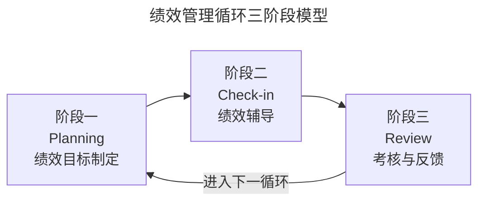
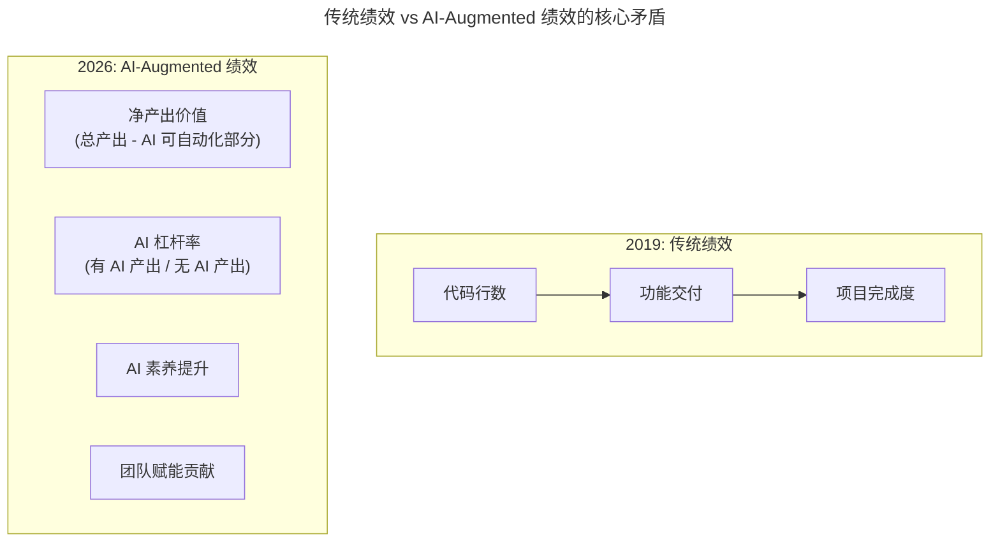

# 第112讲 | 刘俊强：必知绩效管理知识之绩效管理循环

> **适用范围**：技术管理者、团队 Leader、HRBP，以及希望从全局视角理解绩效管理而非仅关注考核环节的技术骨干。
>
> **更新摘要（v2 · 2026-08 更新）**：
> - 结构化升级为 6 节骨架（导言 / 核心方法论 / 关键流程 / 工具与实战 / 常见误区 / 进阶延展）
> - 保留原文三阶段模型（Planning / Check-in / Review）与跟进检查方法论
> - 将"AI 时代升级注解（2026）"统一融入进阶延展，补充 2026 年新增 KPI 维度与三阶段 AI 增强实践
> - 补充 Mermaid 图标题与图后解读，强化绩效管理循环的可视化可读性

## 1. 导言

可能绝大多数互联网从业人员都会对一件事达成一致意见，那就是绩效评估既严肃又不好玩，因为绩效会影响员工的奖金和晋升。说实话，对于技术管理者而言，学会如何进行绩效管理尤为重要，我们应当让绩效管理变成有效的管理工具，有效地激励团队，帮助团队成员更好地了解自己的工作及未来的挑战。相信到那时，你已经是一位卓越的管理者了。

其实，我们接触最多的绩效评估（或绩效评定）仅仅是整个绩效管理循环中的一部分，因为绩效评估直接与利益挂钩，所以，我们对这个阶段最为熟悉。但作为技术管理者，要学好、用好绩效管理，不仅需要关注绩效评估阶段，还应该将目光放于全局之上，关注整个绩效管理循环。

## 2. 核心方法论

### 2.1 绩效管理循环三阶段模型

我将绩效管理循环简化为三个阶段，具体如下：

- **阶段一：Planning，绩效目标制定**。该阶段主要根据公司战略目标，与团队及团队成员一起制定预期绩效目标，同时也要进行完成目标所需的资源评估等。
- **阶段二：Check-in，绩效辅导**。在该阶段，管理者需要跟进目标完成情况，并给予团队和团队成员必要的支持与帮助，为完成目标扫清障碍。同时，可能需要根据实际情况对之前制定的目标进行调整。
- **阶段三：Review，绩效考核与反馈**。在该阶段，管理者将通过绩效数据对团队及团队成员进行绩效评定，同时，需要就绩效结果跟团队及团队成员进行反馈和沟通，给予团队及团队成员一些发展建议与指导。

上图展示了绩效管理循环的闭环结构：从 Planning 出发，经由耗时最长的 Check-in 阶段，到 Review 收束，再回到下一周期的目标制定。之所以称为"循环"，正是因为执行完第三阶段后就会进入下一个循环的第一阶段。

### 2.2 循环周期设定

至于具体的循环周期为多久，可以根据公司的实际情况来设定，底线是不能少于一个季度，原因主要在于，绩效管理循环不光是技术团队内部的事情，还需要人力资源等其他团队的参与。从公司运营的最佳实践来讲，绩效管理循环周期一般为半年或一年，且不能超过一年，否则绩效管理就失去了意义。

### 2.3 专注于发展

在整个绩效管理循环中，最重要的是专注于发展，包括两方面：一是公司业务发展需要制定有效的绩效目标；二是通过绩效管理指引团队及团队成员的发展方向，并帮助他们进行有效提升。从这个角度来看，绩效管理是为业务发展提供达成目标的基础，并为团队和团队成员的未来发展提供基础。

## 3. 关键流程

### 3.1 时间分配

正如前文所说，绩效管理是一个周期内持续循环的过程，这个循环周期可以是半年，也可以是一年。其中，阶段三的绩效评估工作可能只会花费我们 1 到 2 周的时间，阶段一的预期绩效目标制定可能会耗费我们 3-6 周时间，而整个周期内的剩余时间便是用于阶段二的绩效辅导工作。不难理解的是，我们使用绩效管理工具，其根本目的在于帮助团队达成目标。

### 3.2 适应绩效管理循环

在此，我先明确错误示范，管理者往往会忽略整个循环周期，直接在阶段三，即绩效评定与反馈阶段开始绩效管理工作，这是极为错误的做法。绩效管理的目的是员工管理，是整个周期内持续不断的过程。

适应绩效管理循环的关键在于，管理者有效地使用跟进检查方法。建议大家在阶段一制定绩效目标时，就同时制定出对目标的定期检查与跟进计划。而在跟进检查的过程中，也需要定期与随机相结合，保持对团队和团队成员的关注度。当然，值得注意的是，检查也不要过于密集，否则你会被贴上控制欲极强的标签。

最后，在每次跟进检查后，你需要总结情况并进行记录，备忘录、电子邮件等都可以，但需要斟酌的是，哪些需要私下记录，哪些需要公开记录并同步给团队成员。

## 4. 工具与实战

### 4.1 跟进检查的三大作用

适应绩效管理循环的关键在于，管理者有效地使用跟进检查方法，而跟进检查的主要作用有三点：

1. **提供支持与帮助**：有时我们认为公开询问员工的工作状态很有必要，这确实管用，但有时候也会适得其反，因为有些人不喜欢别人用对待未成年人的方式对待自己。所以，你需要清楚，跟进检查的目的是，为达成他们目标提供必要的支持与帮助，这种情况下再采用正面、积极的询问方式进行检查会更为有效。
2. **保持可见性**：这点很关键，因为这样团队能够时常看到你，知道你在乎并正在关注他们所做的工作及所达成的成长。
3. **避免员工在阶段三出现麻烦**：采用定期检查与不定期检查，能够帮助我们更了解团队及团队成员的工作进展和状态，以防在阶段三进行绩效评定时，出现因关注少或不了解，造成对团队或团队成员评定不客观的情况。

### 4.2 跟进检查记录实践

每次跟进检查后，管理者需要总结情况并进行记录（备忘录、电子邮件等均可）。需要斟酌的是：哪些需要私下记录（用于自己的判断参考），哪些需要公开记录并同步给团队成员（用于对齐和反馈）。这种"定期 + 随机"结合的检查节奏，是绩效辅导阶段最实用的执行抓手。

## 5. 常见误区

1. **直接从阶段三开始绩效管理**：管理者往往会忽略整个循环周期，直接在绩效评定与反馈阶段开始绩效管理工作，这是极为错误的做法。绩效管理是整个周期内持续不断的过程，不是一次性事件。
2. **期望所有员工都喜欢绩效考核**：还是不要期望所有员工都喜欢绩效考核，因为有些人就是不喜欢被评估。管理者的目标是用好这个工具，而非取悦所有人。
3. **检查过于密集**：检查过于密集会被贴上"控制欲极强"的标签，需要在保持可见性和给予自主空间之间找到平衡。
4. **只关注考核不关注发展**：绩效管理的核心是专注于发展（公司业务发展 + 团队成员发展），若只把绩效当作利益分配工具，就失去了循环的意义。

## 6. 进阶延展

### 6.1 绩效管理的 AI 时代挑战

本文原发布于 2019 年，刘俊强介绍了绩效管理循环的三阶段模型：**Planning（目标制定）、Check-in（绩效辅导）、Review（考核反馈）**。7 年后的今天，**84% 开发者使用 AI 工具**，工作方式发生质变——传统的绩效评估体系面临挑战：如何衡量"AI 辅助产出"？如何评估"Prompt Engineering 能力"？

上图揭示了绩效评估对象的根本迁移：从衡量"个人产出量"转向衡量"人机协作的净价值与杠杆率"。这意味着 2019 年的考核维度需要扩展，而非推翻。

### 6.2 三阶段的 AI 时代升级

#### 阶段一：Planning → AI 增强的目标制定

原文：根据公司战略目标，制定预期绩效目标。

2026 补充：在传统 OKR/KPI 基础上，新增 AI 相关 KR——AI 工具使用熟练度、Prompt Library 贡献数、AI 辅助产出占比、AI Code Review 参与度、新 AI 工具探索与分享。

#### 阶段二：Check-in → AI 辅助的绩效辅导

原文：跟进目标完成情况，提供支持与帮助。

2026 增强：AI 自动生成进度报告（从 JIRA/GitHub 同步）、AI 预测风险（提前预警延期可能）、AI 个性化学习建议（基于技能短板）、AI 辅助的职业发展规划，让跟进检查从"经验驱动"走向"数据驱动"。

#### 阶段三：Review → AI 支持的考核反馈

原文：绩效评定 + 反馈沟通。

2026 新考量：推荐评分维度从"目标达成率 40% + 能力表现 30% + 态度协作 30%"演进为"净产出价值 30% + AI 杠杆率 20% + 传统能力 25% + AI 素养 15% + 团队赋能 10%"。

### 6.3 2026 新增 KPI 维度

| 维度 | 2019 年 | 2026 年新增 |
|------|--------|-----------|
| 个人产出 | 代码量/Feature 数 | **净产出价值 × 质量系数** |
| 效率指标 | 完成速度 | **AI 杠杆率（提效倍数）** |
| 能力成长 | 技术进步 | **AI 技能认证 + Prompt 质量** |
| 团队贡献 | 帮助他人 | **AI 资产共享 + 知识沉淀** |
| 创新价值 | 技术方案 | **AI 应用创新 + 流程优化** |

### 6.4 2026 绩效管理最佳实践

原文核心：绩效管理的目的是员工管理，专注于发展。

2026 补充原则：

1. 评估"人 + AI 协作"的价值，而非单纯个人产出
2. 鼓励 AI 工具使用，但要求理解原理（防伪学习）
3. 奖励 AI 资产共享，惩罚知识囤积
4. 关注 AI 伦理行为（数据安全、版权意识）
5. 平衡效率提升与技能深度（防止过度依赖）

具体行动清单：制定 AI 时代的绩效考核标准（与 HR 协同）、建立 AI 产出度量体系（净产出、杠杆率）、设计 AI 技能认证机制（初级/中级/高级）、创建 AI 最佳实践奖励制度、定期评审绩效指标的适应性（每季度调整）。

### 6.5 作者简介

刘俊强（微信公众号：程序员精进），TGO 鲲鹏会会员，现任腾讯云资深架构师，曾任迅雷技术总监、某互联网公司技术副总裁，10+ 年以上互联网开发经验，8 年以上技术管理经验。

> **注解完成时间**：2026 年 6 月 ｜ **适用读者**：CTO、技术总监、HRBP、团队 Leader ｜ **核心价值**：将传统绩效管理与 AI 时代工作方式结合
