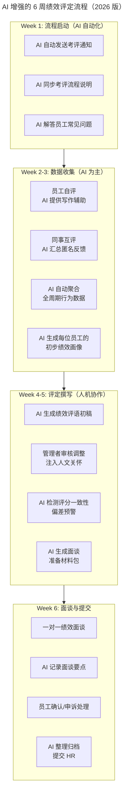

# 第124讲 | 刘俊强：必知绩效管理知识之评定绩效

> **适用范围**：技术管理者、团队 Leader、HRBP，以及需要在绩效评定阶段合理安排 6 周流程、撰写公平有用绩效评语的管理者。
>
> **更新摘要（v2 · 2026-08 更新）**：
> - 结构化升级为 6 节骨架（导言 / 核心方法论 / 关键流程 / 工具与实战 / 常见误区 / 进阶延展）
> - 保留原文"绩效评定流程 6 周时间表""撰写绩效评价策略""良好评定的四要素（完整/准确/公平/有用）"
> - 将"AI 时代升级注解（2026）"统一融入进阶延展，补充 AI 增强的 6 周评定流程与人机协作撰写策略
> - 补充 Mermaid 图标题与图后解读

## 1. 导言

绩效评定是绩效沟通环节的关键前置环节，一个良好的绩效评定能够助力你接下来的工作。本文将从绩效评定流程和撰写绩效评价两个部分，系统介绍如何做好绩效评定。

在我们开始绩效评定之前，需要先对整个绩效评定流程作出一个合理的时间安排。可能对于大公司的管理者而言，人力部门会帮你制定时间表，并按时提醒进度。但如果公司规模较小的话，可能就需要管理者自己创建和控制流程。

## 2. 核心方法论

### 2.1 绩效评定流程的反推法

绩效评定阶段的最后一项，是在截止日期前将所有评定结果反馈给人力资源部门，因此，我们首先要确定反馈给人力资源部门的截止日期，进而反推绩效评定流程中各项工作的完成时间。从我过往的经验来看，一般整个绩效评估流程大约需要 6 周的时间。

### 2.2 良好绩效评定的四要素

一个良好的绩效评定应该是**完整、准确、公平且尽可能有用**的：

- **完整**：意味着管理者需要对绩效考核的各个维度都进行评定和评价，同时在允许的情况下提供足够的绩效评语。
- **准确性**：要求管理者认真审查收集到的绩效数据，产生差距时需要解释差距产生的原因，以保证评估是准确的。
- **公平性**：要求管理者使用的评价标准要一致。
- **有用**：评语要对员工的改进有帮助。

### 2.3 撰写绩效评价的策略

大多数管理者会首先填写量化考核的部分，但是我并不建议这样做，相反我会建议先从叙述性、陈述性的部分开始，例如绩效评语及改进建议等。原因在于这样做能够强迫管理者在没有详细数据支持的情况下，来思考员工在绩效周期内的表现情况，并回想起他们具体的突出行为例子。

在完成陈述部分的草稿之后，是时候填充量化考核部分了，管理者需要根据之前收集到的数据，对每个考核项的完成情况进行分数评定。接着还需要拿出员工自我评价、同事互评等信息，看是否需要对之前的评分作出调整。

这里需要记住的原则是，一般情况下你最初的评定是你最诚实的评定，绩效评定的目标是提供公平的评估，而不仅仅是个人评估或他人对该员工的评估。

## 3. 关键流程

### 3.1 6 周绩效评定流程

**第一周**：在整个流程开始前，需要管理者将时间表及考评流程同步给员工，以便员工对接下来参与考评流程一事做好准备。这里的同步方式可以是正式邮件结合非正式会议的方式，如果某些员工没弄清楚考评流程的话，还需要管理者对其进行单独的沟通辅导。

**第二周到第三周**：员工进行自我评估。每个公司情况不一样，可以是 Word、Excel 文档也可以通过在线系统进行提交。当然，如果有条件的话，更建议采用在线系统，方便日后追溯和员工培养。有些公司还会采用同事间互评的方式，并将结果作为绩效参考。在这个时候，管理者需要根据之前文章中介绍过的绩效数据收集方法，拿出之前收集到的数据，以便对各个员工在绩效管理循环中的第二个阶段——绩效辅导阶段中的表现情况有清晰的认识，尽量避免认知偏差带来的不公平问题。

**第四周到第五周**：管理者需要对自己管辖的团队和员工进行绩效评定，并撰写绩效评估的评语。在这个阶段，管理者需要根据之前确定的绩效目标以及收集到的数据，包括员工的自我评价、绩效目标的完成情况以及日常的行为表现记录等等，根据这些记录及数据来进行绩效考核表的填写。其中的上级评语和改进意见是最为重要的部分。

**第六周**：管理者需要安排自己的时间，与团队员工进行绩效面谈。确认好时间后，建议使用日程管理工具管理好日程，并且也要确认被评估员工的时间。将最终结果和绩效面谈后的员工反馈等信息整理后提交给人力资源的同事，至此，整个绩效评定流程正式完结。

### 3.2 绩效面谈的时间安排

至于会议时长，我建议每次都安排一个小时的时间，可能实际用不了这么长的时间，但这样预留安排时间的好处有两点：一是不要让员工觉得你很着急结束跟他的绩效面谈，这样正式的沟通机会对员工来说是难得的机会；二是如果能提前完成面谈，你还能够花这些时间去处理其他日常工作和可能出现的紧急事务等，并不会浪费。

另外在与员工进行绩效沟通时，一个实践经验是，先从他们最近的绩效表现开始聊起，然后整体回顾该员工的表现。另外，管理者在与每位员工进行绩效沟通前，需要至少将该员工的整体信息看两遍，不要让员工觉得你不了解他们的实际情况，否则他们会怀疑绩效评定的准确性和公平性。

### 3.3 评语撰写的时间投入

管理者至少使用一周的时间来进行绩效评语的撰写，建议时间是一周至两周的时间。为什么需要这么长的时间呢？因为管理者需要对员工在整个绩效周期里的表现进行评分，同时还要撰写相应的绩效评语和改进意见，所以完整回顾员工的整体表现是十分重要的，也就需要多花些时间反复斟酌。因此，我会建议，每个员工，管理者都至少花费一至二个小时的时间来撰写他们的绩效评语。

## 4. 工具与实战

### 4.1 评语撰写的三步法

1. **先写陈述性部分**：从叙述性、陈述性的部分开始（绩效评语及改进建议），强迫管理者在没有详细数据支持的情况下思考员工表现，回想起具体突出行为例子。
2. **再填量化部分**：根据之前收集到的数据，对每个考核项的完成情况进行分数评定。拿出员工自我评价、同事互评等信息，看是否需要调整评分。
3. **回到叙述性评语校准**：看量化评定跟之前填写的叙述性评语间的差异。管理者需要关注这样的差距，同时要尽量解决这样的差距。建议将这些差距记录下来，并具体解释为什么会有这样的差距，这将会成为接下来跟员工绩效沟通时的重点。

### 4.2 评分差距的处理

管理者需要告诉员工为什么彼此的认知是不一致的，不论是正面还是负面的差距都应如此。这种"先叙述—再量化—再校准"的流程，能有效避免"先打分再凑评语"的本能倾向，让评语更贴近事实。

## 5. 常见误区

1. **先填量化部分再写评语**：这会让管理者被数字锚定，评语沦为对分数的事后合理化；应先写陈述性部分再填量化。
2. **忽视评分与评语的差距**：量化评定与叙述性评语出现差异时不记录、不解释，会让员工在面谈时感到困惑。
3. **面谈前不充分阅读员工信息**：让员工觉得你不了解他们的实际情况，会怀疑评定的准确性和公平性；至少看两遍。
4. **面谈时间安排过短**：让员工觉得你着急结束，丧失正式沟通机会；建议每人预留 1 小时。
5. **评语缺乏改进建议**：只指出问题不给发展方向，违背"有用"原则。
6. **评价标准不一致**：对类似表现的员工使用不同尺度，破坏公平性。

## 6. 进阶延展

### 6.1 AI 增强的绩效评定流程

2026 年，绩效评定流程从 6 周的人工密集劳动，转变为"AI 准备 + 人审决策"的混合模式。AI 承担数据聚合、初稿生成、偏差检测等重复性工作，管理者聚焦于价值判断和发展辅导。



上图展示了 2026 年版的 6 周流程升级：Week 1-3 由 AI 主导通知与数据聚合，Week 4-5 进入人机协作的评语撰写与偏差检测，Week 6 完成面谈与归档。管理者从"数据搬运工"解放，专注价值判断与发展辅导。

### 6.2 撰写策略升级：三步走

原文建议"先写陈述性部分，再填量化部分"。2026 年，这个策略演变为"AI 草稿 → 人审注入 → 智能校准"：

1. **AI 生成初稿**（基于全量数据）：包含工作表现、亮点、待改进、发展建议。
2. **管理者审核与注入**（关键步骤）：补充 AI 无法感知的软性因素（态度、潜力、团队氛围），调整语气使其更具温度和个人风格，加入只有管理者知道的细节和观察，删除过于机械化或不恰当的表达。
3. **AI 智能校准**：检查评分与评语的一致性，对比同级别员工的评价尺度，预警可能的偏见或遗漏。

### 6.3 AI 时代的 360 度评估增强

| 评估来源 | 权重（建议） | AI 增强点 |
|----------|--------------|----------|
| **上级评价** | 35% | AI 提供行为数据支撑，减少印象流 |
| **同事互评** | 20% | AI 匿名聚合，去除极端值 |
| **下属评价** | 10%（如有） | AI 文本分析提取共性主题 |
| **自评** | 10% | AI 对比自评与他评差距 |
| **AI 行为数据** | 25% | 客观、实时、不可博弈 |
| **（新增）AI 协作评价** | — | 来自 AI 工具的协作效能数据 |

### 6.4 2026 年可执行建议

**绩效评定效率提升预期**：

```
传统流程（纯人工）：
- 数据收集：8 小时/人
- 评语撰写：2 小时/人
- 面谈准备：1 小时/人
- 合计：11 小时/人（10 人团队 = 110 小时）

AI 增强流程（人机协作）：
- 数据收集：0.5 小时/人（AI 自动聚合）
- 评语撰写：0.5 小时/人（AI 初稿+人审改）
- 面谈准备：0.3 小时/人（AI 生成材料包）
- 合计：1.3 小时/人（10 人团队 = 13 小时）

效率提升：88%
节省的时间用于：更深入的员工发展辅导
```

**避免过度依赖 AI 的提醒**：

- ❌ 错误做法：直接复制 AI 生成的评语不改就发；完全依据 AI 数据评分不考虑上下文；用 AI 替代面对面的沟通。
- ✅ 正确做法：AI 是"研究助理"，你是"最终编辑"；AI 数据是"证据"，你是"法官"；AI 提高效率，你注入灵魂。

### 6.5 作者简介

刘俊强（微信公众号：程序员精进），TGO 鲲鹏会会员，现任腾讯云资深架构师，曾任迅雷技术总监、某互联网公司技术副总裁，10+ 年以上互联网开发经验，8 年以上技术管理经验。

> *本注解强调：AI 让绩效评定更高效、更客观，但"公平"和"温度"仍来自管理者本身。*
