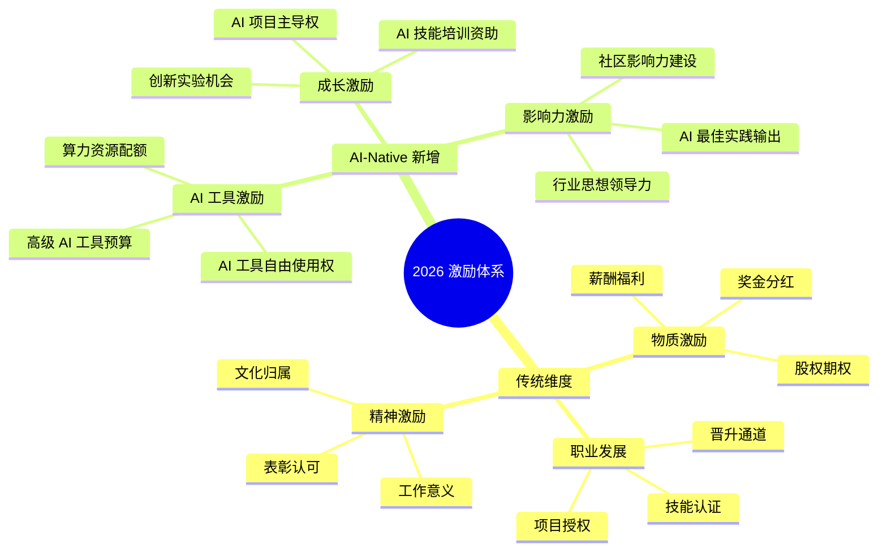
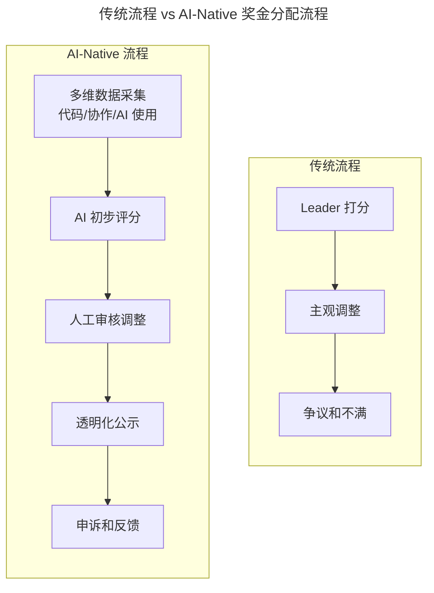

# 第42讲 | 团队激励之分配好你的奖金

> **适用范围**：技术 VP、CTO、业务线负责人、团队 Leader，以及需要为大规模团队设计奖金分配方案并落地执行的管理者。
>
> **更新摘要（v2 · 2026-08 更新）**：
> - 结构化升级为 6 节骨架（导言 / 核心方法论 / 关键流程 / 工具与实战 / 常见误区 / 进阶延展）
> - 保留原文"三大奖金分配原则""SVM 贡献度评价模型""12 个版本迭代"完整案例
> - 将"AI 时代升级注解（2026）"统一融入进阶延展，补充 AI-Native 激励体系与新型激励方式
> - 补充 Mermaid 图标题与图后解读

## 1. 导言

大家好，我是刘译璟，百分点技术副总裁兼首席架构师。团队激励有许多种手段，物质方面我们可以考虑股权、绩效工资、项目奖、年终奖、加薪、提成等等，职业方面可以考虑晋升、表彰、授权、培训、宣传等等。众多激励手段中，奖金无疑是最简单最直接最容易见效的。但想把奖金分配好、发到位乃至收获效果，却是一件很有挑战的事。在这里，我想通过案例剖析的方式，同大家分享如何充分利用好奖金激励。

## 2. 核心方法论

### 2.1 奖金激励的初衷

摆在我面前的第一个问题是，为什么要发奖金，我想通过奖金激励获得什么？我很快有了结论：**发奖金是期望团队知道公司乐于分享，业务的成长会给大家带来的收益，并且对业务贡献越大的人获得的收益越多。**

### 2.2 三大奖金分配原则

由此我得出了三个奖金分配的原则：

**原则一：根据业务发展情况设置奖金池大小。** 业务发展的好则奖金多，发展的不好则有可能完全没有奖金。这个原则比较容易让大家接受，毕竟不会天下掉馅饼，大家只有努力把蛋糕做大才有可能得到更多。

**原则二：根据每个成员在业务中的贡献度统筹分配奖金。** 对业务做出越大贡献的人得到的奖金越多，而且我希望贡献度前 30% 的成员可以分配总奖金的 70%！请注意，这里的贡献度不是指个人绩效，而是一种对业务的综合影响程度。在实际操作中，这是最核心的原则，但也确实是解释成本最高的原则。

**原则三：根据每个成员的月薪计算奖金。** 每个人的薪酬不一样，这就造成大家对"奖金多少"的理解是不一致的，同样是一万块钱，甲可能觉得匹配自己的努力，但乙就会觉得太少了。为了消除这种不一致，每个人的奖金都会是他月薪的一个倍数。

大家仔细思考可以看出，上述三个原则实际上把个人和团队的利益绑定在了一起，让每个人都切身感受到自己参与到了业务中，业务成长个人才能受益。而这正是我实施奖金激励的初衷。

## 3. 关键流程

### 3.1 细则制定与宣传

一项政策要落地，不是领导拍脑袋就说了算的，必须得到团队的理解和认可。所以我要做的第二项工作就是细则制定和宣传。在这个环节中，我首先跟 2 位业务总经理讨论激励目标和原则，进一步明确了以下事项：

- 第一，业务发展状况由公司来评定，主要考虑收入、客户满意度和项目质量；
- 第二，成员贡献度的评估精心设计，至少要参考岗位重要度、个人绩效、参与业务的时长这些重要指标；
- 第三，成员贡献度被分为 S、A+、A、B+、B、C 和 D 七档，对应的奖金是月薪的 6、5、4、3、2、1 和 0 倍（最后落实时调整为 6、5、4.5、3.5、2.5、1.5 和 0）；
- 第四，岗位重要度被分为 ABCD 四档，分别代表功能小组中的核心、副手、骨干和成员；
- 第五，个人绩效被划分为 SABCD 五档；
- 第六，参与业务的时长由 HR 给出；
- 第七，只要参与过业务的人员，不论他是否归属到本部门都会一视同仁。

在与 2 位业务总经理讨论明晰之后，我进一步征求 4 位核心总监意见，而后在部门聚餐中向 30 位 Leader 介绍这些原则和细则并与大家讨论。最后，在一系列的团建活动和培训中向所有团队成员简介 2017 年度的奖金激励规划。

整个讨论、意见征询和宣传活动贯穿了 2017 年下半年，团队成员大致都明白了我的奖金激励计划和背后理念。某种程度上讲，我认为 2017 年下半年的这一系列活动要远比发奖金本身更重要，因为它是团队形成共识的过程，也是塑造团队文化的过程，更是夯实团队班底的过程。

### 3.2 贡献度评价模型的设计

实际的奖金分配工作是 2018 年 1 月才开始启动的，此时的关键问题是如何合理的评估大家在 2017 年的贡献度？在操作层面，我做了如下工作：

1. 我和 2 位业务总经理为每个成员确定了岗位重要度；
2. 由 30 位 Leader 给出了每个成员的年度个人绩效；
3. 我从 HR 处获得了每个人参与到本业务线的天数。

收集到以上数据后，我着手设计一个相对公平的贡献度评价模型。我的做法是：我和 2 位业务总经理挑选了一些典型员工出来，商定了他们的贡献度档位，作为基准和样本；基于上面的样本训练了一个 **SVM 模型**，输入是每个人的岗位重要度、个人绩效和参与业务时长，输出是贡献度档位；将训练出来的模型用到全体成员上，得到每个人的贡献度；再跟实际的奖金池去匹配，对每级贡献度的奖金系数进行适当的调整。

这个过程描述起来很简单，但实际上我前前后后用了两周多时间才计算好，中间涉及到许多沟通、数据校正和系数调整的工作。经过上面的工作，我有一个初步的奖金分配方案，但还有一些特殊情况需要考虑，因此又做了两件事：与 2 位业务总经理讨论对极个别特殊员工进行了贡献度上调整；对每个小组，利用上面得到的分配方案核算出一个奖金包，给到小组 Leader 由他进行微调。

这一阶段的工作又持续了两周。在这一个月时间内，分配方案更新了 12 个版本才算敲定。任何涉及到利益的事都不能大意啊！

### 3.3 逐层沟通与发放

分配方案敲定以后，从 2018 年 2 月开始，团队开始逐层沟通每个人的年终奖，总的来说非常顺利，没有出现负面的声音。大家也拿着年终奖开开心心过了大年。

## 4. 工具与实战

### 4.1 SVM 贡献度评价模型

| 输入维度 | 数据来源 | 说明 |
|---------|---------|------|
| 岗位重要度 | 管理者与业务总经理确定 | ABCD 四档（核心/副手/骨干/成员） |
| 个人绩效 | 30 位 Leader 评价 | SABCD 五档（超预期/优秀/良好/合格/不合格） |
| 参与业务时长 | HR 提供 | 按入职到本业务线的时间计算 |
| **输出** | SVM 模型 | 贡献度档位（S/A+/A/B+/B/C/D 七档） |

由于业务线比较新，2017 年在制度建设和数据积累方面条件不足，这部分的工作不算非常细致，例如评价要素不够丰富、个人绩效过于粗糙等等。今年我已经针对这些问题做了制度上的改进，相信 2018 年的年终奖分配会更加合理和精细。

### 4.2 奖金激励落地四步法

1. 必须想清楚发奖金的目的是什么，按照什么原则发；
2. 要通过一系列的宣传工作让每个人知晓管理者的目的和原则，团队齐心激励才有意义；
3. 需要设计合理的机制，保证奖金的分配是合理的，是可以被团队认可的；
4. 发放奖金时各层管理者一定要进行面对面的沟通，讲清楚规则，让员工理解我为什么拿了这些奖金，以后怎么办才能得到更多。

## 5. 常见误区

1. **不发奖金比发不到位更好**：如果做不到位，甚至会带来反效果，还不如不发。
2. **把贡献度等同于个人绩效**：贡献度是对业务的综合影响程度，不是个人绩效；团队 Leader 和关键岗位天然更容易做出大贡献。
3. **完全按绩效发放奖金**：由于 Leader 的业务职能差异和手松收紧程度不一致，不同团队之间个人绩效的差别很大，完全按照绩效发放并不是个好主意。
4. **忽视宣传与共识**：奖金激励不只是最后发钱那么简单，而是一项需要考虑公司文化、业务体系、制度和利益的细致工作。
5. **不预留特殊调整空间**：有些员工得到客户高度认可、即将承担重要岗位、月薪偏高/偏低等特殊情况需要微调空间。
6. **一人拍脑袋决定**：分配方案更新了 12 个版本才敲定，任何涉及到利益的事都不能大意，需要多层管理者参与。

## 6. 进阶延展

### 6.1 激励理念的 AI-Native 演进

2026 年，GPT-5.5 和 DeepSeek V4 让 AI Agent 能力达到新高度，**84% 的开发者使用 AI 编程工具**。在这样的背景下，员工的需求正在从"物质激励"转向**"物质 + 成长 + AI 赋能"的多元激励**。

上图展示了 2026 年激励体系在传统三维（物质/职业/精神）基础上新增的 AI-Native 三维（AI 工具/成长/影响力）。原文的三大原则仍然有效，但"贡献度"的衡量维度需要扩展。

### 6.2 重新定义"贡献度"

| 传统维度 | AI-Native 新增维度 | 如何衡量 |
|---------|------------------|---------|
| 岗位重要度 | **AI 协作影响力** | AI 记录的跨团队协作数据 |
| 个人绩效 | **AI 使用质量和创新** | AI 工具使用效果和创新应用 |
| 参与时长 | **AI 学习投入和成长** | AI 技能提升速度和应用深度 |

### 6.3 引入 AI 辅助的公平性保障

原文痛点：不同团队 Leader 打分标准不一致；主观评价可能存在偏差；数据收集和分析工作量大。

上图对比了两种流程：传统流程依赖 Leader 打分和主观调整，容易产生争议；AI-Native 流程通过多维数据采集、AI 初步评分、人工审核、透明化公示与申诉反馈，让分配更客观、更可解释。

### 6.4 新型激励方式（2026 推荐）

1. **AI 工具自由使用权**：为高绩效员工提供高级 AI 工具的使用权限（如 GPT-5、Claude Opus 等付费版本）和专属的算力资源配额。
2. **AI 技能认证资助**：资助员工参加 AI 相关的培训和认证考试，提供 AI 会议和大会的参会机会。
3. **AI 创新项目机会**：设立"AI 创新专项基金"，支持员工提出和主导 AI 相关项目；给予 20% 工作时间用于 AI 技术探索和实验。
4. **算力配额奖励**：根据绩效等级给予不同级别的算力资源配额，可用于个人学习、实验项目或团队共享，配额可以累积和转让。

### 6.5 2026 年展望：从"金钱驱动"到"价值共创"

| 维度 | 传统激励 | AI-Native 激励 |
|------|---------|---------------|
| **激励重心** | 物质回报 | **物质 + 成长 + 赋能** |
| **激励方式** | 单一（奖金） | **多元（工具+机会+资源）** |
| **时间视角** | 短期（当期） | **短期 + 长期并重** |
| **员工体验** | 被动接受 | **主动选择、个性化** |
| **组织收益** | 短期业绩提升 | **长期竞争力和创新能力** |

### 6.6 作者简介

刘译璟，百分点信息技术副总裁，[TGO 鲲鹏会](https://tgo.geekbang.org) 北京分会会员。负责产品研发工作以及研发团队管理和培训工作。工作后主要关注高并发 Web 应用、分布式存储和计算、机器学习、商业建模和用户画像等技术领域，以及个性化推荐、互联网广告、精准营销和客户管理等应用领域。

> *2026 年的最佳激励不是"给更多的钱"，而是"给更多的可能性"；帮助员工建立 AI 能力不仅是激励手段，更是最有效的留任保障。*
