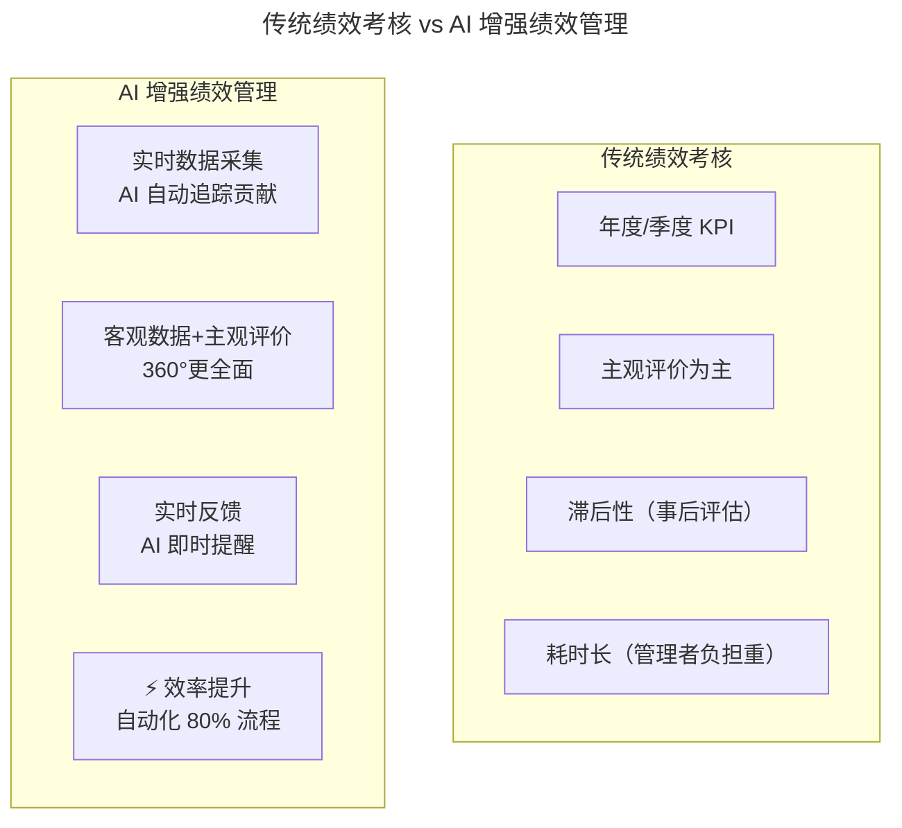
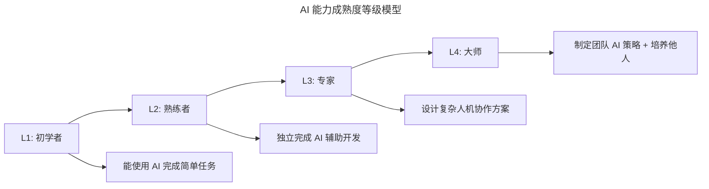

# 大咖对话 | 李昊：创业公司如何做好技术团队绩效考核？

> **适用范围**：创业公司 CTO、技术 VP、团队 Leader，以及希望用简单透明的绩效体系激活技术团队的管理者。
>
> **更新摘要（v2 · 2026-08 更新）**：
> - 结构化升级为 6 节骨架（导言 / 核心方法论 / 关键流程 / 工具与实战 / 常见误区 / 进阶延展）
> - 保留李昊"KPI 简单明了、过程结果并重、定期反馈调整、公平透明"四大绩效理念
> - 将"AI 时代升级注解（2026）"统一融入进阶延展，补充 2026 年 KPI 维度重定义与 AI 能力成熟度评估
> - 补充 Mermaid 图标题与图后解读

## 1. 导言

本周大咖对话嘉宾是爱回收 CTO，TGO 鲲鹏会会员李昊。曾任职于阿里、1 号店、京东等公司，拥有丰富的电商和 O2O 行业技术管理经验。创业公司如何做技术团队绩效考核？这是一个很多技术管理者都头疼的问题。李昊老师基于实战经验，给出了四条简明实用的原则。

## 2. 核心方法论

### 2.1 KPI 要简单明了

创业公司不要搞复杂的考核体系，2-3 个核心指标就够了。比如：项目交付质量、系统稳定性、技术债务控制。

### 2.2 过程和结果并重

既要看最终交付的结果，也要看过程中的表现。比如代码质量、团队协作、知识分享等。

### 2.3 定期反馈调整

不要等到年底才做一次考核，至少每季度要做一次正式的绩效沟通，平时也要有持续的反馈。

### 2.4 考核要公平透明

标准要提前告知，过程要公开，结果要有据可依。最怕的就是"黑箱操作"，员工不知道自己为什么被评好或评差。

## 3. 关键流程

### 3.1 指标设定流程

创业公司的绩效指标设定遵循"少而精"原则：从业务目标反推 2-3 个核心指标，确保每个指标都可量化、可追溯。指标设定后提前告知全员，确保标准透明。

### 3.2 反馈与调整流程

- **季度正式沟通**：每季度做一次正式的绩效沟通，回顾目标达成情况。
- **平时持续反馈**：不等到季度末才反馈，日常工作中发现问题即时沟通。
- **目标动态调整**：根据业务发展情况，对下一阶段的目标进行合理调整。

## 4. 工具与实战

### 4.1 创业公司核心 KPI 速查

| 核心指标 | 衡量方式 | 适用场景 |
|---------|---------|---------|
| 项目交付质量 | 按时按质完成率、上线后 Bug 数 | 所有项目型团队 |
| 系统稳定性 | 可用率、故障次数、MTTR | 有线上系统的团队 |
| 技术债务控制 | 技术债清单、偿还率、重构进度 | 有历史包袱的团队 |

### 4.2 过程指标与结果指标的结合

| 类型 | 指标示例 | 价值 |
|------|---------|------|
| **结果指标** | 功能上线数量、业务目标达成度 | 衡量最终产出 |
| **过程指标** | 代码质量、团队协作、知识分享 | 衡量达成方式，防止"结果好但过程糟" |

## 5. 常见误区

1. **搞复杂的考核体系**：创业公司不要搞复杂的考核体系，2-3 个核心指标就够了。
2. **只看结果不看过程**：只看最终交付结果会纵容"结果好但过程糟"的行为，长期损害团队健康。
3. **年底才做一次考核**：等到年底才发现问题就晚了，应至少每季度做一次正式沟通。
4. **黑箱操作**：员工不知道自己为什么被评好或评差，会严重破坏信任。
5. **标准不提前告知**：标准要提前告知，过程要公开，结果要有据可依。

## 6. 进阶延展

### 6.1 绩效管理的 AI 革命

2026 年，84% 的公司使用 AI 辅助绩效数据收集，实时反馈替代季度考核成为趋势，从"评价人"到"发展人"的理念转变。李昊 2018 年的绩效管理智慧——**"简单、平衡、及时、透明"**——在 AI 时代依然有效，但需要升级度量方式。



上图对比了传统绩效考核与 AI 增强绩效管理的四个维度差异：从年度 KPI 到实时采集、从主观评价到客观数据 + 主观评价、从滞后评估到实时反馈、从管理者负担重到自动化 80% 流程。李昊的四大原则在 AI 时代更容易实现。

### 6.2 KPI 的重新定义

原文："2-3 个核心指标就够了"。2026 年推荐的 KPI 维度：

| 维度 | 传统指标 | AI 时代建议指标 |
|-----|---------|---------------|
| 产出 | 代码行数 | **业务价值交付量** |
| 质量 | Bug 数量 | **AI 生成代码通过率 + 用户满意度** |
| 效率 | 工时投入 | **人机协作效率比** |
| 成长 | 技术文档数 | **AI 能力提升度 + 知识分享质量** |
| 协作 | 同事评分 | **跨 AI 系统协作品质** |

### 6.3 AI 能力成熟度评估（2026 新增）



上图展示了 AI 能力成熟度的四级模型：从 L1 初学者（能使用 AI 完成简单任务）到 L4 大师（能制定团队 AI 策略 + 培养他人）。这为原文"过程和结果并重"原则提供了新的能力成长衡量维度。

### 6.4 2026 年绩效考核框架

```
核心指标（3 个）：
1. 业务价值交付（40%）
   - 功能上线数量及使用率
   - 用户反馈/NPS
   - 业务目标达成度

2. 人机协作效率（30%）
   - AI 工具使用率和效果
   - 代码交付速度提升
   - 质量指标（Bug 率、覆盖率）

3. 团队成长贡献（30%）
   - 知识分享（Prompt 库贡献、最佳实践）
   - 协作质量（Code Review、跨团队支持）
   - AI 能力提升进度

数据来源：
✅ 自动化：Git 记录、CI/CD 数据、AI 工具日志
✅ 半自动：Peer Review、360° 反馈（AI 辅助收集）
✅ 手动：1on1 沟通、重大项目复盘
```

### 6.5 避免陷阱（2026 新增）

1. ❌ 用 AI 生成代码占比作为主要 KPI（导致为用 AI 而用 AI）
2. ❌ 忽视软技能（协作、沟通仍重要）
3. ❌ 标准僵化不更新（AI 能力模型每季度迭代）

### 6.6 总结

李昊 2018 年的绩效管理智慧在 AI 时代依然有效，但需要升级度量方式：

> 2018: KPI = 代码 + 质量 + 态度
> **2026: KPI = 业务价值 + 人机效率 + 成长贡献（数据驱动）**

> 2018: 季度考核 + 年终总结
> **2026: 实时数据仪表盘 + 季度发展对话（从评价转向发展）**

> *注解生成时间：2026 年 6 月 ｜ 基于李昊原对话内容与 AI 时代绩效管理最新实践更新*
