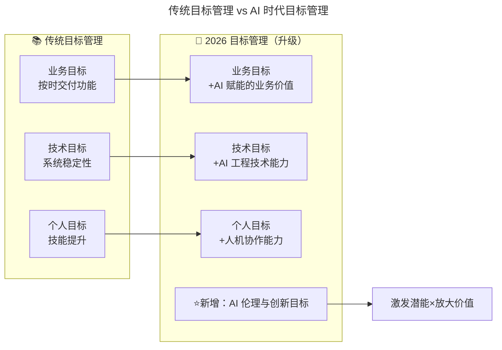
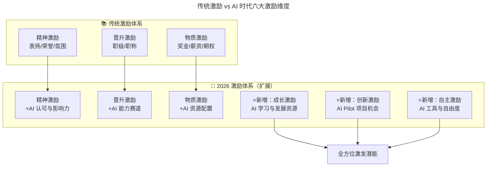

# 第192讲 | 崔俊涛：如何做好技术团队的激励

> **适用范围**：CTO、技术 VP、团队 Leader，以及需要从目标管理、考核、激励三个阶段系统设计技术团队激励体系的管理者。
>
> **更新摘要（v2 · 2026-08 更新）**：
> - 结构化升级为 6 节骨架（导言 / 核心方法论 / 关键流程 / 工具与实战 / 常见误区 / 进阶延展）
> - 合并原文（上）"目标管理"与（下）"目标考核与激励"两篇内容
> - 保留"给谁干""OKR 目标共享""即时反馈/量化考核/目标修正""精神/晋升/物质/量身定做四类激励"等核心方法论
> - 将"AI 时代升级注解（2026）"统一融入进阶延展，补充 AI 时代六大激励维度与激励矩阵
> - 补充 Mermaid 图标题与图后解读

## 1. 导言

在明确如何激励之前，我们先简单了解下激励的重要性和误区。激励是心理学的术语，代表激发动机、鼓励行为及形成动力。激励用于管理，是指激发员工的工作动机，用各种有效的方法来调用员工的积极性和创造性，使其努力完成任务，实现公司目标。一般而言，有效的激励手段能够实现两个目标：公司及团队目标的实现；激发开发员工的潜能，使之获得巨大的成就感。

既然激励如此重要，那在实际的团队管理中，我们应该如何进行激励以提高团队的积极性和开发效率呢？在实际的产品或者项目流程中，我们一般分为三个阶段：**设定目标、进行考核以及实施激励**，做好激励也需要从这三个阶段着手。本文核心讨论两个问题：**给谁干**和**怎么分**。

## 2. 核心方法论

### 2.1 目标管理：给谁干

提到目标管理，我们脑海中最先出现的可能是 KPI 或者近年流行的 OKR。设定目标之后可以使公司的愿景明确，团队资源集中来完成目标。在实际的工作中，如何设定目标可以用一个通俗易懂的词语来表达：**给谁干**。

人是一种社会性动物，但同时也是一种自私的动物。我们喜欢拥有自主和主动的权利，不喜欢被人牵着鼻子走。因此，在设定目标的过程中，我们期望团队中的每位成员都能够认为目标是自己的，是在为自己实现目标。因此给谁干的问题可以总结为如何使团队成员设定自己的目标。

### 2.2 目标共享：自上而下与自下而上

如果希望团队成员将团队目标当成自己的目标，那就需要做到目标共享，信息透明。基于此，目标共享分为自上而下和自下而上两条路径。自上而下保证团队成员的个人目标最终能汇聚成团队目标，而自下而上能够由个人目标来推动团队目标的完成，增加团队成员的集体荣誉感。

在实际的操作过程中，我们可以结合 OKR 来进行：首先根据 OKR 的原则来设定团队的整体目标及关键成果；关键成果讨论确定完毕后，每个团队成员都需要根据自己的情况和工作安排来考虑自己的目标和关键成果是什么；团队成员的目标可能会互相影响和互相促进，因此需要在团队内部进行共享。

### 2.3 业务目标与技术目标并重

技术人员渴望自身技术的进步以及公司层面技术的前瞻性与先进性，而团队更关注于业务的目标及完成度。大多数情况下，这两个目标是有冲突的，为了业务的稳定性及目标能够尽快达成，采用原有的稳定性高的技术是首选，但这样做就会限制技术团队尝试使用新的可能不太稳定的技术。因此在团队管理中，需要兼顾短期业务目标及中长期技术目标，将技术的发展作为团队的一个长期发展的主线。

### 2.4 激励的四类方式

最激动人心的时刻到了，所有团队成员都在等着这一刻，目标达成，拿到期盼已久的奖励。通俗地说，激励就是怎么分的问题。激励一般有如下几种：

1. **精神激励**：领导的信任、良好的情感空间和氛围、对自身价值的认同都属于精神激励的范畴。精神激励是一种低成本、高效率的激励方式，可分为持续性（定期评比，如每月的任务之星）和临时性（完成某个项目或任务）两种方式。
2. **晋升激励**：通过职位或者职称的晋升，团队成员的价值获得最直接、最明确、最广泛的认可。在公司层面上一般都会有技术职级的设定，比如阿里的 P 序列，腾讯的 T 序列等。
3. **物质激励**：比较常见的直接激励手段，也是最能体现怎么分的细节。但在使用物质激励时需要小心，避免掉进物质激励的陷阱。
4. **量身定做**：团队成员的情况千差万别，有人追求精神激励，有人追求物质激励，所以激励手段和方法不能一概而论，要单独为团队成员量身定做激励方案。

## 3. 关键流程

### 3.1 目标考核的三方面

目标设定完毕后，团队就需要定期监控目标的达成进度和完成情况，并及时向团队成员进行反馈，修正目标的偏离和漂移，并且及时根据市场及业务的发展情况对目标进行调整。目标考核一般分为几个方面：**即时反馈、量化考核及目标修正**。

### 3.2 即时反馈

积极心理学奠基人米哈里在《心流》一书中着重提到，获得即时反馈能够帮助我们进入心流状态，即全神贯注、投入忘我的状态。米哈里认为即时反馈本身是什么并不是很重要，真正重要的是，通过这个反馈信号，能让你觉得达到或者在接近目标。因此在工作中，团队管理者需要对团队取得的成果给予即时的反馈，包括对接近目标的鼓励和表扬，对远离目标的批评和建议。

### 3.3 量化考核

技术团队的过程量化一直是个比较大的难点。目前，在实际的量化考核中，我们主要采用如下几种方式：

1. **项目完成度**：对于团队来说，项目按时按质完成是首要任务。
2. **任务积分**：将产品和项目分解成工作量差不多的任务，交由团队成员来挑选，完成任务可以增加任务积分。
3. **严重/无脑 BUG 排名**：对测试过程中或生产环境上产生的严重/无脑 BUG 进行统计。
4. **知识分享积分**：鼓励团队成员之间的知识分享，可以通过会议、文档、沟通的方式来进行。
5. **工时排名**：承认每个人的效率会有差异，但投入的时间和精力能够成为衡量一个人工作情况的重要参考指标。

### 3.4 目标修正

俗话说，唯一不变的就是变化。市场的变化、竞争的变化、政策的变化以及执行的结果都会导致公司目标发生变化和调整，因此需要定期回顾目标及其完成情况，然后根据公司实际情况进行修正，并且将新的目标共享给团队成员。

## 4. 工具与实战

### 4.1 OKR 目标共享实践案例

以"提升用户留存率"为例，整体目标的关键成果可以由团队成员集体讨论后确定：

- 提升用户次日留存率 3 个百分点；
- 提升用户 7 日留存率 5 个百分点；
- 提高推送消息触达率到 99.5%；
- 提升用户浏览时长 10%。

关键成果讨论确定完毕后，每个团队成员都需要根据自己的情况和工作安排来考虑自己的目标和关键成果。比如产品负责人为自己设定的目标：设计积分奖励体系，提高用户的次日及 7 日留存率分别为 3% 和 5%；提高内容质量，提升用户浏览时长 10%；设计推荐系统，根据用户的浏览习惯推送内容，提高用户浏览时长 10%。

开发负责人可能会根据总体目标及产品负责人的目标来设定自己的目标：使用手机厂商的推送通道并优化推送逻辑，提高推送消息触达率达 99.5%；使用协同过滤算法实现推荐系统，提高用户浏览时长 10%；实现积分奖励体系，提高用户次日及 7 日留存率分别为 3% 和 5%。

### 4.2 量化与不可能目标的平衡

清晰且可以实现的目标一定是量化的目标。如"完成订单功能的微服务重构"就不是一个量化的目标，因为目标中不包含时间、目标范围等基础信息。此目标应该改为"2019.3.31 完成订单功能（包括下单、库存处理、订单支付）的微服务重构，并能无缝接入现有系统"。

同时，团队也需要一些看似不可能实现的远大目标。从心理学的角度来说，人的潜力和主观能动性是无穷的，看起来可以实现的目标会限制人的潜力和欲望，从而不能达成惊人的结果。如果团队设置一些看起来不太容易实现的目标，为了达成这个目标，团队中的成员往往会自发的发挥他的潜力，即使最终的目标没有达成，也可能看到令人欣喜的发展。

### 4.3 物质激励的两大陷阱

- **平均主义**：中国有句古语：不患寡而患不均。有时候我们认为公平=平均，所以倾向于采用按照工资比例分配的方式来发放物质激励。但往往这种激励不仅达不到激励的效果，还会引起反作用。所以在实际操作中，可以不按照规律来分配物质激励，或者说团队管理者可以比较随心的分配激励，不需要让团队成员看到其中的规律。
- **过于依赖物质激励**：团队管理者往往有一种概念：只要给足了钱，员工必然会感恩。其实未必，由俭入奢易，由奢入俭难。人的欲望是无止境的，物质的激励只会逐步放大欲望。

对大部分团队成员来说，精神激励的效果要大于金钱激励。在基本物质需求得到满足的基础上，员工更需要的是肯定与褒奖，即精神层面的鼓励。

## 5. 常见误区

1. **目标不量化**：如"完成订单功能的微服务重构"缺乏时间和范围，应改为"2019.3.31 完成订单功能（含下单、库存处理、订单支付）的微服务重构，并能无缝接入现有系统"。
2. **只设可实现目标**：团队也需要一些看似不可能的远大目标来激发潜力。
3. **业务目标与技术目标对立**：需要兼顾短期业务目标及中长期技术目标，将技术的发展作为团队的一个长期发展的主线。
4. **物质激励平均主义**：按工资比例平均分配会起反作用，应不按规律分配。
5. **过于依赖物质激励**：由俭入奢易，由奢入俭难；精神激励的效果往往大于金钱激励。
6. **用金钱买尊严**：每个月给某个团队成员发 1 万块钱奖金但天天当众骂他废物，不如只给 1000 块钱但天天当众夸他做得好。
7. **激励一刀切**：团队成员情况千差万别，要单独为团队成员量身定做激励方案，对症下药。

## 6. 进阶延展

### 6.1 AI 时代目标管理的变革

2026 年，技术团队激励面临全新命题：当 AI 能完成大量编码工作时，如何激励开发者？当"代码产出"不再是最核心的价值时，激励什么？原文的"给谁干"在 2026 年升级为"**与 AI 一起干，创造更大的价值**"。



上图展示了目标管理从三维到四维的升级：在业务、技术、个人三维基础上新增"AI 伦理与创新目标"，最终汇聚到"激发潜能 × 放大价值"的共同目标。员工不再是独自背负目标，而是与 AI 伙伴协作达成目标。

### 6.2 OKR 设定的 AI 时代升级

```
【传统版】
O: 提升用户留存率
KR1: 次日留存率+3%
KR2: 7 日留存率+5%
KR3: 推送触达率 99.5%

【⭐2026 AI 增强版】
O: 打造 AI 驱动的用户增长引擎
KR1: 次日留存率+3%（通过 AI 个性化推荐实现）
KR2: 7 日留存率+5%（AI 内容生成提升供给质量）
KR3: 推送触达率 99.5%（AI 优化推送时机）
KR4: ⭐团队 AI 工具采纳率达 90%
KR5: ⭐AI 辅助开发效率提升 30%
KR6: ⭐落地 2 个 AI Agent 自动化运营场景
```

### 6.3 "不可能实现的目标"在 AI 时代的新含义

| 维度 | 传统"不可能目标" | ⭐2026"不可能目标" |
|------|-------------------|---------------------|
| **典型表述** | "Q4 日活翻倍" | "Q4 用 AI 将运营效率提升 10 倍" |
| **为什么看似不可能** | 受限于人力和时间 | 受限于想象力和技术边界 |
| **AI 如何改变可行性** | — | Agent 自动化、AIGC 规模化 |
| **激发的潜能类型** | 拼搏精神、执行力 | 创新思维、人机协作设计能力 |
| **失败的价值** | 积累经验 | 探索 AI 能力边界 |

### 6.4 AI 时代新型激励方式



上图展示了激励体系从三维到六维的扩展：在精神、晋升、物质三维基础上新增成长、创新、自主三个 AI 时代维度。原文"精神激励 > 物质激励"的原则依然成立，且新增"成长激励 > 消费激励""创新包容 > 短期产出""人机协作 > 人机竞争"三条原则。

### 6.5 AI 能力等级（可嵌入现有职级体系）

```
Level 0 - AI Aware（AI 认知）：了解 AI 工具的基本概念和使用场景
Level 1 - AI Proficient（AI 熟练）：熟练运用 AI 工具提升个人效率 30%+
Level 2 - AI Skilled（AI 精通）：能设计和优化 AI 工作流，指导他人
Level 3 - AI Expert（AI 专家）：能架构 AI Agent 系统解决业务问题
Level 4 - AI Leader（AI 领袖）：能制定 AI 战略规划，培养 AI 时代梯队
```

### 6.6 按员工类型定制激励矩阵

```
📋 AI 时代激励矩阵：

员工类型        精神激励    晋升激励    物质激励    成长激励    创新激励
─────────────────────────────────────────────────────────────
高绩效明星      ★★★★★    ★★★★☆    ★★★☆☆    ★★★★★    ★★★★★
  （重点：成长+创新机会）

核心骨干        ★★★★☆    ★★★★☆    ★★★★☆    ★★★★☆    ★★★☆☆
  （重点：稳定+稳步提升）

潜力新人        ★★★★★    ★★☆☆☆    ★★☆☆☆    ★★★★★    ★★★☆☆
  （重点：成长资源+导师带教）

AI 专才          ★★★★☆    ★★★★★    ★★★☆☆    ★★★★★    ★★★★★
  （重点：专业认可+创新空间）

稳健贡献者      ★★★★☆    ★★★☆☆    ★★★★★    ★★★☆☆    ★★☆☆☆
  （重点：物质回报+稳定感）
```

### 6.7 避免激励陷阱的 AI 时代版本

| 陷阱 | 表现 | 后果 | 解法 |
|------|------|------|------|
| **平均主义** | 所有人一样的 AI 工具权限 | 高绩效者不满 | 差异化配置 |
| **物质依赖** | 只用钱激励 | 效果递减 | 组合激励 |
| **⭐AI 工具主义** | 强制使用 AI，不管适用场景 | 抵触情绪 | 自愿+引导 |
| **⭐AI 焦虑激励** | "不用 AI 就会被淘汰" | 压力过大 | 成长导向 |
| **⭐AI 虚荣指标** | 用 AI 使用次数考核 | 动作变形 | 关注实效 |

### 6.8 作者简介

崔俊涛，TGO 鲲鹏会会员，目前担任上海万位数字科技有限公司 CTO，专注于位置服务、大数据及汽车金融风控解决方案领域。

> *AI 时代的激励，本质是从"管理者的恩赐"转向"生态系统的滋养"。最好的激励是让员工在 AI 时代找到不可替代的价值定位。*
