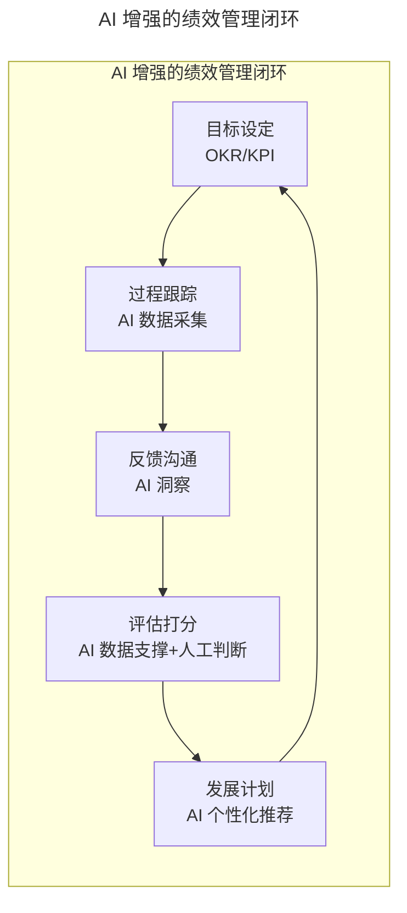
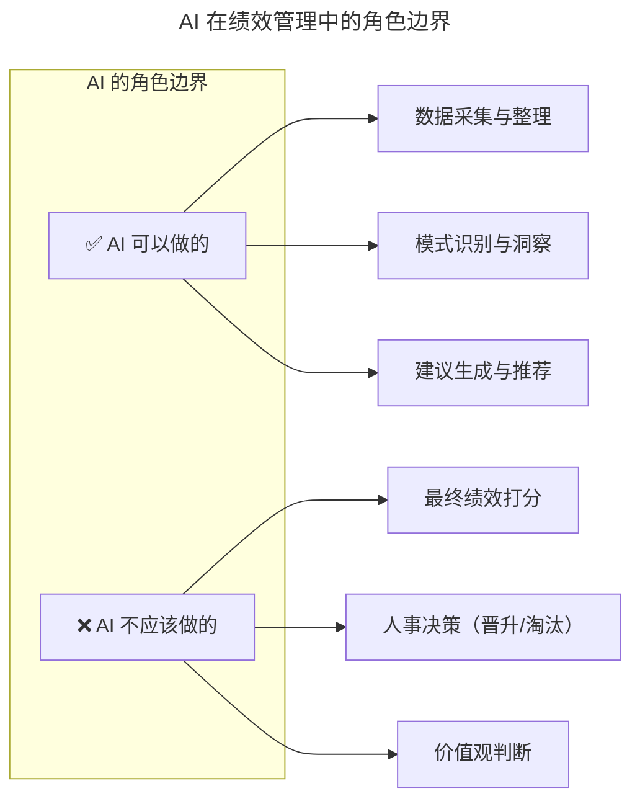

# 第21讲 | 绩效管理的目标不仅仅是绩效考核

> **适用范围**：技术负责人、研发部门经理、HRBP，以及希望理清绩效管理与绩效考核关系、用好 KPI 与 OKR 的技术管理者。
>
> **更新摘要（v2 · 2026-08 更新）**：
> - 结构化升级为 6 节骨架（导言 / 核心方法论 / 关键流程 / 工具与实战 / 常见误区 / 进阶延展）
> - 保留原文"绩效考核的痛与伤""绩效管理 PDCA 闭环""目标/KPI/OKR 关系""增强 KPI 设置模式"等核心内容
> - 将"AI 时代升级注解（2026）"统一融入进阶延展，补充 AI-Native 绩效管理闭环与 KPI 体系
> - 补充 Mermaid 图标题与图后解读

## 1. 导言

我们经常讨论绩效考核这个话题，有不少人为如何考核程序员产出这件事烦恼。我旗帜鲜明的提出观点，**绩效考核只是绩效管理的一环，如果抛弃绩效管理谈绩效考核，无异于舍本逐末**。本文尝试聊几个大家关心的话题：绩效考核有哪些痛与伤、绩效管理与绩效考核的关系、目标与 KPI、OKR 的关系等。

## 2. 核心方法论

### 2.1 绩效考核的三类痛与伤

**第一类问题：工作量考核**。顾名思义，工作量考核的关键点在于工作量评估。工作量评估又会绕到一些常见的问题：Java 开发工程师的工作产出如何衡量？前端工程师的工作产出如何衡量？产品经理的产出如何衡量？DBA 的工作产出如何衡量？有人提到过代码行评估，但代码行评估其实在业界的争议非常大。代码行多是绝对代表产出更好吗？不同语言之间对比代码行也是一个有点滑稽的事情。

**第二类问题：全面指标考核**。全面指标考核可以说在"考核"本身这件事上已经做得足够了，一般会关注多个维度的评估以保障全面性。我曾在一家电信业务的 IT 公司做部门经理，当时公司是采用平衡计分卡来做绩效考核。平衡计分卡是从财务、客户、内部运营、学习与成长四个角度，将组织的战略落实为可操作的衡量指标和目标值的一种新型绩效管理体系。我后来反思，绩效目标要突出拉动力，而不是面面俱到。否则很容易导致全面指标考核在实操过程中走向失败，绩效考核的维度和实际运营维度不 match。

**第三类问题：绩效指标设定偏差**。绩效指标要和组织目标对齐，不要为了设置而设置。某测试同学的绩效指标设定：1. 所负责的模块无线上缺陷；2. 辅导应届生进行功能测试；3. 完成一次性能测试。到考核季的前一个月，这位同学发现第三个指标还没做呢？于是急急忙忙去做了。所有指标都完成了，但这个指标是不是当下最重要紧急的，甚至这个个人绩效指标跟项目目标、团队目标没有强关联。目标没有对齐的危害，可能是树木和森林没有很好的对应，甚至可能南辕北辙。

### 2.2 绩效管理闭环：PDCA 环

有个专家叫戴明，他将其导师休哈特提出的质量循环思想推广完善为著名的"戴明环"，又称为 PDCA 环。PDCA 循环的含义是将质量管理分为四个阶段，即计划（Plan）、执行（Do）、检查（Check）、行动（Action）。绩效管理其实质也是一个 PDCA 循环：

- **第一步：目标设定**。目标来自于哪里？技术团队的目标一定是来自于业务。我经常讲不服务业务的技术都是耍流氓。
- **第二步：设置计划（Plan）**。设置计划来自于目标的分解。
- **第三步：执行（Do）**。执行过程中进度风险、人员流失、技能不够、需求变更频繁等风险都有可能存在。我们要做好的就是缩短反馈环，解决问题。
- **第四步：检查（Check）**。对于个人而言，日常过程中的绩效管理尤其重要，及时发现偏差，及时清晰的沟通，落地有效的改进计划或方式。
- **第五步：给出 Action**。根据 check 结果给出 Action 帮助目标进行改进。同时进入到新的 PDCA 循环。

由此可见，绩效管理是一个闭环过程，而绩效考核是其中一个阶段。如果等到考核期才发现问题就晚了，应该保持按周、月、季做 check 有利于早发现、早纠正。

### 2.3 目标、KPI、OKR 的关系

- **目标**：要去的方向，并且转换为可衡量的数据指标。目标不是孤立存在的。
- **KPI（Key Performance Indicator）**：关键绩效指标，来自自上而下的分解。各部门的主管需要依据企业级 KPI 建立部门级 KPI，并对相应部门的 KPI 进行分解。KPI 的好处就是分解清晰，力出一孔。
- **OKR（Objectives and Key Results）**：目标与关键成果法，是一套明确和跟踪目标及其完成情况的管理工具和方法。OKR 首先确定 O，然后从 O 分解出 KR，然后用 KPI 或者 Milestone 的形式来表示 KR。

有论者批评唯 KPI 论，一切都是 KPI 惹的祸。我觉得关键的问题不是出在 KPI，而是出在 KPI 的制定者，或者是 KPI 的执行者。KPI 顾名思义，是关键绩效指标，指标不等于目标，所以 KPI 应该在目标的指导下工作。无论 KPI 还是 OKR 都需要强目标驱动，单纯谈 KPI，可能会丢掉目标和初心。

## 3. 关键流程

### 3.1 增强型 KPI 的设置模式

我在工作中，习惯了增强 KPI 的设置模式，这个模式里面有关键绩效指标，但关键绩效指标仅仅是一个评估结果。于是又增加了过程关键指标。过程关键指标如同温度计，它不是用于惩罚和制裁，而是去发现可能的异常，通过高频快速的反馈促进团队和个人改进。

以"夯实底盘（稳定性、资金风险）"为例：

**最终结果**：无重大故障；无 P1 级故障；线上总故障数<=5。

**过程关键指标**：线下缺陷，缺陷密度、紧急发布等作为观察指标；应急体系（变更导致线上的问题的发现时效、主动发现线上问题比例等）；业务分钟级异动感知，5 分钟内止血消除影响。

**加分项**：创新解决问题方案，有案例支撑并具备跨子域或者更大范围的推广价值；在问题的解决过程中追求极致，有典型案例支撑。

### 3.2 目标对齐的检查流程

绩效目标设定和所属团队目标的关系，以及和上级组织目标的关系，需要通过 PDCA 的 Check 环节持续校验。研发过程的指标应该作为观测指标，真正的考核指标是业务在线上运营的故障和缺陷，以及研发人员对于需求响应、客户服务方面的满意度。由外而内，避免自嗨。

## 4. 工具与实战

### 4.1 研发绩效考核指标体系示例

在项目研发中往往以研发过程数据、业务结果、公司制度（比如考勤）、主管主观评价等构成程序员的绩效考核体系。业务结果、研发过程、制度考勤、主观评价 4 个维度有对应的权重，来体现不同的岗位角色和各项指标的关联紧密程度。

需要注意的是，活跃用户数超出预期，研发人员自然是有贡献，但产品和运营所起到的作用更是重要。研发过程的指标应该作为观测指标，真正的考核指标是业务在线上运营的故障和缺陷，以及研发人员对于需求响应、客户服务方面的满意度。

### 4.2 KPI 与 OKR 的使用心得

KPI 本身并不 low，关键在使用这个工具的人。在使用 KPI 的时候要紧扣目标，绩效管理闭环有助于产出的改进。OKR 创造性的提出了 Key Results，但也要防止 Key Results 陷阱。随着公司业务发展和规模扩大，越来越多的团队面临的是不确定性问题域，很可能 3 个 Key Results 结果都很好，但关键目标并未达成。

可以参考吴军老师 2017 年初给自己设定的 OKR（目标 1：完成《数学之美》的英文版和韩文版，《大学之路》第二版），每个 KR 都有完成度评分（1.0/0.3/0.1）。这种"目标 + 量化进度"的透明化方式，值得技术团队借鉴。

## 5. 常见误区

1. **抛弃绩效管理谈绩效考核**：绩效考核只是绩效管理 PDCA 的其中一环，舍本逐末会导致考核流于形式。
2. **工作量考核用代码行**：代码行评估在业界争议非常大，不同语言之间对比代码行更滑稽。
3. **全面指标考核面面俱到**：绩效目标要突出拉动力，而不是面面俱到，否则维度和实际运营维度不 match。
4. **绩效指标与组织目标不对齐**：个人绩效指标跟项目目标、团队目标没有强关联，导致南辕北辙。
5. **唯 KPI 论**：关键的问题不是出在 KPI，而是出在 KPI 的制定者或执行者；指标不等于目标，KPI 应在目标指导下工作。
6. **OKR 陷阱**：很可能 3 个 Key Results 结果都很好，但关键目标并未达成；要防止 KR 完成但 O 未达成的情形。
7. **等到考核期才发现问题**：应保持按周、月、季做 check，早发现早纠正。

## 6. 进阶延展

### 6.1 AI-Native 绩效管理重构

2026 年，GPT-5.5 和 DeepSeek V4 让 AI Agent 能力达到新高度，**84% 的开发者使用 AI 编程工具**。绩效管理正在从"事后考核"转向**"AI 驱动的全过程赋能"**。原文核心观点"绩效考核只是绩效管理的一环"在 AI 时代更容易落地——因为 AI 让全过程数据采集成为可能。

上图展示了 AI 增强的绩效管理五环节闭环：目标设定、过程跟踪、反馈沟通、评估打分、发展计划，每个环节都有 AI 增强。这使原文的 PDCA 闭环从"按周/月/季做 check"升级为"实时数据采集 + 持续微反馈"。

### 6.2 五环节的 AI 增强

| 环节 | 传统做法 | AI-Native 做法 | 效果提升 |
|------|---------|---------------|---------|
| **目标设定** | 人工制定 OKR/KPI | **AI 辅助目标拆解和对齐** | 目标一致性提升 30%+ |
| **过程跟踪** | 定期汇报、手工统计 | **AI 实时采集工作数据** | 跟踪频率从月→天 |
| **反馈沟通** | 季度/年度面谈 | **AI 持续微反馈 + 关键时刻提醒** | 反馈及时性提升 10 倍 |
| **评估打分** | 主管主观评价 | **AI 客观数据 + 人工综合判断** | 公平性提升 40%+ |
| **发展计划** | 统一培训课程 | **AI 个性化学习路径推荐** | 培训效果提升 50%+ |

### 6.3 传统 KPI vs AI 时代 KPI

| 维度 | 传统 KPI | AI-Native KPI | AI 如何辅助 |
|------|---------|---------------|-----------|
| **产出量** | 代码行数、功能数 | **有效代码行数 × 业务价值系数** | AI 自动计算价值系数 |
| **质量** | Bug 数、故障率 | **AI 生成代码质量 + 人工审核质量** | AI 静态分析 + 质量评分 |
| **效率** | 完成时间、工时 | **人机协作效率指数** | AI 记录协作过程数据 |
| **创新** | 专利、论文 | **AI 工具创新应用 + 最佳实践输出** | AI 追踪工具使用和创新行为 |
| **协作** | 360 度评价 | **跨团队协作影响力 + 知识贡献度** | AI 分析沟通记录和知识共享 |
| **学习** | 培训时长 | **AI 技能掌握度 + 学习转化率** | AI 测评技能水平 |

### 6.4 AI 在绩效管理中的角色边界

上图划定了 AI 的角色边界：AI 可以做数据采集、模式识别、建议生成；AI 不应该做最终打分、人事决策、价值观判断。三条铁律：**AI 提供数据，人做判断；AI 发现异常，人去验证；AI 建议方案，人拍板决定**。

### 6.5 2026 年行动清单

**对于管理者**：

1. **立即行动（本周）**：评估当前绩效管理工具的 AI 集成程度；选择 1-2 个 AI 绩效管理工具进行试用；与 HR 讨论 AI 在绩效管理中的应用规范。
2. **短期计划（1-3 个月）**：在试点团队实施 AI 增强的绩效管理流程；收集员工对 AI 辅助绩效管理的反馈；根据反馈优化 AI 算法和使用策略。
3. **中期目标（3-6 个月）**：全面推广 AI 增强的绩效管理体系；建立"AI 绩效数据治理"机制；培训管理者使用 AI 工具进行绩效管理。

### 6.6 2026 年展望：从"绩效考核"到"持续赋能"

| 维度 | 传统绩效管理 | AI-Native 绩效管理 |
|------|-------------|-------------------|
| **核心理念** | 评价过去 | **赋能未来** |
| **时间维度** | 季度/年度 | **实时 + 关键时刻** |
| **数据来源** | 主观评价 + 少量数据 | **全方位数据 + AI 洞察** |
| **关注点** | 结果导向 | **过程 + 结果 + 成长** |
| **员工体验** | 焦虑、被动 | **主动、透明、个性化** |
| **管理成本** | 高（大量沟通成本） | **低（AI 自动化 + 人聚焦关键）** |

### 6.7 作者简介

于君泽，蚂蚁金服资金运营技术部负责人，TGO 鲲鹏会成都分会会员。从业超过 16 年，业务领域兴趣在支付、金融风险、监管科技。同时经常就高可用分布式架构、研发管理、内建质量等发表观点。维护公众号：技术琐话。著有《深入分布式缓存》一书。

> *AI 不是要替代人的判断，而是要让绩效管理更客观、更及时、更有温度；保持人文关怀，用 AI 放大管理的效能。*
