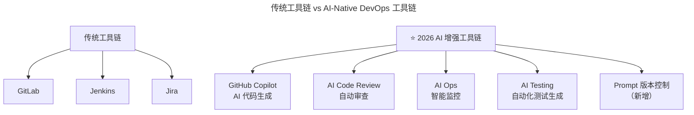

# 第177讲 | 胡键：创业公司如何打造高凝聚力高绩效的技术团队：工具篇

> **适用范围**：创业公司 CTO、技术合伙人、技术团队负责人，以及需要搭建研发基础设施、设计薪酬与团队管理辅助工具的早期创业者。
>
> **更新摘要（v2 · 2026-08 更新）**：
> - 结构化升级为 6 节骨架（导言 / 核心方法论 / 关键流程 / 工具与实战 / 常见误区 / 进阶延展）
> - 保留原文"基础设施（版本控制/问题跟踪/持续集成/部署流水线）""经济手段""复盘""团队建设""新陈代谢"四大辅助工具
> - 将"AI 时代升级注解（2026）"统一融入进阶延展，补充 AI-Native DevOps 工具链与"经济手段"AI 时代新解
> - 补充 Mermaid 图标题与图后解读

## 1. 导言

正如一个成功的系统除了有好的架构和关键对象设计外，还需要有清晰明确的协作系统和好用的辅助工具一样，要想打造成功高效的组织也离不开好的基础设施和必要的辅助工具。本文承接"组织篇"，聚焦基础设施与团队管理辅助工具，探讨创业公司如何用工具保障高凝聚力高绩效团队的落地。

## 2. 核心方法论

### 2.1 基础设施：研发过程的自动化底座

选好团队带头人是否就万事大吉了呢？当然不是！你还得提供相应的基础，为这些带头大哥的工作提供支持，同时也要保证不同大哥之间能够相互配合，合作无间。前文谈到的三观测试只是解决了主观层面的问题，保证大家性情相投，愿意合作共事。但这还不够，为了给我们的事业提供多一份保障，还需要客观层面的基础设施。

这些基础设施典型包括：**版本控制、问题跟踪、持续集成、部署流水线**。它们为整个公司的开发过程提供了自动化的基础，同时也通过各个系统将开发实践和要求固化，保证整个开发团队都按照同一标准去做事和协作。

### 2.2 团队管理辅助工具四件套

#### 经济手段

虽说谈钱很俗，但这是一个绕不过的话题，因为它将兑现你所有的"待人诚意"。就我的做法而言：

- 结合行业标准和个人能力来评定，工作年限只作为参考。比如，某人号称在某领域中有 3 年工作经验，但经考察发现其只有 1 年工作经验，后两年只不过是重复前面的经验毫无进步，此时只能等同 1 年工作经验来对待了。
- 基本工资和绩效工资相结合，多劳多得，但此处的"多劳"并不单指"工作时长"，更侧重"工作结果"。在实际操作过程中，可以让绩效工资远超基本工资，同时跟项目的贡献度挂钩。

另外，我不建议开出超待遇的条件，即使你非常希望候选人加入。一方面是没有必要，因为这个世界总能找到替代品；另一方面，单纯靠金钱吸引过来的人往往是最早离开的。

#### 复盘

复盘一词的本质是客观地按时间线复现关键动作，最终进行总结。在敏捷方法中，则落实到：好的实践（应该发扬）和坏的实践（应该避免）。我个人比较喜欢这种不那么正式的方式，简单有效，如果能持之以恒，累积效果会很惊人。但假若急于求成，一次想改进的东西太多，则可能造成期望和实际落差太大，适得其反。

#### 团队建设

团队建设的方式依据公司所处的阶段不同而不同。对于刚起步的公司，吃吃喝喝可能就够了。至于上规模的公司，选择面就更多了。但总的原则仍然不变：促进团队合作，提高大家彼此的认同感。

#### 新陈代谢

关于人员管理，我只想强调几点：

- 第一，尽快淘汰不认可公司价值观的员工，不论职位高低。因为他们的存在对于整个团队士气有不可估量的后果，职位越高，后果越严重。
- 第二，对于希望挽留的员工，考虑感情留人、事业留人和待遇留人。但说实话，很多时候这已经属于事后补救措施，效果有限。
- 第三，新挑战是除了经济手段之外最好的激励手段。这些新挑战在我看来有两种：一种是在项目中尝试新技术；另一种则是采用老技术将项目升级到新形态。

## 3. 关键流程

### 3.1 基础设施搭建流程（以 GitLab + Jenkins 为例）

以我们公司为例，目前所有的研发都围绕 gitlab + Jenkins 的方式完成：

- 每一项任务（feature 或 Bug）都会有相对应的 issue，对于每类 issue 有建议但非强制的格式要求。
- 代码管理则采用"主/从库"结构，所有开发将各自代码以 Merge Request 的方式向主库提交。对于每个 MR，会先经过自动化测试流水线，成功之后，经专人 Review 合并，正式版本只从服务器的主库编译产生。
- 代码要求写自动化单元测试，同时有建议非强制的 git log 格式，但强制要求在提交时关联对应的 issue 号。
- 对于涉及数据库的后端，要求提供 DB Migration 脚本，促进发布和测试的自动化。
- 分支模型采用"branch-per-feature"模式，但 Merge Request 只向主库的 Master 分支提交，并且只从 Master 分支编译。
- 集成流水线围绕 jenkins 打造，也有团队直接使用 gitlab 的 pipeline，主要完成：自动化测试（发生在 MR 时和合并进入主库后）和部署（人工触发）。
- 由于 gitlab 本身也支持 wiki，开发相关的琐碎事项可以直接写入到此，但从可维护性角度来讲，我们倾向于将其直接作为项目文档纳入到版本控制中来。

### 3.2 从第一天就抓起的纪律

这里我再强调一遍，不要以创业公司人少好协调为借口，将这些本该从公司创立第一天就做的事情一拖再拖。在我看来，这种事情恰恰就应该从人少的时候抓起，从一开始就培养好团队的优良习惯，再将后来者不断同化。如果等到人多的时候再做，反而成本更高，推进更慢，因为"人多嘴杂"。

## 4. 工具与实战

### 4.1 薪酬机制设计实践

基本工资和绩效工资相结合的薪酬机制有点类似销售市场的模式，好处显然易见，就是工资直接与公司的财务状况挂钩，避免团队内部出现"南郭先生"，能撑下来的不论从心态还是从能力来看都可谓强大。当然，不利之处也很突出，容易引起某些研发人员的误解和反感。但是，创业公司招人不就是一个认同和被认同的过程么？相比起所得的好处来讲，一点点误解和反感不算什么，只要能够在后续的工作中持续让大家拿到满意的薪资，建立了信任感和信心，其余的问题都好解决。

### 4.2 创业公司吸引人才的非薪资策略

鉴于创业公司永远都处于资金紧张的状态，创始人更应该去用心琢磨公司的业务和前景，以此为王牌去帮助公司吸引各式各样的人才。摆在眼前的一个耳熟能详的例子就是当年蔡崇信放下上百万年薪跟着马云只拿 500 块钱工资一起创业的故事。

- 创业公司永远都处于资金紧张的状态。如果拿薪资跟其他大公司硬碰硬，是以己之短对他人之长。
- 所谓的超待遇一词仅限于薪资而言，而对于候选人本身擅长的领域，当许以充分的自由度。而这种自由度往往是大公司体制下无法获得的，恰恰是创业公司之长。
- 创业公司吸引人才不能不谈待遇，但也不能光谈待遇。只要创始人魅力足够，公司的愿景足够诱人，吸引合适的候选人并非困难。

### 4.3 新挑战的两种类型

| 新挑战类型 | 描述 | 技术人员重视度 |
|-----------|------|--------------|
| **在项目中尝试新技术** | 引入新的技术栈解决业务问题 | 重视有加 |
| **采用老技术将项目升级到新形态** | 例如将硬编码业务逻辑重构为"基础平台 + 业务实施平台" | 重视不足 |

技术人员往往对第一种重视有加，但对于第二种重视不足。第二种恰恰是创业公司从早期走向规模化必经的工程能力升级。

## 5. 常见误区

1. **以人少好协调为借口推迟搭建基础设施**：这种事情恰恰应该从人少的时候抓起，等到人多的时候再做成本更高、推进更慢。
2. **开出超待遇条件吸引人才**：单纯靠金钱吸引过来的人往往是最早离开的；创业公司应以业务前景和自由度为王牌。
3. **薪酬只看工作年限**：有人号称 3 年经验但后两年只是重复第一年的经验，应等同 1 年经验对待。
4. **复盘一次想改进太多**：急于求成会造成期望和实际落差太大，适得其反，应持之以恒、小幅迭代。
5. **不淘汰不认可价值观的员工**：他们的存在对团队士气有不可估量的后果，职位越高后果越严重。
6. **只重视新技术尝试忽视老技术升级**：采用老技术将项目升级到新形态（如硬编码重构为平台化）是创业公司工程能力升级的关键，但常被忽视。
7. **生搬硬套其他公司的方法**：没有最好，只有最适合，各个公司有各个公司的企业文化和发展历史，所有其他公司的组织结构和搭建方法都只是参考。

## 6. 进阶延展

### 6.1 基础设施的 AI 时代升级

2026 年，GPT-5.5 发布，DeepSeek V4 国产大模型崛起，84% 开发者已将 AI 编程作为日常工作方式，Agent（智能代理）进入加速落地期，人机协作成为新常态。胡键老师的"工具篇"在 AI 时代需要全面升级——**不仅是传统 DevOps 工具，更要加入 AI-Native 工具链**。

上图在原文 GitLab + Jenkins + Jira 工具链的基础上，叠加 AI 代码生成、AI Code Review、AIOps、AI Testing 与 Prompt 版本控制五类新工具。2026 年的创业公司基础设施应该从第一天就包含 AI 工具，这不再是"可有可无"而是"必不可少"。

### 6.2 新增基础设施对照

| 类别 | 传统工具 | ⭐2026 AI 增强工具 |
|------|---------|-------------------|
| **代码生成** | 手写代码 | GitHub Copilot / Cursor |
| **代码审查** | 人工 Review | AI Code Review + 人工复审 |
| **问题定位** | 日志分析 | AI 日志分析 + 根因定位 |
| **文档生成** | 手写文档 | AI 自动生成 + 人工完善 |
| **测试** | 手写测试用例 | AI 生成测试用例 + 自动执行 |

### 6.3 "经济手段"的 AI 时代新解

| 评估维度 | 传统标准 | ⭐2026 新标准 |
|---------|---------|-------------|
| **工作经验** | 工作年限 | **有效 AI 使用年限 > 总工作年限** |
| **技术能力** | 技术栈掌握度 | **AI 工具熟练度 + Prompt 工程质量** |
| **产出效率** | 代码行数/功能点 | **人机协同产出 / 纯人工产出** |
| **学习能力** | 自学新技术速度 | **AI 技术跟进速度 + 应用能力** |

### 6.4 2026 年行动清单

**本月搭建**：

1. **AI 工具标准化**：统一配置 Copilot/Cursor/Windsurf；建立团队 Prompt 模板库；制定 AI 输出质量标准。
2. **CI/CD 流水线 AI 化**：加入 AI Code Review 环节；加入 AI 自动化测试生成；监控 AI 辅助产出占比指标。
3. **重新设计绩效评估**：新增 AI 能力评估维度；调整从"写多少代码"到"创造多少价值"。

### 6.5 核心结论

胡键老师的"工具篇"在 AI 时代需要全面升级——**不仅是传统 DevOps 工具，更要加入 AI-Native 工具链**。2026 年的创业公司基础设施应该从第一天就包含 AI 工具，这不再是"可有可无"而是"必不可少"。

### 6.6 作者简介

胡键，上海圭步 CTO，TGO 鲲鹏会会员，前 InfoQ 中文站 SOA 社区首席编辑。超过 15 年软件研发经验，先后任职于中兴和 SAP，现专注于工业物联网创业，具有丰富的产品研发和项目实施经验，擅长围绕设备资产和生产管理提供物联网端到端解决方案。他同时还是 CSM 和活跃的社区活动组织者，在西安组织过多场 HiBlock 区块链技术社区活动并做分享。
