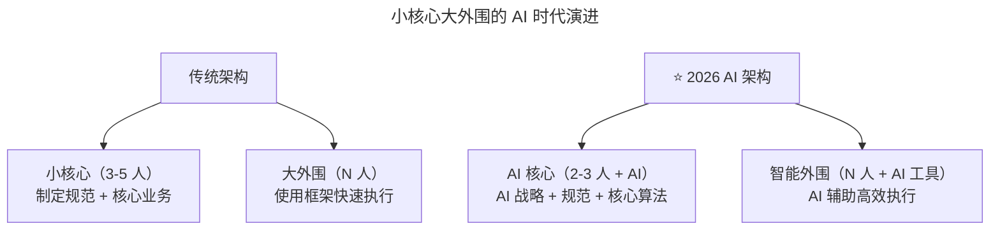

# 第176讲 | 胡键：创业公司如何打造高凝聚力高绩效的技术团队：组织篇

> **适用范围**：创业公司 CTO、技术合伙人、技术团队负责人，以及需要设计团队架构、选拔带头大哥的技术管理者。
>
> **更新摘要（v2 · 2026-08 更新）**：
> - 结构化升级为 6 节骨架（导言 / 核心方法论 / 关键流程 / 工具与实战 / 常见误区 / 进阶延展）
> - 保留原文"小核心大外围"团队架构与"带头大哥三观测试（价值观/团队观/技术观）"核心方法论
> - 将"AI 时代升级注解（2026）"统一融入进阶延展，补充"AI 增强核心 + 智能外围"的组织演进
> - 补充 Mermaid 图标题与图后解读

## 1. 导言

就团队架构而言，打造一个成功的组织与搭建一个系统有异曲同工之妙：团队架构相当于架构范式，带头大哥则相当于系统内的关键对象。本文将从团队架构和带头大哥两个维度，探讨创业公司如何打造高凝聚力高绩效的技术团队。

## 2. 核心方法论

### 2.1 "小核心大外围"团队架构

我倾向于"小核心大外围"。其中的小核心主要由全职精英人员组成，大外围则可以由兼职或全职非精英人员构成。这里的精英其实没有那么严格，站在公司立场上来讲，更多是指那些认同公司价值观、打过硬仗的员工。这样的组织结构具有天然的优势，非常适合创业公司：

- **第一，管理成本低，执行效率高**：从管理上来讲，只需要重点管理小型核心团队即可。
- **第二，模范带头作用**：核心成员给外围团队起到了模范带头作用，让外围队员更有目标，激励他们向核心区靠拢。而且，即使部分外围人员没有意愿这样做，对于公司来讲，并没有什么损失。
- **第三，严进宽出，控制人数**：明确人才战略，有效控制公司的全职员工总人数，同时获得不错的生产力。

这种结构建立在两层团队明确的分工基础之上：**核心团队制定规范，外围队伍负责执行**。从公司的角度来看，尽量安排核心团队干附加价值高的事情，低附加值的事情则交由外围队伍完成。

### 2.2 带头大哥的三观测试

俗话说，"兵熊熊一个，将熊熊一窝"。对于这样的一位带头大哥，我的要求很简单：**与公司三观一致**。这里的三观指的是，价值观、团队观和技术观。

#### 价值观

如果价值观不一致，而你又恰好招到了一位充满领导魅力的大哥，那无疑是危险的。在考虑候选人时，首先需要考虑的就是候选人的价值观是否跟公司保持一致。具体到操作层面，我的建议是，你必须能很明确地将公司的价值观总结成一句话或口号，想尽办法让候选人高度认同它。

#### 团队观

大多数人都认为"带头大哥必须是技术水平最高的那位"，而我个人并不赞同。就团队观而言，我主要考察候选人的以下几个方面：

1. **团队调动能力**：是否有能力让整个团队拧成一股绳、劲往一块使。
2. **良好的方向感**：有能力判断当前做的事情是否符合公司的战略方向，分清楚事情的先后缓急。
3. **外部协调能力**：是否有能力获取外部支援以及在外部团队需要配合时能有效地支援对方。
4. **团队教育能力**：是否有能力让团队出现更多优秀的领导者或工程师，培育团队相互教育的环境和土壤。
5. **团队搭建能力**：是否有能力引贤聚能，为团队和公司招到合适的队员。

#### 技术观

在三观之中，技术观之所以会排在最后，是因为这三观暗含了这样的顺序：公司层面、团队层面和个人层面。对其技术观的考察不会落到具体的技术细节上，而在于：

- 是否能接受不同的技术偏好？
- 是否能有效地将技术和业务结合起来思考问题？
- 是否具备一定的技术视野和前瞻性？
- 是否有能力将想法落地实施？
- 是否具备总结能力，能将经验固化到代码中？
- 是否有方法论的指导？

## 3. 关键流程

### 3.1 团队架构的公平对待

虽然客观上"小核心大外围"这种结构会造成双方心态的不对等，但作为管理者，需要做到公平对待：

1. 符合要求的外围队员可以进入核心团队；
2. 核心团队犯错，绝不姑息；
3. 在资源允许的情况下，为双方提供一致的机会，比如培训；
4. 刻意促进双方交流，加强相互了解，找机会增进双方感情，比如聚餐或踢球等团体活动；
5. 核心团队对于外围团队的意见和反馈需要重视，同时不定期选派核心成员和外围队员共同完成某项任务，帮助不断打磨基础框架和组件。

### 3.2 带头大哥的选拔流程

团队架构决定之后，接下来就是决定各个团队带头大哥的人选。选拔流程遵循"三观测试"递进考察：先验证价值观一致性（不是一家人不进一家门），再考察团队观（带头大哥的软实力），最后看技术观（个人层面的技术与业务结合能力）。这个顺序对应"公司层面 → 团队层面 → 个人层面"的优先级。

## 4. 工具与实战

### 4.1 团队架构与系统架构的类比

打造一个成功的组织也是如此：

- **团队架构相当于架构范式**：选定合适的团队架构不仅要求管理者思考清楚人员分工协作，同时也要求管理者思考清楚自己的人才战略，明确自己当前最需要的人才，以便在一定的成本之下建立相对优化的人才结构。
- **带头大哥则相当于系统内的关键对象**：他或她的确定除了个人能力之外，还需确保三观测试得以通过，以便能在当前公司的组织架构之下起到其应该发挥的作用。

### 4.2 核心团队与外围团队的分工实践

| 团队类型 | 职责 | 附加价值 |
|---------|------|---------|
| **核心团队** | 制定规范和核心业务逻辑，通过自研基础框架和组件将知识和要求固化 | 高 |
| **外围团队** | 使用核心团队开发的框架和组件，快速实施 | 低 |

用一句话来概括就是：**核心团队制定规范，外围队伍负责执行**。

## 5. 常见误区

1. **带头大哥必须是技术水平最高的**："技能第一"对于带领技术团队来讲并不是优势，反而常常会带来个人意愿、技能偏见、人身攻击、思维局限等障碍。
2. **价值观不一致但能力强也敢用**：招到一位充满领导魅力但价值观不一致的大哥是危险的，历史上类似下克上的事情并不少见。
3. **外围团队只管执行不需要关怀**：会造成双方心态不对等，需做到公平对待，提供上升通道。
4. **核心团队犯错也姑息**：核心团队犯错必须同样追责，否则会破坏公平性。
5. **技术观考察落到具体技术细节**：带头大哥的技术一般不会太差，技术观考察应聚焦于技术视野、业务结合、总结能力等更高维度。
6. **妄想一步到位搭建组织**：和软件架构一样，组织的结构也需要根据组织本身的发展不断进化，在不同阶段需要采用不同的结构。

## 6. 进阶延展

### 6.1 "小核心大外围"的 AI 时代演进

2026 年，GPT-5.5 发布，DeepSeek V4 国产大模型崛起，84% 开发者已将 AI 编程作为日常工作方式，Agent（智能代理）进入加速落地期，人机协作成为新常态。原文的"小核心大外围"在 AI 时代升级为"**AI 增强核心 + 智能外围**"。

上图展示了组织架构的 AI 时代演进：核心团队从"3-5 人制定规范"压缩为"2-3 人 + AI 制定 AI 战略"，外围团队从"使用框架执行"升级为"使用 AI 工具 + 框架高效执行"。AI 让核心更小更强，让外围更智能更高效。

### 6.2 新分工模式

| 团队类型 | 传统职责 | ⭐2026 职责 |
|---------|---------|------------|
| **核心团队** | 制定规范、核心逻辑 | **AI 战略、Prompt 规范、Agent 设计** |
| **外围团队** | 使用框架执行 | **使用 AI 工具 + 框架高效执行** |

### 6.3 2026 年行动清单

**组织优化**：

1. **重新定义"核心"**：核心能力标准 = 业务理解 + AI 能力 + 架构思维；核心人数建议 2-3 人 + AI 工具 = 传统 5-8 人的产出。
2. **为外围团队配备 AI**：统一配置 AI 编程工具；建立 Prompt 模板库；定期培训 AI 使用技巧。
3. **促进核心-外围 AI 协同**：核心团队输出 AI 规范、最佳实践；外围团队反馈 AI 使用问题、效率数据。

### 6.4 核心结论

胡键老师的"小核心大外围"组织架构在 AI 时代更加有效——**AI 让核心更小更强，让外围更智能更高效**。2026 年的创业公司可以用更少的人做更多的事，关键在于建立"AI Native"的组织架构。

### 6.5 作者简介

胡键，上海圭步 CTO，TGO 鲲鹏会会员，前 InfoQ 中文站 SOA 社区首席编辑。超过 15 年软件研发经验，先后任职于中兴和 SAP，现专注于工业物联网创业，具有丰富的产品研发和项目实施经验，擅长围绕设备资产和生产管理提供物联网端到端解决方案。他同时还是 CSM 和活跃的社区活动组织者，在西安组织过多场 HiBlock 区块链技术社区活动并做分享。
