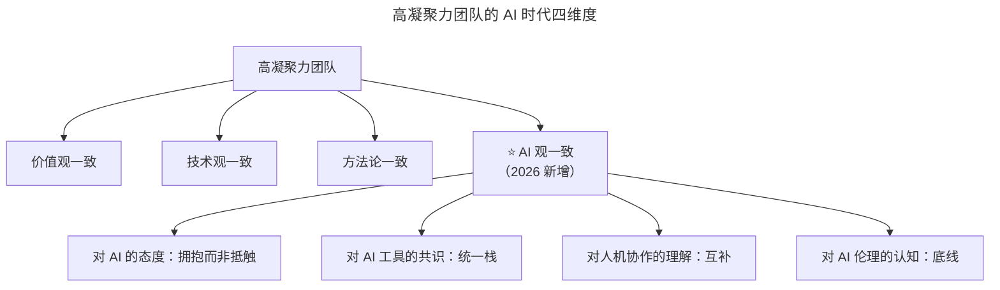

# 第160讲 | 胡键：创业公司需要高凝聚力高绩效的技术团队

> **适用范围**：创业公司 CTO、技术合伙人、技术团队负责人，以及希望在残酷市场中打造高凝聚力高绩效技术团队的早期创业者。
>
> **更新摘要（v2 · 2026-08 更新）**：
> - 结构化升级为 6 节骨架（导言 / 核心方法论 / 关键流程 / 工具与实战 / 常见误区 / 进阶延展）
> - 保留原文"高凝聚力三方面一致（价值观/技术观/方法论）""高绩效三特质（高执行力/自我进化/做对的事情）"核心框架
> - 将"AI 时代升级注解（2026）"统一融入进阶延展，补充"AI 观一致"第四维度与 AI 互助文化实践
> - 补充 Mermaid 图标题与图后解读

## 1. 导言

大多数人对于创业公司需要拥有一支高绩效的团队毫无疑问，但在我看来，它还有一个前提：**高凝聚力**。作为创业公司，为了能在残酷的市场上生存下来，它必须高度聚焦、反应迅速，作为其技术支撑的团队如果缺乏凝聚力必然导致迟疑、浪费和抗压能力差三种现象发生。本文将系统探讨什么样的队伍是高凝聚力的技术队伍，以及什么样的队伍是高绩效的技术队伍。

## 2. 核心方法论

### 2.1 高凝聚力团队的三方面一致

我认为高凝聚力的技术队伍至少要达到三个方面的一致：**价值观、技术观和方法论**。

#### 价值观

就价值观而言，我看中的主要是：

- 团队拥有一致的对错观；
- 团队对自己有高标准的要求；
- 团队内部对协作保持一种开放心态。

第三条可以简化成：我为人人，人人为我。由于软件开发是一种团队协作，只有构成产品的每一部分都完成了，整个产品才算完成。我观察到两种类型的团队：第一种大家自扫门前雪，团队协作靠上游拉动；第二种大家除了干好本职工作，同时也会在力所能及的前提下帮助需要帮助的小伙伴。后者团队的协作要比前者好得多，并带来效率提升（知识在团队内流动）和团队认同感（"我们的产品"而非"这不是我的工作"）。

#### 技术观

就技术观而言，我会要求团队管理者做到三个方面的一致性：**平台、架构和工具**。在一段时间内，从众多技术选择中认定一种，并坚持下去。拥有一致的技术观，会让团队更关注于解决问题，而不是去对技术挑三拣四、朝秦暮楚，并且也有利于团队的技术积累，进而带来更高的绩效。

#### 方法论

如果说价值观统一了团队的意识，技术观统一了团队的工具，那么方法论则起到了统一团队做事方式的目的。不论采用何种方法论，有一点是关键的：坚持一种，就是整个公司的技术研发都采用一种。这种方式虽然有点独裁，但放在创业公司的背景下不无道理：创业公司的人手本就不足，人员很有可能会在团队间来回切换，拥有同样的方法论可以让这一过程更平滑一些。

### 2.2 高绩效团队的三特质

高绩效的队伍特点有很多，但我个人看重的就三条：**高执行力、自我进化能力和做对的事情**。

- **高执行力**：除了通常所说的"指哪打哪、说到做到"之外，还有一个我个人比较看重的特质，即自我驱动力。它是一切高绩效队伍或高效个人的基础。反映在具体事项上就是主动，而非被动等着分配任务。
- **自我进化能力**：反映出一个现实：创业公司早期能吸引到的人和它想要的人并不匹配。团队的自我成长能力就显得很关键了。自我进化能力不仅仅体现在技术上，同时还体现在技术管理、架构发展、方法论等方方面面。
- **做对的事情**：什么是"对的事情"？在每个阶段可能含义并不一样。在原型还没有出来就考虑高并发架构显然是一个错误的行为。方向对了，事半功倍；反之，则事倍功半。

## 3. 关键流程

### 3.1 从高凝聚力到高绩效的升级路径

只要技术队伍的资质过得去，从高凝聚力的队伍升级到高凝聚力高绩效的队伍并不算太难，因为创业本身也是不断发展的过程，刚开始对于技术技能的要求算不上太高。而反过来，由高绩效升级到高凝聚力可就没有那么容易了。正如电影《天下无贼》中葛优所说"人心散了，队伍不好带了。"

### 3.2 凝聚力缺失的三种现象

作为创业公司，如果技术团队缺乏凝聚力，必然导致三种现象发生：

1. **迟疑**：小到不认同公司选择的技术架构，大到甚至不认同公司的目标，进而导致整个队伍缺乏行动力，严重时导致队伍出现逃兵，对整个生产力和士气打击巨大。
2. **浪费**：过于多样化的团队在创业公司早期并不可取，它很容易分散团队的精力，在不重要的事情上浪费时间，而在真正重要的工作上却没有取得任何实质性的进展。
3. **抗压能力差**：创业是条艰险的道路，很少有一帆风顺。如果没有很强的向心力，队伍很容易就会出现负面心态，导致怨天尤人，不能真正面对问题，在公司需要大家携手共渡难关之时，队伍反而分崩离析。

## 4. 工具与实战

### 4.1 统一技术观的实践：以 IDE 为例

拥有一致的技术观，会让团队更关注于解决问题。以 IDE 为例，开发队伍采用同样的 IDE 有以下这些好处：

- 统一 IDE 设置，如 TAB 键对应 4 个空格还是 8 个或者根本不做变化，这样使得代码格式在不同机器间得以统一。
- 统一编码习惯，因为同一 IDE 的快捷键往往一致，当开发者之间相互结对编程时，不会因为换了机器而觉得不顺手。
- 规避了法律风险，比如有人采用盗版的付费 IDE，而作为管理者却完全不知情。

### 4.2 协作模式的两种类型对照

| 协作类型 | 表现 | 效果 |
|---------|------|------|
| **自扫门前雪型** | 出了问题由最上游逐一往下排查 | 效率低，知识不流动，缺乏团队认同感 |
| **主动互助型** | 出了问题相关人员一起帮助排查 | 效率高，知识流动，形成"我们的产品"认同感 |

后者还带来额外好处：有利于培养团队认同感，团队相关成员会认为自己是团队的一份子，这种团队认同感恰恰是高凝聚力团队不可或缺的一部分。

## 5. 常见误区

1. **先追求高绩效再追求高凝聚力**：由高绩效升级到高凝聚力非常困难，正确顺序是先凝聚力后绩效。
2. **技术观追求多样化**：过于多样化的团队在创业公司早期并不可取，容易分散精力。应在平台、架构、工具上坚持一种。
3. **方法论频繁切换**：Scrum、KANBAN 等流派之间频繁切换会让团队无所适从，应坚持一种方法论。
4. **忽视自我驱动力**：不主动的员工即便能完成本职工作，也是公司战斗力的浪费，且很难对公司的目标有认同感。
5. **用"没功劳也有苦劳"的标准评判**：低效者看起来每日忙忙碌碌，是团队战斗力不良的关键因素，不能被"苦劳"迷惑。
6. **不分阶段做"对的事情"**：原型阶段就考虑高并发架构是错误行为，产品得到市场考验后只关注功能不关注架构同样不对。

## 6. 进阶延展

### 6.1 高凝聚力团队的 AI 时代新维度

2026 年，GPT-5.5 发布，DeepSeek V4 国产大模型崛起，84% 开发者已将 AI 编程作为日常工作方式，Agent（智能代理）进入加速落地期，人机协作成为新常态。原文核心"价值观、技术观、方法论三方面一致"需要新增第四个维度：**AI 观**。

上图在原文三维一致的基础上新增"AI 观一致"维度，涵盖对 AI 的态度、工具共识、人机协作理解和伦理认知四个子项。2026 年的高凝聚力团队不仅是价值观和技术观的统一，更是人机协同理念的统一。

### 6.2 "我为人人，人人为我"的 AI 版本

| 协作类型 | 传统表现 | ⭐2026 AI 增强表现 |
|---------|---------|-------------------|
| **知识共享** | 口头传授经验 | **共享 Prompt 模板、AI 工作流** |
| **问题排查** | 一起定位 Bug | **AI 辅助定位 + 人类确认** |
| **代码审查** | 人工 Code Review | **AI 初审 + 人类复审** |
| **文档撰写** | 各写各的 | **AI 生成初稿 + 人类完善** |

### 6.3 2026 年行动清单

**打造 AI 时代高凝聚力团队**：

1. **建立"AI 观"共识**：团队讨论"我们如何使用 AI"；制定 AI 使用规范和标准；承诺不歧视不用 AI 或过度依赖 AI 的人。
2. **创建"AI 互助文化"**：每周分享 1 个 AI 使用技巧；建立"AI 问题求助"渠道；表彰 AI 协作最佳实践。
3. **量化凝聚力指标**：知识分享频率（含 AI 知识）、跨角色协作次数、AI 工具使用均衡度。

### 6.4 避坑指南（2026 新增）

| 坑 | 表现 | 解决方案 |
|----|------|----------|
| **AI 分化** | 用 AI 的人 vs 不用 AI 的人形成对立 | 建立 AI 学习伙伴制度 |
| **技术孤立** | 各用各的 AI 工具，无法协作 | 统一 AI 工具栈 |
| **效率至上** | 只追求 AI 效率忽视团队氛围 | 效率 + 情感双轨考核 |

### 6.5 核心结论

胡键老师的"高凝聚力 + 高绩效"理论在 AI 时代需要加入"AI 观一致"这个新维度。**2026 年的高凝聚力团队不仅是价值观和技术观的统一，更是人机协同理念的统一**。记住：AI 可以提升效率，但只有人类的协作才能创造真正的凝聚力。

### 6.6 作者简介

胡键，上海圭步 CTO，TGO 鲲鹏会会员，前 InfoQ 中文站 SOA 社区首席编辑。超过 15 年软件研发经验，先后任职于中兴和 SAP，现专注于工业物联网创业，具有丰富的产品研发和项目实施经验，擅长围绕设备资产和生产管理提供物联网端到端解决方案。他同时还是 CSM 和活跃的社区活动组织者，在西安组织过多场 HiBlock 区块链技术社区活动并做分享。
