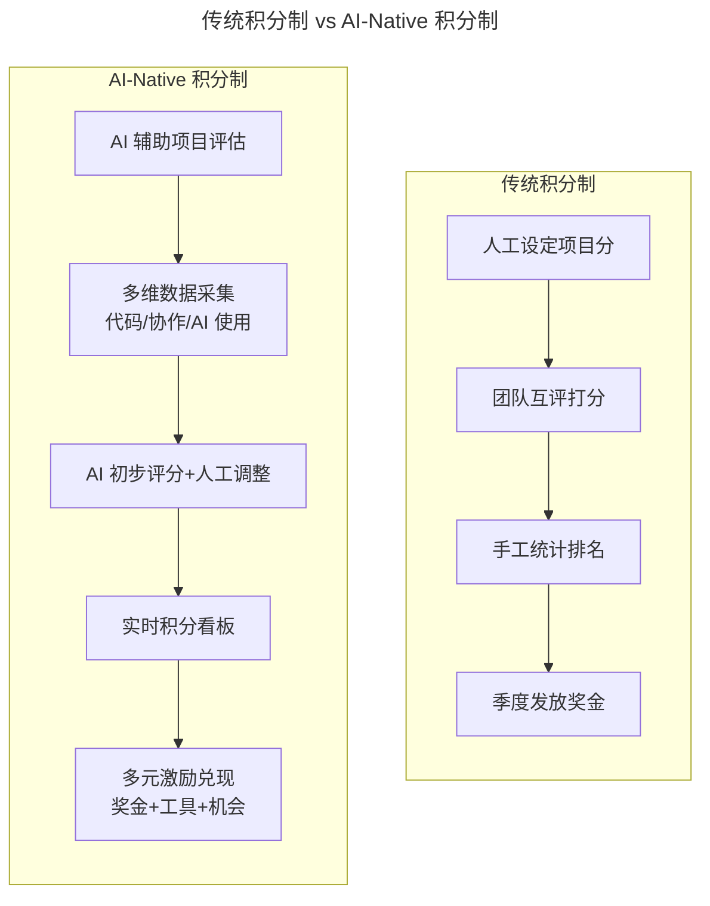

# 第43讲 | 通过积分考核提升技术团队的绩效

> **适用范围**：CTO、技术 VP、项目型组织负责人，以及希望用积分制综合 OKR 与 KPI 优点来考核技术团队的管理者。
>
> **更新摘要（v2 · 2026-08 更新）**：
> - 结构化升级为 6 节骨架（导言 / 核心方法论 / 关键流程 / 工具与实战 / 常见误区 / 进阶延展）
> - 保留原文"任职资格标准与 OKR 为何不适合考核""项目积分设定""个人积分评定""积分排名与奖金分配""实施阻碍"完整方法论
> - 将"AI 时代升级注解（2026）"统一融入进阶延展，补充 AI-Native 积分制与 AI 协作积分维度
> - 补充 Mermaid 图标题与图后解读

## 1. 导言

技术团队考核一向是个大难题，合理的考核机制加上奖励制度，能极大激发团队成员的热情，提升团队效率，而不合理的考核机制，却往往会造成团队缺乏热情，高手离职、庸人留下的严重后果。今天，我想跟大家分享一个综合了不同考核方法优点的方法——**积分制**。

## 2. 核心方法论

### 2.1 为什么任职资格标准和 OKR 不适合做考核

在聊积分制之前，我想先说一下，为什么我认为"任职资格标准"和"OKR"这两种人力资源方法并不适合作为技术团队的考核方法。

**任职资格标准——技术人员的晋升通道**。很多公司已经实施了任职资格标准，通过任职资格标准给技术员工进行评级，让技术人员在公司内有明确的晋升通道，解决的是员工持续发展的问题。因此，虽然这种方法对员工有一定的激励作用，但却不足以用来刺激员工或团队提升效率。因为每人起点不一样，有的员工想半年晋一级，有的员工觉得两年晋一级就不错呢。

**OKR——聚焦员工和团队的工具**。我们可以给团队设定相对单一的目标（O），而在这个目标下最多分解不超过 3 个关键结果（KR）。那为什么 OKR 不适合做考核呢？因为在实际操作中，有人喜欢挑战，KR 设得高却可能得不到高分，有人保守，KR 设的很低，不需要努力都能达到。如果把 OKR 作为考核工具，必然结果是每个人都去设定没有挑战的目标，这非常不利于团队的激励，也偏离了 OKR 管理的初衷。

### 2.2 积分制的核心机制

积分制适合于项目型组织，在这个组织里，一切都可以转化为不同类型的项目。其核心机制包括：

- **项目积分**：管理层首先要对项目进行重要性排序或者打分。与此同时管理层还需要给每个项目设定 1-3 个量化的目标，为目标设定卓越线和及格线。
- **个人积分**：项目得分如果参考量化标准，是比较容易打分的，但个人打分是一件十分困难的事情。作为技术管理者，你可以把打分的权利完全授权给团队，让他们根据对目标的贡献度互相进行打分。
- **积分排名**：不同的公司可以按照以上的规则进行季度排名和年底最终排名。

## 3. 关键流程

### 3.1 项目积分的设定

管理层首先要对项目进行重要性排序或者打分。根据项目的规模，这个活动可以每个季度执行一次，也可以每个月执行一次。与此同时管理层还需要给每个项目设定 1-3 个量化的目标，为目标设定卓越线和及格线。

如果一个项目目标都达到卓越，那么最终每个成员的项目得分都是满分。例如，参与"盘古"项目的成员，项目上线后 1 个月内统计数据显示产品 7 日留存率提升到了 39.7%，崩溃率降到了 0.19%，那么所有参与该项目的成员都能拿到项目分的满分 5 分。

### 3.2 个人积分的评定

项目得分如果参考量化标准，是比较容易打分的，但个人打分是一件十分困难的事情。作为技术管理者，这个时候就到了体现你智慧的时刻，你可以把打分的权利完全授权给团队，让他们根据对目标的贡献度互相进行打分。你可以给定一个总分数和两条打分原则：1. 不能均分；2. 按照每人对目标的贡献度进行打分。

总分的范围为团队人数×项目系数，而项目系数从 1-5，越早上线的项目系数越大，从而激励团队尽早完成项目和上线使用。还是以"盘古"项目为例，项目提前 2 周上线，那么项目系数为 4，同时项目人数 10 人，那么我们可以设定团队的总分为 10×4=40 分，这 40 分分给团队让团队进行自己打分，个人最多 5 分，最少 1 分。这个打分过程由于不能平均，每个人又都按对目标的贡献进行打分，所以会相对公平一些。如果你在这个项目中得到了 5 分，那么你在这个项目的期间段个人积分就是项目分×个人分，也就是 5×5=25 分。

### 3.3 积分季度排名和年底排名

年初管理层应该根据预测的业绩设置一个奖金包，这个奖金包就是发放的基础。奖金倍数的计算是根据员工积分进行的，积分的导向就是尽量拉开差距，不搞平均主义。可以设定积分排名前 20% 的人按 4-8 倍系数发放奖金，后 20% 的人不发奖金，中间 60% 的人能拿到 1-2 倍系数奖金。

需要注意的是，中层经理不参与积分，如果要考核中层，可以参考 360 度考核法。最后，需要在试用第 1 年后汇总员工的建议，并根据反馈将以上的考核方案形成制度，然后通过人力资源部和 CTO 两个渠道下发给员工。

## 4. 工具与实战

### 4.1 项目系数表（以 3 个月项目周期为例）

| 项目上线情况 | 项目系数 | 说明 |
|-------------|---------|------|
| 提前 4 周以上 | 5 | 激励尽早交付 |
| 提前 2 周 | 4 | 盘古项目案例 |
| 按时上线 | 3 | 基准 |
| 延期 2 周内 | 2 | 需关注 |
| 延期 2 周以上 | 1 | 需复盘 |

### 4.2 奖金分配速查

| 积分排名 | 奖金系数 | 说明 |
|---------|---------|------|
| 前 20% | 4-8 倍月薪 | 激励核心贡献者 |
| 中间 60% | 1-2 倍月薪 | 保障大多数 |
| 后 20% | 0 倍 | 不搞平均主义 |

在这种体制下，如果你月薪 20000，排名第一，就可以拿到 20000×8=160000 年终奖金。

### 4.3 积分制的综合优势

积分考核综合了 KPI 和 OKR，鼓励做有价值的项目，鼓励在项目中有卓越的和目标相关的表现，同时还导向项目及早上线。作为技术管理者或者 CTO，团队效率的提升是首要考虑的事情，当你还是一个小团队时，可以撸起袖子加油干，而随着团队的扩大，就需要建立适当的规则再用公司情怀来激励。团队再大一些，再讲情怀已经没用了，务实一些就需要建立合适的考核制度。

## 5. 常见误区

1. **把 OKR 当考核工具**：OKR 作为考核工具必然导致员工设定没有挑战的目标，偏离 OKR 管理初衷。
2. **用任职资格标准刺激效率**：任职资格标准解决的是员工持续发展问题，不足以刺激效率提升。
3. **个人积分允许均分**：均分会失去拉开差距的激励效果，必须按贡献度打分且不能均分。
4. **奖金包太小**：最少也要有技术团队 2 倍工资作为起点才有意义，如果太少，什么考核方法也起不到激励作用。
5. **面向行业交付的公司照搬项目分值**：面向行业进行项目交付的公司，项目分值大同小异，个人积分排名不容易拉开，需通过项目毛利、项目回款等因素对项目进行不同分值划分。
6. **忽视低分项目的人员激励**：员工不愿意做运维、行政、市场等低分项目，需直接主管配合设定合理的量化目标，确保即使项目不容易拿高分，也能让个人在项目表现中拿到高分。
7. **中层经理参与积分**：中层经理不参与积分，应参考 360 度考核法。

## 6. 进阶延展

### 6.1 积分制的 AI-Native 重构

2026 年，GPT-5.5 和 DeepSeek V4 让 AI Agent 能力达到新高度，**84% 的开发者使用 AI 编程工具**。积分考核正在从"手工统计"转向**"AI 自动采集 + 智能分析 + 实时反馈"的新模式**。

上图对比了两种积分制流程：传统积分制依赖人工设定、互评、手工统计、季度发放；AI-Native 积分制引入 AI 辅助评估、多维数据采集、AI 初步评分 + 人工调整、实时看板与多元激励兑现。

### 6.2 积分维度的 AI 增强设计

| 维度 | 传统做法 | AI-Native 做法 | 数据来源 |
|------|---------|---------------|---------|
| **项目贡献** | 团队互评 | **AI 记录的客观贡献 + 主观评价** | Git 记录、Jira、Code Review |
| **代码质量** | 人工抽查 | **AI 持续静态分析** | SonarQube、CodeClimate |
| **协作表现** | 360 度问卷 | **AI 分析沟通记录** | Slack/钉钉、邮件、会议 |
| **知识分享** | 分享会参与度 | **AI 追踪知识产出和影响力** | Wiki、博客、内部培训 |
| **AI 创新** | N/A | **⭐ AI 工具使用和创新应用** | AI 工具日志、创新案例 |

### 6.3 新增维度：AI 协作积分（2026 推荐）

| 指标 | 权重 | 如何衡量 | 目的 |
|------|------|---------|------|
| **AI 工具使用率** | 20% | AI 生成代码占比、工具活跃度 | 鼓励拥抱新技术 |
| **AI 代码质量** | 25% | AI 生成代码的 Bug 率、Review 通过率 | 避免滥用 AI，保证质量 |
| **AI 知识分享** | 20% | AI 使用技巧分享、最佳实践输出 | 促进团队学习 |
| **AI 创新应用** | 35% | AI 驱动的效率提升案例、创新项目 | 激发创造力 |

### 6.4 2026 年可执行建议

**对于技术管理者**：

1. **升级积分系统**：引入 AI 数据采集工具，自动化收集工作数据；增加 AI 相关积分维度，鼓励 AI 工具的使用和创新；建立实时积分看板，让员工随时了解自己的积分情况。
2. **优化评分机制**：使用 AI 辅助评分作为参考，减少主观偏差；保留人工审核环节，确保公平性和灵活性；定期校准算法模型，适应团队变化。
3. **丰富激励形式**：除了奖金，增加 AI 工具使用权、算力配额、培训机会等激励；设计个性化的激励菜单，让员工自主选择；建立即时激励机制，不要等到季度末才兑现。

**对于 HR/组织发展**：

1. **重新设计积分制度**：明确 AI 时代的价值观和行为导向；制定清晰透明的积分规则；建立申诉和反馈机制。
2. **培养积分文化**：宣传积分制的理念和好处；表彰积分高的员工和团队；收集成功案例和最佳实践。

### 6.5 2026 年展望：从"游戏化考核"到"智能化成长"

| 维度 | 传统积分制 | AI-Native 积分制 |
|------|-----------|----------------|
| **数据来源** | 手工统计为主 | **AI 自动采集 + 人工补充** |
| **评分方式** | 主观互评为主 | **客观数据 + 主观评价结合** |
| **反馈频率** | 季度/年度 | **实时/周/月** |
| **激励内容** | 奖金为主 | **多元激励（金钱+成长+资源）** |
| **员工体验** | 焦虑、竞争 | **透明、有趣、成长导向** |
| **管理成本** | 高（统计、沟通） | **低（自动化 + 聚焦关键）** |

### 6.6 结语

> *AI 不是要替代人的判断，而是要让积分制更智能、更透明、更有趣；未来的积分制应该从"考核工具"进化为"成长引擎"。*
