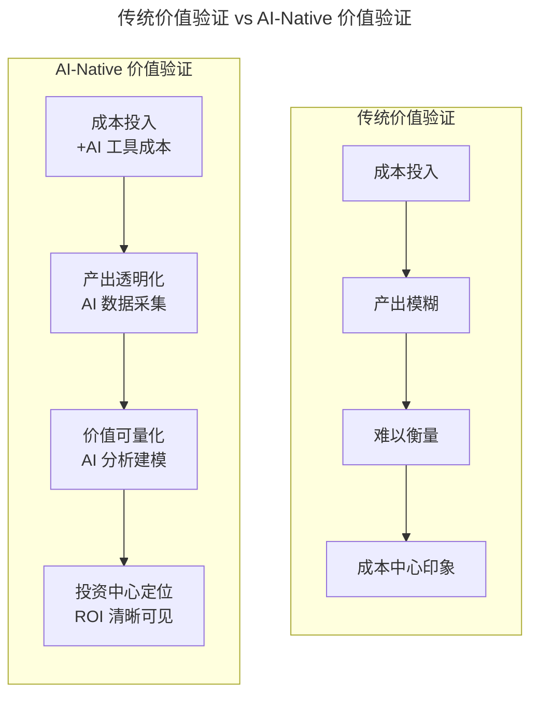
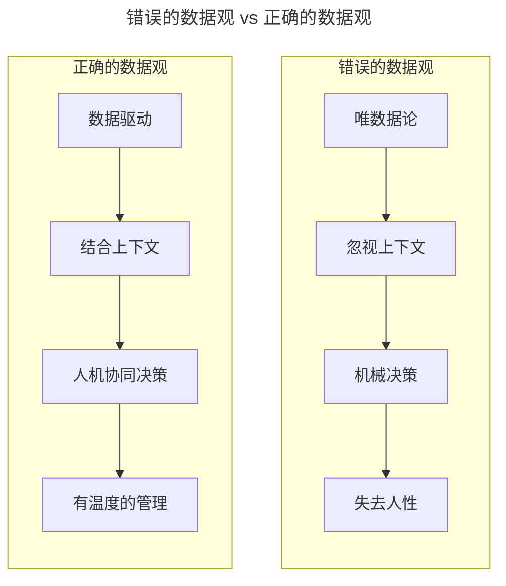

# 第22讲 | 验证研发团队价值的绩效考核机制

> **适用范围**：CTO、技术 VP、研发团队负责人，以及希望用"项目团队 + 个人 OKR + 技术 KPI"组合机制验证研发团队价值的管理者。
>
> **更新摘要（v2 · 2026-08 更新）**：
> - 结构化升级为 6 节骨架（导言 / 核心方法论 / 关键流程 / 工具与实战 / 常见误区 / 进阶延展）
> - 保留原文"研发团队考核模型（功能/效率/创新三类团队）""OKR 十大要领""SABC 四级考核"完整方法论
> - 将"AI 时代升级注解（2026）"统一融入进阶延展，补充 AI-Native 价值验证模型与 OKR 十大要领的 AI 升级
> - 补充 Mermaid 图标题与图后解读

## 1. 导言

业务同事的绩效很容易考核，签了多少单？赚了多少钱？清晰可见，容易衡量。对于做产品研发工作的我们来说，成本很好计算，但价值却很难衡量。业务团队能为公司赚钱，研发团队却花公司的钱，研发团队从此就变成了公司的"成本中心"。

我们需要有一套合理的绩效考核机制，衡量并验证自己的价值。这套机制需要简单易懂、操作方便，而且需要通过数据说话。有数据还有要对比，需要与自己比较，还要与别人比较。

## 2. 核心方法论

### 2.1 研发团队考核模型：横向职能 + 纵向项目

我们的研发团队分为横向"职能团队"与纵向"项目团队"，所有的研发人员都在职能团队中，他们都在所在的项目团队中，体现出自己的工作绩效。因此，绩效考核是基于项目团队进行的，而不是职能团队。针对不同类型的项目团队而言，需要制定不同的团队目标，采用不同的考核方式。

每种项目团队都有共同的考核部分，那就是"个人 OKR"，它包括两方面：一是个人成长，二是团队贡献。个人成长又包括专业技能和综合技能两方面，前者是"硬技能"，后者是"软技能"。个人是否得到成长，取决于和自己的曾经作比较，而并非与他人作比较。团队贡献包括的方面较广，比如：技能培训、经验分享、偿还技术债、制定并落地规范、组织团队活动等。

需要注意的是，个人 OKR 需要个人结合团队目标来定义，由个人所在职能团队来评审个人 OKR。也就是说，**OKR 是自底向上的，而 KPI 却是自顶向下的**。此外，我们认为 OKR 和 KPI 既不冲突，还能相辅相成。将 OKR 与 KPI 有效结合，不仅可以激励团队成长，还能促进团队完成公司的核心目标。

### 2.2 三类项目团队的不同考核方式

- **功能团队**：他们的目标是确保以最快的速度，高质量地让项目上线。我们需要对功能团队定义一些"技术 KPI"，才能确保项目的顺利交接，比如：上线时间、代码质量、产品质量等。
- **效率团队**：他们的目标是优化现有产品功能并帮助业务实现目标。我们无需像要求功能团队那样去要求效率团队，我们可将业务 KPI 作为考核效率团队的参考标准。
- **创新团队**：他们的目标是帮助公司创造新的商业机会与盈利方式。我们需要同时设置业务 KPI 与技术 KPI 来验证该团队的价值，即投入与产出。

当然，不论哪种项目团队，都需要考核项目是否延期？上线后是否有 Bug？而且这些标准都应该是事先确定清楚并和团队达成共识的。我们相信：**先有共识，才有共赢**。

### 2.3 OKR 十大要领

OKR 包括两大要素：O 和 KR，O 是 Objectives（目标）的缩写，KR 是 Key Results（关键结果）的缩写。O 用于描述我们心中希望通往的美好目标，KR 用于描述衡量实现这个目标的关键结果。

1. OKR 不是一款绩效考核工具，而是一款目标管理工具。
2. OKR 包括自顶向下（制定）与自底向上（评审）的全过程。
3. O（目标）需要做到简洁且定性，要鼓舞人心。
4. KR（关键结果）需要做到明确且定量，用数据说话。
5. 一个季度制定一次 OKR，季度结束需对 OKR 进行评审。
6. 每周做一次 OKR 回顾，每月做一次 OKR 调整。
7. OKR 制定过程需进行多次评审，以确保它与上级目标不冲突。
8. O 一般不要超过 5 个，O 所包含的 KR 一般为 2-4 个。
9. OKR 需要做到透明化，向团队完全公开。
10. OKR 评审结果可作为加薪的重要参考依据，但不是唯一依据。

## 3. 关键流程

### 3.1 季度绩效考核流程

每个季度可进行一次绩效考核，具体的考核成绩将分为 S、A、B、C 四个级别：S 表示大家心中充满美好期待的那根线，A 表示努力跳起来就能够得着的那根线，B 表示及格线，C 表示不及格。绩效考核的成绩需要公示，考核结束后根据具体成绩进行奖金发放。

同时，个人 OKR 也在每个季度结束时进行考核，但考核结果不会体现在季度奖金中，而是体现到每年的加薪幅度上，因为个人 OKR 是个人的能力提升与团队贡献程度的表现，与薪资挂钩会更加合理。

### 3.2 功能团队与效率团队的接力流程

效率团队将对功能团队的交付成果进行考核，不仅是代码，还包括文档。确保功能团队的 1.0 项目这根"接力棒"可以顺利传递下去，未来在效率团队的手中，让它变成 1.1、1.2、1.3 等。若要开发产品功能 2.0，可认为这是新的尝试，同样需要功能团队来开发，2.0 功能上线后再次交给效率团队进行功能迭代。

## 4. 工具与实战

### 4.1 绩效考核打分制

以功能团队和效率团队为例，在绩效考核的具体操作层面上，我们可采用"打分制"，根据具体情况进行加分或减分。这种打分制结合了定量与定性，既看技术 KPI 也看业务 KPI，还看项目是否延期、上线后是否有 Bug。

### 4.2 OKR 的 O 与 KR 写法实践

我们务必做到能用一句话来描述 O，这句话要让团队任何人都能完全理解，即简洁且定性，还要做到鼓舞人心。例如，如果目前我们的团队文化做得不太好，我们希望未来一个季度可以得到改善，O 如果写成"改善团队文化"，这句话虽然做到了简洁且定性，但不够鼓舞人心。我们可以将其改为"打造更好的团队文化，让大家爱上这个团队"，是否瞬间就产生了正能量？

每个 O 都有对应的 KR，它们用来说明为了实现这个 O，应该做到的关键结果是什么。KR 需要做到让团队任何人都能完全衡量，即明确且定量，还要做到用数据说话。例如，如果将其中一个 KR 写成"切分颗粒度较大的微服务"，这样是不合乎要求的，我们可将其表述为"至少切分 3 个颗粒度较大的微服务"，增加了一个数字来描述，这样的 KR 就更加容易衡量了。

### 4.3 OKR 与 KPI 的结合实践

KPI 是自顶向下的，老板定义了 KPI，各级领导去背 KPI，员工去完成 KPI，大家各扫门前雪，达成自己的 KPI 即可。然而，OKR 却是自顶向下和自底向上的全过程：老板结合企业战略去定义企业 OKR，领导结合企业 OKR 去制定团队 OKR，员工结合团队 OKR 去制定个人 OKR，这是 OKR 制定过程。通过一段时间的努力，随后进入 OKR 评审过程，员工评审个人 OKR，领导评审团队 OKR，老板评审企业 OKR。

## 5. 常见误区

1. **把 OKR 当绩效考核工具**：如果将 OKR 理解为考核工具，我们一定无法用好它，也更无法从中受益。OKR 是一款目标管理工具，它管理的是我们所制定的目标。
2. **基于职能团队考核**：绩效考核应基于项目团队进行，而不是职能团队；职能团队负责评审个人 OKR。
3. **功能团队只看速度不看质量**：速度和质量往往是相互制约的，需要对功能团队定义"技术 KPI"确保顺利交接。
4. **O 写得不够鼓舞人心**：如"改善团队文化"不够鼓舞人心，应改为"打造更好的团队文化，让大家爱上这个团队"。
5. **KR 缺乏定量**：如"切分颗粒度较大的微服务"不合要求，应改为"至少切分 3 个颗粒度较大的微服务"。
6. **OKR 不透明**：OKR 需要做到透明化，向团队完全公开，可用电子表格或纸质卡片来管理。
7. **只有目标没有考核或只有考核没有目标**：如果只有目标而没有考核，将无法检验团队的价值；如果没有目标而只有考核，团队将离我们越来越远。

## 6. 进阶延展

### 6.1 AI-Native 价值验证模型

2026 年，GPT-5.5 和 DeepSeek V4 让 AI Agent 能力达到新高度，**84% 的开发者使用 AI 编程工具**。研发团队不再是"黑盒"，AI 正在让团队的价值创造过程变得**透明、可追踪、可量化**。

上图展示了研发团队定位的根本转变：从"成本投入 → 产出模糊 → 难以衡量 → 成本中心印象"的传统链路，转向"成本投入 + AI 工具成本 → 产出透明化 → 价值可量化 → 投资中心定位"的 AI-Native 链路。原文的"成本中心"困境在 2026 年有了数据化的破解路径。

### 6.2 AI 增强的三类团队考核模型

| 团队类型 | 核心目标 | 传统 KPI | AI-Native KPI | AI 如何辅助 |
|---------|---------|---------|---------------|-----------|
| **功能团队** | 快速、高质量上线 | 上线时间、代码质量 | **人机协作效率 × 质量系数** | AI 记录开发全过程数据 |
| **效率团队** | 优化体验、提升指标 | 业务指标达成率 | **AI 驱动的优化效果 × 影响力** | AI 归因分析贡献度 |
| **创新团队** | 探索新机会、验证假设 | 收入、用户增长 | **创新探索数量 × 成功率 × AI 辅助度** | AI 追踪实验和迭代 |

### 6.3 OKR 十大要领的 AI 升级

| 原文要领 | AI-Native 升级 | 具体做法 |
|---------|--------------|---------|
| OKR 是目标管理工具，非绩效考核工具 | **OKR + AI 数据双轮驱动** | OKR 定方向，AI 数据看进展 |
| 自顶向下制定 + 自底向上评审 | **AI 辅助对齐 + 人工共识** | AI 检测目标冲突，推荐调整方案 |
| O 简洁定性、鼓舞人心 | **AI 辅助提炼 + 情感分析** | AI 评估目标的激励性 |
| KR 明确定量、用数据说话 | **AI 推荐 KR + 可达性预测** | 基于历史数据建议合理的 KR 值 |
| 季度制定、季度评审 | **实时跟踪 + AI 预警** | AI 持续监控进度，异常及时提醒 |
| 每周回顾、每月调整 | **AI 自动生成周报 + 月报** | 减少手工统计，聚焦问题讨论 |
| 多次评审确保不冲突 | **AI 冲突检测 + 对齐建议** | 自动发现跨团队目标冲突 |
| O 不超过 5 个，KR 2-4 个 | **AI 智能精简 + 优先级排序** | 避免目标过多导致精力分散 |
| 透明化、完全公开 | **AI 仪表盘 + 实时同步** | 全员随时查看进度和对齐情况 |
| 结果作为加薪参考 | **AI 客观数据 + 人工综合判断** | 数据支撑决策，避免主观偏差 |

### 6.4 关键原则：用数据说话，但不要被数据绑架

上图对比了两种数据观：错误的"唯数据论 → 忽视上下文 → 机械决策 → 失去人性"链路，与正确的"数据驱动 → 结合上下文 → 人机协同决策 → 有温度的管理"链路。三条原则：**数据是参考，不是裁判；关注趋势，而非单点；量化结果，也要量化过程**。

### 6.5 2026 年可执行建议

**对于技术管理者**：

1. **建立 AI 增强的研发效能平台**：集成代码仓库、项目管理、CI/CD 等系统的数据；使用 AI 进行多维度分析和可视化展示；让团队价值一目了然。
2. **重新定义"研发价值"**：从"代码产出"转向"业务影响力"；从"个人英雄"转向"人机协同效能"；从"成本中心"转向"投资中心"。
3. **打造透明的绩效文化**：定期向全员公开团队效能数据；让每个人都能看到自己的贡献和价值；用数据和事实说话，减少主观争议。

### 6.6 2026 年展望：从"成本中心"到"创新引擎"

| 维度 | 2018 年 | 2026 年 |
|------|--------|--------|
| **团队定位** | 成本中心 | **投资中心 / 创新引擎** |
| **价值证明** | 困难、模糊 | **清晰、实时、多维** |
| **考核方式** | 主观评价为主 | **AI 数据 + 人工判断** |
| **员工体验** | 焦虑、被动 | **主动、透明、成长导向** |
| **管理重点** | 控制成本 | **激发潜能、放大价值** |

### 6.7 作者简介

黄勇，现任特赞科技（tezign.com）CTO，图书《架构探险》作者，Smart 开源项目作者，[TGO 鲲鹏会](https://tgo.geekbang.org) 上海分会董事会成员，QCon 讲师。十年以上互联网软件架构与技术管理经验，擅长敏捷开发，推崇“轻量级”系统架构。喜欢阅读，热爱交流，乐于分享。

> *AI 让研发价值从"不可见"变为"可见"，从"不可量"变为"可量"；未来的研发团队应该是"投资中心"而非"成本中心"。*
